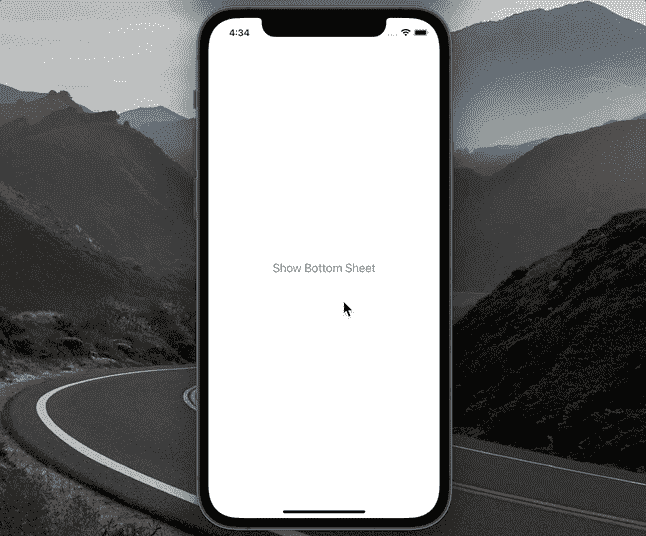
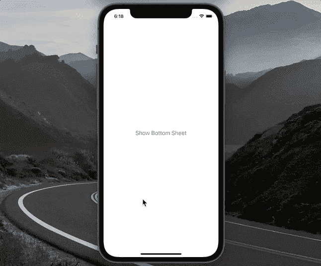
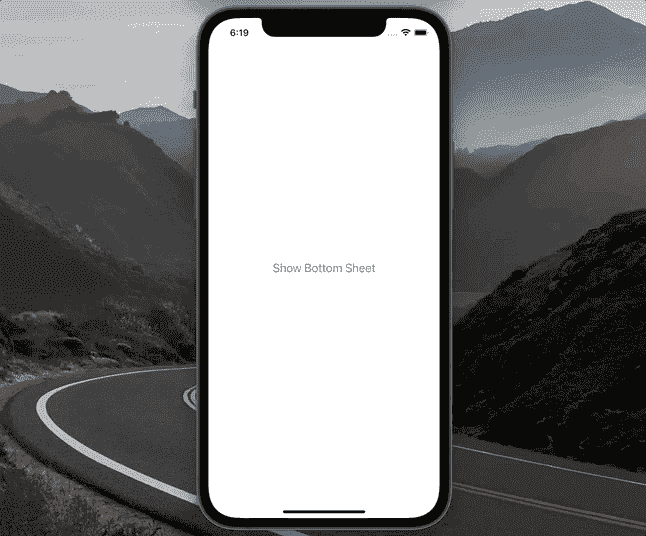
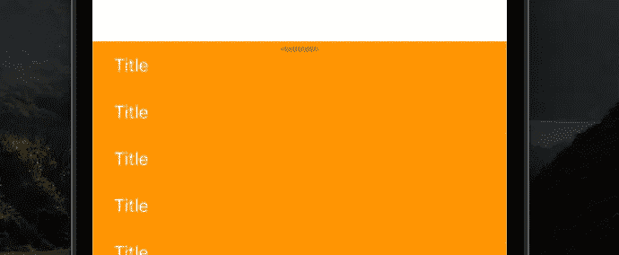
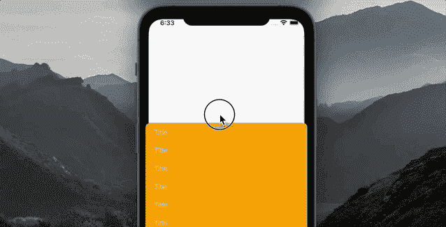
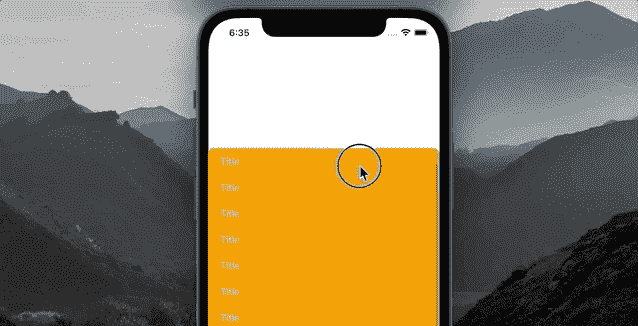
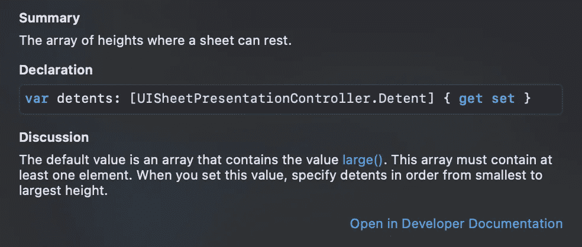

# 如何在 iOS 15 中呈现可定制的底部表单

> 原文：<https://betterprogramming.pub/how-to-present-customizable-bottom-sheets-in-ios-15-e98e530208b2>

## 使用 UISheetPresentationController

丹尼尔·罗梅罗在 [Unsplash](https://unsplash.com?utm_source=medium&utm_medium=referral) 上的照片

在本文中，我们将学习如何使用 iOS 15 中可用的`UISheetPresentationController` API 来呈现底部表单。示例项目的源代码可以在本文的底部找到。简而言之，这是你学完这个教程后会知道的:

*   如何将任何`UIViewController`呈现为底单？
*   如何为你的底层提供尺寸？
*   如何自定义底部工作表的布局和行为。
*   决定使用`UISheetPresentationController`时需要考虑哪些细微差别。

这是我们将要建造的:

# 我们开始吧

我们从在屏幕中央显示一个按钮的`UIViewController`开始:

在`buttonHandler`中，我们将实现一个底部表单并在屏幕上显示它。

让我们首先创建另一个`UIViewController`作为底板:

1.  我们将`modalPresentationStyle`指定为`.pageSheet`来告诉系统我们将使用这个视图控制器作为一个工作表。
2.  通过将`isModalInPresentation`设置为`false`，我们允许用户交互式地关闭表单。如果我们将它设置为`true`，工作表将不会被忽略。
3.  为了简单起见，我们只显示橙色视图。

是时候在按钮的处理程序中显示底部的工作表了:

1.  我们从初始化`BottomSheetViewController`开始。
2.  获取内置的`sheetPresentationController`属性。当`modalPresentationStyle`为`.pageSheet`或`.formSheet`时，视图控制器设置该属性。之前，我们将`BottomSheetViewController`的属性设置为`.pageSheet`，所以`sheetPresentationController`存在。
3.  “定位”属性用于为底部图纸提供尺寸配置。目前，苹果只为我们提供了`.medium()`和`.large()`卡顿。由于开发人员无法访问制动器创建 API，我们无法创建自定义大小的制动器。希望我们以后能看到 API 的更新，比如`.small()`或者`.custom(size: CGSize)`。
4.  `largestUndimmedDetentIdentifier`属性决定底部工作表后面的视图何时变暗。通过将它设置为`.medium`，我们告诉系统仅当纸张处于其`.large()`尺寸时才使背景变暗。
5.  当我们在底部表单中有`UIScrollView`时，`prefersScrollingExpandsWhenScrolledToEdge`属性可以为案例提供支持。当它被设置为`true`时，用户能够滚动底部表单的内容，一旦它以其完整高度显示。否则，我们无法在底部工作表内滚动`UIScrollView`。为了说明它是如何工作的，考虑值为`true`的情况:

当设置为`false`时:

6.`prefersGrabberVisible`设置为`true`显示料板顶部的抓取器视图:

7.最后，我们使用标准的`present()`方法展示底部的表。

除了上面显示的属性，我们还有一个称为`preferredCornerRadius`的圆角半径属性。通过将其设置为 0，我们得到以下结果:

# 以编程方式更改大小

我们还可以更改当前的`Detent`并以编程方式动画显示这些更改:

1.  在表单显示两秒钟后，启动这段代码。
2.  通过使用`animateChanges`闭包，我们告诉系统动画显示板材属性的变化。上面，我们告诉它改变卡位到`.large`并激活它。

总的来说，在决定是自己实施底单还是使用`UISheetPresentationController`时，我们需要记住这些事情:

*   `UISheetPresentationController` API 仅支持 iOS 15 及更新版本。
*   API 目前是有限的，因为它只提供`.medium()`和`.large()`尺寸配置。
*   想象你想摆脱这种视差效应:

要做到这一点，您需要违背 API 的准则:您需要按照降序提供`detents`:

`sheet.detents = [.large(), .medium()]`

这产生了我们需要的结果:

这种溶液之所以“有气味”，是因为当纸张被呈现时，它立即以`.large()`尺寸显示。此外，苹果告诉我们在文档中使用*升序*顺序:

# 资源

示例项目可在 [GitHub](https://github.com/zafarivaev/uisheetpresentationcontroller-ios15) 上获得。希望这篇教程对你有用，感谢阅读！