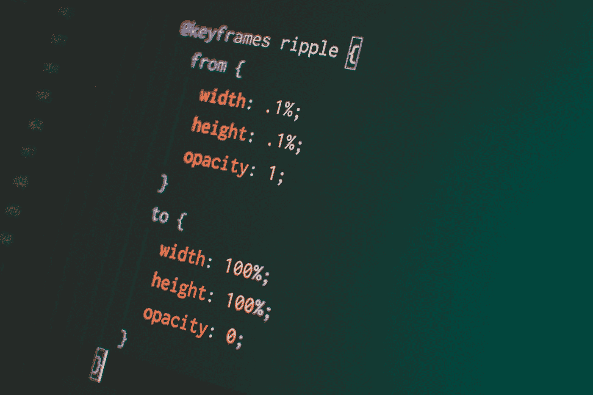

# 如何防止 CSS 动画在页面加载时运行

> 原文：<https://betterprogramming.pub/how-to-prevent-css-animation-from-running-on-page-load-ced731144af7>

## 按照您想要显示的方式加载页面

[潘卡杰·帕特尔](https://unsplash.com/@pankajpatel?utm_source=medium&utm_medium=referral)在 [Unsplash](https://unsplash.com?utm_source=medium&utm_medium=referral) 上的照片

假设我们有一个包含一些过滤器的侧边栏。当我们不需要侧边栏的内容时，它应该可以折叠以节省空间。

一种简单的方法是根据开关来改变侧边栏的宽度，这样可以展开或折叠侧边栏。我们可以使用 JavaScript 直接设置样式，或者通过应用 CSS 类来指定侧边栏应该占用的宽度。我更喜欢后者，因为在我看来它更容易维护，而且不需要访问 DOM。

这种方法可以完成工作。然而，折叠和展开对用户来说可能显得突然和不自然。因此，我们可以通过利用 CSS 动画功能来改善这一点。使宽度变化更加流畅的最简单方法是使用`[transition](https://developer.mozilla.org/en-US/docs/Web/CSS/transition)` CSS 属性。

使用`transition`来折叠和展开侧边栏感觉更加自然，更加赏心悦目。但是这产生了一个新问题:侧边栏在页面加载时是动态的。为了解决这个问题，我创建了另一个 CSS 规则，只在父元素悬停时显示宽度变化。

这解决了原来的问题:动画仅在展开或折叠侧边栏时使用。

# 这种方法的优缺点是什么？

和所有的事情一样，每种方法都有其优点和缺点。让我们看一看。

## **优点:**

*   易于使用:不需要外部库或复杂的 JavaScript
*   大部分时间都像预期的那样工作

## **缺点:**

*   如果用户在页面加载时悬停在元素上，您可能仍然会看到动画
*   对行为的控制较少，因为这是一个只有 CSS 的解决方案

像 [Angular](https://angular.io/guide/animations) 和 [Vue.js](https://vuejs.org/v2/guide/transitions.html) 这样的流行框架包含了更高级的动画功能，由 JavaScript 驱动，可以覆盖比 CSS 动画更多的用例。CSS 动画不能包含复杂的逻辑，而你可以用 JavaScript 做任何事情。另一方面，纯 CSS 动画通常很容易编写(不仅对于前端开发人员，对于 UI/UX 设计人员也是如此)，而基于 JavaScript 的动画可能需要更多代码，甚至需要第三方库，如 [anime.js](https://animejs.com/) 。

就我个人而言，我更喜欢在处理简单动画时使用纯 CSS 动画，并为更复杂的用法转换和基于 JavaScript 的解决方案。

# 结论

感谢您阅读这篇短文。你是如何写动画的？请在评论中告诉我。