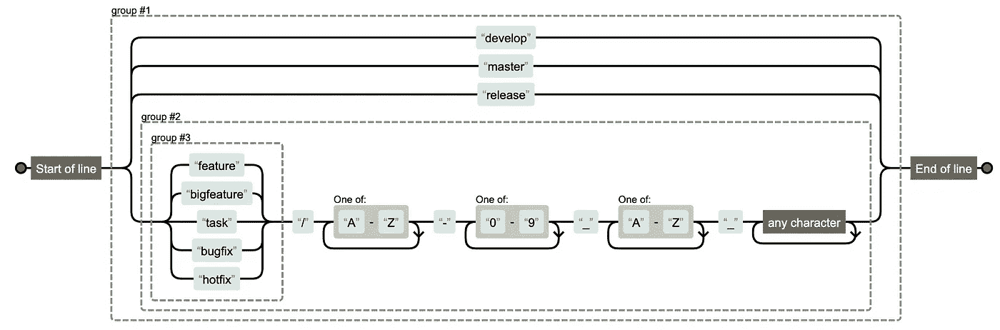
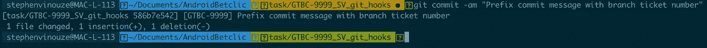
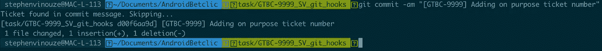
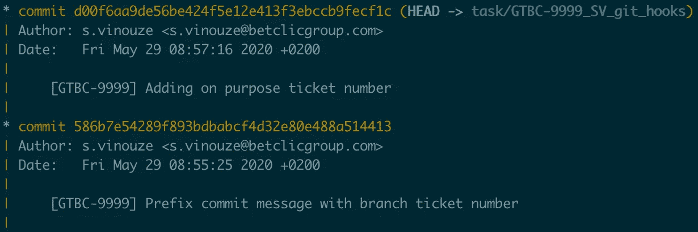

# 如何防止 Git 提交命名错误

> 原文：<https://betterprogramming.pub/how-to-prevent-git-commit-naming-mistakes-a34c8a7c6ae6>

## 每次使用 Git 钩子时，抛出一个安全网


在 [Unsplash](https://unsplash.com?utm_source=medium&utm_medium=referral) 上 [Praveesh Palakeel](https://unsplash.com/@praveesh?utm_source=medium&utm_medium=referral) 拍摄的照片。

我使用 Git 已经很多年了，但我还远远没有完全了解它。然而，我觉得每次遇到问题，Git 都有答案。最近，我一直在想，我们如何才能消除在提交消息前加上[吉拉](https://www.atlassian.com/software/jira)票号的无聊。

我一直觉得命名我的分支和提交消息很乏味。尽管如此，我总是努力尊重命名惯例。它们对于保持正确的版本控制和帮助你的队友寻找你的分支是至关重要的。

那么有哪些选择呢？您仍然可以手动命名您的分支，但是这很繁琐并且容易出错。如果您使用 Git flow，您可能会被一个[包装器](https://danielkummer.github.io/git-flow-cheatsheet/index.fr_FR.html)所诱惑，来驱动您完成命名。不幸的是，我的经历并不是决定性的。此外，您可能希望在命名上有一些灵活性，我发现这个工具太死板了。

欢呼吧！Git 总有锦囊妙计。您可以在执行脚本之前拦截特定的 Git 命令。它们被称为[钩子](https://git-scm.com/book/en/v2/Customizing-Git-Git-Hooks)。

我就不一一描述了。相反，我将把其中的两个展示给:

1.  实施分支命名策略。
2.  用分支名称标签作为提交消息的前缀。

# 1.实施分支命名策略

我在介绍中提到了 [Git 流](https://nvie.com/posts/a-successful-git-branching-model/)。这种分支约定在开发人员中很流行。这导致在您的分支前面加上名称，例如`master`、`develop`、`feature`、`bugfix`，等等。在命名您的分支机构时，您可能还想附加一个票证编号。

在我的公司，我们强制执行这样的命名策略:

*   分支必须以 Git flow 关键字之一开头，后跟一个点号。
*   然后指出用连字符连接的吉拉项目名称和票号。
*   然后开发者姓名首字母用下划线链接。
*   最后是票的描述。

一个例子是:

```
feature/GTBC-9999_SV_git_hooks
```

钩子可以检查所有这些条件。例如，在提交之前，确保您的分支机构名称遵守您的策略。您需要在`.git/hooks`文件夹中添加一个`pre-commit`脚本文件。

以下是强制执行这些条件的脚本:

> 出于语法目的，这个要点是用`sh`文件扩展名编写的。确保不要使用这个扩展，否则 Git 不会读取它。

将文件标记为可执行文件:

```
$ chmod +x pre-commit
```

为了更好地理解正则表达式，请看一下正则表达式的表示。这个例子表明它尊重我们的分支机构命名政策。



用 [Regexper](https://regexper.com/) 制作的照片。

如果您试图从与您的正则表达式模式不匹配的分支提交，您将在提交执行之前被拒绝。

# 2.提交消息前缀

命名约定不仅仅适用于分支。每次提交时，您都可以在提交消息中添加额外的信息。例如，这可能是你的机票号码。

Git 允许您用一个`prepare-commit-msg`钩子自动编辑提交消息。您获得原始的提交消息作为参数，您可以根据需要对其进行操作。

让我们重温一下我上面的例子。我正在开发一个新特性，将 Git 挂钩添加到我的 GTBC 项目中——多么方便。这个任务指的是票号 9999，我的首字母是 SV。

一个有效的分支名称是:

```
feature/GTBC-9999_SV_git_hooks
```

对于这个分支，我希望我所有的提交消息都以`[GTBC-9999]`开始，然后是实际的开发人员消息。

这里，`$1`指的是您的原始提交消息。使用`grep`命令，我们从分支名称中提取项目名称和票据编号。然后我们把这个提取转换成大写。最后，我们在将最终的提交消息重定向到 g it 提交消息管道之前打印它。

在测试脚本之前，请记住将文件标记为可执行文件:

```
$ chmod +x prepare-commit-msg
```

插上这个钩子后，输出如下:



Git 提交消息以[GTBC-9999]为前缀

注意脚本中的`if`条件。有时候，习惯很难改变。您的一些队友可能会继续手动添加他们的机票号码。

为了防止冗余，您可以检查票据编号是否驻留在提交消息中——不需要添加两次票据引用。

让我们试试这个:



有目的地添加[GTBC-9999]以便提交消息不会重复

我们在提交消息中捕获了票号，跳过了这个过程。我们可以检查我们的两个提交在日志中的命名是否正确:



有了这个钩子，您不再需要为提交消息添加前缀。

# 与你的队友分享你的钩子

我在上面说过，你必须把你的钩子放在`.git/hooks`文件夹里面。你应该知道`.git`文件夹不受版本控制。Git 会忽略这个文件夹下的每个文件。

如果您将它们保存在此位置，您将无法:

*   与您的团队分享它们。
*   记录下你对它们的修改。

幸运的是，您可以改变钩子执行的默认位置。例如，我在项目的根目录下创建了一个`.git-hooks`文件夹，并把我所有的挂钩都放在里面。

在项目的根目录下，执行以下命令行以应用这些更改:

```
$ git config core.hooksPath .git-hooks
```

现在版本这个文件夹，你的队友将从中受益。

# 走向全球

我的其他项目呢？我必须把钩子添加到所有共享相同命名约定的项目中吗？

用这种策略，是的。

再一次，Git 已经用[模板](https://git-scm.com/docs/git-init#_template_directory)考虑清楚了。你可以创建一个模板，避免重新配置钩子。

本文对此进行了更详细的解释:

[](https://coderwall.com/p/jp7d5q/create-a-global-git-commit-hook) [## 创建一个全局 git 提交挂钩(示例)

coderwall.com](https://coderwall.com/p/jp7d5q/create-a-global-git-commit-hook) 

# 结论

希望这两个实际使用案例能引发你的创意。自动化那些无聊的东西，确保你在命名你的提交时不会错过标记！

感谢您的阅读！