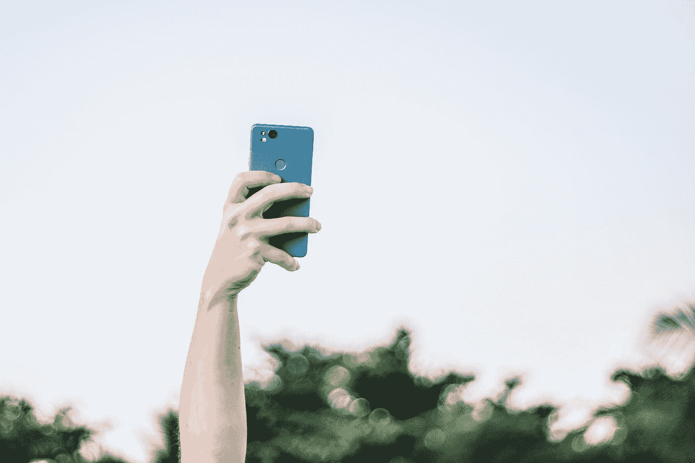
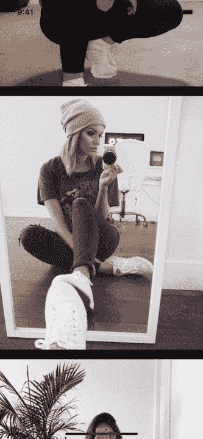

# iOS 14 如何防止截屏

> 原文：<https://betterprogramming.pub/how-to-prevent-screen-capture-at-ios-14-1f01173c31c0>

## 从屏幕截图和屏幕录像中保护应用中的敏感信息

Jona Friedri 在 [Unsplash](https://unsplash.com?utm_source=medium&utm_medium=referral) 上拍摄的照片。

iOS 14 自带了一个叫做 Back Tap 的新功能。它可以让你在 iPhone 背面自定义双击和三击，以触发快捷键、辅助功能、滚动手势和系统操作，包括屏幕截图。没什么大的水花但是超级有用。我见过许多用户对点击屏幕截图的便利感到兴奋。

作为开发人员，我们开发的应用程序可能包含敏感内容:自拍、家人照片、支付细节、版权内容和机密信息。如何保护我们的应用程序并保护用户的敏感信息免受截图和屏幕记录的影响是一个很大的问题。

# 1.构建我们的示例自拍应用程序

比方说，我们正在开发一款名为 Selfie 的应用，用于与朋友和关系分享自拍，而这些自拍并不打算被拍摄和发布给公众。

杨梦的自拍应用

## 成分布局

通过使用 iOS 13+中的组合集合视图，我们创建了一个简单的垂直流布局:

杨梦的构图布局

*   每个项目通过使用派系的宽度和高度来占据其群组的整个空间。
*   每组取屏幕的整个宽度和屏幕高度的 60%。

## 可区分数据源

然后我们注册单元并应用数据源:

杨梦的可区分数据源

*   将单元格注册到`UICollectionViewDiffableDataSource`的实例中。
*   将 100 个样本图像应用到`.main`部分。

# 2.检测并阻止屏幕捕获

防止杨梦进行屏幕录制

我们能够通过使用通知`UIScreen.capturedDidChangeNotification`来检测屏幕录制即将发生。然后，我们可以立即隐藏屏幕，并弹出一个警告窗口，让用户知道他们不允许在我们的应用程序中拍摄内容的屏幕记录。

## ui screen . captureddidchange notification

为了检测屏幕记录，我们创建了一个名为`ScreenProtector`的专用类:

杨梦的 CapturedDidChangeNotification

*   `warningWindow`属性存储警告窗口的有效实例。
*   使用连接的场景检索当前窗口。
*   通过注册`UIScreen.capturedDidChangeNotification`通知开始阻止屏幕录制。
*   当检测到屏幕录制时，隐藏当前窗口并显示警告提示。

## 隐藏屏幕

iOS 11.0 中引入了新标志`isCaptured`。它指示屏幕是否被捕获，是否是屏幕录制、播放、镜像等。

杨梦的《隐藏屏幕》

## 当前警告

*   如果存在任何警告窗口，请进行清理。
*   生成具有屏幕尺寸的示例警告消息标签。
*   创建与内容窗口大小相同的警告窗口。
*   动态显示标签，并使警告窗口可见。

# 3.检测并防止屏幕截图

防止杨梦截图

虽然没有办法阻止 iOS 在我们的应用程序中截图，但我们可以检测何时截图，并在检测后删除最后保存的图像。

## ui application . userdidtakescreenshotnotification

为了检测是否截图，我们在我们的`ScreenProtector`中注册通知`UIApplication.userDidTakeScreenshotNotification`:

防止杨梦截图

## AppDelegate 的屏幕保护程序

现在我们有了`ScreenProtector`来检测和防止屏幕截图和屏幕捕获，我们将创建一个保护程序的实例，并将其放在 AppDelegate 中:

杨梦代表

# 结论

在我们的应用中，保护用户的敏感信息始终是重中之重。本文介绍了一种通过注册和监听`UIApplication.userDidTakeScreenshotNotification`和`UIScreen.capturedDidChangeNotification`通知来检测和阻止屏幕截图和屏幕录像的方法。我相信这个话题还有更多值得探索的地方。

感谢您的阅读，请在评论中留下您可能有的任何问题。

上面提到的所有代码都可以在这个 [GitHub repo](https://github.com/ericleiyang/PreventScreenCaptureIniOS14.git) 中找到。