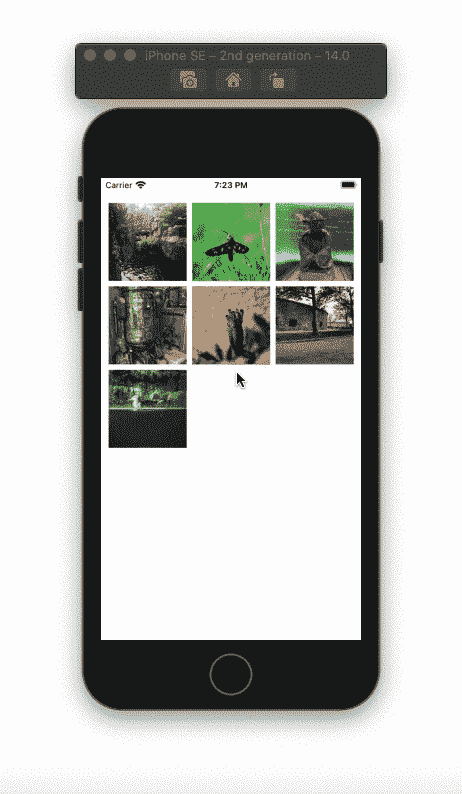

# 如何在 SwiftUI 中预览照片

> 原文：<https://betterprogramming.pub/how-to-preview-photos-in-swiftui-6c3a04d40bda>

## 从照片网格缩放照片并制作动画

在 SwiftUI 中预览图像。作者的动画。

# 简单图像网格

我们将使用 2D 阵列来创建网格。在一个`VStack`中，添加一个接受 2D 数组的`ForEach`循环。对于 2D 数组中的每个图像数组，添加第二个循环(从 0 到小于 3)。检查索引是否超出范围，然后添加`Image`视图。当指数超出范围时，添加一个空的`Rectangle()`。如果你不想使用`Rectangle()`，那么你可以使用前导对齐，重新将网格居中。

向`Image`视图添加`aspectRatio()`修改器，并将其内容模式设置为`fill`。使用可调整大小修改器可以更改图像的框架，然后添加框架修改器来调整图像的大小。

要制作正方形图像，请确保宽度和高度值相同。最后，使用`.clipped()`修改器剪辑图像:

# 图像预览

创建一个带有`binding image`字符串变量的自定义图像视图。确保使用阴影使图像突出。

回到我们的`ContentView`。声明两个新变量:

*   `isDetectingLongPress`:手势状态变量。用于检测长按手势和控制图像预览。
*   `img`:状态变量，用于将要预览的图像传递给我们上面创建的`ImagePreview`。

将上面的网格代码嵌入到一个`ZStack`中。在网格下，将我们在上面创建的`ImagePreview`添加到检查长按是否发生的`if`语句中:

# 长按手势

向网格内的`Image`视图添加一个手势修改器，并传递给它一个最小持续时间为 60 的`LongPressGesture()`。如果用户没有结束长按手势，持续时间决定了`ImagePreview`将持续多长时间。在`updating()`修改器中，为事务添加一个 spring 动画。在`onChanged()`修改器中，将传递给`ImagePreview`的图像字符串分配给被按下的图像:

最后，将`.blur()`修改器添加到`VStack`中。当检测到长按时，在 0 和 5 之间改变其半径值:

在 SwiftUI 中预览图像。作者的动画。

全部完成！感谢阅读。