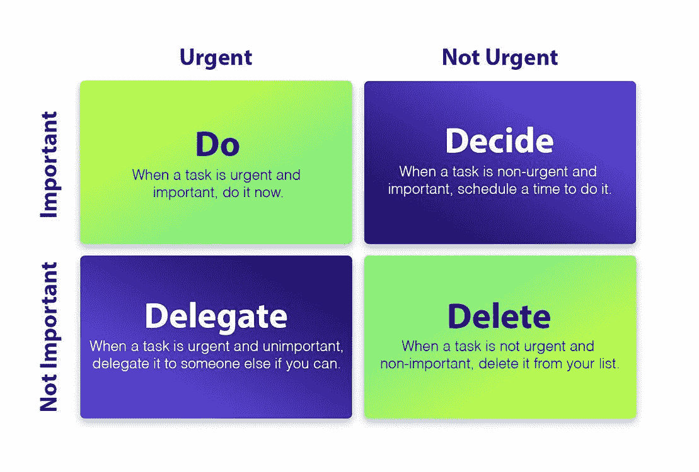

# 如何像初创公司一样无情地划分优先顺序并管理技术债务

> 原文：<https://betterprogramming.pub/how-to-prioritize-ruthlessly-and-manage-tech-debt-like-a-startup-77b4e6b02b25>

## 在正确的时间处理技术债务和漏洞可能会带来变革

马克·柯尼希在 [Unsplash](https://unsplash.com/?utm_source=medium&utm_medium=referral) 上的照片

您已经推出或发布了一项重要的新功能。但是所有的代码仍然很难处理，因为它需要重新架构。

帮助品牌提供转售服务的 [Treet](https://www.treet.co/) 的首席技术官兼联合创始人索尼娅杨(Sonia Yang)表示:“科技债务对初创企业来说是独一无二的，因为有时当科技债务成为一个严重的问题时，你会感觉自己成功了。”。

恭喜你。你欠了技术债。在你的待办事项列表中，你可能也有一个 bug 和测试的列表(你的工程师已经告诉过你一次…或者十几次了)。

现在，又有一个特性要发布了。流失率略有上升的客户群。那么，您如何知道何时从产品维护转向主动维护呢？

我们与 Treet、[Edify](https://www.getedify.co/)(Slack-native technical on boarding and training to enable your software engineering team in scale)和[Linear](https://linear.app/)(issue tracking tool for high-performance teams)的团队进行了交谈，以了解他们作为一家初创公司是如何处理技术债务、测试和 bug 的。我们总结出了四条清晰的经验，分别是可访问性、决策、优先级和讲故事。

请继续阅读，了解为什么维护任务和技术债务不会影响您的产品路线图。

# 1.提升你的代码质量，帮助迎来新的队友

当你想到科技债务的时候，你可能(也可以理解)会把注意力放在你没有做过的事情上。但是如果你想开发一个高质量的可持续系统，你需要考虑那些还没有加入你的团队的工程师。

“我们意识到，如果我们想要增长，我们必须让人们容易进入文化，”Treet 首席技术官兼联合创始人索尼娅杨说。

就像因为客人要来而打扫你的房子一样，Treet 在新工程师入职前几周找到了解决遗留问题的合适时机。杨和她的团队安排了一次冲刺会议，会议的中心议题是一份经过讨论、编辑和分配的清单。

虽然暂停清理代码是有效的——杨估计他们在专门修复代码的时间里解决了 70%的问题——但之后发生的事情可能会产生显著的好处。

公司实施监控以衡量工作的有效性。他们也在重新审视如何记录变化。

Treet 和其他初创公司可以向 Linear 寻求蓝图，在修复缺陷的同时推进项目。Linear 首席执行官兼联合创始人 Karri Saarinen 发展了一种文化，鼓励工程师在他们被注意到并知道他们有后盾时解决问题。

“我们有一名工程师轮流担任‘守门员’，帮助支持和修复报告的错误和问题，”Saarinen 说。

Treet 正在权衡带宽的轮换或专用百分比，以确保有人总是在削减需要完成的任务。

杨说:“一次冲刺不可能把我们所有的盘子都洗干净。”。“现在，当我们在建造一些东西时，首先要考虑的是，让另一位工程师跟随我们会有多明智。”

# 2.找到正确的决策框架来平衡维护和特性

小团队天生灵活。需要迅速做出决策，以考虑用户反馈和产品支点。

然而，随着您的团队的成长，您如何保持灵活性——以化解维护需求和对更好性能的渴望之间的潜在矛盾？

对于 Edify 产品总监 Jayme Rabenberg 来说，答案很简单:你需要采用一个清晰的决策框架来决定何时以及如何处理测试、代码质量和技术债务。

“你必须从一个框架开始，因为你不能一时冲动开发一个，”Rabenberg 说。

因为决策可能很难，所以决策过程必须简化。拉伯格偏爱艾森豪威尔矩阵，一种由前总统德怀特·戴维·艾森豪威尔开发的时间管理系统。在这里，潜在问题根据它们的紧急程度(x 轴)和重要性(y 轴)被处理、委派或删除。如果某件事既紧急又重要，它就优先处理。

艾森豪威尔矩阵

在 Edify，每个项目都有一个决策者。然后，团队的其他成员充当顾问，提供背景(客户想要什么或可能产生什么结果)，让决策者了解给定问题的紧迫性和重要性。

技术债务和测试不太可能被认为是紧急的，但当长期存在的问题减缓或停止新功能开发时，它们可以优先考虑。相反，功能错误和性能问题通常看起来很紧急，但是只有当它们有损于用户体验时，解决它们才是重要的。

决策框架提供了衡量不同行动方案和决定如何分配资源所必需的一致性。它也创造了透明度。团队成员的声音被听到。然后，决策会全面考虑不同部门的需求和用户反馈。

那么小的修正呢，拉伯格称之为“微决策”，那些可能会被遗漏的修正呢？

Rabenberg 授权她的团队做出自己的选择，以有效地解决离散的问题。对于那些被认为对正式流程来说太小的决策，Edify 已经概述了设计标准和可建立的、可衡量的结果，以帮助提供仍然允许自治的指导。

# 3.考虑成本和收益，知道何时解决技术债务

一旦你承认你不能——甚至可能不想——解决你所有的技术债务，工作就没有完成。您仍然需要决定何时优先维护。

在 Treet，杨磨练了那些妨碍工程师从事深度工作的能力的错误。

“如果一个错误在一天内发生多次，那就是远离核心工作的时间，”杨说。

Treet 经常优先处理需要立即解决的 bug，因为这种债务的成本——工程师失去的时间和精力——太大了。评估维护任务价值的另一种方法是考虑最终用户或团队的最终利益。

在 Stashpad，我们高度关注性能。除非产品很快，否则开发者无法从我们的产品中获得价值。性能标准是所有新功能验收标准的一部分。当科技债务开始成为我们的拦路虎并拖累我们时，我们会优先考虑科技债务。

通过保持我们的核心功能集较小，我们有可能保持我们的高性能标准。这为我们的产品和工程团队提供了共同的基础和共享的语言，确保决策基于它们最终如何影响性能——即使这意味着推出的功能更少。

# 4.不要忘记讲述每个决定的故事

一旦你决定对技术债务、bug 或新功能开发进行优先排序，你团队中的每个人都必须明白为什么要做出这个决定。

“我必须学会阐明我为什么做决定，”拉伯格说。“我不认为这是我们这些擅长做决定的人与生俱来的。”

承认个人情绪是过程的一部分，即使决策是基于一套明确的衡量标准或市场需求。留出空间让人们分享他们的感受，这消除了一个支点可能会让你的团队中的一个人感到被落下的可能性。它还可以帮助你明确下一步需要优先处理的事情。

“作为一名领导者，我认为我的工作是营造一个安全的环境，”拉伯格说。“我们如何以人类的身份出现，如何以人类的身份互动，是让我们成功的因素。”

请记住，你不仅要照顾团队的情感需求，还要协调团队成员、客户和你的领导。决策的故事是你公司故事的一部分，因为每个决策都是朝着新方向迈出的一步。

当你清楚为什么的时候，就更容易分清主次，找到正确的前进道路。