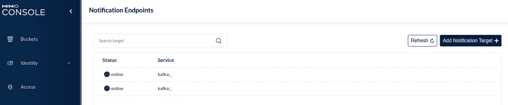
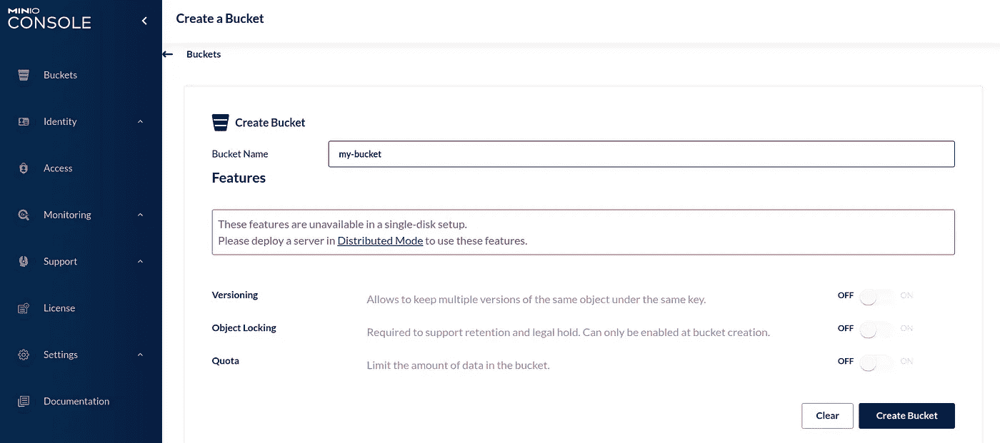
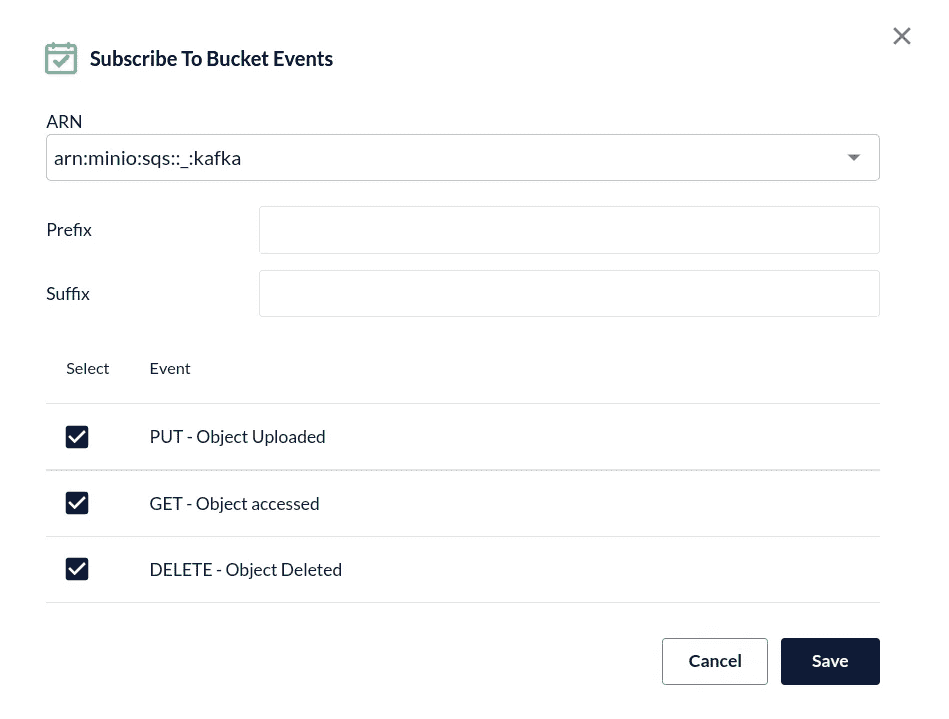
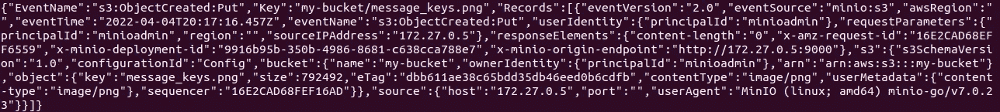
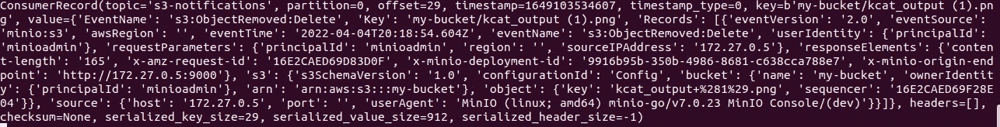

# 如何用 Kafka、MinIO 和 Python 处理通知

> 原文：<https://betterprogramming.pub/how-to-process-notifications-with-kafka-minio-and-python-8a288b12854>

## 通过 Kafka 发送存储桶通知，并使用 Python 处理记录


Christopher Gower 在 [Unsplash](https://unsplash.com?utm_source=medium&utm_medium=referral) 上拍摄的照片

[事件驱动架构](https://en.wikipedia.org/wiki/Event-driven_architecture)已经成为一种流行的方法，它使解耦的应用程序能够相互通信。

为了说明这个架构是如何工作的，我们将设置 [Minio](https://min.io/) 通过 Kafka 发送主题通知。然后，我们将用 Python 创建一个简单的 Kafka 监听器来使用事件记录。

我们开始吧！

# 准备迷你卡夫卡环境

首先，让我们准备本地开发基础设施。最简单的开始方式是运行一个`docker-compose.yml`文件:

我们为`minio`、`kafka`和`zookeeper`创建容器。

*   MinIO 服务充当生产者，向 Kafka 发送通知数据。
*   Kafka 是一个流系统，它将使用 MinIO 事件数据并相应地处理记录。
*   Zookeeper 用于跟踪 Kafka 集群中节点的状态，并维护 Kafka 主题、分区等的列表。

重要注意事项:

*   米尼奥的`environment`配置定义了卡夫卡的属性。例如，代理端口、通知主题名称。
*   卡夫卡经纪人出现在`9092`端口。所以，我们可以参考它进行局部测试。
*   所有服务应该运行在同一个网络中，在本例中是`kafka-net`。

# 配置 MinIO 通知

运行`docker-compose.yml`文件:

```
$ docker-compose up -D
```

然后使用凭证登录运行在 [http://localhost:9001/](http://localhost:9001/) 上的 MinIO 的控制台:*minioadmin*/*minioadmin*。

确保 MinIO 和 Kafka 配置正确。导航至**设置- >通知**。**通知端点**应该在线；



Kafka 的通知端点

创建新的存储桶:



创建新的存储桶

点击新的存储桶并选择**管理**。

点击**订阅事件**按钮订阅通知事件:



订阅存储桶事件

**ARN** 下拉菜单应该会自动提示卡夫卡。订阅一些事件，例如**放**，**获取，删除**。

# 测试通知

我们已经配置了 MinIO 和 Kafka，并订阅了通知事件。所以，现在当我们上传一个文件，我们应该得到通知。如何检查是否收到通知？让我们使用`[kcat](https://github.com/edenhill/kcat)`，一个轻量级的、简单易用的消息阅读器工具。

要在 Ubuntu 上安装`kcat`,在终端中运行:

```
$ apt-get install kafkacat
```

然后，让我们启动该工具，将代理的端口和主题的名称作为参数传递:

```
$ kafkacat -b localhost:9092 -t my-notifications
```

就是这样！

现在，让我们将一个文件上传到 MinIO 中的 bucket。

您的`kcat`控制台应该会立即向您显示通知:



Kcat 输出

厉害！现在，我们成功地通过 Kafka 接收来自 MinIO 的通知。

# 配置 Python Kafka 监听器

Python 可以使用几个 Kafka 客户端。在本教程中，我使用的是`[kafka-python](https://kafka-python.readthedocs.io/en/master/index.html)`库:

```
$ pip3 install kafka-python
```

让我们用以下内容创建一个新的 Python 文件:

kafka-listener.py 代码

我们用以下参数初始化一个`KafkaConsumer`:

*   `topic` —要听的题目名称。
*   `value_deserializer` —将数据反序列化为通用的 JSON 格式。这种格式有利于灵活的数据操作。

*注意还有一个可选参数，* `*bootstrap_listener*` *，其默认值为* `*localhost:9092*` *。因为这是我们使用的，所以我没有把它包括在参数列表中。*

我们在后台线程中启动 Kafka 监听器。程序从循环中的主题开始轮询。当消息到达时，我们简单地打印出数据。通常，我们会执行一些代码来处理接收到的记录。

运行程序:

```
$ python3 kafka-listener.py
```

让我们通过在 MinIO Bucket 中上传一个新文件来测试它。

您应该会在终端的控制台上看到一个`ConsumerRecord`:



Python Kafka 监听器使用的结果

如您所见，该程序按预期运行。设置它非常简单！

当然，它也应该适用于删除和下载事件。

# 总结

在这个简短的教程中，我向您展示了如何使用 Kafka 从 MinIO 接收桶通知。我们还使用`kafka-python`库创建了一个小的 Python 程序来使用记录。

本例中的消费者配置是用于演示目的的基本配置。更高级的用法，查看[文档](https://kafka-python.readthedocs.io/en/master/apidoc/modules.html)。

如果你喜欢这个话题，你可能会喜欢一个类似的。它基于 MinIO、RabbitMQ 和 Java 技术堆栈:

[](/java-process-messages-from-rabbitmq-and-upload-data-to-minio-cloud-b70ecd2e82be) [## Java:处理来自 RabbitMQ 的消息并将数据上传到 MinIO Cloud

### 消费来自 RabbitMQ 的消息并将 epub 文件上传到 MinIO 云存储

better 编程. pub](/java-process-messages-from-rabbitmq-and-upload-data-to-minio-cloud-b70ecd2e82be) 

感谢您的阅读，祝您编码愉快！