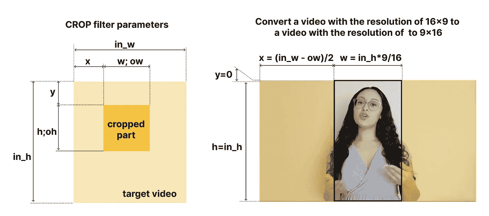
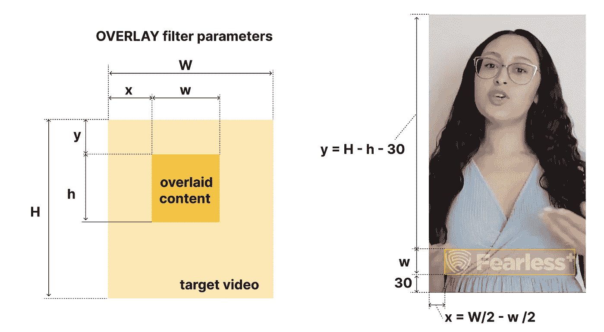
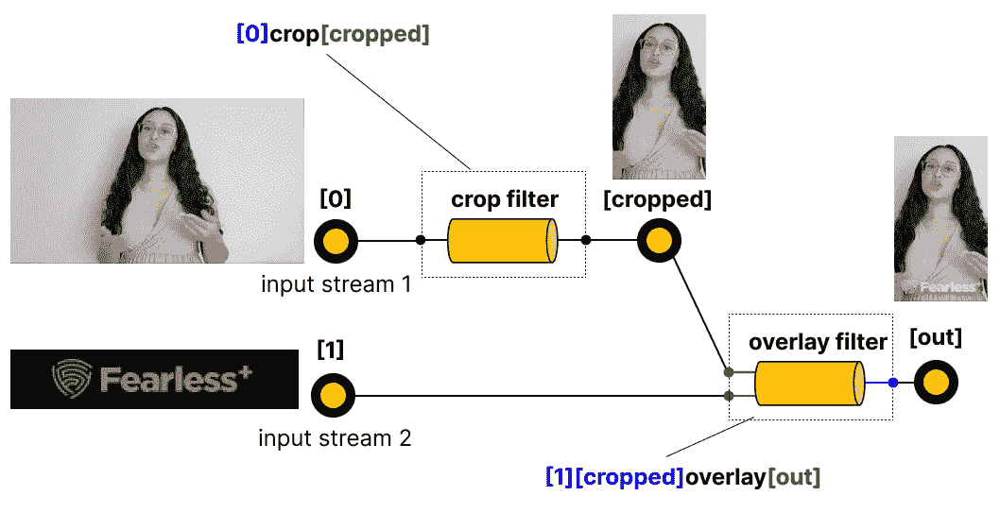
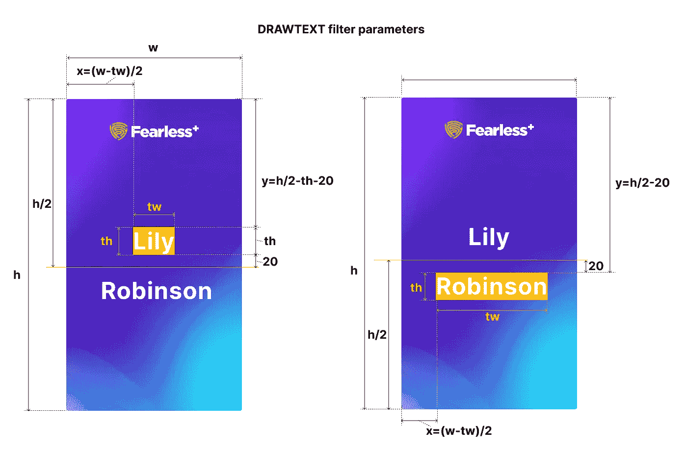

# 如何用 FFmpeg 和 NodeJs 处理视频

> 原文：<https://betterprogramming.pub/how-to-process-video-with-ffmpeg-and-nodejs-940a8e510791>

## 在这里，我们揭示了用 FFmpeg 处理视频的一些方法，以及如何在 JS 栈中使用它


作者图片

应用程序中的视频处理是当今的主流，我们作为开发人员应该遵循它。乍一看，这似乎是一个非常困难的话题，需要特殊的知识和教育。幸运的是，一些框架旨在简化这一过程，并提供一种声明性的方式来表达我们需要以何种方式处理视频的意图。

其中一个框架叫做 [FFmpeg](https://ffmpeg.org/) 。它提供了一个特殊的命令行界面(CLI ),看起来它可以完成所有需要的事情。作为工程师，我们只需要查看文档并创建一个特殊的命令。

# 先决条件

在这篇文章中，我们将实现一个特定的项目，并获得足够的知识用于您的个人项目。

完整的代码将会在 GitHub 资源库中提供，你可以在这里找到[。自述文件中有关于如何运行和使用服务器的说明。该项目用 FFmpeg 版本 4.4.1 和 NodeJS 版本 16.15.0 进行了测试。](https://github.com/vladimirtopolev/ffmpeg-composition-tutorial)

在我们开始之前，我强烈推荐阅读这篇文章，因为它提供了 FFmpeg 语法的一般概述，并解释了过滤器如何工作，因为过滤器是这个框架的核心，我们将进一步使用它们。

> 注意 FFmpeg 是在 [GNU 宽松通用公共许可证(LGPL)版本 2.1](http://www.gnu.org/licenses/old-licenses/lgpl-2.1.html) 或更高版本下。在任何商业项目中使用 FFMPEG 组件之前，您应该咨询法律团队并研究 FFmpeg 网站的[法律部分](https://www.ffmpeg.org/legal.html)

嗯，最初的任务如下——用户应该记录他们对一些面试问题的回答；然后，前端(FE)将这些视频块发送到服务器，并附带与每个视频块相关联的元数据(在我们的例子中，是问题本身以及用户的名字和姓氏)。

在这里，我跳过了 FE 部分的实现，将摄像机录制的视频直接放入服务器`/src/media/camera`。它包括两个录制的 MP4 格式的视频，分辨率为 1280x720(也可能以 WebM 格式交付，但这并不重要，因为 FFmpeg 可以轻松地将视频从一种格式转换为另一种格式)。

我们需要从所有记录的块中创建一个视频组合，并在每个块之前放置一些封面(图 1):

*   用标题覆盖——在这里我们需要包含用户的名字和姓氏(图片。1: 1)
*   用一个问题覆盖——在每个记录的组块之前，我们需要在那里加入一个问题(图片。1: 2, 4)
*   记录块-我们需要把一个标志水印放在里面，并调整它以适应预期的分辨率 9x16(图片。1: 3, 5 )
*   片尾——这一大块将由 Motion Designer 准备，我们不需要做任何修改，只需将其连接到最终的视频(图片。1: 6)


图 1 —最终视频合成方案

嗯，动作设计师还应该为屏幕 1、2 和 6 准备视频封面，只跳过那些被认为是可变的元素(例如，名字、姓氏或问题)。您可以在项目资源库文件夹`/src/media/covers`中找到所有这些封面

下面你可以看到我们将要创作的最终作品:

在这里，您可以看到如何以编程方式更改名字或姓氏并生成新组合的过程(当然，您可以根据需要更改任何其他初始数据):

# 1.使用 FFmpeg 的方法

有很多方法可以使用这个框架。让我们来看看其中一些可能有趣的。

## 1.1.在本地机器的终端中运行 FFmpeg 命令

首先，您需要在本地机器上安装 FFmpeg(要了解更多信息，请参见这个[链接](https://ffmpeg.org/download.html))。

安装后，确保 FFmpeg 可用:

```
ffmpeg -version
```

如果一切正常，您可以创建特定的命令。例如，这个将两个视频`in1.avi`和`in2.avi`连接成一个名为`out.avi`的视频

```
>  ffmpeg -i in1.avi -i in2.avi -filter_complex concat out.avi
```

## 1.2.在 NodeJS 服务器上将 FFmpeg 作为命令运行

让我们假设我们的服务器应该在 Docker 容器中启动。当然，我们需要把它安装在里面。您的 Docker 文件可能如下所示:

```
FROM node:16 AS deps
WORKDIR /app
COPY . .
RUN wget [https://www.johnvansickle.com/ffmpeg/old-releases/ffmpeg-4.4.1-arm64-static.tar.xz](https://www.johnvansickle.com/ffmpeg/old-releases/ffmpeg-4.4.1-arm64-static.tar.xz) &&\
    tar xvf ffmpeg-4.4.1-arm64-static.tar.xz &&\
    mv ffmpeg-4.4.1-arm64-static/ffmpeg /usr/bin/ &&\
    mv ffmpeg-4.4.1-arm64-static/ffprobe /usr/bin/ 
#RUN apt install -y ffmpeg
RUN yarn install
RUN yarn buildEXPOSE 3000ENV PORT 3000CMD [ "node", "dist/index.js" ]
```

之后，您可以在 NodeJS 服务器上以这种方式执行任何 FFmpeg 命令:

```
import { exec } from 'child_process';exec('ffmpeg -i in1.avi -i in2.avi -filter_complex concat out.avi')
```

在 docker 容器中安装 FFmpeg 并不是最好的选择，所以我们要使用[@ FFmpeg-installer/FFmpeg](https://www.npmjs.com/package/@ffmpeg-installer/ffmpeg)NPM 依赖。它为当前平台安装了一个`ffmpeg`的二进制文件，并提供了一个到框架的路径。代码看起来像这样:

```
import { path as ffmpeg } from '@ffmpeg-installer/ffmpeg';
import { exec } from 'child_process';exec(`${ffmpeg} -i i1.avi -i i2.avi -filter_complex concat out.avi`)
```

对了，如果这种情况下需要使用`ffprobe`，还有另外一个安装程序——[@ ff probe-installer/ff probe](https://www.npmjs.com/package/@ffprobe-installer/ffprobe)，工作方式也是一样的:

```
import { path as ffprobePath } from '@ffprobe-installer/ffprobe';
import { exec } from 'child_process';exec(`${ffprobePath} -v quiet \
   -print_format json \
   -show_format \
   -show_streams \
   /path/to/input.mp4 \ 
   > /path/to/file/where/with/meta.json`
)
```

该命令从视频`/path/to/input.mp4`中提取元信息，并以 JSON 格式打印在文件`/path/to/file/where/with/meta.json`中

## 1.3.在 NodeJS 服务器上用特殊的包装器运行 FFmpeg

尽管 FFmpeg 命令看起来非常具有声明性，但它仍然不是在服务器上将该命令作为字符串处理并以编程方式连接不同部分的最方便的方式。在这种情况下，你可以使用库 [fluent-ffmpeg](https://github.com/fluent-ffmpeg/node-fluent-ffmpeg) 。我们通过构建器模式构建 FFmpeg 字符串命令，可以链接不同的逻辑部分。

例如，这个命令

```
exec(`${ffmpeg} -i i1.avi -i i2.avi -filter_complex concat out.avi`)
```

可以这样改写:

```
import * as ffmpeg from 'fluent-ffmpeg';ffmpeg()
  .input('i1.avi')
  .input('i2.avi')
  .filterComplex('concat)
  .output('out.avi')
```

也许，这个命令没有给人留下深刻的印象，也没有显示出所有的好处，但无论如何，使用起来还是很舒服的。

顺便说一下，如果你想使用安装程序安装的框架[@ ffmpeg-installer/ffmpeg](https://www.npmjs.com/package/@ffmpeg-installer/ffmpeg)或[@ ff probe-installer/ff probe](https://www.npmjs.com/package/@ffprobe-installer/ffprobe)——你应该定义这些路径:

```
import { path as ffmpegPath } from '@ffmpeg-installer/ffmpeg';
import { path as ffprobePath } from '@ffprobe-installer/ffprobe';
import * as ffmpeg from 'fluent-ffmpeg';// set paths
ffmpeg.setFfmpegPath(ffmpegPath);
ffmpeg.setFfprobePath(ffprobePath);
```

如果你不设置这些路径，`fluent-ffmpeg`将试图直接调用`ffmpeg`(所以它应该在你的`PATH`)。

## 1.4 在浏览器中运行 FFmpeg

它太酷了，你甚至可以在浏览器中运行 FFmpeg。我不打算在本文中重点讨论这个问题，但是您可以在这里自己探索一下——一个名为 FFMPEG 的项目。WASM

# 2.项目执行

看起来我们准备好开始了。

## 2.1 调整视频录制块的分辨率

首先，我们录制的组块的分辨率是 1280x720 (16x9)，但是根据构图(图 1)，应该调整为 9x16 分辨率的视频。

为此，我们可以使用`crop`滤波器(文档在此处为)。在图 2 中，我们反映了任务的参数:



图片 2 —将分辨率为 16x9 的视频调整为分辨率为 9x16 的视频

请注意，过滤器参数可能被设置为数学表达式，您可能包括文档中列出的所有内容，在我们的例子中，我们有一种方法来提取输入宽度/高度(`in_w/in_h`)和输出宽度/高度(`ow/oh`)

让我们编写命令:

```
Sometimes, it’s pretty important to see the final command that fluent-ffmpeg compile and we achieve that with the following event:ffmpegCommand
   .on('start', (commandLine) => {
      console.log(`Spawned command: ${commandLine}`);
   })
   .run()
```

在我们的例子中，它用下面的命令编译:

```
ffmpeg \ 
   -i /path/to/input/video \
   -filter:v crop=w=in_h*9/16:h=in_h:x=(in_w-ow)/2:y=0 \ 
   /path/to/output/video
```

## 2.2 在记录的块下放置水印

为此，FFmpeg 有一个特殊的`overlay`视频滤镜(文档是[这里是](https://ffmpeg.org/ffmpeg-filters.html#overlay-1))。它有两个输入，一个输出。第一个输入是第二个输入覆盖的“主”视频。第二输入可以是视频或图像。

该命令的原始结构如下所示:

```
ffmpeg 
   -i /path/to/main/video
   -i /path/to/overlaid/content
   -filter_complex overlay=x:y
   /path/to/output
```

嗯，我们只需要计算出所需的`x`和`y`坐标，并根据设计进行调整(图 1；3d 屏幕):



图 3-叠加滤镜设置

使用`fluent-ffmpeg`可以将该命令转换为以下命令:

```
ffmpeg()
   .input('./input/video.mp4')
   .input('./input/logo.png')
   .complexFilter(['overlay=W/2-w/2:H-h-30'])
   .output('./output.mp4')
```

## 2.3 代码优化

我们可以创建两个单独的命令(像 2.1 和 2.2 中那样)一个接一个地应用于记录的块。但是在这种情况下，每个命令的 FFmpeg 应该为每个命令编码和解码媒体——这不是一种非常有效的方式。

Fmpeg 允许我们使用一个过滤图将所有内容组合在一个命令中(让我提醒您，详细的解释在文章[这里](https://medium.com/numatic-ventures/how-to-process-video-with-ffmpeg-framework-syntax-from-zero-to-hero-81812e8e8785)中提供)。

让我们描述一下为新命令提供心理感知的过程:



图 4 —通过一个命令中的过滤器图连接一些过滤器

这个合并在一个命令中的过滤图如下所示:

## 2.4 在标题封面中包含名字和姓氏

这里我们有名字和姓氏的具体值。此外，正如我之前提到的那样，运动设计师初步为这个封面准备了一个带动画的视频，没有被认为是可变的元素(图片 1:屏幕 1)。这个视频可以在项目资源库文件夹中找到:`src/media/covers/start.mp4`

为了在视频中融入文字，FFmpeg 有一个特殊的`drawtext`滤镜(文档在这里是)。了解了滤镜属性后，让我们根据设计来定义我们的期望(图 1:屏幕 1):



图 5 —绘图文本过滤器的计算

## 2.5 纳入问题文本

我将跳过这一部分的解释，但简单地说，我们将再次使用`drawtext`过滤器，其方法与 2.5 节中描述的完全相同。此外，您还有机会在这里查看项目资源库[中的代码。](https://github.com/vladimirtopolev/ffmpeg-composition-tutorial)

## 2.6 将所有视频合并在一起

在到达这一部分时，我们应该已经处理了所有的块，我们只需要将它们连接在一起。FFmpeg 有一个特殊的`concat`滤镜(文档是[这里是](https://ffmpeg.org/ffmpeg-filters.html#concat))。在拼接之前，我们应该确保所有合并的部分具有相同的分辨率(在我们的项目中，我们遵循这种方法，所有块都具有 404x720 的分辨率)和相同的 FPS(每秒帧数)。

让我们创建一个函数，它接受应该被污染的输入路径的数组和输出路径的字符串。我们的函数将如下所示:

> 注意:如果您想跟踪进度，您可以像我们在上面代码中所做的那样订阅一个`*progress*`事件。

```
ffmpegCommand.on('progress', (progress) => console.log(progress))
```

# 3.把所有东西放在一起

现在我们已经实现了应用程序的主要部分。最后一步是把所有东西粘在一起:

# 结论

FFmpeg 是一个健壮的视频处理解决方案，你可以将它与 JS 栈集成。FFmpeg 有许多可以组合在一起并创建复杂结构的过滤器。我希望这个小项目证明它并不像看起来那么难。

让我提醒你，代码可能在 GitHub 库[这里](https://github.com/vladimirtopolev/ffmpeg-composition-tutorial)找到。

# 来源

1.  [如何用 FFmpeg 处理视频？从零到英雄的框架语法。](https://medium.com/numatic-ventures/how-to-process-video-with-ffmpeg-framework-syntax-from-zero-to-hero-81812e8e8785)
2.  [视频处理的前 17 个 FFmpeg 命令](https://medium.com/numatic-ventures/top-17-ffmpeg-commands-of-video-processing-64b587325d9e)
3.  [FFmpeg 官方网站](https://ffmpeg.org/)
4.  [FFmpeg 滤波器文档](http://www.ffmpeg.org/ffmpeg-filters.html)
5.  [FFmpeg 基础知识。使用快速音频和视频编码器进行多媒体处理](http://ffmpeg.tv/)

我希望你喜欢阅读这篇文章。很高兴看到任何关于应该被涵盖的项目的评论。感谢任何有助于改进文章的帮助。谢谢你。