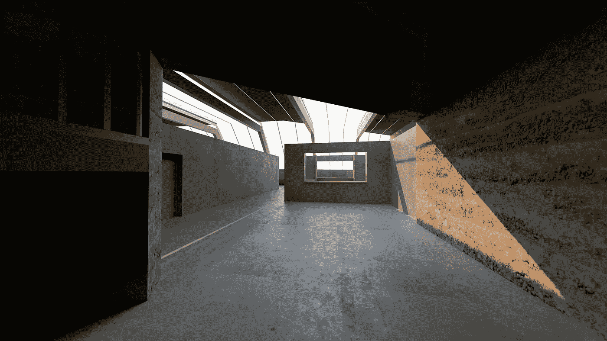
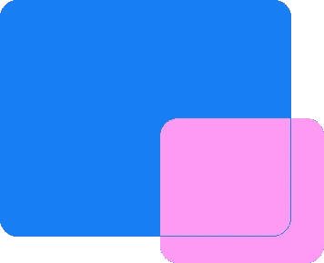
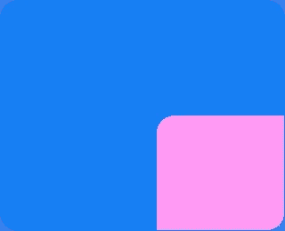

# 如何以编程方式为视图添加阴影和圆角— Swift

> 原文：<https://betterprogramming.pub/how-to-programmatically-add-shadow-rounded-corners-to-a-view-swift-df004ac98fa5>

## 仅仅定义属性并添加圆角半径并不总是足够的



由 [Sam Cid](https://unsplash.com/@marsumilae?utm_source=unsplash&utm_medium=referral&utm_content=creditCopyText) 在 [Unsplash](https://unsplash.com/search/photos/concrete-building?utm_source=unsplash&utm_medium=referral&utm_content=creditCopyText) 上拍摄的照片

如果你正在读这篇文章，你可能正在绞尽脑汁想弄明白为什么你的 UIView 没有阴影。不要难过。所有的 iOS 开发者迟早都要搞清楚这一点。有很多方法可以解决这个问题，我发现这个方法是最有效的。

如果你想直接得到答案，你可以在我的 [GitHub](https://github.com/JosiahRininger/AddShadowAndRoundedCornersToView/blob/master/AddingShadowAndRoundedCornersToView/ViewController.swift) 上找到我的解决方案。否则，让我们看看为什么你看不到你的影子，并找出如何修复这一点。

# 我的影子在哪里？

你们大多数人可能已经建立了这样的观点。

```
view.layer.shadowRadius = 8
view.layer.shadowOffset = CGSize(width: 3, height: 3)
view.layer.shadowOpacity = 0.5view.layer.cornerRadius = 20
view.layer.masksToBounds = true
```

好了，你已经定义了创建投影所需的属性，并且添加了想要的圆角半径。这看起来应该可以，对吧？

不，这个问题是`masksToBounds = true`。

# masksToBounds 和这个有什么关系？

`masksToBounds`是每个 UIView 的图层都有的属性。该属性将切断延伸到视图边界之外的任何子层或子视图。因此，通过将该属性设置为 true，视图的边界现在变成了一个可见窗口，并且该窗口之外的所有视图内容都不再可见。所以当设置`masksToBounds`为假时，可能会导致你的视图以你不希望的方式呈现。



masksToBounds = false



masksToBounds = true

请记住，在我们的例子中，`clipsToBounds`被设置为 true 与`masksToBounds`被设置为 true 的作用相同。

没有一个子视图在这个属性下是安全的，这包括阴影。想想吧。阴影位于视图边界之外。视图的投影将总是要求`maskToBounds`被设置为假以便可见。

# 您可以通过使用 contentsLayer 来解决这个问题

什么是内容杀手？它只是一个子视图，与您的视图具有相同的宽度、高度和位置。它将保存视图的所有内容，并将其`masksToBounds`设置为 true。

这有什么帮助？现在你的`contentsLayer`已经开始注意将你的子视图屏蔽到它的边界，你终于可以给你的视图添加阴影了。

```
// Creates your mainView
var mainView: UIView = {
    let view = UIView()
    view.backgroundColor = .orange
    view.layer.shadowRadius = 8
    view.layer.shadowOffset = CGSize(width: 3, height: 3)   
    view.layer.shadowOpacity = 0.5
    view.layer.cornerRadius = 20   
    view.translatesAutoresizingMaskIntoConstraints = false
    return view
 }() // Creates your contentsLayer
 // Add all your subsequent subviews to your contentsLayer
 var contentsLayer: UIView = {
    let view = UIView()
    view.backgroundColor = .orange
    view.layer.cornerRadius = 20
    view.layer.masksToBounds = true    
    view.translatesAutoresizingMaskIntoConstraints = false
    return view
 }()func setupView() {
    view.backgroundColor = .white
    view.addSubview(mainView)
    mainView.addSubview(contentsLayer) NSLayoutConstraint.activate([ // Constrains your mainView to the ViewController's view
        mainView.centerYAnchor.constraint(equalTo: view.centerYAnchor),
        mainView.centerXAnchor.constraint(equalTo: view.centerXAnchor),
        mainView.heightAnchor.constraint(equalToConstant: view.frame.height * 0.5),
        mainView.widthAnchor.constraint(equalToConstant: view.frame.width * 0.7), // Constrains your contentsLayer to the mainView
        contentsLayer.centerYAnchor.constraint(equalTo: mainView.centerYAnchor),
        contentsLayer.centerXAnchor.constraint(equalTo: mainView.centerXAnchor),
        contentsLayer.heightAnchor.constraint(equalTo: mainView.heightAnchor),
        contentsLayer.widthAnchor.constraint(equalTo: mainView.widthAnchor)
    ])
}
```

下面是[的源代码](https://github.com/JosiahRininger/AddShadowAndRoundedCornersToView/blob/master/AddingShadowAndRoundedCornersToView/ViewController.swift)。

额外提示:当一个视图没有背景色或者 alpha 小于 1.0 时，你不能给它一个阴影。相反，它的所有子视图都将继承阴影。

# **结论**

当您的视图的`masksToBounds`设置为 true 时，您的视图的阴影将不可见。这可以通过创建一个子视图来处理，这个子视图负责将你的内容屏蔽到它的边界。

这是我的第一篇文章，但我真的希望我能帮助别人解决这个问题。我今年开始了 iOS 开发，还有很多东西要学，所以我希望听到其他的解决方案。