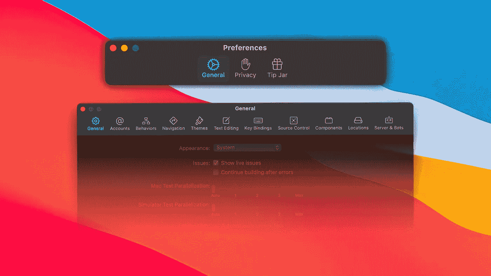
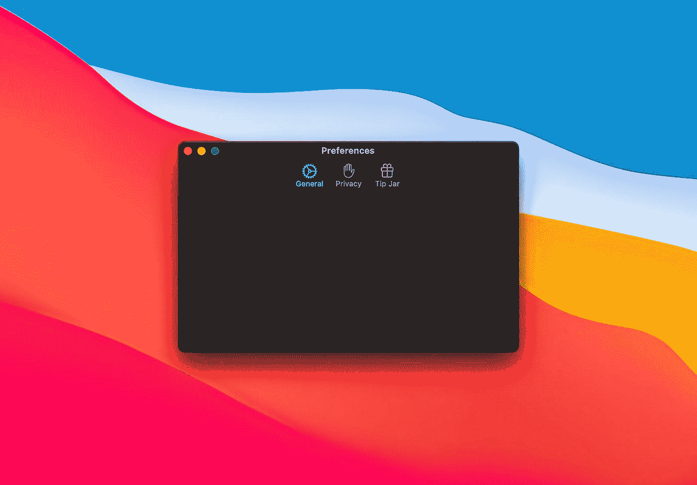

# 如何在 macOS Catalyst 中以编程方式创建偏好样式的工具栏

> 原文：<https://betterprogramming.pub/how-to-programmatically-create-a-preference-styled-toolbar-in-macos-catalyst-d7c370199c49>

## Catalyst 中更好的工具栏样式

作者照片。

大苏尔给 Mac 带来了大规模的重新设计。它提供了新的图标和新的、更简洁的 UI 设计，同时保持了 macOS 的特性。它也为我们的 Catalyst 开发带来了很大的改进，但是今天我们将讨论工具栏的新偏好样式。

本文的目的是创建一个具有这种工具栏风格的首选项控制器。这种风格以前已经存在，但大苏尔采取了不同的方法。它现在有一个更干净的外观和感觉，并且在越来越多的应用程序中使用。本教程假设您已经有了首选项窗口的场景。

# 让我们开始编码吧

首先，我们需要在窗口中添加一个`toolbar`。在我们的`SettingsViewController`中，我们制作了一个名为`insertToolbar()`的新函数:

让我们分解一下刚刚编写的代码:

1.  我们检查我们是在为 Mac 还是 iOS 构建。
2.  我们从当前的`windowScene`创建一个场景对象，如果它存在的话。如果不存在，函数返回。
3.  我们检查场景中是否有标题栏。
4.  我们用`mainToolbar`标识符创建了一个`NSToolbar`类型的`toolBar`对象。我们还将`ToolbarIdentifers.general`分配给`toolBar`的`selectedItemIdentifier`属性。这会给你一个错误，这个错误稍后会被修复。
5.  我们将`toolBar`样式设置为`.preferece`，给它我们想要的外观；
6.  我们将刚刚创建的`toolBar`对象分配给`titleBar`的工具栏属性。

我们将我们的控制器`self`分配给`toolBar`的代表。它现在返回一个错误，因为我们的控制器还不符合`NSToolbarDelegate`。为了解决这个问题，我们创建了一个`ViewController`的扩展，如下所示:

在这个新的扩展中，我们将实现一些工具栏功能。首先，创建一些标识符常量，而不是每次我们需要寻址一个特定的标识符时都编写一个字符串，这是一个好的做法。这将减少拼写错误的风险。所以在我们刚刚创建的扩展中，我们把这个枚举:

*注意:为了简单起见，我稍后将对 SF 符号的名称进行硬编码。*

# 标识符离题了

为了将所有的常数放在一个地方，可以这样创建一个枚举:

# 回到真正的编码

我们刚刚创建了项目的标识符。现在我们必须告诉工具栏显示什么以及如何显示。我们从添加`public func toolbarAllowedItemIdentifiers(_ toolbar: NSToolbar) -> [NSToolbarItem.Identifier]`方法开始，该方法告诉工具栏哪些项目是允许的:

它必须返回一个数组`NSToolbarItem.Identifier`，该数组由我们提前几步设置的标识符组成。现在，我们需要告诉工具栏哪些是默认项目，哪些是可选项目，以便它们获得我们期望的行为:

我们离终点只有一步之遥。我们需要确定按钮看起来应该是什么样子，以及按下时它必须做什么。`public func toolbar(_ toolbar: NSToolbar, itemForItemIdentifier itemIdentifier: NSToolbarItem.Identifier, willBeInsertedIntoToolbar flag: Bool) -> NSToolbarItem?`前来救援:

在这个方法中，我们告诉工具栏哪些项目属于哪个标识符。底部的三个方法是我们的项目执行的动作。在那里更改控制器的内容。

# 构建并运行

让我们构建并运行我们的应用程序。恭喜你，你做到了！以下是这项工作的成果:

# **奖金**

为了在改变标签页时改变窗口的标题，我们必须改变场景标题，可以这样做:

本文使用的代码可以在 [GitHub](https://github.com/gianpispi/) 上找到。