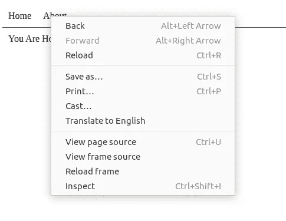

# 如何正确处理 React 应用程序中的导航

> 原文：<https://betterprogramming.pub/how-to-properly-handle-navigation-in-a-react-app-e99086dd19ec>

## 你的应用导航可能已损坏。以下是解决方法

格伦·卡斯滕斯-彼得斯在 [Unsplash](https://unsplash.com?utm_source=medium&utm_medium=referral) 上拍摄的照片。

看看下面的代码。您发现`NavBar`组件有什么问题吗？如果仅仅通过查看代码找不到问题，您甚至可能想试验一下结果:

[拨弄](https://jsfiddle.net/divinemaniac/2ha08g1k/)

# 问题是

如果你回答了上一个问题的`history.push`，那么你是正确的！这里的问题是导航是用 JavaScript 处理的。让我们看看产生问题的一系列步骤:

1.  导航到上面的“结果”标签。
2.  右键单击“主页”或“关于”链接。

缺少"*在新标签页中打开链接"*按钮

在右键上下文菜单中，缺少“在新选项卡中打开链接”选项！我数不清有多少次我访问了一个单页应用程序网站，因为无法在新标签页中打开一个链接这样简单的任务而感到沮丧！

你可能倾向于认为这没什么大不了的。然而，在新标签页中打开链接的选项已经存在很久了！这是网络浏览器的一个基本功能。剥夺用户的这种能力有时会带来令人沮丧的体验。

现在，让我们花点时间来看看如何轻松解决这个问题。我们甚至会得到更干净的代码。

# 解决方案

这个问题的解决方案是简单地使用`react-router-dom`中可用的`Link`组件:

[拨弄](https://jsfiddle.net/divinemaniac/fk3y0ntj/3/)

现在，如果您导航到“结果”并右键单击“主页”或“关于”，您应该会看到一个在新选项卡中打开链接的选项。这是一个简单的变化，可以使用户的生活更容易。使用`Link`甚至为我们创建了一个`<a>`标签。这就是链接应该在网页中呈现的方式——而不是使用`onClick`事件！

但是，您可能希望链接只是改变 URL 的一部分。搜索/查询字符串，哈希部分。您可能还想运行一个基于当前位置计算链接的函数。这都是有可能的！`Link`支持使用函数或对象作为`to`属性的值。

来源: [React 路由器的文档](https://reactrouter.com/web/api/Link)

为了更好地了解 Link 支持的一切，[查看文档](https://reactrouter.com/web/api/Link)。

# 结论

所有这些的底线是你应该确保你的链接使用一个`<a>`标签而不是一个点击处理程序。如何实现这一点以及使用哪种技术都无关紧要。

这样做的另一个好处是搜索引擎也会关注`<a>`标签。所以，让我们都使用`a`标签，让网络成为它原本的样子——一个通过超链接互相链接的文档网络。