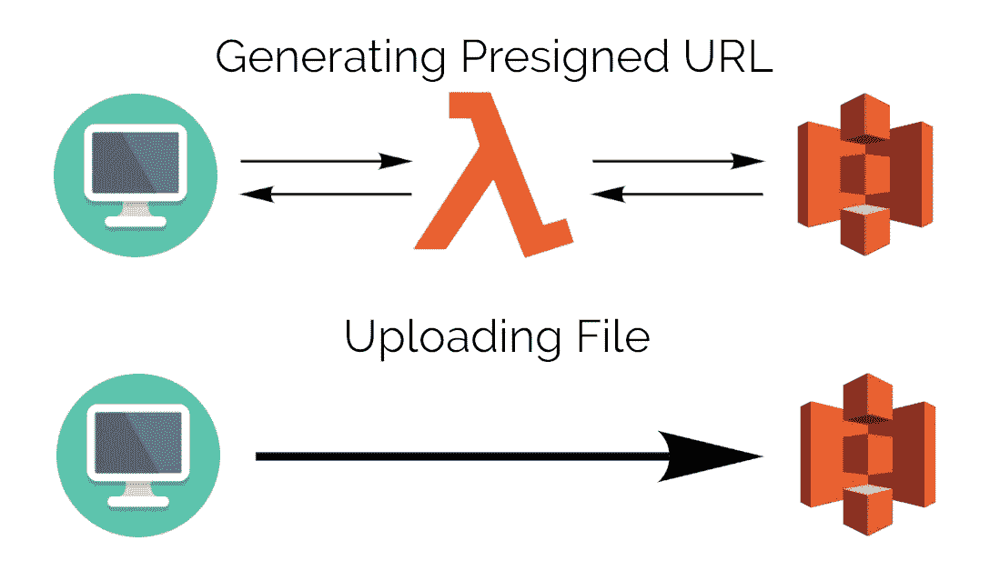
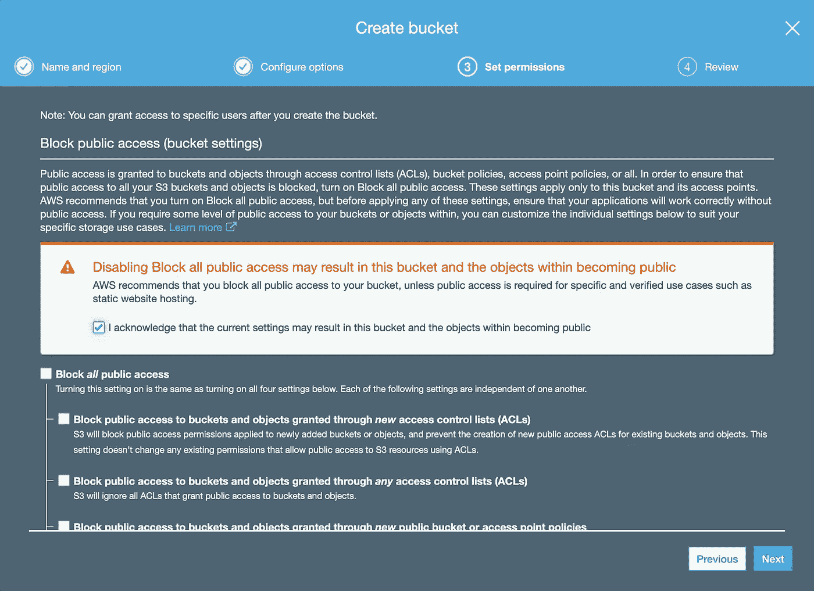
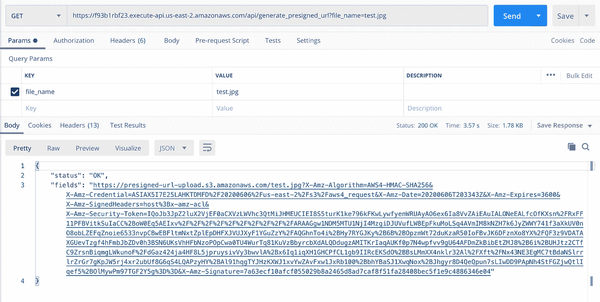
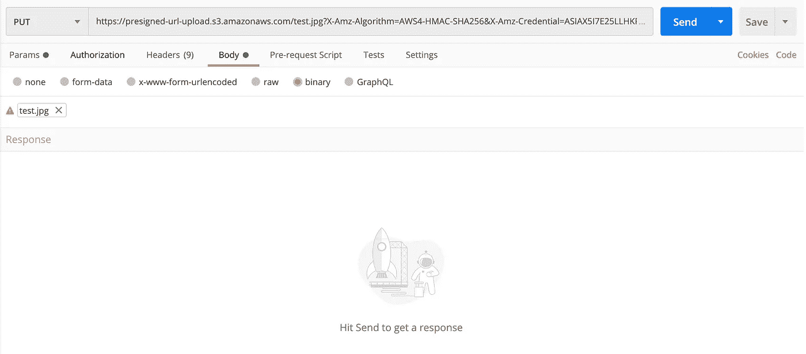

# 如何正确使用 AWS S3 预先指定的网址

> 原文：<https://betterprogramming.pub/how-to-properly-use-aws-s3-presigned-urls-147a449227f9>

## 使用 Lambda 和 Python 以及 Chalice 上传文件


照片由[格兰特·杜尔](https://unsplash.com/@blizzard88?utm_source=medium&utm_medium=referral)在 [Unsplash](https://unsplash.com?utm_source=medium&utm_medium=referral) 拍摄

上周，我和我的开发伙伴 kiziltepecinar、ege.gurkan2608 正在努力将 AWS S3 预先设计的 URL 文件上传到我们的网站。

我们知道有很多关于这个主题的教程，包括 AWS 自己的[文档](https://docs.aws.amazon.com/AmazonS3/latest/dev/PresignedUrlUploadObject.html)，但是我们看到的所有教程都是旧的或者缺少一些要点，所以我们决定写一个完整的教程。如果你是一个想用预先设计好的网址上传文件到 S3 的开发者，那么你来对地方了。

在本教程中，我们将使用 Chalice 部署一个 REST API 到 Lambda，调用 REST API 获得一个预先设计的 URL，最后直接上传一个文件到 S3 桶。



# 圣杯入门

> “AWS Chalice 是一个用于 AWS 的 Python 无服务器微框架，允许您快速创建和部署使用 Amazon API Gateway 和 AWS Lambda 的应用程序。”——亚历克斯·普尔弗， [AWS 开发者博客](https://aws.amazon.com/blogs/developer/deploying-aws-chalice-application-using-aws-cloud-development-kit/)

如果你想自己开始，你可以遵循[Chalice 文档](http://Chalice is a framework for writing serverless apps in python. It allows you to quickly create and deploy applications that use AWS Lambda.)并跳到[配置 AWS 部分。](#8f29)

首先，你需要在你的电脑上配置你的 AWS 键，这样 Chalice 就可以访问 Lambda。(更多信息可以在这里找到[。)](https://docs.aws.amazon.com/cli/latest/userguide/cli-chap-configure.html)

```
$ mkdir ~/.aws
$ cat >> ~/.aws/config
[default]
aws_access_key_id=YOUR_ACCESS_KEY_HERE
aws_secret_access_key=YOUR_SECRET_ACCESS_KEY
region=YOUR_REGION (such as us-west-2, us-west-1, etc)
```

配置完成后，让我们通过运行下面的命令来启动我们的 Chalice 项目。

```
$ pip install chalice
$ chalice new-project s3_presigned_file_upload
```

这将创建两个文件:`app.py`和`requirements.txt`，位于`s3_presigned_file_upload`下。当我们用我们最喜欢的编辑器打开`app.py`时，我们将面对下面的代码(以及一些注释):

现在我们需要配置 S3 桶和 Lambda 权限，让我们的 Lambda 函数成功地创建预先指定的 URL。

# 配置 AWS

首先，我们需要创建一个 S3 桶。(如果你已经有一个了，你可以用它，但是记得做下面的配置。)

登录控制台，导航至 S3、**、**，点击蓝色的“创建桶”按钮。我们将我们的 bucket 命名为`presigned-url-upload`，除了 Set Permissions 下的“Block all public access”之外，其他都保持默认。(如果您希望允许公众访问某些文件，如个人资料照片，则需要将其关闭。)



在创建了 bucket 之后，我们还需要编辑 bucket 的 CORS 配置。导航到存储桶，选择“权限”选项卡下的“CORS 配置”,并复制以下配置:

接下来，我们需要给 Lambda 必要的权限。

为此，导航到 Lambda 仪表板，选择您的函数(在我的情况下是`s3_presigned_file_upload-dev`)，转到 Permissions 选项卡，然后单击角色名(与您的函数名相同)。

这将打开一个 IAM 仪表板。点击“附加策略”，搜索“S3 *”，*选择“AmazonS3FullAccess”，点击左下方的“附加策略”；这给了 Lambda 访问 S3 并生成 URL[【2】](#2a6e)的必要权限。


# 生成预先设计的 URL

我们将使用 [boto3](https://boto3.amazonaws.com/v1/documentation/api/latest/index.html) 连接到我们的 S3 桶并生成 URL 因此，我们需要更改我们的 Lambda 代码，如下所示[【3】](#2a6e):

这段代码在`/generate_presigned_url`接收到参数中带有`file_name` 的 GET 请求后，它会发送给我们一个预先指定的 URL，这将使我们能够使用 put 请求将文件放到 S3。

记住，在这个例子中，`BUCKET_NAME` 是`presigned-url-upload`，我在`us-east-2`地区工作。更改代码后，我们需要使用 Chalice[【1】](#2a6e)将其部署到 Lambda。

```
$ chalice deploy
```

这应该会产生与下面类似的输出:

```
Creating deployment package.
Creating IAM role: s3_presigned_file_upload-dev
Creating lambda function: s3_presigned_file_upload-dev
Creating Rest API
Resources deployed:
  - Lambda ARN: arn:aws:lambda:us-east-2:543915562838:function:s3_presigned_file_upload-dev
  - Rest API URL: [https://f93b1rbf23.execute-api.us-east-2.amazonaws.com/api/](https://f93b1rbf23.execute-api.us-east-2.amazonaws.com/api/)
```

注意 Rest API URL ( `[https://f93b1rbf23.execute-api.us-east-2.amazonaws.com/api/](https://f93b1rbf23.execute-api.us-east-2.amazonaws.com/api/)`)很重要。

现在我们的 API 已经部署好了，是时候进行测试了。

# **上传文件**

你可以发送你的请求，但是对于测试来说，我发现 [Postman](https://www.postman.com/) 真的很有用。为了测试，我们将把下面的照片发送到我们的 S3 桶。(来自[这个人不存在](https://thispersondoesnotexist.com/)的随机假人照。)


首先，我们需要向我们的 Lambda 发送一个 GET 请求，并获取我们预先指定的 URL。在这个例子中，我们将把文件命名为`test.jpg`。

```
https://f93b1rbf23.execute-api.us-east-2.amazonaws.com/api/generate_presigned_url?file_name=test.jpg
```



Lambda 请求的邮递员响应

带有所有这些参数的长 URL 是我们预先指定的 URL，我们将在其上执行第二个请求，再次使用 Postman。创建一个新请求，复制 URL，记住将请求类型设置为`PUT`。

我们还需要在 Headers 选项卡下设置一个带有键`x-amz-acl`和值`public-read` 的标题。另外，在 Body 选项卡下，选择二进制类型，并添加您的文件[【4】](#2a6e)。


标题选项卡



正文选项卡

按下发送后，获得`200 OK`状态意味着一切配置正确，文件可以从以下位置访问:

```
https://<BUCKET_NAME>.s3.amazonaws.com/<FILE_NAME>
```

如果您想从网站或移动应用程序上传文件，您需要做的就是使用相同的配置调用上面的 PUT 请求。

非常感谢你一直读到最后。如果你面临任何问题，请随时写一封回信解释你的情况，我会尽我所能帮助你。

# 笔记

[1]`public-read`访问控制列表(ACL)使文件在上传后能够被公开读取。你可以在这里了解更多信息[。](https://docs.aws.amazon.com/AmazonS3/latest/dev/acl-overview.html)

[2]无论是设置 CORS 配置来接受来自所有来源的请求，还是给予 Lambda 通过 S3 的完全访问权限，从安全角度来说都不理想，而且还有更好的方法。记住这一点。

[3]虽然这看起来可能违反直觉，但没有必要将 boto3 放在`requirements.txt`中。

[4]在我遇到的很多资源中，都写着“如果文件名和扩展名不完全匹配(与预先设计的 URL 中的文件名和扩展名不匹配)，就会产生一个`SignatureDoesNotMatch` 错误。”然而，这不是真的——我甚至成功地将同一个`test.jpg`上传到了一个为`file_name_and_format_wrong.png`预先设计的 URL。如果你面临一个`SignatureDoesNotMatch`错误，检查你的头；没有放置`x-amz-acl`标题会导致错误。