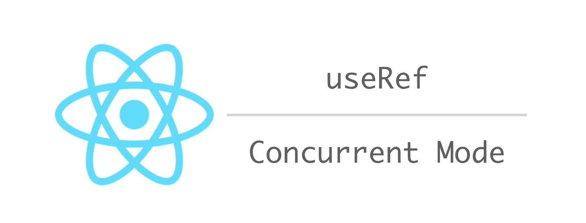

# 如何在并发模式下正确使用 React useRef 钩子

> 原文：<https://betterprogramming.pub/how-to-properly-use-the-react-useref-hook-in-concurrent-mode-38c54543857b>

## 并发模式要求更严格的组件编写方式

# 介绍

根据 [React 16.x 路线图](https://reactjs.org/blog/2018/11/27/react-16-roadmap.html)，我们很快就可以期待并发模式了。

## React 16.x (~Q2 2019):并发模式的那个

并发模式允许 [React](https://reactjs.org/) 应用在不阻塞主线程的情况下渲染组件树，从而提高响应速度。

它是可选的，并允许 React 中断长时间运行的呈现(例如，呈现新的提要故事)来处理高优先级事件(例如，文本输入或悬停)。

并发模式还通过跳过快速连接上不必要的加载状态来改善用户的悬念体验。

虽然它是一个选择加入的特性，但是您可以很容易地启用它，如果您的组件没有正确实现，它将无法正常工作。

简而言之，你不能在你的渲染函数中制造副作用。这一直都是正确的，但是直到我们有了并发模式，它才成为一个真正的问题。

在并发模式下，可以多次调用渲染函数，而无需实际提交(例如，将更改应用到 DOM)。

幸运的是，严格模式故意调用两次呈现函数，您可以在开发模式中看到错误的行为。更多信息请参考[文档](https://reactjs.org/docs/strict-mode.html#detecting-unexpected-side-effects)。

这篇短文关注的是 React 的钩子之一`useRef`。`useRef`钩子非常强大，经常会被误用。一般来说，开发人员应该避免使用`useRef`，如果他们可以使用`useState`来代替的话。

本文展示了错误使用`useRef`的示例代码以及如何修复它。

这个例子是一个简单的计数器，只是为了说明这个问题。不是产品代码，实际上可以用`useState`实现同样的例子。

# 错误代码

它在传统的 React 中按预期工作，其中呈现阶段和提交阶段是一对一的。

但是，如果它多次调用 render 函数而没有提交，计数会意外增加。

# 好代码

这段代码使用了`useEffect`，它的第一个参数函数只在提交阶段被调用。

`currentCount`是渲染函数范围内的局部变量，它只会在提交阶段改变 ref `count`。ref 本质上是函数范围之外的一个全局变量，因此修改它是一个副作用。

# 演示

为了运行上面的两个代码示例，下面是应用程序组件。

我们其实不需要`ConcurrentMode`，只要`StrictMode`就够了。

请查看下面的“codesandbox”以了解实际行为。

# 最终注释

我想用`useRef`的原因是为 Redux 开发一个绑定库。它需要订阅全局存储，并在状态更新时更新组件。

ref 用于跟踪上一次呈现的状态。要了解更多信息，请查看 GitHub 资源库。

 [## 戴式/反应式挂钩-简易-还原

### 使用 Hooks API 为 Redux 提供简单的 React 绑定。为 dai-shi/react-hooks-easy-redux 开发作出贡献

github.com](https://github.com/dai-shi/react-hooks-easy-redux)