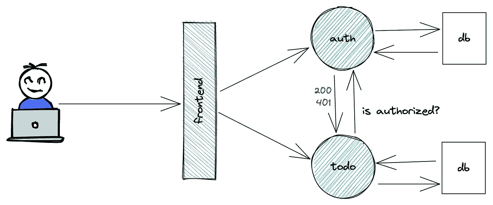
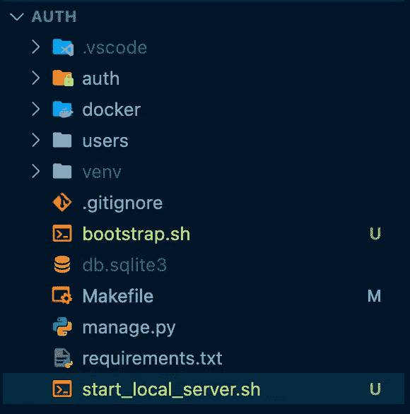
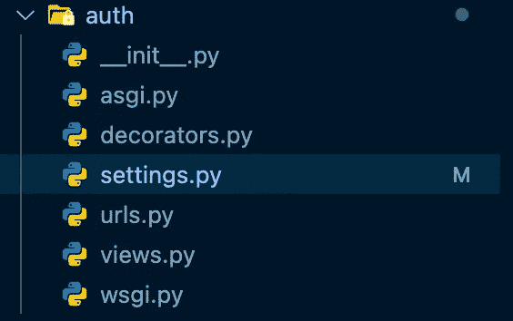
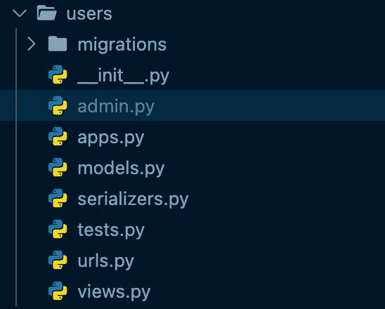
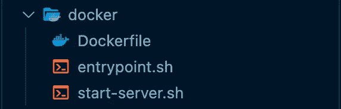

# 如何保护您的微服务

> 原文：<https://betterprogramming.pub/how-to-protect-your-microservices-8d74045061c1>

## 使用身份验证服务来验证 JWT 令牌并保护您的其他微服务(实验 01 —第 1 部分)

国际国王教会在 [Unsplash](https://unsplash.com/s/photos/security-guard?utm_source=unsplash&utm_medium=referral&utm_content=creditCopyText) 上拍摄的照片

# 开始前

当我开始学习微服务时，我想知道如何保护服务并确保用户被授权使用 API。

当我们希望使用单片架构时，我对如何构建身份认证系统和保护路由非常有信心，但对于微服务，范式和方法都有所不同。

在这次的微服务 lab01 中，我试图澄清我的疑惑，我将向大家展示如何配置一个基本的待办应用(哇，我知道的超级原创。我认为待办应用是 Hello World！配置一个微服务架构，让用户登录并在列表中添加待办事项，查看他们的任务等。但只有在授权的情况下！

我们完全同意，这个应用程序可以在一个整体架构中管理，因为它很简单。其实简单的事情的美好就在于我们可以越来越复杂。

你可以从我的 [GitHub 库](https://github.com/anotherbuginthecode/microservices-labs)中克隆代码，我将创建几个实验室实验，在那里我将尝试解决一些问题或添加高级功能，如 CI/CD、测试和自动化。

我将跳过我创建前端服务的部分，因为这已经超出了范围。

文章将按如下方式组织:

第一部分:

*   整体情况
*   授权服务

**第二部分**:

*   待办服务
*   用 docker-compose 运行所有服务

所以跟着来，让我们开始吧。

# 大局

用 [Excalidraw](https://excalidraw.com/) 制作的草图

如上所述，web 应用程序将允许用户登录，在他们的待办事项列表上创建任务，查看他们当前的任务，以及执行其他操作。

为此，我在 [Vue3](https://vuejs.org/) 中创建了一个前端服务。auth 服务用 [Django](https://www.djangoproject.com/) 编写，负责验证用户和保护服务。最后，用负责处理 web 应用程序核心动作的 [Flask](https://flask.palletsprojects.com/en/2.1.x/) 开发待办服务。

作为一种最佳实践——也是因为解耦微服务架构的性质——每个后端服务都有自己的数据库，在我的例子中是一个 PostgreSQL。

Auth 和 to-do 服务是 REST 应用程序，它们将使用 REST APIs 与前端以及彼此之间进行通信。

此外，对于每个服务，我都创建了一个 docker 文件，并使用 docker-compose 将它们连接起来。如果你[克隆存储库](https://github.com/anotherbuginthecode/microservices-labs)，你会看到一些实用的 bash 脚本或 Makefile，我用来加速重复的任务，并在构建阶段设置 docker。

# 授权服务

现在，让我们看看项目的结构。如果你有兴趣知道 Django 项目中的每个文件负责什么，我建议在这里阅读[或者](https://techvidvan.com/tutorials/django-project-structure-layout/)[Django 官方文档](https://django-project-skeleton.readthedocs.io/en/latest/structure.html)。

授权服务项目结构

## ***授权文件夹***

它是你输入`django-admin startproject <your-project-name>`时创建的文件夹。里面有像`settings.py`一样最重要的文件(用于添加所有的应用和中间件应用。它是主设置文件)和`urls.py`(它包含了我们网站的所有端点)。

授权文件夹中的文件

如前所述，auth 是一个 REST 应用程序，为了实现这一点，有一个令人惊叹的模块叫做 [django-rest-framework](https://www.django-rest-framework.org/) 。

它将帮助您解决许多令人头痛的问题，为您提供易于理解的说明。结合[djangorestframework-simple jwt](https://django-rest-framework-simplejwt.readthedocs.io/en/latest/)，你可以得到一个全功能的 jwt-token 管理器。它将允许您在用户登录时生成访问令牌，验证传递的令牌是否有效和/或过期，并刷新令牌系统。

从下面的代码中可以看出，这一切都不费吹灰之力。

## `**urls.py**`

## **views.py**

正如您所注意到的，我在`views.py`中创建了一个名为`TokenDecode`的自定义端点。它的目标是解码作为 POST 请求传递的 jwt 令牌，并返回相关的`user_id`。如果向 auth 服务发送无效令牌，它将引发 AuthenticationFailed 错误。

## **decorators.py**

我对使用 Python 中的 decorators 相当陌生，但是自从我开始使用它们以来，我已经印象深刻了。

> 装饰器是 Python 中一个非常强大和有用的工具，因为它允许程序员修改函数或类的行为。装饰者允许我们包装另一个函数，以便扩展被包装函数的行为，而不用永久地修改它。

当您查看代码时，在函数定义上方您会看到类似于`@decorator_name.`的东西，这可能是因为有一个 decorator 将函数作为参数，并在包装函数内扩展了他的行为。

在我们的例子中，我们有`@jwt_required` decorator，它必须检查授权是否在请求的头中。否则将引发 AuthenticationFailed 错误。

使用这种方法，我们可以确保只有拥有 jwt 令牌的用户才能调用我们的 API。此外，Django 将检查令牌是否有效，并防止未经授权的用户访问我们的视图。

## 用户文件夹

用户文件夹中的文件

在这里，我们可以发现用户是如何在数据库中定义的(`models.py`)以及人们如何与这个界面进行交互(`views.py`)。

## **models.py**

作为一个实验项目，我想让这部分简单一些。因此，我们将只使用电子邮件和密码来定义我们的用户。

## **views . py+serializer . py**

在这里，我定义了`APIView`以及人们如何与应用程序交互。在我们的例子中，用户可以注册到应用程序中，获得在应用程序中注册的所有用户的列表，也许在未来我可以保护这条路线，只允许管理员用户或特殊角色与之交互。

他们还可以通过`user_id`获得某个用户的详细信息。

正如你所看到的，除了`RegisterView`之外，所有的 API 都用`@jwt_required`装饰器来保护。

## **urls.py**

每个视图都需要一个端点才能被调用。那么，让我们看看我为 APIViews 定义了哪些路线。

## Docker 文件夹

让我们看看 docker 文件夹里面有什么。

docker 文件夹中的文件

**Dockerfile**

> [“Docker](https://docs.docker.com/engine/reference/builder/)可以通过读取来自`Dockerfile`的指令自动构建图像。一个`Dockerfile`是一个文本文档，它包含用户可以在命令行上调用的所有命令来组合一个图像。使用`docker build`,用户可以创建一个连续执行几个命令行指令的自动化构建。”

我是这样定义 Dockerfile 的:

我的灵感来自[Mariano Martinez Grasso](/dockerize-your-django-apps-428189407c69)写的这篇文章。

它写得很好，为您的下一个 Django 应用程序提供了很好的技巧和最佳实践。

基础映像将首先执行的脚本`entrypoint.sh`作为入口点。当您启动 docker 容器时，它将检查与 PostgreSQL DB 的连接是否已建立，然后继续执行其他指令。

在我的例子中，只有当`POSTGRES_ENABLED=1`否则，容器将使用默认数据库 db.sqlite3 运行时，才进行这种检查

基本 docker 映像将用于创建开发映像(这就是所谓的[多阶段构建](https://docs.docker.com/develop/develop-images/multistage-build/))。当您通过命令`docker run`运行容器时，bash 脚本`start-server.sh` 将通过执行您将在本地启动服务器时使用的基本指令来启动。

# **启动服务**

现在，是时候推出服务了！我准备了一个`Makefile`来自动化那些无聊的东西。如果你已经下载了代码，你只需输入命令`make <target>`就可以享受了！

*   `docker-build`:它将创建一个名为`msalab01/auth:v1`的 docker 图像
*   `docker-run`:启动名为`lab01_auth`的 docker 容器。如果需要使用不同的端口，必须在 make 命令中用变量 port 指定，否则，将使用`8000`
*   `local-build`:它将启动`bootstrap.sh`，自动完成所有初始设置，如创建虚拟环境和安装依赖项
*   `local-run`:它将启动`start_local_server.sh`，这是一个 bash 脚本，执行所有基本指令来本地运行服务器。(注意:它将使用 db.sqlite3 作为默认数据库)

# 结论

你做到了！现在一切都准备好了，你可以欣赏风景，测试路线，进行实验和改进

别忘了让我知道！我喜欢讨论和学习新东西。

我希望在[第二部分](/build-a-todo-app-using-a-microservices-architecture-and-use-auth-service-to-protect-its-routes-f8f0d2ad6669)中见到你，在那里我将向你展示我是如何创建待办事项服务并使用授权服务保护它的。

最后，我们将以所有微服务与 docker-compose 一起运行来结束 lab01！

再见！

# 有用的链接

 [## 使用微服务架构构建 Todo 应用程序，并使用授权服务来保护其路线

### 使用身份验证服务来验证 JWT 令牌并保护您的其他微服务(实验 01 —第 2 部分)

better 编程. pub](/build-a-todo-app-using-a-microservices-architecture-and-use-auth-service-to-protect-its-routes-f8f0d2ad6669)  [## GitHub -另一个 bug in 代码/微服务-实验室:一系列实验来了解…

### 在我学习微服务架构的过程中，进行了一系列的实验。有时候我会看到一些文章或者…

github.com](https://github.com/anotherbuginthecode/microservices-labs)  [## 将你的 Django 应用归档

### 从本地开发到生产

better 编程. pub](/dockerize-your-django-apps-428189407c69) 

Django 项目结构布局:[https://techvidvan . com/tutorials/django-project-structure-layout/](https://techvidvan.com/tutorials/django-project-structure-layout/)