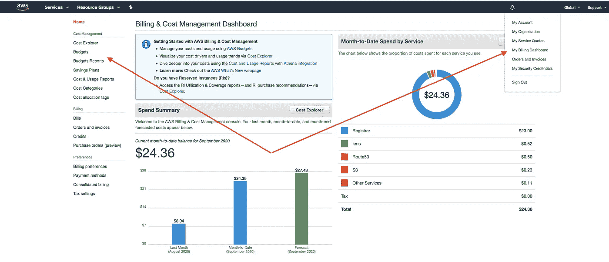
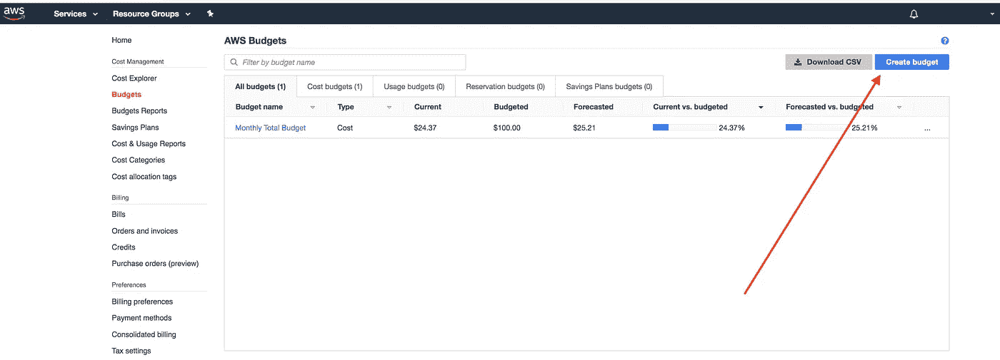
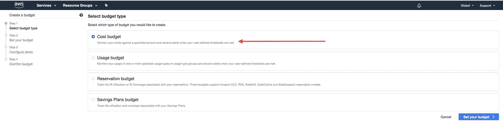
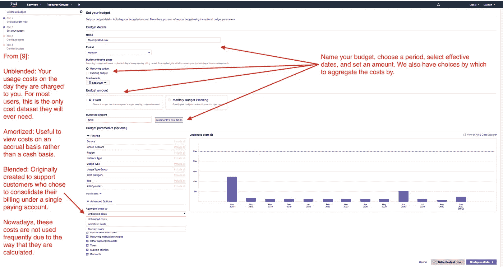
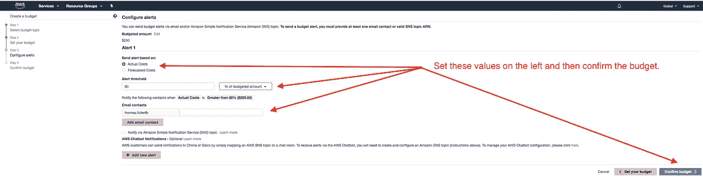
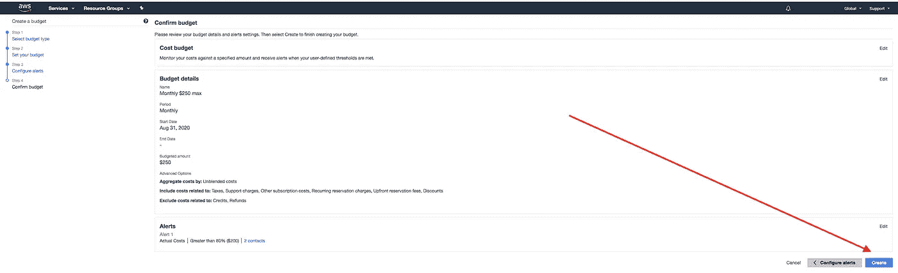
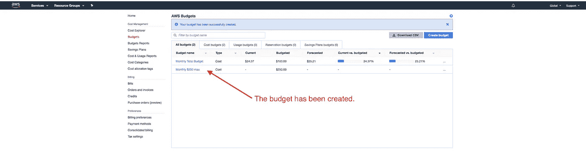
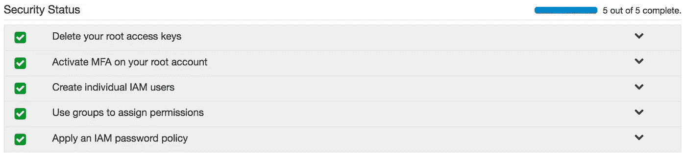
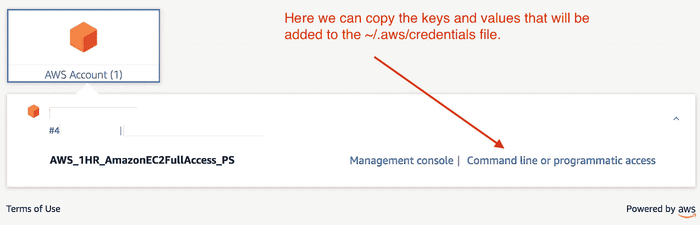

# 如何保护自己免受意想不到的高额 AWS 账单

> 原文：<https://betterprogramming.pub/how-to-protect-yourself-from-unexpectedly-high-aws-bills-4ec91bbe66f4>

## AWS 预算、警报和 AWS 单点登录


图片来源:作者

# 介绍

这真的发生了，请记住，这样的故事似乎经常发生:

> “我在[一个 AWS]研讨会上使用了我的个人 AWS 帐户，并认为我已经在研讨会结束时删除了 CF 堆栈，但实际上并没有。月底，当我在 AWS 账单上看到一笔 1500 美元的意外费用时，我震惊了。[1]

这是另一个故事——这次更糟糕:

> “所以，就像一个老笑话说的那样，专家是一个避免了所有业余爱好者犯的小错误的人——继续犯一个真正的大错误！
> 
> “嗯，**我刚刚发现了一个 14k 美元的错误**…我遇到了一个非常好的工作请求。自动执行[AWS] [理解-医疗](https://aws.amazon.com/comprehend/medical/)从一些 JSON 文件，最终在 S3 桶…有两个错误。(1)作为我平时流程的一部分，我在自己的测试账号中使用 Terraform 测试基础设施。当我运行测试时，我低估了触发自动化的 JSON 标签的数量。(2)理解-医疗的定价与[理解](https://aws.amazon.com/comprehend/)大相径庭。**是成本的 20 倍！**”②

可悲的是，如果用户简单地设置一个带有警报的预算，一旦账单达到某个阈值就发送电子邮件，这些账单灾难可能是可以避免的。

在本文中，我们将设置一个带有警报的预算，并且我们将简要查看[身份和访问管理](https://aws.amazon.com/iam/) (IAM)安全状态页面。然后我们将介绍 AWS 单点登录(SSO)。下面是结论和一个小测验。

AWS SSO 提供了一些强大的功能，可以用来帮助降低帐户被盗用的风险，我们建议花一些时间通读本文的这一部分，包括参考资料。

首先，让我们看看当你的 AWS 使用率飙升时会发生什么。

# 当你的 AWS 使用率激增时会发生什么？

像简介中提到的那些故事经常发生，当这种情况发生时，客户需要与 AWS 代表交谈，看看是否可以获得缓刑。然而，不能保证会显示出仁慈，所以你应该提前利用一些工具来帮助防止这种意外发生。Quora 上的以下问题应该被视为本文的必读内容:“[我的 AWS 帐户被黑客攻击，我有一张 5 万美元的账单，我如何减少我需要支付的金额？](https://www.quora.com/My-AWS-account-was-hacked-and-I-have-a-50-000-bill-how-can-I-reduce-the-amount-I-need-to-pay)”—特别是，克里斯·克拉克的回答很有启发性:

> “我使用 AWS 作为我的热门鸡尾酒网站。最近，当我向我的堆栈中添加一项新服务时，我的帐户被收取了类似的恶意费用(尽管不是 5 万)，与这里的其他人不同，我的结果不是积极的。**我在这里代表当这种事情发生时可能出现的不愉快的道路**，提供一些关于如何处理这种情况的建议，以及你可以采取的预防措施。
> 
> **《不太快乐的路》**
> 
> **“是的，你可以提交一张带有账单的票据，虽然亚马逊有时会‘善待’他们的客户，但他们并不需要这样做。最终，你的索赔将受到暗箱操作的会计部门的支配，如果你不喜欢裁决，你将被告知去找律师或警察(这不是开玩笑)。记录下你所做的每一件事，并且非常谨慎地对待你在案件中的行动。他们会让一切看起来都很好……直到一切都不好。AWS 的客户服务方式与其他公司不同。他们最终会对你不理不睬，所以不要认为有时在航空公司行得通的吵闹顾客的方法在这里也行得通。**
> 
> **“计费复杂。不要在没有所有数据的情况下提交罚单。我深入挖掘了我收费的根源，发现我每月被收费 3000 实例小时。怎么会？这很复杂，我甚至花了很长时间才找到那些数据，这么长时间已经不重要了，因为我的判决已经做出了。确保尽可能了解你是如何以及为什么被收取这么多费用的。他们还可能要求您删除任何与账单相关的实例，这使得挖掘日志变得困难。请考虑在删除实例之前保存所有日志文件。**
> 
> “做好一切准备，因为最终 AWS ToS 是一张空白支票。AWS 计费模式是有意开放的，在做出裁决后，你几乎无能为力。你可以在几天之内在 AWS 上积累一笔改变人生的债务，不像你的工程错误，这个 bug 是无法修复的。出于这个原因，下面我将首先提供如何避免这种情况的建议。
> 
> **“如何保护自己**
> 
> **"设置计费提醒。**如果您正在使用 AWS，即使是一个小任务，也请设置计费提醒。它们在设置过程中不是必需的，但如果你是非企业用户，我会认为这一步**是必须的**，因为 AWS 不会提醒你费用的大幅增加，除非它们绕过 15K，这已经是一笔不可思议的金额。
> 
> **“仔细阅读价格表……。如果您正在安装一项新服务，请务必仔细阅读价格表。亚马逊有时会为容器大小设置荒谬的默认值，在账单到来之前你可能看不到。但是要明白，这可能还不够好，因为 bug、松散的 API 密钥和不正确的安装会做出疯狂的事情。**
> 
> **“考虑使用其他服务。**如果您是非商业个人用户或小型企业用户，您可能需要考虑使用其他服务。AWS 是为企业客户打造的，也是一个企业钱包。是的，它可能非常便宜，但是考虑一下:在我小小的混乱之后，我可以在我使用 AWS 的这些年里每月支付 150 美元，并且仍然领先。是的，AWS 一开始可能很便宜，但一个错误就可能让它变得非常昂贵。目前，AWS 不提供为非企业客户量身定制的体验，这对希望学习该服务的新用户来说**非常危险**。考虑选择不同的服务，超龄模式更适合保护个人用户。”

请注意，一个在撰写本文时似乎还不可用的功能，也是上面引用中提到的功能，就是为您的预算设置一个硬性限制。当人们被烧伤时，这种特征要求会频繁出现。如果他们制定了预算，他们可能早就发现了自己的错误。俗话说:一盎司的预防抵得上一磅的治疗。

# 常见错误

除了没有配置预算之外，人们还会犯另外两个可能导致问题的错误:他们根本没有注意他们正在做的事情，或者他们的个人访问令牌已经被破坏。如果你知道其他可能导致意外预算超支的问题，请在评论中添加。

## 没有注意

注意力不集中会在几个方面造成伤害。例如，用户运行一个创建许多昂贵的 EC2 实例的脚本，然后离开。或者一个用户要求一个服务，没有先查价格。或者用户忘记删除一些数据，他们后来才知道他们要为此付费，而且费用不菲。

## 个人访问密钥泄露

这是一个非常糟糕的场景——在这个场景中，AWS 用户将他们的个人访问密钥(pak)包含在一个提交中，该提交在互联网上结束。需要说明的是，我们并不真正关心键，而是关心值。

这里的建议相当简单:

*   永远不要将凭证放在代码中，句号。有一种设置 AWS 环境的适当方法，您应该遵循这种方法。
*   加密巴基斯坦人。当需要在持续集成平台(如 [Jenkins](https://www.jenkins.io/) )中使用它们时，这一点非常重要。如果您需要将键/值对添加到服务器，这些值不应该以明文形式存储。
*   不要在日志消息中包含个人访问值。

GitHub 扫描秘密[27]，但不是每个人都用 GitHub。如果扫描遗漏了键/值对，或者由于其他原因丢失了它们(例如，有人丢失了以未加密文本形式存储 PAKs/PAK 值的闪存驱动器)，那么这可能是一个问题。

# 创建带有警报的预算

在本节中，我们将创建一个 250 美元的预算，当达到预算的 80%时，将发出警报并发送电子邮件。

第一张图片显示了我们可以在 My Billing Dashboard 菜单项下找到预算页面。



在下图中，我们可以看到“创建预算”按钮的位置。请注意，在本例中，我们已经有一个设置为$100.00 (USD)的现有预算。



下一页允许我们选择预算类型，在本例中，我们将选择“成本预算”



以下页面有助于创建预算。我们已经在图片中详细介绍了该页面的重要方面，并对“汇总成本”选项中的可用选项进行了解释。

参见:[了解你的 AWS 成本数据集:备忘单](https://aws.amazon.com/blogs/aws-cost-management/understanding-your-aws-cost-datasets-a-cheat-sheet/)



设定你的预算。

这个过程的下一步是创建一个警报，如下所示。



配置预算预警。

最后，我们检查预算，然后创建它。



确认预算并创建预算。

我们可以看到，我们的新预算现在出现在 AWS 预算页面上。



预算已创建。

**需要进一步研究**:如果超出预算，具体什么时候发出通知？除非有证据支持，否则我们不应该假设警报会导致立即发送通知。如果你发现了这些信息，请在评论中添加链接。

在下一节中，我们将简要探讨 IAM 的安全状态。然后，我们将介绍 AWS SSO，最后，我们将结束本文。我们希望你能对接下来的测验发表意见。

# IAM 安全状态

如果您不熟悉 AWS，您应该看看身份和访问管理(IAM)控制台。如果它看起来不像我们下面所看到的，那么考虑处理已经出现的任何标志。



关于如何实现上述结果的进一步说明可在此处找到:

*   [AWS 账户根用户](https://docs.aws.amazon.com/IAM/latest/UserGuide/id_root-user.html)
*   [启用虚拟多因素认证(MFA)设备(控制台)](https://docs.aws.amazon.com/IAM/latest/UserGuide/id_credentials_mfa_enable_virtual.html)
*   [在您的 AWS 帐户中创建 IAM 用户](https://docs.aws.amazon.com/IAM/latest/UserGuide/id_users_create.html)
*   [IAM 中的安全最佳实践](https://docs.aws.amazon.com/IAM/latest/UserGuide/best-practices.html)
*   [为 IAM 用户设置帐户密码策略](https://docs.aws.amazon.com/IAM/latest/UserGuide/id_credentials_passwords_account-policy.html)

在下一节中，我们将介绍 AWS 单点登录(SSO)。

# AWS 单点登录(SSO)

[AWS SSO](https://aws.amazon.com/single-sign-on/) 是免费的【13、22、23】并且需要 [AWS 组织](https://aws.amazon.com/organizations/)，这也是免费的，并且为 AWS 帐户所有者提供了对 AWS 资源访问的更好控制。我们已经包含了几个学习 AWS SSO 的资源，这里不再重复。但是，请参阅本文下面的参考资料部分，特别是编号 13 到 24。

在我们配置的测试设置中，我们将 Developers 组的会话时间设置为一个小时，并且我们还将策略限制为 AmazonEC2FullAccess。我们通过 Amazon 提供给我们的 URL 进行身份验证，此时我们可以从命令行或编程访问链接中选择环境变量(见下图)。



我们在`~/.aws/credentials`文件中设置这些变量，然后通过命令行执行以下命令:

```
aws ec2 run-instances --image-id ami-02354e95b39ca8dec --count 1 --instance-type t2.micro --region us-east-1 --profile 221025111467_AWS_1HR_AmazonEC2FullAccess_PS --subnet subnet-cm235nh7cc72969d2 --tag-specifications 'ResourceType=instance,Tags=[{Key=costCenter,Value=45678}, {Key=department,Value=Energy}]'
```

并且创建了 EC2 实例。

如果我们在一个小时后尝试运行相同的命令，我们将看到以下消息:

```
An error occurred (RequestExpired) when calling the RunInstances operation: Request has expired.
```

在这里注意一些事情是有帮助的:

*   用户使用用户名、密码和多因素身份验证(MFA)代码进行身份验证。
*   会议只持续一个小时。
*   凭据会自动过期。
*   用户仅限于身份和访问管理(IAM)策略权限，在本例中是 AmazonEC2FullAccess。
*   通过 CloudWatch 跟踪活动。
*   这比使用个人访问密钥稍微复杂一些；然而，设置和测试只花了大约十五分钟。

关于这一点，我们要说的最后一点涉及到 AWS 系统管理器会话管理器(SMSM)，这是留给读者的一个练习——引用自[25]:

> “会话管理器提供了安全且可审核的实例管理，无需打开入站端口、维护堡垒主机或管理 SSH 密钥…同时仍为终端用户提供了对托管实例的简单一键式跨平台访问。”

我们提到的练习如下:演示如何使用 SMSM 在正在运行的 EC2 实例上运行单个命令，比如`ls`。

# 结论

在研究这篇文章时，我们发现了一个新的 AWS 服务，目前正在预览中，名为 [AWS 成本异常检测](https://aws.amazon.com/blogs/aws-cost-management/preview-anomaly-detection-and-alerting-now-available-in-aws-cost-management/)(CAD)——来自[29]:

> “从今天开始，客户可以使用 [AWS 成本异常检测](https://aws.amazon.com/aws-cost-management/aws-cost-anomaly-detection/)来检测意外或不寻常的支出。AWS 成本异常检测使用多层状态机学习模型，该模型可以学习您独特的支出模式来调整支出阈值，这意味着您无需担心如何确定适当的阈值(例如，每日支出增加 10%)并在您的使用情况随时间变化时维护它们。这些机器学习层允许异常检测来检测各种类型的异常，例如一次性成本峰值或逐渐、持续的成本增加。异常检测可定制为对您的支出数据进行分段，并提供定制的警报首选项，以便在检测到异常时立即通知您。”

这个服务预览版于 2020 年 9 月 24 日发布，我们还没有对它进行实验。然而，这听起来似乎应该是每个人的雷达。

我们将通过建议几件事来结束这篇文章:

*   设置预算和闹钟。
*   注意你正在做的事情。
*   如果您没有使用 AWS SSO，那么可以考虑这样做。
*   如果您在 AWS 中创建了用户，并且在将来的某个时候不再使用该用户，请通过删除所有策略来禁用该用户，或者考虑完全删除该用户。
*   同样的逻辑也适用于个人访问密钥——如果它们没有被使用，就停用它们。
*   根据 IAM 安全状态页面提供的建议保护您的帐户。
*   下面的测验包含更多有助于保护您的 AWS 帐户的信息。

希望这篇文章对你有所帮助。如果你有任何问题，请在评论区留下，我们可以讨论。参加测验！

*编码快乐！*

帽子戏法:[艾伦·韦伯](https://www.linkedin.com/in/allanwebb/)，[蒂莫西·英格尔斯](https://www.linkedin.com/in/timothy-ingalls/)

# 恶作剧

你准备好测验了吗？将您的答案放在评论区进行讨论。

1.  您刚刚为个人使用打开了您的新 AWS 帐户。你应该做些什么来避免意想不到的高额账单？
2.  超出了预算，发了一封邮件，你忽略了这封邮件——会发生什么？
3.  按照 IAM 的安全状态部分中的建议，您创建了一个新用户，一个对 EC2 具有完全访问权限的用户。如果您的访问密钥被盗或误放在 internet 上，您希望进一步减轻可能发生的损害。描述一件你可以做到的事情。
4.  目前有没有一种方法可以为您的 AWS 帐户预算设置硬性限制？
5.  对于类似本文描述的错误，AWS 会帮我吗？(是，不是，也许)
6.  我能做些什么来降低我的帐户被盗用的可能性？【与 3 相关】。提示:_____ 的仪表板包括一个标题为“安全状态”的部分。
7.  问题 6 与一个被泄露的账户有关。在哪里可以找到提高个人帐户安全性的建议？参见[4，5]。
8.  对于 AIM 策略，在可视化编辑器的“创建策略”下，对于 EC2，我们看到一个请求条件，其中包括“需要 MFA”和源 IP —提供一个设置源 IP 会有所帮助的示例。(另见问题 3)
9.  为什么您不想使用 0.0.0.0/0 的源 IP？

# 参考

1.  匿名对话
2.  匿名对话
3.  [我在亚马逊网络服务上被开了 14k 美元的账单](https://dev.to/juanmanuelramallo/i-was-billed-for-14k-usd-on-amazon-web-services-17fn)(注意:这个来源与 1 不同，尽管两个数字相等。)
4.  [入门:在配置 AWS 资源时遵循安全最佳实践](https://aws.amazon.com/blogs/security/getting-started-follow-security-best-practices-as-you-configure-your-aws-resources/)
5.  [您的 AWS 客户需要改进的 10 大安全项目](https://aws.amazon.com/blogs/security/top-10-security-items-to-improve-in-your-aws-account/)
6.  [Ryan Hellyer 的 AWS 噩梦:密钥泄露导致一夜之间 6000 美元的账单](https://wptavern.com/ryan-hellyers-aws-nightmare-leaked-access-keys-result-in-a-6000-bill-overnight)
7.  [我的 AWS 账户被黑了，我有一张 50，000 美元的账单，我该如何减少我需要支付的金额？](https://www.quora.com/My-AWS-account-was-hacked-and-I-have-a-50-000-bill-how-can-I-reduce-the-amount-I-need-to-pay)
8.  [AWS 成本分配标签和成本降低:
    优化您的 AWS 服务，通过成本分配标签每月支付更少的费用](https://medium.com/better-programming/aws-cost-allocation-tags-and-cost-reduction-8a0e46e39e75)
9.  [了解您的 AWS 成本数据集:备忘单](https://aws.amazon.com/blogs/aws-cost-management/understanding-your-aws-cost-datasets-a-cheat-sheet/)
10.  [启用虚拟多因素身份验证(MFA)设备(控制台)](https://docs.aws.amazon.com/IAM/latest/UserGuide/id_credentials_mfa_enable_virtual.html)
11.  [如何使用 IAM 角色来限制从特定 IP 地址到 AWS 管理控制台的 API 调用？](https://aws.amazon.com/premiumsupport/knowledge-center/iam-restrict-calls-ip-addresses/)
12.  [储存秘密](https://www.jenkins.io/doc/developer/security/secrets/)
13.  [AWS 单点登录(SSO)](https://console.aws.amazon.com/singlesignon/)
14.  [介绍 AWS 单点登录](https://aws.amazon.com/blogs/security/introducing-aws-single-sign-on/)
15.  [如何通过 AWS 单点登录检索 CLI 使用的短期凭据](https://aws.amazon.com/blogs/security/aws-single-sign-on-now-enables-command-line-interface-access-for-aws-accounts-using-corporate-credentials/)
16.  [配置 AWS CLI 以使用 AWS 单点登录](https://docs.aws.amazon.com/cli/latest/userguide/cli-configure-sso.html)
17.  [AWS SSO 的身份和访问管理](https://docs.aws.amazon.com/singlesignon/latest/userguide/iam-auth-access.html)
18.  [管理 AWS SSO 资源访问权限概述](https://docs.aws.amazon.com/singlesignon/latest/userguide/iam-auth-access-overview.html)
19.  [请求临时安全证书](https://docs.aws.amazon.com/IAM/latest/UserGuide/id_credentials_temp_request.html)
20.  [亚马逊工作空间成本优化器](https://docs.aws.amazon.com/solutions/latest/workspaces-cost-optimizer/overview.html)
21.  [AWS 单点登录功能](https://aws.amazon.com/single-sign-on/features/)
22.  [AWS 单点登录常见问题解答](https://aws.amazon.com/single-sign-on/faqs/)
23.  [AWS 组织常见问题解答](https://aws.amazon.com/organizations/faqs/)
24.  [如何在 AWS 单点登录中创建和管理用户](https://aws.amazon.com/blogs/security/how-to-create-and-manage-users-within-aws-sso/)
25.  [AWS 系统经理会议经理](https://docs.aws.amazon.com/systems-manager/latest/userguide/session-manager.html) (SMSM)
26.  (SMSM) [开始会话](https://docs.aws.amazon.com/systems-manager/latest/userguide/session-manager-working-with-sessions-start.html)
27.  GitHub [关于秘密扫描](https://docs.github.com/en/free-pro-team@latest/github/administering-a-repository/about-secret-scanning)
28.  [我的 AWS 帐户遭到黑客攻击，我有一张 50，000 美元的账单，如何减少我需要支付的金额？](https://www.quora.com/My-AWS-account-was-hacked-and-I-have-a-50-000-bill-how-can-I-reduce-the-amount-I-need-to-pay)
29.  [预览:AWS 成本管理现已提供异常检测和警报](https://aws.amazon.com/blogs/aws-cost-management/preview-anomaly-detection-and-alerting-now-available-in-aws-cost-management/)
30.  [AWS 成本分配标签和成本降低](https://medium.com/better-programming/aws-cost-allocation-tags-and-cost-reduction-8a0e46e39e75)