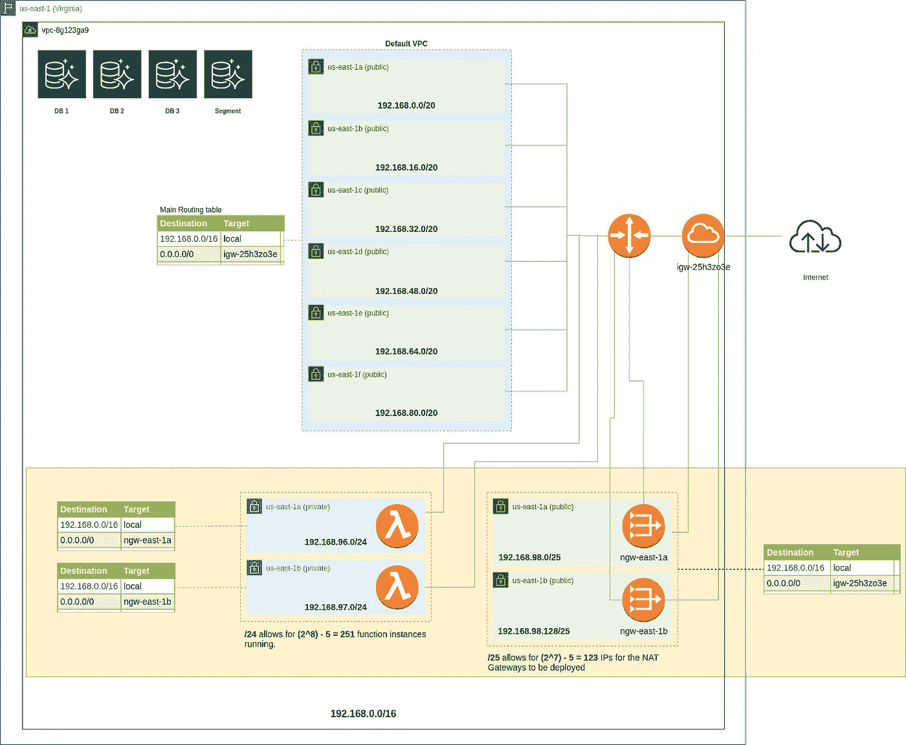
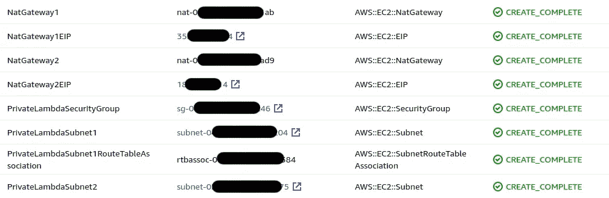

# 如何以容错方式向 AWS Lambdas 提供静态 IPs

> 原文：<https://betterprogramming.pub/how-to-provide-static-ips-to-aws-lambdas-in-a-fault-tolerant-way-c42084a0dc81>

## 或者如何在第三方防火墙上把你的 Lambdas 列入白名单

你好，我是尼克🎞 on [Unsplash](https://unsplash.com/s/photos/white?utm_source=unsplash&utm_medium=referral&utm_content=creditCopyText)

# 问题是

最近，在为我们的一个客户工作时，我们不得不应对以下挑战:我们如何为我们的 Lambdas 提供静态 IP，以便它们可以被列入我们需要集成的第三方公司的防火墙的白名单中？

你可能知道，公共 Lambdas 有短暂的 IP，这意味着它们会随时改变。这意味着当这些 IP 发生变化时，没有可靠的方法来以稳定的方式配置防火墙，而不会失去从 Lambda 通过防火墙的访问。

# 解决方案

考虑到我们已经在一个默认的 VPC 中部署了一些东西，并且考虑到将这些东西迁移到一个新创建的定制 VPC 所需要的工作量，主要是因为生产数据库，我们选择以下列方式扩展现有的默认 VPC(在黄色框中突出显示):

该图显示了如何使用 NAT 网关扩展默认 VPC，以便为 Lambdas 提供稳定的 IP

注意:资源 id 和 IP 不反映实际部署中的任何实际值。

正如您在上面突出显示的黄色框中看到的，这是一个容错解决方案，包括:

*   **两个/24 专用子网**(蓝色方框)，每个位于不同的可用性区域(AZ)，允许 2⁸ - 5 = 251 个 IP 地址(参见下面关于 AWS 保留 IP 地址的解释)
*   **两个/25 公共子网**(绿色方框)，每个子网位于不同的 AZ 上，与为新的私有子网选择的 AZ 相匹配。这些子网最多支持 2⁷ - 5 = 123 个 IP 地址，这为我们提供了一些灵活性，以防我们需要在每个子网上托管除 NAT 网关之外的任何东西。
*   **两个静态 IP**(图中未显示)
*   **两个 NAT 网关**，每个部署在一个新创建的公共子网上，每个都有自己的静态 IP
*   第一个 AZ 上的**私有子网的一个路由表。它将负责将内部流量路由到 VPC，并将外部流量通过同一 AZ 上新创建的公共子网上的 NAT 网关。**
*   第二个 AZ 上的**私有子网的一个路由表。它将负责将内部流量路由到 VPC，并将外部流量通过同一 AZ 上新创建的公共子网上的 NAT 网关。**
*   一个路由表，用于托管 NAT 网关的两个新创建的公共子网。它将负责将内部流量路由到 VPC，并将外部流量通过现有的默认互联网网关路由。

## AWS 保留的 IP 地址

我们无法使用每个子网 CIDR 块中的前四个 IP 地址和最后一个 IP 地址，也无法将其分配给实例。例如，在 CIDR 地址块为 10.0.0.0/24 的子网中，保留了以下五个 IP 地址:

*   **10.0.0.0:** 网络地址
*   **10.0.0.1:** 由 AWS 为 VPC 路由器保留
*   **10.0.0.2:** 由 AWS 保留。DNS 服务器的 IP 地址是 VPC 网络范围的基数加二。
*   **10.0.0.3:** 由 AWS 保留以备将来使用
*   **10.0.0.255:** 网络广播地址。AWS 不支持 VPC 中的广播，因此该地址被保留。

参考:[https://docs . Amazon AWS . cn/en _ us/VPC/latest/user guide/VPC-ug . pdf #入门-ipv4](https://docs.amazonaws.cn/en_us/vpc/latest/userguide/vpc-ug.pdf#getting-started-ipv4) (第 70 页)

# 履行

## 云形成模板

部署该解决方案的第一步是创建一个 CloudFormation 模板文件，用要部署的新资源定义堆栈:

扩展默认 VPC 的 CloudFormation 模板

这个 CloudFormation 模板的内容应该是不言自明的。如有任何疑问，请参考[云信息文档](https://docs.aws.amazon.com/AWSCloudFormation/latest/UserGuide/Welcome.html)。如果这还不够，请在下面留言，我很乐意帮忙。

## JSON 参数文件

如你所见，上面的 CloudFormation 模板有一个名为`Parameters`的部分。这使得模板可以重用，以防(理想情况下)您的每个环境都有不同的 VPC(例如，`development`、`staging`和`production`)。

要配置每个部署，您需要创建一个 JSON 文件，其中包含您可能想要应用堆栈更改的每个环境的参数。参见下面一个假想的`development`环境的例子:

JSON 参数文件。

注意，`VPC`和`InternetGateway`参数引用了现有的资源 id(记住，我们是在扩展现有的默认 VPC)。您可以从 AWS Web 控制台复制这些值。

## JSON 参数文件解析器

`aws cloudformation deploy`命令通过其`--parameter-overrides`标志接受参数(见下文)。参数应该用空格分隔，就像下面的例子:`ParameterKey1=ParameterValue1 ParameterKey2=ParameterValue2`。

为了让我们的生活更轻松，可以使用下面的脚本。该脚本需要一个参数，即一个 JSON 文件的路径，如上图所示，它以空格分隔的格式解析并打印该文件，如前一段所示。

用于将 JSON params 文件转换为 aws cloudformation deploy 命令接受的空格分隔格式的脚本

我们也可以有一个简单的包含空格分隔的参数的`.txt`文件，但是我个人认为 JSON 文件更容易维护，因为如果有很多参数，它更容易阅读。

## 部署堆栈

最后，我们需要部署我们的堆栈。为此，我们可以使用类似于下面的脚本:

用于部署我们的 AWS 云形成堆栈的辅助 shell 脚本

该脚本需要三个参数:

*   要部署的 AWS CloudFormation 堆栈名称
*   CloudFormation 模板`yml`文件的路径(查看上面的 CloudFormation 模板部分)
*   JSON 参数文件的路径，该文件包含云形成模板所期望的参数(查看上面的 JSON 参数文件部分)

注意:正如您在第 8 行看到的，这个脚本依赖于我们在上面的 JSON 参数文件解析器小节中创建的 JSON 解析器脚本。

## 把所有的放在一起

一切就绪后，运行以下命令来部署您的堆栈:

部署 CloudFormation 堆栈的脚本使用示例

其中:

*   `deploy-cfn-stack.sh`:上面部署堆栈部分描述的脚本
*   `stack-name`:您的 CloudFormation 堆栈将被部署的名称
*   `path-to-cfn-template-file`:CloudFormation 模板`yml`文件的路径，如上面 cloud formation 模板部分所述
*   【CloudFormation 模板的 JSON params 文件的路径，如上面的 JSON 参数文件一节所述

# 测试您的部署

您可以通过以下步骤检查您的部署是否有效:

1.打开 AWS Web 控制台，找到您创建的 CloudFormation 堆栈。

2.验证是否创建了下图所示的资源以及其他资源:

我们部署的堆栈中的资源列表。

3.在我们部署的堆栈创建的两个 Lambda 私有子网之一中创建一个新的 EC2 实例。

4.`ssh`到新创建的实例中，并运行以下命令:

`curl 'https://api.ipify.org?format=json'`

结果应该是您在 CloudFormation 堆栈资源列表中看到的两个静态 IP 之一，如上面的截图所示。具体的 IP 取决于您在创建 EC2 实例时选择的子网。请记住，每个私有子网都有自己的路由表，它将流量路由到与私有子网位于同一 AZ 上的相应 NAT 网关。

或者，您也可以创建并部署一个简单的 Lambda 函数来响应 GET 请求。这个函数将对我们上面提到的同一个端点执行 GET 请求，并将响应返回给客户机，因此您可以验证它是否具有预期的 IP 地址。

# λ配置

既然基础设施已经设置好了，是时候配置 Lambda 了，它将被部署在由我们的栈创建的 Lambda 私有子网上。

我们碰巧使用的无服务器框架提供了配置你的函数的 VPC 细节的能力。

如果您密切关注上面的 CloudFormation template 部分中描述的 CloudFormation 模板`yml`文件，您会注意到，除了其他内容之外，它还输出(查看文件末尾的`Outputs`部分)由部署创建的安全组和私有子网。

您可以很容易地在您的`serverless.yml`文件中引用这些值，如下所示:

在无服务器框架`serverless.yml`文件上引用 CloudFormation 输出的示例配置

参考:[https://server less . com/framework/docs/providers/AWS/guide/functions/# VPC-configuration](https://serverless.com/framework/docs/providers/aws/guide/functions/#vpc-configuration)

# 打扫

完成所有工作后，您可以通过在本地机器上运行以下命令来删除堆栈:

此外，确保删除您在上一节中为测试部署而手动创建的任何资源。

# 定价

截至本文撰写之时:

*   每个 NAT 网关每小时 0.045
*   每 0.045

**每月定价= 2 * 0.045 * 24 * 30 = 64.8 美元+数据成本**

其中:

*   两个 NAT 网关实例
*   每个 NAT 网关每小时 0.045
*   24 小时
*   30 天
*   数据成本:每消耗 GB 0.045 英镑

参考:[https://aws.amazon.com/vpc/pricing/](https://aws.amazon.com/vpc/pricing/)

# 最终意见

本文展示了如何使用 NAT 网关容错地扩展现有的默认 VPC，使您能够为您的 Lambdas 提供静态 IP，这些 IP 可以被列入第三方防火墙的白名单。

您应该记住的一点是，在专用子网上部署 Lambdas 会显著增加它们的冷启动时间。

在我们的例子中，由于对这个第三方防火墙应用程序的请求是使用一个定制的队列系统异步处理的，这个限制对我们来说并不是一个障碍。

虽然其他解决方案也有可能解决同样的问题，但是考虑到现有的堆栈，这种方法对我们来说更自然。

编码快乐！

# 资源

*   [亚马逊虚拟私有云-用户指南](https://docs.amazonaws.cn/en_us/vpc/latest/userguide/vpc-ug.pdf)
*   [云形成文件](https://docs.aws.amazon.com/AWSCloudFormation/latest/UserGuide/Welcome.html)
*   [ipify API -一个简单的公共 IP 地址 API](https://www.ipify.org/)
*   [无服务器- AWS 功能- VPC 配置](https://serverless.com/framework/docs/providers/aws/guide/functions/#vpc-configuration)
*   [亚马逊 VPC 定价](https://www.freecodecamp.org/news/lambda-vpc-cold-starts-a-latency-killer-5408323278dd/)