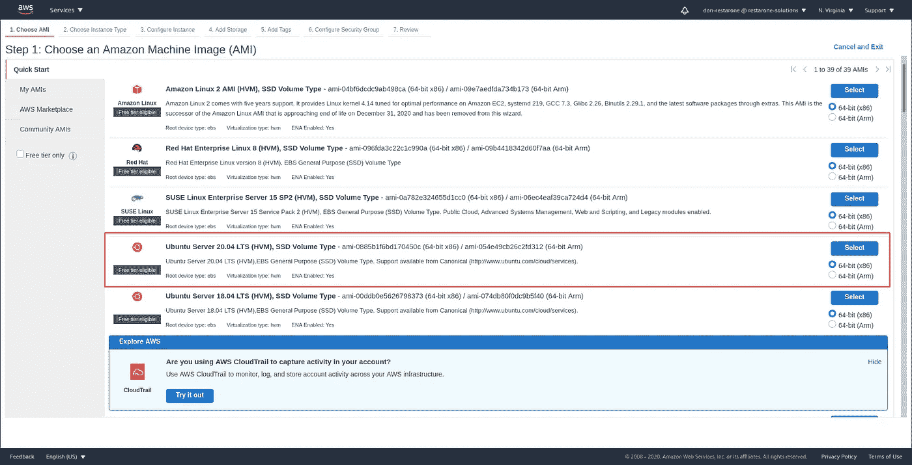
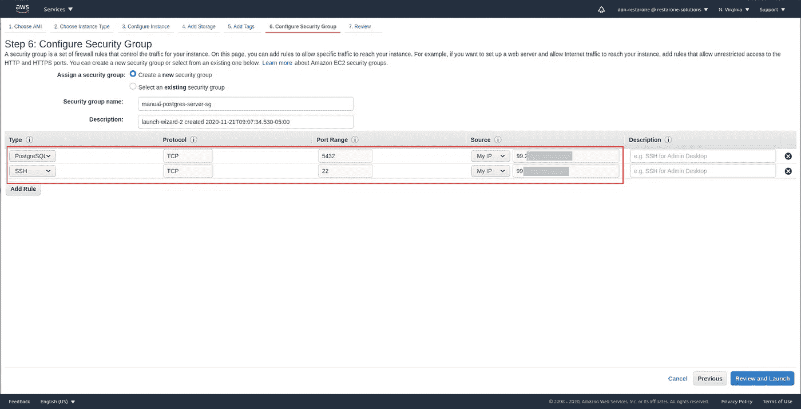
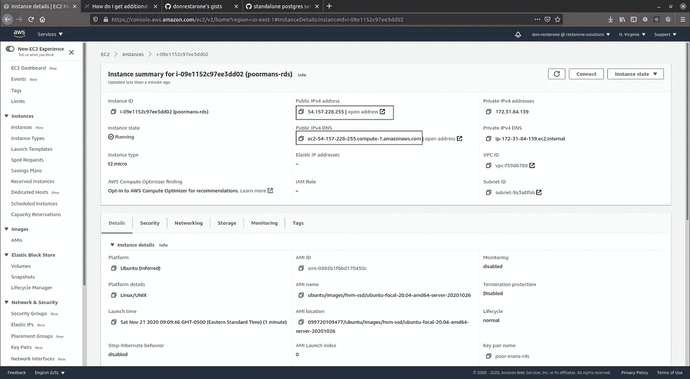
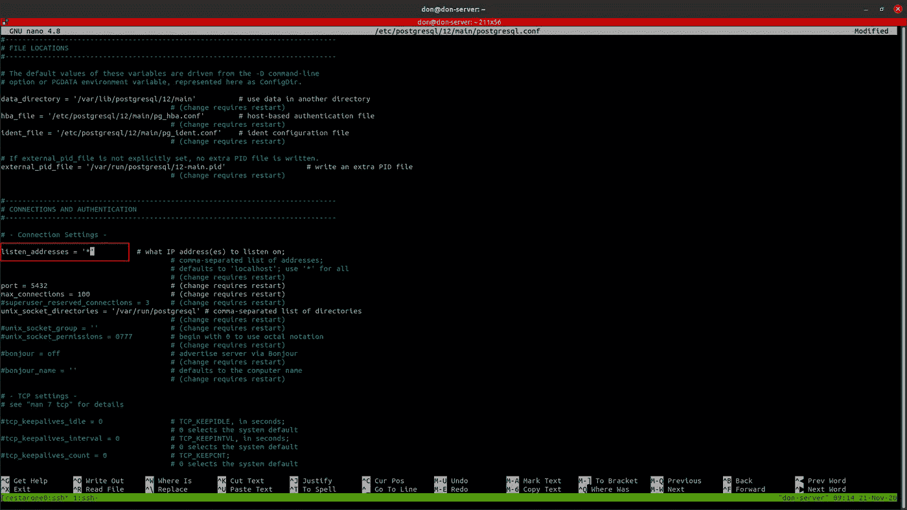
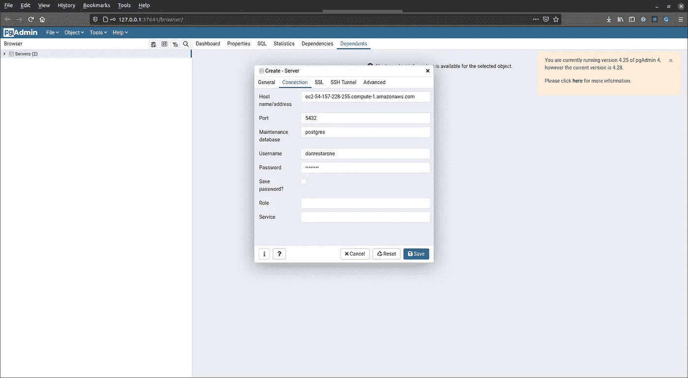
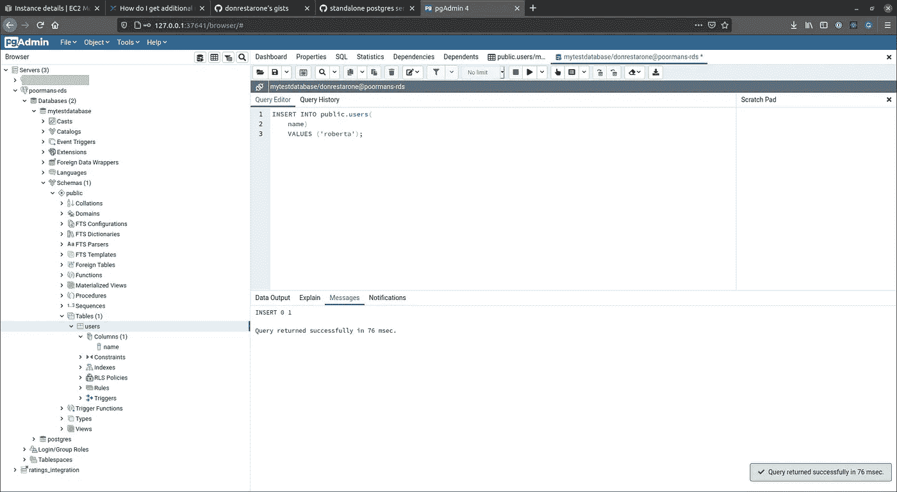
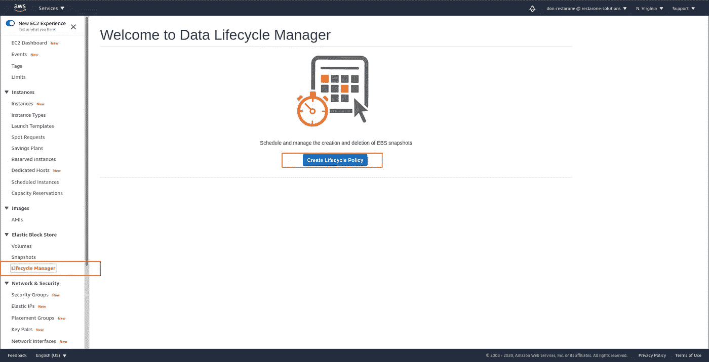
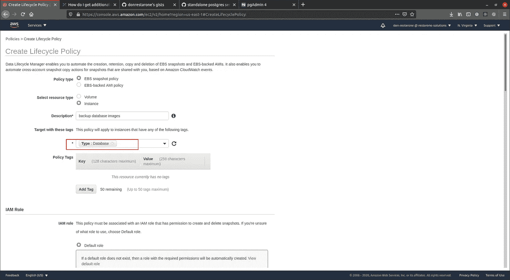
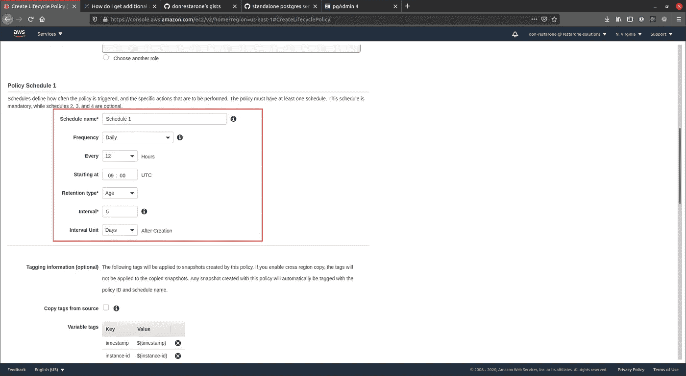

# 如何在 AWS EC2 中提供廉价的 PostgreSQL 数据库

> 原文：<https://betterprogramming.pub/how-to-provision-a-cheap-postgresql-database-in-aws-ec2-9984ff3ddaea>

## 当 RDS 超出您的预算时，在 EC2 上运行 Postgres


泰勒·维克在 [Unsplash](https://unsplash.com/@tvick?utm_source=unsplash&utm_medium=referral&utm_content=creditCopyText) 上的照片

# 动机

用 EC2 运行数据库的最大原因是节省成本。在撰写本文时，最便宜/最小的 RDS 部署成本约为每月 30.88 美元。相比之下，我们可以运行一个具有 8GB 存储空间的 t2.micro EC2 实例，每月花费大约 6 美元。如果您选择预约计费，这一费用还可以进一步降低。

# 警告/何时应该选择 RDS

根据经验，如果预算允许，总是选择 RDS。它通过不同可用性区域中的备用实例提供复制，并处理自动故障转移。这是可取的，原因有二:

1.  亚马逊保证各地区 99.99999%的正常运行时间，而不是可用性区域。因此，在不同的区域中有一个备用副本将确保即使主数据库所在的主区域出现故障，您的应用程序也能够回退到另一个(可能未受影响的)区域中的备用副本。
2.  您的应用程序不需要能够检测数据库故障和处理故障转移。这是由亚马逊自动处理的。如果/当您的主数据库出现故障时，它们会将您的数据库主机 URL 指向备用数据库。危机解决后，它们将自动赶上恢复的主数据库并提升它。

既然我们已经解决了这个问题，让我们开始吧。如果您喜欢使用视频格式的本指南:

# 建立基础设施

跳转到 AWS EC2 控制台，提供一个 Linux 服务器来托管我们的数据库。我会选择 Ubuntu 20.04 服务器，因为这是我最习惯的。



在 EC2 上配置 Ubuntu 服务器(图片由作者提供)

配置的其余部分并不重要，但是在标记部分，我们将创建一个标记来标识这个 DB 实例。这将在我们稍后设置备份时使用。


在 EC2 上标记实例(图片由作者提供)

接下来，我们将配置安全组以允许 SSH 和数据库访问。我将打开缺省的 Postgres 端口 5432，以便在那里运行 Postgres 服务。为了增加安全性，我限制访问我的公共 IP 地址。对于生产使用，您应该只允许来自应用程序服务器的安全组的数据库连接。



添加安全组以通过 SSH 和 Postgres 端口访问服务器(图片由作者提供)

实例启动后，记下公共 IP 地址和公共 DNS 名称。我们将使用公共 IP 地址 SSH 到服务器来设置 Postgres。之后，我们可以使用 DNS 名称连接到 Postgres 服务器。



我们将使用 SSH 的 IP 地址和连接 Postgres 的 DNS 名称(图片由作者提供)

这将是暂停并将新创建的服务器添加到您的 SSH 配置中的好时机，这样您就可以以更符合人体工程学的方式进行连接。

在允许对。pem 文件，您可以将其添加到 SSH 配置中(图片由作者提供)

# 配置 Postgres

我们将使用以下步骤作为配置 Postgres 服务器的指南。

第 1 行和第 2 行将刷新包并安装最新版本的 Postgres(图片由作者提供)

让我们来分解上面列出的命令。前两行将刷新 Ubuntu 中的包并安装最新版本的 Postgres。

```
sudo apt-get update -y && sudo apt-get upgrade -y
sudo apt install postgresql -y
```

接下来，我们将作为默认 Postgres 用户登录(富有想象力地命名为`postgres)`),并创建我们将使用的用户角色。我将简单地命名我的用户`ubuntu`，并允许它登录和创建数据库。

```
sudo su postgres
psql -U postgres -c "CREATE ROLE ubuntu;"
psql -U postgres -c "ALTER ROLE  ubuntu  WITH LOGIN;"
psql -U postgres -c "ALTER USER  ubuntu  CREATEDB;"
psql -U postgres -c "ALTER USER  ubuntu  WITH PASSWORD 'ubuntu';"
```

通过输入以下内容，从`postgres`用户帐户中注销并返回到您的默认用户:

```
exit
```

找到`postgresql.conf`文件(通常在`/etc/postgresql/12/main/postgresql.conf`)。如果您不确定，可以使用一个方便的 Bash 命令，通过输入:

```
sudo find / -name "postgresql.conf"
```

用你最喜欢的文本编辑器打开文件(是的，我的恰好是 Nano #sorryNotSorry)。我们将找到配置条目`listen_addresses`，并将其从默认设置更改为`‘*’`。这将允许 Postgres 服务器监听 EC2 实例的 DNS 名称。



如果你像我一样是个异教徒，并且使用 Nano，你可以使用快捷键 CTRL+W 来搜索(图片由作者提供)

之后找到`pg_hba.conf`打开。

```
sudo nano /etc/postgresql/12/main/pg_hba.conf
```

我们将通过在文件末尾添加以下行来允许来自远程连接的身份验证。这将允许来自任何 IP 地址的连接。请注意，在生产中，最好将连接限制在您需要的范围内(一个配置良好的 EC2 安全组应该足够了，但是为了省心起见，您应该添加应用服务器的 IP 地址，而不是 0.0.0.0/0)

```
host    all             all              0.0.0.0/0                      md5host    all             all              ::/0                            md5
```

为了使新配置生效，我们将通过运行以下命令来重新启动 Postgres 守护程序:

```
sudo systemctl restart postgresql
```

# 让我们试驾一下吧

为了测试我们闪亮的新 Postgres 数据库，我们将使用 PgAdmin。[从这里下载并安装](https://www.pgadmin.org/download/)。安装后，启动它并添加服务器。


右键单击服务器并选择创建->服务器

从 EC2 控制台输入 DNS 名称和我们之前设置的凭据。



连接到 Postgres 服务器(图片来自作者)

如果加了服务器，太好了！如果您遇到超时错误，请确保仔细检查 EC2 中的安全组和我们之前讨论过的 Postgres 配置。

我将创建一个测试数据库和一个用户表，并插入一些虚拟数据进行测试。



向表格中添加一些数据(图片由作者提供)

# 配置自动备份

既然我们已经启动并运行了数据库，让我们确保定期备份数据库实例。这里的目标是备份整个实例(连同数据和配置),以便在出现故障时，我们可以简单地从备份的映像(AMI)中启动一个新的 EC2 实例。

为此，请转到 EC2 控制台，选择 Data Lifecycle Manager，然后单击 Create Lifecycle Policy。



作者图片

还记得我们与这个 EC2 服务器关联的标签吗？我们将告诉 DLM 支援标有标签`Type: Database`的目标。



作者图片

接下来，我们将定义备份策略和时间表。我通常选择每日备份，并在五天的保留期后使备份的快照过期。



值得注意的是，由于 Amazon 处理映像创建的方式，这种备份策略会导致一点停机时间。在此备份窗口期间，您的数据库服务器将关闭几秒钟。

如果这种停机时间是不可接受的，那么您可以使用`pg_dump`以及 Bash 脚本和 AWS SDK 来粘合一个例程，该例程定期转储数据库并将其上传到 S3。可以在使用 cron 的类 Unix 系统中调用这个脚本。虽然这超出了本文的范围，但是这个要点应该可以帮助您开始:

暂时就这样了。享受成为数据库管理员的乐趣，祝你好运！

[沙施克](https://www.linkedin.com/in/shashike-jayatunge/)是一名来自多伦多的软件工程师，也是 [Restarone Inc](https://www.restarone.com) 的创始人。当他不开发软件时，他在 Medium 和 YouTube 上创作内容，帮助人们过渡到技术领域。