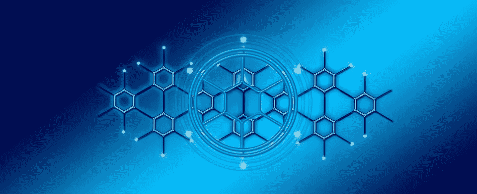
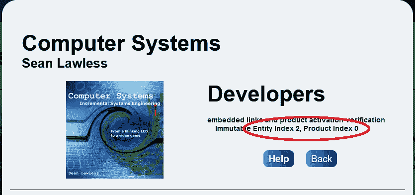

# 如何代理成 NFT 铸造刀

> 原文：<https://betterprogramming.pub/how-to-proxy-into-an-nft-minting-dao-51f5a574a007>

## 组织 NFT 收藏从铸造刀与小代理合同



现有第三方智能合约的概念性代理视图。照片由 Pixabay.com[geralt](https://pixabay.com/users/geralt-9301/)提供。

不可变生态系统 DAO(或不可变 DAO)是由 [ImmutableSoft](https://immutablesoft.org) 创建的一个小型智能合同集合，这是一个开放的公益 501(c)(3)非营利组织。加入这个开放 DAO 的成员可以保护他们的数字所有权，并向用户许可他们创作的最终用户权利。

通过将他们的数字创作的文件校验和(SHA256)记录在 NFT 铸造的链上，由数字创作者的钱包签名的带有时间戳且不可变的交易记录证明了第一出处，这是证明所有权的关键一步。

最初设计用于保护面向公众的文件/软件发布，伪造和欺诈吸引了传统的 NFT 创作者到我们的 DAO。关于这一运动的更多信息，请参见 NFTs 中的[创建者出处。本文继续我们的 DAO 之旅，描述我们的成员如何部署他们自己的智能契约代理来区分他们的 NFT 的特定集合的细节。](/creator-provenance-within-nfts-7353e9e435c0)

对于 NFT 收藏来说，当在我们的 dApp(即 NFT 观众和第三方交易所)之外观看用不变刀铸造的艺术 NFT 时，问题就出现了。由于历史原因(元数据标准)，ERC721 智能合约函数成为“集合”名称。我们的 DAO 的每个成员都铸造了它们自己唯一的 NFT——成员 ID 嵌入在每个铸造的`tokenId`中(参见[在大整数内序列化数据](/serializing-data-within-large-integers-433684c8e7cd))。

然而，由于所有 DAO 成员的所有 NFT 都是由同一个智能契约创建的，所以它们都出现在第三方交换(OpenSea、Rarible 等)的同一个“集合”中。).这可能会给高端 NFT 艺术品拍卖等带来不太好的体验(至少可以这么说)。

虽然为 ERC721 `name()`函数添加一个可选的`tokenId`参数或者一个新的函数`collectionName(tokenId)`会很好，但这可能不会在任何时候支持 NFT minting DAOs 的出现。作为一个迫切需要解决的问题，我们通过允许不可变 DAO 的成员部署一个小的智能契约来解决这个问题，这个小的智能契约覆盖集合“name”，但是代理所有其他智能契约 ERC721 对相关 DAO 智能契约的调用(在本例中是 [CreatorToken](https://immutablesoft.github.io/ImmutableEcosystem/docs/CreatorToken.html) )。

然后，通过代理智能合约地址查看“集合”的第三方将看到唯一的集合名称，并且只看到特定于该集合的 NFT。令牌实现的其他部分也可以被覆盖。如果需要，这个代理可以作为将 NFT 完全移出 DAO 的基础(带有 escape 子句的代理)。

关于代理和可升级智能合约已经讨论了很多；然而，这种类型的代理不太复杂，因为主数据总是驻留在 DAO 智能契约上，而不是代理上。这意味着，与可升级代理不同，不使用`delegateCall()`。

相反，用 DAO 主契约的地址初始化代理(参见 Polygonscan 上的 [CreatorToken](https://polygonscan.com/address/0x02a5d5c9c22eedfabe54c42cd81f907ffb27567c#readProxyContract) )允许每个 ERC721 令牌接口函数将调用代理到不可变的 DAO 智能契约中。这在很大程度上是一对一的关系。

需要进行一次性初始化，以便用不可变的 DAO 智能契约和实体和产品 id(在 DAO 中定义)来配置代理，从而限制代理集合。但是，ERC721 和相关的可枚举接口，如`totalSupply()`、`tokenByIndex()`、`balanceOf()`和`tokenOfOwnerByIndex()`不是一一对应的可翻译接口。这些 ERC721 标准函数必须只返回不可变 DAO 中对应于特定创建者的产品(即这个集合)的 NFT 的子集。为了实现上述所有四(4)个核心函数，我们创建了一个内部函数来支持所有变量，从计算令牌数到哪个索引对应哪个令牌。

这个代理智能契约很小，部署起来也不贵。对于可扩展性，代理本身可以是可升级的智能合约。这种双重代理是首选的 NFT 收集可能变形，改变或以其他方式开放进一步发展。上述 NFT 集合的 DAO 代理需要进行初始化更改，以继承基于 [OpenZeppelin](https://www.openzeppelin.com/) 的可升级性。

这个代理的最终目标是将来自 DAO 的令牌 ID 转换成只使用发布 ID，而不与实体和产品标识符序列化。序列化的 DAO 标记是非常大的整数，使用 NFT 查看器或交换无法兼容或理解。删除序列化允许 NFT 代理令牌标识符从 1 开始，并按照本机 ERC721 令牌的预期时间顺序排列。为了做到这一点，我们添加了一个助手函数`idToDAO()`,并使用它从代理翻译到对 DAO 的每个后续调用。代理 NFT 集合现在在第三方交换机上与本机令牌无法区分。

```
 /// [@notice](http://twitter.com/notice) Convert tokenID from this proxy to ImmutableSoft DAO
  /// [@param](http://twitter.com/param) tokenId The proxy identifier (only release id)
  /// [@return](http://twitter.com/return) The CreatorToken (ImmutableSoft) token Id
  function idToDAO(uint256 tokenId)
    public view returns (uint256)
  {
    return ((_entity << commonInterface.EntityIdOffset()) &
            commonInterface.EntityIdMask()) |
           ((_product << commonInterface.ProductIdOffset()) &
            commonInterface.ProductIdMask()) |
           ((tokenId << commonInterface.ReleaseIdOffset()) &
            commonInterface.ReleaseIdMask());
  } /// [@notice](http://twitter.com/notice) Look up the release URI from the token Id
  /// [@param](http://twitter.com/param) tokenId The unique token identifier
  /// [@return](http://twitter.com/return) the file name and/or URI secured by this token
  function tokenURI(uint256 tokenId) public view
      returns (string memory)
  {
    return creatorToken.tokenURI(idToDAO(tokenId));
  }
...
```

使用这个代理来覆盖`tokenURI()`也是可能的。这有助于法律契约，其中不可变的道 NFT 保护私有文件(签署的契约等)。)和 PoE 哈希。然而，代理智能合约返回由第三方验证私有文件的证书的公共 NFT 元数据图像。请参阅我们的另一篇文章[李嘉图合同互操作性](/ricardian-contract-interoperability-9b9e2919dc43)，了解有关该合同服务提供商场景的更多信息。

另一个重要的用例是游戏物品，例如，一个`tokenURI()`可以被重载以允许整个收藏库 URI 的动态变化。有了对`tokenURI()`的覆盖，可以为代理所有者添加一个新的`setTokenBaseURI()`功能，通过一个调用将他们游戏的所有 NFT 移动到一个新的 web2 域，借鉴了 ERC1155 标准的效率。

通过一个基本集合 URI，令牌 id(或者来自不可变 DAO 私有文件的尾随文件名)被添加到 URI 基本集合中，并由`tokenURI()`输出。代理所有者负责托管 web2 URI 端点，该端点提供用于显示此 NFT 的 JSON 元数据详细信息。一些项目可能还希望以某种方式公开`mint()`,以加强 NFT 创建的一致性和/或简化与 DAO 相比的接口。

要查看完整的实现，可以在我们的核心 GitHub 库找到[。由于实体和产品标识符是在部署时定义的，因此每个人都可以使用相同的智能合约，而无需进行更改。我们以一个示例结束，展示了一个客户使用`10_deploy_collection_proxy.js`部署脚本部署他们自己的代理。](https://github.com/ImmutableSoft/ImmutableEcosystem/blob/master/contracts/CollectionProxy.sol)

我们的示例成员已经注册了他们的实体名称，并在市场中创建了一个产品。创建的产品的 Developers 选项显示唯一的和不可变的实体和产品编号，分别是值二(2)和零(0)。从我们的 dApp 看这张图片。



DAO 用户在 dApp 的 Developers 选项卡上发现他们的实体和产品标识符。

首先，我们克隆存储库，并使用命令提示符(本例中为 MS Windows)安装与 NPM 的依赖关系。这需要 NPM，所以确保 NPM 已经安装在您的开发系统上，或者在继续之前安装。

```
D:\>git clone [https://github.com/ImmutableSoft/ImmutableEcosystem.git](https://github.com/ImmutableSoft/ImmutableEcosystem.git)
Cloning into 'ImmutableEcosystem'...
remote: Enumerating objects: 803, done.
remote: Counting objects: 100% (85/85), done.
remote: Compressing objects: 100% (60/60), done.
Receiving objects:  98% (787/803), 10.53 MiB | 10.52 MiB/sremote: Total 803 (delta 44), reused 42 (delta 24), pack-reused 718
Receiving objects: 100% (803/803), 14.72 MiB | 10.65 MiB/s, done.
Resolving deltas: 100% (451/451), done.D:\>cd ImmutableEcosystemD:\ImmutableEcosystem>npm install
...
D:\ImmutableEcosystem>truffle compile --all
...
D:\>
```

如果最后一步出现错误，请确保为 NPM 全球安装了 truffle(`npm install -g truffle`)。一旦合同被编译，我们打开部署文件`10_deploy_collection_proxy.js`，并将初始化参数(下面粗体部分)更改为我们唯一的实体和这个集合的产品标识符。

在本例中，集合名称是“Computer Systems”，令牌符号是“CSI”，不可变的 DAO 实体是 two (2)和 product zero (0)(见上图)。

一旦部署文件被更改，最后一步就是在 EVM 网络(在这个例子中是 Polygon Mainnet)上只运行这个部署。您需要用您的钱包恢复字填充`secrets.json`，以便用正确的私钥签署智能合约部署交易。

请确保在部署后从该文件中删除恢复单词——不要将它们提交给 git 存储库。

建议使用没有高加密价值(只有 gas)的钱包来部署和管理智能合同所有权，以避免您的开发系统成为黑客的目标。

```
D:\>ImmutableEcosystem>truffle migrate --f 10--to 10--compile-none --skip-dry-run --network polygon_mainnet
```

使用上面输出的已部署代理智能合约地址，浏览您最喜欢的第三方 NFT 交易所，在新集合名称下只能看到该产品的 NFTs。请注意，部署将要求代理所有者与向不可变 DAO 注册的实体 id 的 wallet 地址相同。这将有助于保护代理生态系统。参见上面的源代码链接，了解我们如何做到这一点的细节。

总之，一个 DAO 成员可以部署的代理数量没有限制。尽管如此，每个产品必须是唯一的产品，并且所有产品都必须是该产品的注册实体地址所拥有的产品(并且 DAO 产品的名称必须与集合名称相匹配！).carpe partem for DAO minted collections 代理智能合约！

如果你喜欢这条穿越区块链丛林的小路，请留下你的评论。