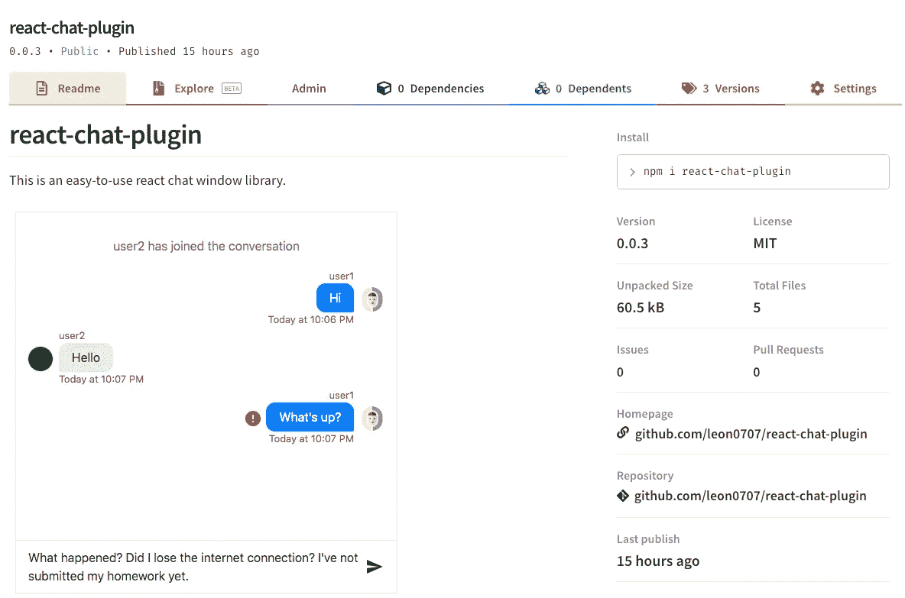
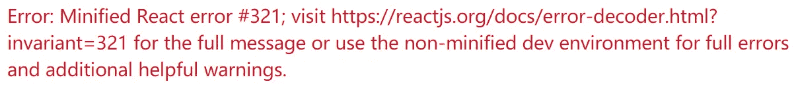

# 如何发布 React 组件库

> 原文：<https://betterprogramming.pub/how-to-publish-a-react-component-library-c89a07566770>

## 既然你已经创造了一些有用的东西，那就和全世界分享吧



*   GitHub 回购:[https://github.com/leon0707/demo-component](https://github.com/leon0707/demo-component)

您已经在 React 项目中创建了一个非常有用的组件。你想与开源世界分享它，并希望它能帮助其他开发者。

最常见的方法是将其发布到 [npm](https://www.npmjs.com/) 中，JavaScript 开发人员可以在那里轻松下载 JS 库并将其导入到他们的项目中。

本文将一步一步地演示如何做到这一点，并强调您可能会遇到的潜在问题。

让我们创建一个更复杂的场景，以便它更接近真实世界的项目。

1.  在`DemoComponent`中，它导入 CSS 和图像文件，并使用其他 React 库。
2.  当使用 [Babel](https://babeljs.io/) 编译 React 组件时，您不希望在编译时包含所有依赖项，如 React、react-dom。不仅会增加包的大小，而且拥有 React 的多个副本也会导致错误。

# 首先，创建一个 React 组件项目

在本地开发环境中创建项目目录，在 GitHub.com 上创建存储库。

```
mkdir react-democomponent
cd react-democomponent
mkdir src
npm init
```

使用默认值创建`package.json`文件是可以的。这些价值观将来会改变。

该目录将如下所示:

```
/react-democomponent
--- /src
--- .gitignore
--- LICENSE
--- package.json
--- README.md
```

这将是一个 React 项目，所以我们需要先安装 React 和`prop-types`。

```
npm install --save-dev react prop-types
```

选择您已经创建的组件或复制[演示组件](https://github.com/leon0707/demo-component/tree/master/src)并将其移动到`src`文件夹中。

`DemoComponent`有三个部分:

*   反应组件本身。
*   样式文件。
*   SVG 图像文件。

目标是创建一个包含所有这些内容的 JS 文件，这样就可以将它导入到其他 React 项目中。

这个组件很简单，看起来像一个下载按钮。

# 第二步。编译组件

有些浏览器不会理解最新的 ECMAScript 和 React JSX 语法，因此有必要将 ES6、ES7、ES8 代码或 JSX 转换为向后兼容版本的 JavaScript 代码。[巴别塔](https://babeljs.io/)会这样做。

安装 Babel 依赖项并创建一个 Babel 配置文件。

```
npm install --save-dev @babel/cli @babel/core @babel/preset-env @babel/preset-react
```

`.babelrc`文件。

```
{
  "presets": ["@babel/preset-env", "@babel/preset-react"]
}
```

`@babel/preset-env`将所有利用最新 JavaScript 特性的代码转换成与不支持最新 JavaScript 特性的浏览器兼容的代码。

这个插件也可以使捆绑文件变小。开发人员可以指定代码兼容的浏览器的最小版本。更多详情:[巴别塔文档](https://babeljs.io/docs/en/babel-preset-env)。

`@babel/preset-react`将最新的 JSX 转换成 JavaScript 代码。更多细节:[巴别塔文件](https://babeljs.io/docs/en/babel-preset-react)。

在`DemoComponent`中，创建了一个类别属性`handleOnClick`。[类属性仍然是一个实验特性](https://developer.mozilla.org/en-US/docs/Web/JavaScript/Reference/Classes/Class_fields)，还不支持。为了让它在组件中工作，你必须添加一个 Babel 插件。

```
npm install --save-dev @babel/plugin-proposal-class-properties
```

将`"plugins": ["@babel/plugin-proposal-class-properties"]`添加到`.babelrc`文件中。

如果插件未启用，将会引发错误:

```
ERROR in ./src/DemoComponent.js
Module build failed (from ./node_modules/babel-loader/lib/index.js):
SyntaxError: Support for the experimental syntax ‘classProperties’ isn’t currently enabled.
```

webpack 是一个面向现代 JavaScript 应用的静态模块捆绑器。我们需要做的就是创建一个 webpack 配置文件。

安装 webpack 和 webpack CLI 工具。

```
npm install --save-dev webpack webpack-cli
```

`webpack.config.js`

*   `entry`对象是 webpack 开始构建包的地方。
*   `output`对象告诉 webpack 在哪里发出它创建的包，以及如何命名这些文件。
*   `loader`允许 webpack 处理其他类型的文件，并将它们转换成有效的模块，供您的应用程序使用，并添加到依赖图中。

在该项目中，使用了四台装载机:

*   `babel-loader`trans files JavaScript 文件。
*   `style-loader`和`css-loader`加载 CSS 样式表并注入 DOM。
*   `url-loader`将文件转换为 base64 URIs。

需要安装这些软件包。

```
npm install --save-dev babel-loader style-loader css-loader url-loader
```

在`package.json`中增加`build`。

```
...
"scripts": {
    "build": "webpack --mode production --display-modules"
},
...
```

# 构建包

现在您可以构建这个包了。

运行`npm run-script build`，在`dist`下已经创建了`main.js`。这是将在 npm 注册表上分发的文件，其他人可以搜索和下载该文件。

这是日志:

```
Hash: 869e38eb4f7cf4851eb0
Version: webpack 4.41.5
Time: 1613ms
Built at: 01/07/2020 7:59:49 PM
  Asset      Size  Chunks             Chunk Names
main.js  18.8 KiB       0  [emitted]  main
Entrypoint main = main.js
 [0] ./node_modules/react/index.js 190 bytes {0} [built]
 [1] ./node_modules/prop-types/index.js 710 bytes {0} [built]
 [2] ./node_modules/react/cjs/react.production.min.js 6.49 KiB {0} [built]
 [3] ./node_modules/object-assign/index.js 2.06 KiB {0} [built]
 [4] ./node_modules/prop-types/factoryWithThrowingShims.js 1.58 KiB {0} [built]
 [5] ./node_modules/prop-types/lib/ReactPropTypesSecret.js 314 bytes {0} [built]
 [6] ./src/DemoComponent.css 580 bytes {0} [built]
 [7] ./node_modules/style-loader/dist/runtime/injectStylesIntoStyleTag.js 5.83 KiB {0} [built]
 [8] ./node_modules/css-loader/dist/cjs.js!./src/DemoComponent.css 276 bytes {0} [built]
 [9] ./node_modules/css-loader/dist/runtime/api.js 2.04 KiB {0} [built]
[10] ./src/DemoComponent.js + 1 modules 8.11 KiB {0} [built]
     | ./src/DemoComponent.js 3.32 KiB [built]
     | ./src/logo.png 4.77 KiB [built]
```

# 第三步。在本地测试

这很简单。您需要导入这个 React 组件，并在 React 项目中使用它。

更新`package.json`文件，向其中添加有意义的信息。

用您自己的信息替换这些值。注意，`main`应该指向构建的 JS 文件。

运行`npm link`在全局文件夹中创建一个链接到这个包的符号链接。

要将这个包导入到您的 React 项目中，您需要转到 React 项目的目录并运行`npm link react-download-button`或`package.json`中的名称。

导入包。

```
import DemoComponent from 'react-download-button';
```

此时，将会抛出一个错误，因为有两个 React 实例。一个在您的 React 项目中，另一个在您创建的包中。

```
Error: Minified React error #321
```



这是真的。如果你查看建筑日志或者打开编辑器中的`main.js`，你可以找到`react.production.min.js`。

要解决这个问题，您需要:

1.  从包文件中删除`react.production.min.js`。
2.  告诉 React 项目的 webpack 您想要使用哪个 React 实例。

## **第一步**

检查构建日志，有一些包不应该包含在包文件中。它们增加了包的大小并导致不必要的问题。

比如`react`、`prop-types`，就不应该包括在内。您可以通过添加`webpacke-node-externals`轻松排除它们或其他包。

```
npm install --save webpacke-node-externals
```

更新包中的`webpack.config.js`。

```
const nodeExternals = require('webpack-node-externals');module.exports = {
  ...
  target: 'node',
  externals: [nodeExternals()]
}
```

运行`npm run-script build`重建捆绑文件。这一次，文件中不再有`react`和`props-types`。但是，React 项目应该有它们，这些需要在`package.json`中指定。

```
"peerDependencies": {
   "react": "^16.12.0",
   "prop-types": "^15.7.2"
}
```

## **第二步**

在 React 项目文件中，更新 webpack 配置文件。

```
 "resolve" = {
    alias: {
      react: path.resolve('./node_modules/react')
    }
  }
```

这将告诉 webpack 使用本地 React，而不是`DemoComponent`目录中的 React。

现在，您创建的包可以在任何 React 项目中使用。

# 第四步。在 npm 上发布

建议有一个有用的自述文件来演示如何使用您的包以及您希望其他开发人员知道的细节。

一旦你认为一切看起来都很完美，就去 https://www.npmjs.com/注册并验证邮件。

然后，转到包目录运行`npm login`和`npm publish`。

# 结束

您应该可以看到您的包发布在 npmjs.com 上，并且可以通过运行`npm install <package name>`下载。