# 如何发布你的第一个 npm 包

> 原文：<https://betterprogramming.pub/how-to-publish-your-first-npm-package-ebfbcde3c26f>

## 了解如何向 JavaScript 生态系统发布开源包


由 [Paul Esch-Laurent](https://unsplash.com/@pinjasaur?utm_source=medium&utm_medium=referral) 在 [Unsplash](https://unsplash.com?utm_source=medium&utm_medium=referral) 上拍摄

JavaScript 之所以非常适合使用，是因为它包含了大量有用的包。你可能遇到的几乎所有问题都有一个解决方案。

需要一个日期库？没问题，这是给你的包裹！需要表单验证库吗？社区已经覆盖了你！

每个包的背后都是一个个人或者一个团队。那些人正在超努力地工作，让事情成为可能。为什么不通过创建和发布你的第一个 npm 包来了解事情是如何在幕后工作的呢？

事不宜迟，让我们开始吧！

# 安装 Node.js

上 Node.js 官方网站，按安装。默认情况下，Node 还包括节点程序包管理器(npm)。因此，您只需安装 Node 即可开始发布 npm 软件包。

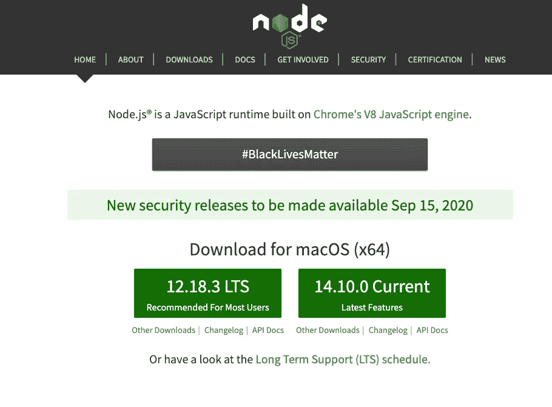

[Node.js 网站](https://nodejs.org/en/)

# 登录到 npm

一旦你安装了 Node，去官方 npm 网站[创建一个账户](https://www.npmjs.com/signup)。您发布的包将在该帐户下。

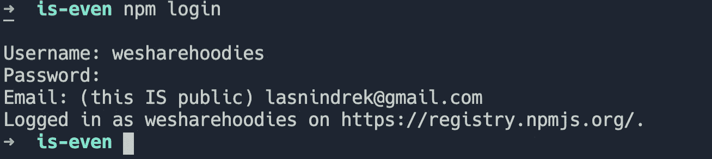

通过 npm CLI 登录 npm 帐户

# 开始一个新的节点项目

继续在控制台中键入以下命令。该命令将创建一个新文件夹，并在该文件夹中初始化一个节点项目。

```
mkdir is-even && cd is-even && npm init -y
```

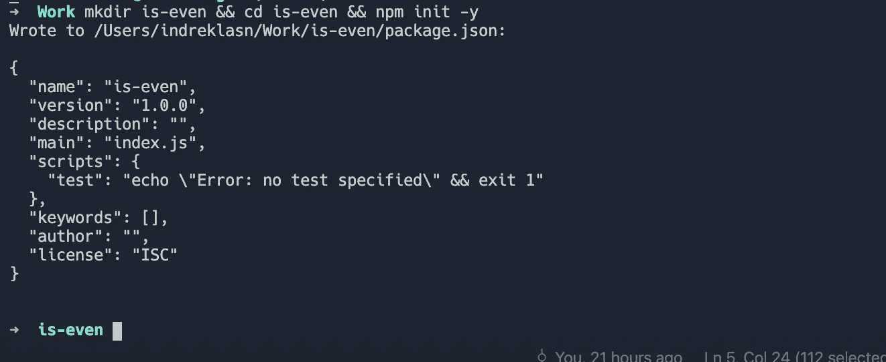

创建新的节点项目

# 创建国家预防机制包

接下来，让我们创建包本身。创建一个名为`index.js`的文件——这是包的底层功能所在的地方。

我们将发布一个超级简单的包——一个计算输入数字是否是偶数的函数。根据计算结果，函数返回`true`或`false`。

# 更新 package.json

每个节点项目都有一个`package.json`文件。`package.json`文件执行以下操作:

*   列出项目所依赖的包
*   指定项目使用的包的版本
*   使您的构建可重复并可与其他开发人员共享

`package.json`文件必须包含`"name"`和`"version"`字段。

`"name"`字段包含您的包的名称，并且必须是小写字母和一个单词。`name`字段可以包含连字符(`-`)和下划线(`_`)。

`"version"`字段必须是`x.x.x`格式，并遵循[语义版本指南](https://docs.npmjs.com/about-semantic-versioning)。

如果您想在`"author"`字段中包含包作者信息，请使用以下格式。电子邮件和网站都是可选的。

```
Your Name <email@example.com> (http://example.com)
```

# 创建自述文件

README 文件旨在帮助其他开发人员在 npm 上找到您的软件包，并希望有助于在使用您的代码时获得良好的体验。我强烈建议在您的软件包目录中包含一个自述文件。

您的自述文件可能包含安装和配置说明以及使用软件包中代码的说明。您还可以包含用户可能会发现有帮助的任何其他信息。自述文件将显示在软件包页面上。

```
touch readme.md
```

这里有一个我在 npm 包中加入自述文件的例子。

如果你好奇的话，这里有 README 文件的原始版本[。](https://gist.githubusercontent.com/indreklasn/adbc22866aa732a93aa0590383d4ece3/raw/8b56f229957eec44c4387ad624504d1e8914481d/readme.md)

# 创建 GitHub 存储库

我们几乎准备好发布代码了。继续创建一个 GitHub 库。

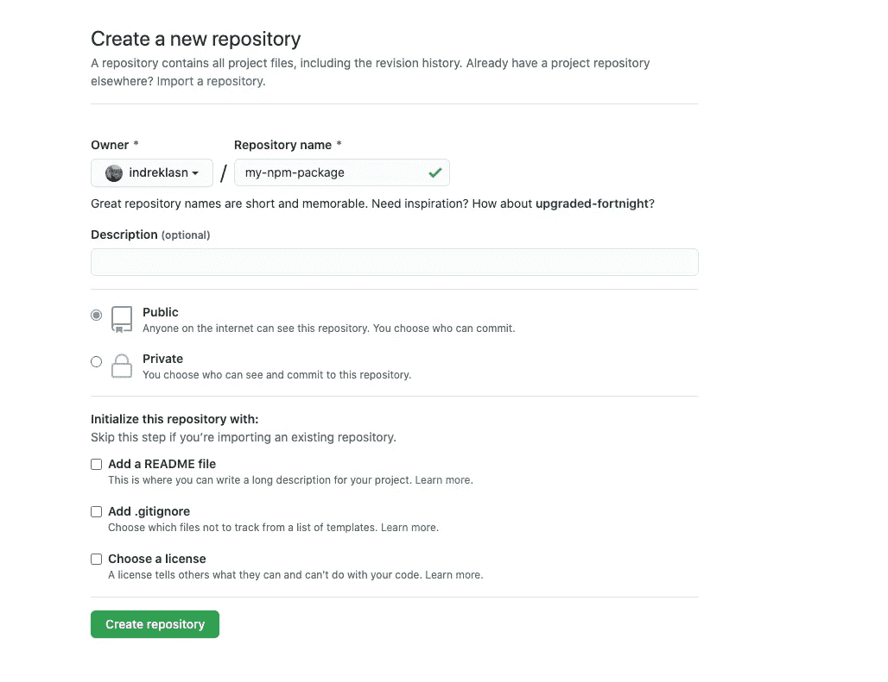

创建 GitHub 存储库

# 将代码推送到 GitHub 存储库

让我们将代码推送到您的存储库中。遵循下面的说明。

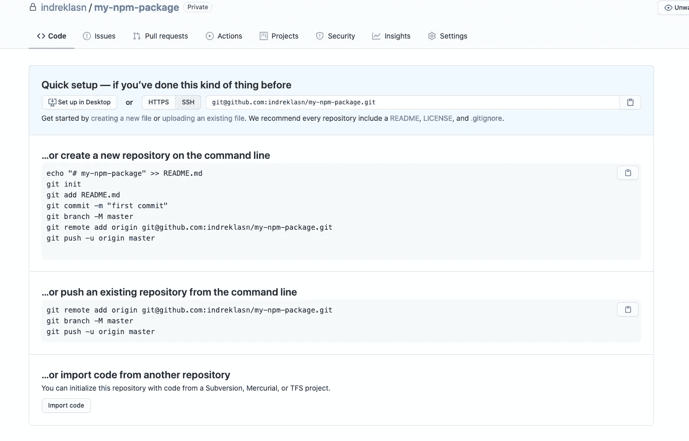

GitHub 知识库

以下是您应该得到的结果:


[是-连 GitHub 库](https://github.com/indreklasn/is-even)

# 发布国家预防机制包

我们终于准备好发布 npm 包了。我们可以用一个命令发布我们的包。

```
npm publish
```

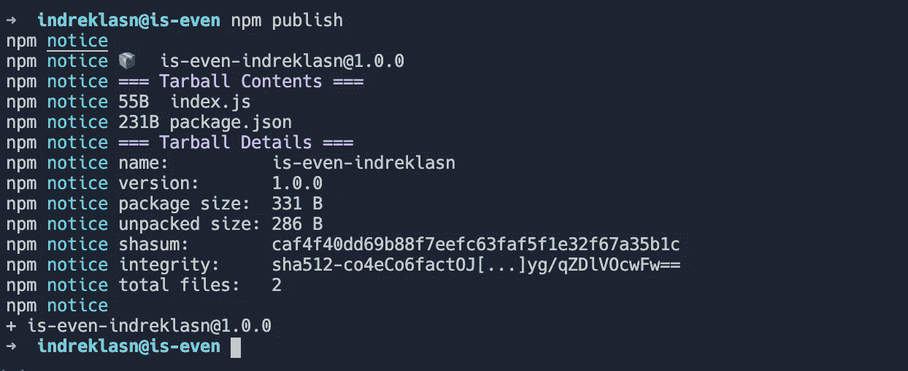

瞧啊。这就是我——看到把一个包发布到 npm 注册中心有多容易了吗？

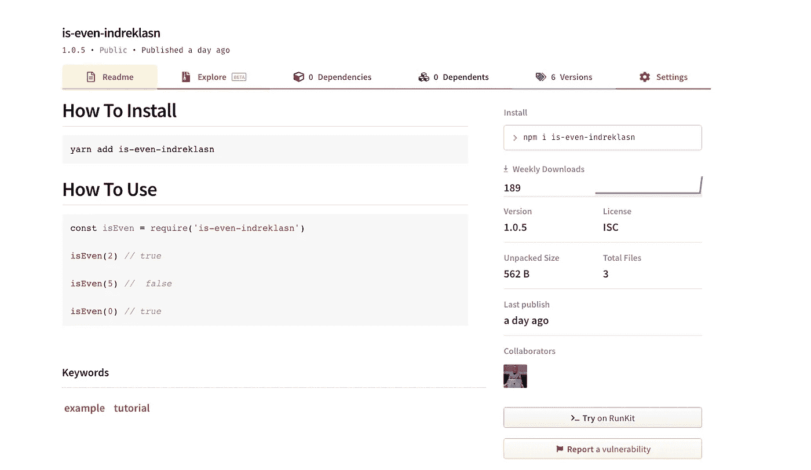

[是-偶数包](https://www.npmjs.com/package/is-even-indreklasn)

# 测试包

测试和使用我们之前发布的包很简单。我们可以用 npm 或 Yarn 安装它。

继续启动新的节点项目，并安装软件包。

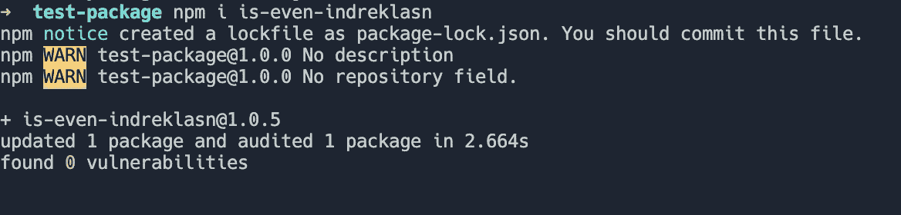

将我们之前发布的包安装到我们的新项目中

要求包，并像这样调用函数。记住，我们导出的函数叫做`isEven`，但是你可以把它重命名为你想要的名字。

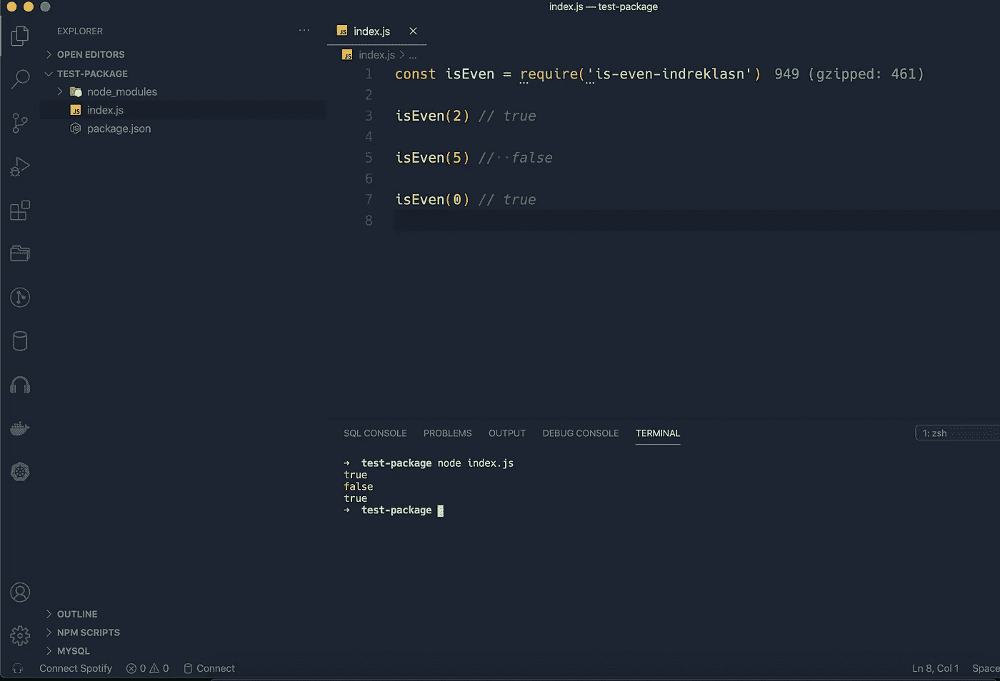

在新项目中导入我们新发布的包

干得好！你做到了——你发布了你的第一个 npm 包。

# 奖金:np

手动修改版本、运行测试和发布包可能会变得很乏味——尤其是如果您已经有多个开源包的话。这就是我推荐使用`np`包的原因。

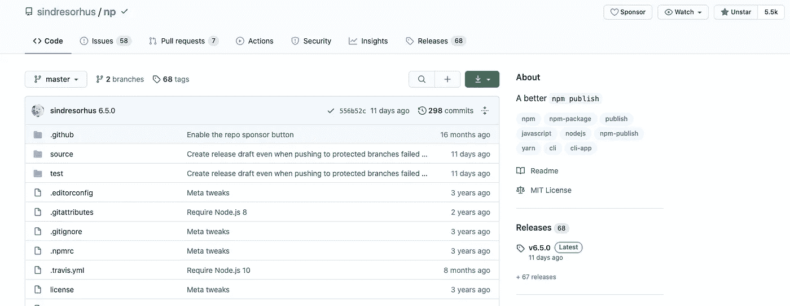

[np](https://github.com/sindresorhus/np)

## 安装

`np`既可以本地配置，也可以全局配置。

```
$ npm install --global np
```

## 交互式用户界面

不带参数地运行`np`,启动交互式 UI，引导您发布新版本。

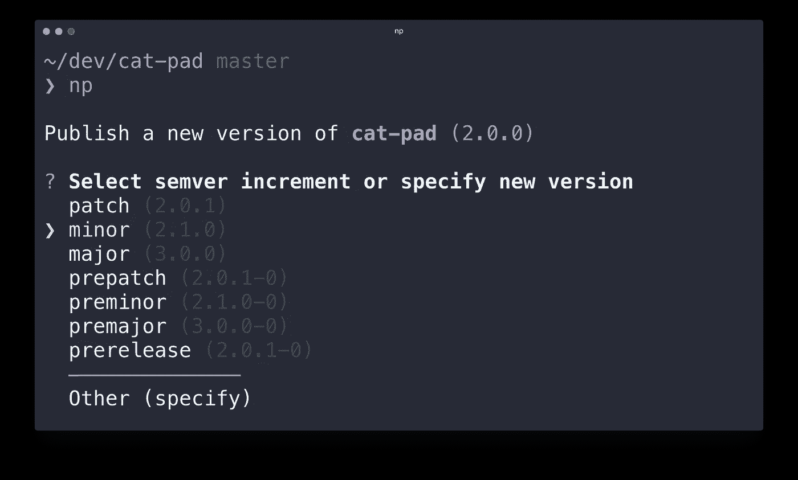

这是它将为您执行的任务:

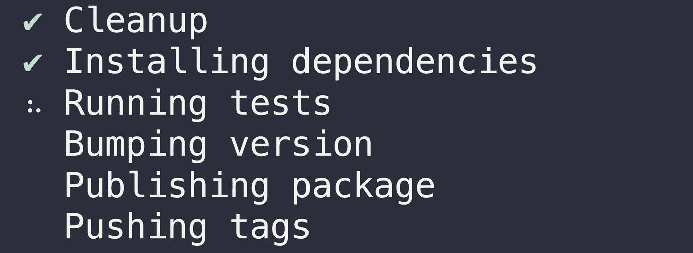

# 结论

感谢阅读，我希望你学到了新的东西！快乐编码。