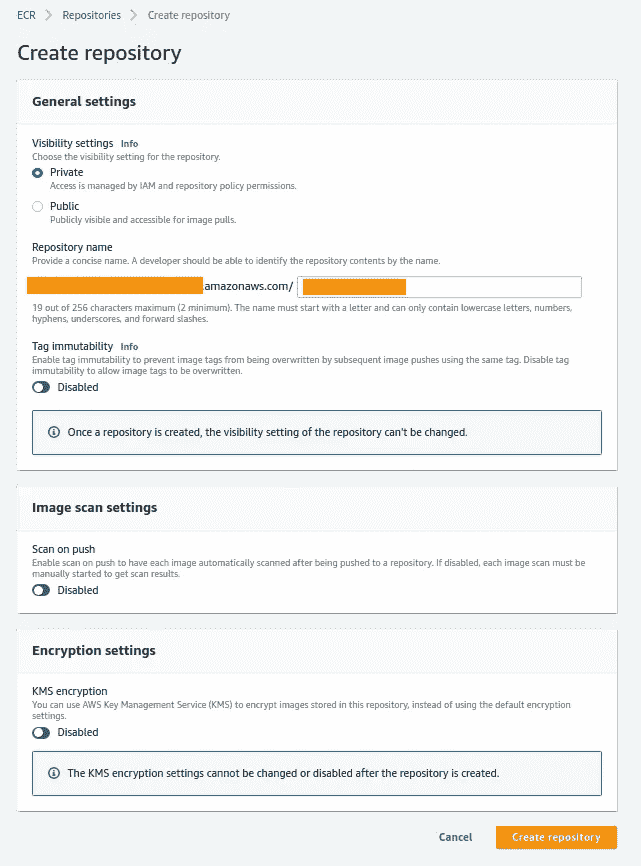
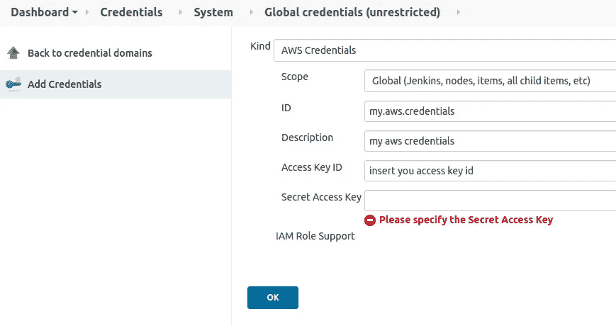
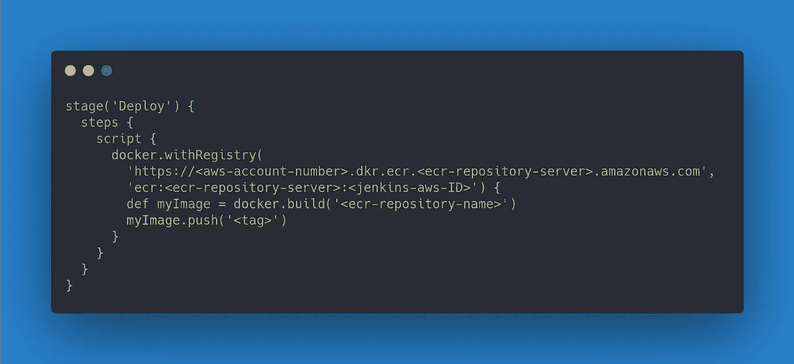

# 如何使用 Jenkins 将 Docker 图像推送到亚马逊 ECR

> 原文：<https://betterprogramming.pub/how-to-push-a-docker-image-to-amazon-ecr-with-jenkins-ed4b042e141a>

## 创建和配置 AWS，并使用 Jenkins 推送它

马特·斯卡兰迪斯在 [Unsplash](https://unsplash.com?utm_source=medium&utm_medium=referral) 上拍摄的照片。

一年前，我的网站在 Heroku 上运行。因为 Heroku 不允许在同一个实例上有多个应用程序，我不得不每月支付两次 7 美元(后端和前端应用程序)。对于每一个额外的应用程序，这将花费我每月另外 7 美元。

我确信内部部署会便宜很多，所以我拿了一台旧笔记本电脑，安装了所有的东西。在配置了 Linux 和 docker-compose 之后，我的网站终于又开始运行了。这让我每个月节省了 14 美元。

直到出现问题。你不希望发生的问题。您可能也会遇到的问题:

*   电源故障
*   WiFi 连接中断
*   配置问题

因此，出于必要，唯一可用的选择是回到云中以提高稳定性。但这一次，它将是一个不同于 Heroku 的云提供商。将我的 Docker 映像推送到云中是这个解决方案的第一部分。这就是这篇文章的全部内容:将 Docker 图像推送到像 Amazon AWS ECR 这样的云存储库中。

让我向你保证:这篇文章只会占用你几分钟的时间。我们将处理部署到 ECR 的三个步骤:

*   创建 AWS ECR 存储库。
*   在 Jenkins 中配置 AWS 凭证。
*   创建一个与 Jenkins 一起推动的构建步骤。

# 创建 AWS ECR 存储库

第一步很简单:您所要做的就是登录 AWS 开发人员控制台，并转到您的 AWS 服务弹性容器注册中心(AWS ECR)。

在这个服务中，您将创建一个 Docker 容器存储库，正如您将在提供的屏幕截图中看到的那样。你不必担心让所有的默认设置都开着。他们没有隐性成本。

您需要填写的唯一字段是“docker 存储库名称”选择一个像“网站前端”或更适合你的应用程序的名字。点击“创建存储库”，您将有一个存储库来推送 Docker 图像。

很简单，对吧？

创建仓库 AWS 菜单

# 在 Jenkins 中配置 AWS 凭据

你可以使用亚马逊 ECR [插件](https://plugins.jenkins.io/amazon-ecr/)在 Jenkins 中存储你的亚马逊 AWS 凭证，并且你可以通过使用 CloudBees Docker 构建和发布[插件](https://plugins.jenkins.io/docker-build-publish/)来使用它们。在继续本节的其余部分之前，请确保安装了这两个插件。

在您的仪表板中，添加 AWS 凭据。

*注意:确保不要将你的个人信息透露给整个公司，因为你可能会因此惹上麻烦。如果你在一个组织内这样做，建议你也创建一个单独的 IAM 用户，只允许访问 ECR。想象一下，有人登录了你的 AWS 账户，并可能花了很多钱。他们最终会找你来付账。*

我们必须填写四个字段:

*   在 Jenkins 内部使用的 ID
*   描述—这给出了关于 Jenkins 中的凭证的信息。
*   您的 AWS 访问密钥 ID
*   您的 AWS 秘密访问密钥

之后，您可以按“OK ”,并且您将能够通过引用 Jenkins ID 在您的管道中使用凭证！

# 创建一个与 Jenkins 一起推动的构建步骤

现在一切都配置好了，您只需要对您的开发管道做一个小的调整。如何在 Angular 中建立这样一个管道的例子可以在本文中找到。

在最后一个阶段，我们将命名为“部署”，我们将添加一个脚本，将 Docker 映像推送到 Amazon ECR。

下图显示了如何实现这一点。确保用正确的配置替换所有内容:

*   您的 AWS 账号— `<aws-account-number>`
*   您所在的地区— `ecr-repository-server>`
*   您的詹金斯证书 ID — `<jenkins-aws-ID>`
*   您的 Docker 存储库名称— `<ecr-repository-name>`
*   您的标签`<tag>`(例如，最新的)

就是这样！每当管道到达“部署”阶段，您的映像将被推向 ECR！

在詹金斯部署阶段

# 包扎

在本文中，我们看到了一种通过使用 Jenkins 将 Docker 图像直接推送到 Amazon ECR 的方法。如果你不想为亚马逊 CodeBuild 或 CodeDeploy 之类的服务付费，那就没必要。

这篇文章是关于重用你已经拥有的东西。不要让云提供商限制你。如果您需要您的管道 100%在线，您仍然可以在以后切换到 AWS 或不同的云提供商提供的服务！

最终，该解决方案允许您将 Docker 图像推送到云中，而不需要额外的成本，并且完全保留在 Amazon AWS 的免费层中。很快，我会写更多关于你可以在云端用这些 Docker 映像做什么的文章！

我将向您展示如何使用这些 Docker 图像在 Amazon EC2 实例中建立您的网站，并将您的总云成本降低到每月仅几美元。

敬请期待！