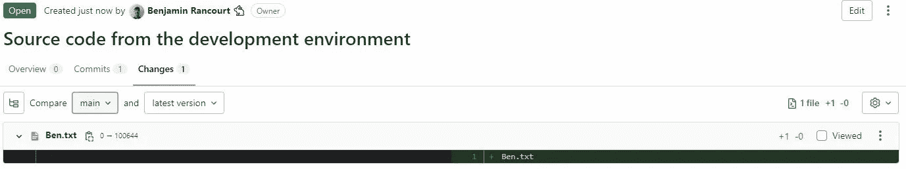

# 如何将遗留应用程序放入 Git

> 原文：<https://betterprogramming.pub/how-to-put-a-legacy-application-in-git-c7b1aec7cd2f>

## 验证所有应用程序都在版本控制系统中


你有没有遇到过一个旧的应用程序，在 2022 年仍然不在[版本控制系统](https://www.atlassian.com/git/tutorials/what-is-version-control) (VCS)下，比如 [Git](https://git-scm.com/) 或 [Apache Subversion](https://subversion.apache.org/) ？一个系统，为了修改它，需要连接应用所在的服务器，直接用 [vim](https://en.wikipedia.org/wiki/Vim_(text_editor)) 修改文件？

在舍布鲁克镇，我们的主要系统之一是。有人很容易引入新的变化或缺陷。唯一做出改变的人会知道为什么要这样做！

是时候开始跟踪该系统中的变化了。

# 结构化

由于遗留系统可能非常复杂，我们需要构造自己来确定我们想要版本化它的内容和方式。

## Git 分支

我们的系统有两个环境:生产和开发。因为他们每个人都有不同版本的应用程序，所以他们需要在 Git 中有相应的分支:`main`和`develop`。

当你考虑 Git 的时候，你可以去 [GitLab](https://about.gitlab.com/) 或者 [GitHub](https://github.com/) 创建一个新的 Git 仓库。确保它是空的，因为这样会容易得多。

## 开发文件

由于开发人员直接在服务器上进行更改，所以有可能存在我们不想进行版本控制的文件，比如副本或待办事项列表。

因此，我们需要用一个 [allowlist](https://en.wikipedia.org/wiki/Whitelist) (也称为白名单)列出我们想要的文件。

我们可以从生产服务器上的文件开始这个列表，因为不应该有太多我们不想要的文件。

```
index.html
api.js
search.js
main.js
main.css
README.md
```

一个简单命名为`files.txt`的文本文件的例子，它列出了定制应用程序应该版本化的所有文件。

> 如果您知道所需文件的扩展名，您可以使用类似下面的命令轻松创建该文件。
> 
> `find . -regex ".*\.js" -o -regex ".*\.css" > files.txt`
> 
> 它将列出所有匹配正则表达式的文件。您将能够修改这个基本文件来包含或排除更多的内容。

现在我们已经构建好了，让我们进入脚本阶段！

# 脚本

由于我们不应该将 Git 添加到生产服务器(这可能会在那里引入潜在的漏洞)，我们将使用 [scp](https://en.wikipedia.org/wiki/Secure_copy_protocol) 将我们想要的文件下载到我们的本地机器。

> 对于那些感兴趣的人，如果你是这个命令的新手，这里有一个[有用的备忘单](https://devhints.io/scp)。

## 为我们的应用程序创建一个档案

```
# From our local computer, upload the file that contains the list of files we want to version
scp list.txt USERNAME@PRODUCTION_SERVER_NAME:/PATH_OF_OUR_APPLICATION

# Connect to the production server
ssh USERNAME@PRODUCTION_SERVER_NAME

# Go to where the application is
cd /PATH_OF_OUR_APPLICATION

# Create an archive containing the files we want
tar --create --preserve-permissions --file APPLICATION_NAME.tar --files-from files.txt --verbose

# Go back to our local computer
exit
```

## 将源代码下载到我们的本地计算机上

```
# Create a new directory to receive the source code
mkdir -p ~/Downloads/APPLICATION_NAME

# Download our TAR archive to our computer
scp USERNAME@PRODUCTION_SERVER_NAME:/PATH_OF_OUR_APPLICATION/APPLICATION_NAME.tar ~/Downloads

# Extract the TAR archive to our new directory
tar --extract --preserve-permissions --file ~/Downloads/APPLICATION_NAME.tar --directory ~/Downloads/APPLICATION_NAME --verbose
```

## 将源代码上传到 GitLab 存储库

```
# Go in the directory that now contains our source code
cd ~/Downloads/APPLICATION_NAME

# Initialize the Git repository in that directory
git init
git remote add origin git@gitlab.com:benjaminrancourt/APPLICATION.git

# Add all files to the Git repository
git add .

# Commit changes
git commit -m "Source code from the production environment"

# Create the main branch
git branch -M main

# Push the main branch to GitLab
git push origin main
```

## 对另一个环境重复上述步骤

请记住，我们的遗留应用程序在不同的环境中可能有不同的版本。如果是这样，您可能想知道对生产服务器还没有做什么更改。

因此，我们必须将这些版本推送到 Git，这样我们就可以很容易地比较它们。

例如，对于我的开发环境，我将执行以下操作:

```
# Download the source code from the development server (follow the previous procedure)

# Go in the directory that now contains our source code
cd ~/Downloads/APPLICATION_NAME

# Make sure we are on the main branch
git checkout main

# Create a new branch from main
git checkout -b develop

# Extract the archive from the development server 
tar --extract --preserve-permissions --file ~/Downloads/APPLICATION_NAME_DEV.tar --directory ~/Downloads/APPLICATION_NAME --verbose

# Add all changes
git add .

# Commit the changes
git commit -m "Source code from the development environment"

# Push the develop branch to GitLab
git push origin develop
```



一个从`develop`到`main`的合并请求，在这里我可以很容易地识别出还没有生产的变更。

# 结论

通过将遗留系统放入版本控制系统，您可以大大降低丢失应用程序源代码的风险。

向更好的系统迈进了一步！😎

*最初发布于*[*www . Benjamin rancourt . ca*](https://www.benjaminrancourt.ca/how-to-put-a-legacy-application-into-git/)*。*