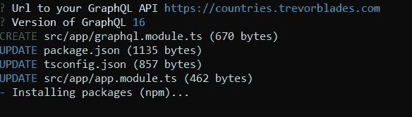
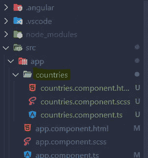
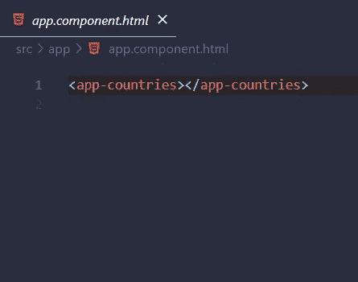
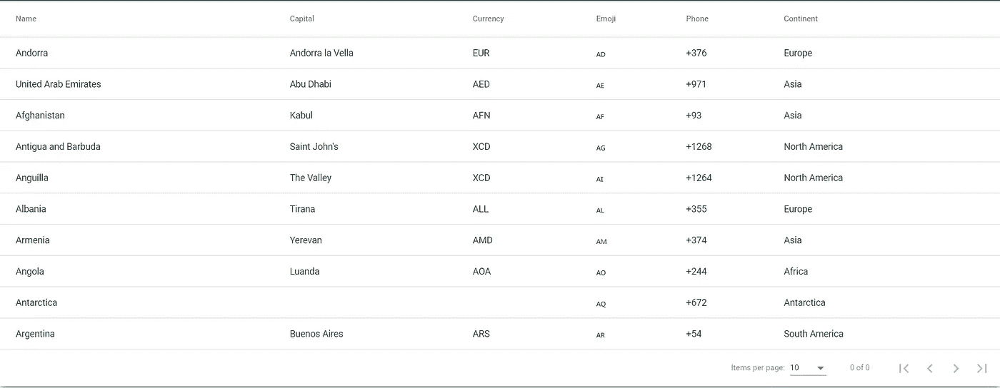

# 如何在 Angular 中快速入门 GraphQL

> 原文：<https://betterprogramming.pub/how-to-quickly-get-started-with-graphql-in-angular-a6fccf5f3a0c>

## 让您轻松入门的简短指南


# 先决条件

*   https://nodejs.org/en/
*   角度 CLI:[https://angular.io/cli](https://angular.io/cli)

# 1.生成新的角度项目

让我们使用`**ng new**`命令生成一个新的角度应用:

```
ng new angular-graphql-app
```

# 2.安装带有角度示意图的 apollo-angular 库

生成 app 后，我们会安装一个名为 [Apollo Angular](https://apollo-angular.com/) 的库。这是一个很棒的 GraphQL 客户端，可以构建使用 GraphQL 获取数据的 UI 组件。

该库支持`ng add`命令。只需运行以下命令来安装它:

```
ng add apollo-angular
```

您将被要求提供 Graphql 服务器的 URL。在这个例子中，我们将使用 countries API，这是一个非常棒的关于国家、大洲和语言信息的公共端点。

看看这里:[https://countries.trevorblades.com](https://countries.trevorblades.com)。



如上图所示，该命令将创建一个名为`graphql.module.ts`的新模块，并用必要的配置和导入自动更新所有其他文件。

`graphql.module.ts`文件看起来会像这样:

graphql.module.ts

# 3.创建模型

现在，我们将创建两个简单的模型，一个用于`Country`，一个用于`Continent`。这两个对象稍后将保存来自 API 的数据。

Country.ts

continental . ts

# 4.创建新的国家服务

在创建了我们的模型之后，下一步是创建一个所有应用程序类都可以用来获取国家的`CountriesService`。稍后我们将使用 Angular 支持的依赖注入将其注入到`CountriesComponent`构造函数中。

您可以通过 CLI 使用以下命令生成新的角度服务:

```
ng g service countries
```

现在，打开生成的`countries.service.ts`文件并粘贴以下代码:

实际的 graphql 查询位于我们在该类开始时声明的 countries 常量中。我们将检索名称、首都、货币、表情符号、电话和大陆的名称。然后我们将它传递给`watchQuery`方法的`query`参数。

`watchQuery`方法返回一个`QueryRef`对象，它的`valueChanges`属性是一个`Observable`。这个可观测值包含了`data`场的实际结果。

# 5.创建新的国家组件

现在，让我们使用下面的命令生成一个新组件:

```
ng g c countries
```



不要忘记将选择器添加到`app.component.html`文件中。



app.component.html

打开`countries.component.ts`文件并粘贴以下代码:

*   `displayedColumns`:要在数据表中显示的列的名称。
*   `dataSource$`:observable 包含了我们之前从服务器获取的国家。我们从注入到组件构造函数中的`countriesService`调用`getCountries()`。

# 6.添加有角度的材料

这部分是可选的。你可以随意使用任何你想要的 UI 库。我们将使用 [Angular material](https://material.angular.io/) 的 datatable 组件来显示本例中的数据。

键入以下命令将库添加到项目中:

```
ng add @angular/material
```

为此，我们需要导入`app.module.ts`中的`MatTableModule`、`MatPaginatorModule`和`MatSortModule`，如下所示:

应用程序模块

# 7.显示数据表中的国家

最后一步是显示列名和从数据表中可观察到的国家提取的数据。

打开`countries.component.ts`文件并粘贴以下代码:

## **结果**



本地主机:4200

# 包扎

这个简单的教程告诉我们如何在 Angular 应用程序中快速设置 graphql。角度示意图使安装和配置依赖关系变得容易，并且与自己动手相比节省了时间。

apollo-angular 库还有很多值得探索的地方，所以请随意查看这里的文档:[https://apollo-angular.com/](https://apollo-angular.com/)

*感谢阅读，下期再见*😉。