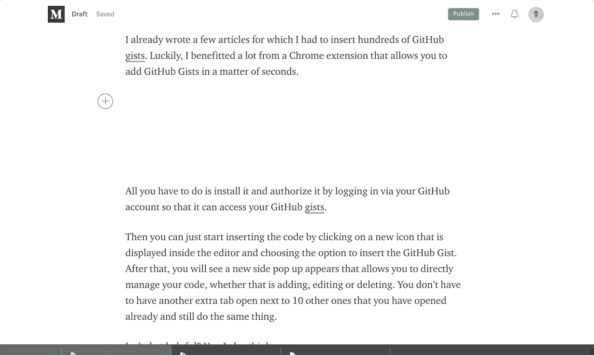

# 给你的中型文章增加要点的一个更快的方法

> 原文：<https://betterprogramming.pub/how-to-quickly-insert-pretty-code-into-your-medium-articles-d812678b897>

## 使用代码介质 Chrome 和 Firefox 扩展

Medium 是一个写作的好地方。你可以发表你的文章，接触到大量的读者。这对开发人员来说特别好，他们很活跃，喜欢阅读编程主题。

如果您是一名撰写关于技术和编程的中型文章的作者，那么您可能需要插入一些代码片段，这些代码片段通过从 GitHub Gists 中插入来突出显示语法并进行格式化。

您希望您的代码在这里看起来很漂亮，就像在您最喜欢的编辑器中一样。

在介质上插入代码片段的过程既漫长又乏味。你需要去 GitHub gist 写代码。然后，你需要将链接粘贴到你的媒体文章中。

如果你想改变代码，你不能在 Medium 内部这样做，但你必须去 GitHub Gist 并更新它。

如果你想插入另一个要点，那么你需要重复这个过程。

换句话说，这可能会很烦人。

我已经写了几篇[文章](https://medium.com/better-programming/127-helpful-javascript-snippets-you-can-learn-in-30-seconds-or-less-part-1-of-6-bc2bc890dfe5?source=---------16------------------)，其中我不得不插入数百个 GitHub Gists。幸运的是，我受益于一个 Chrome 扩展，它可以让你在几秒钟内添加 GitHub Gists。

你所要做的就是安装它，并通过你的 GitHub 帐户登录来授权它，这样它就可以访问你的 GitHub Gists。然后，通过单击编辑器中显示的新图标并选择插入 GitHub 要点的选项，开始插入代码。

你会看到一个新的弹出窗口出现，允许你直接管理你的代码，无论是添加，编辑或删除。

你不必在十个做同样事情的人旁边打开另外一个标签。

这个插件在 [Chrome](https://chrome.google.com/webstore/detail/code-medium/dganoageikmadjocbmklfgaejpkdigbe) 和 [Firefox](https://addons.mozilla.org/en-US/firefox/addon/code-medium/) 上都有。

它也是开源的——你可以在这里查看代码。

# 摘要

*   查看代码介质，可用于 [Chrome](https://chrome.google.com/webstore/detail/code-medium/dganoageikmadjocbmklfgaejpkdigbe) 和 [Firefox](https://addons.mozilla.org/en-US/firefox/addon/code-medium/) 。
*   在 [GitHub](https://github.com/Maluen/code-medium) 上贡献或阅读其代码。

我希望这能节省你的时间，让你的写作更加愉快。