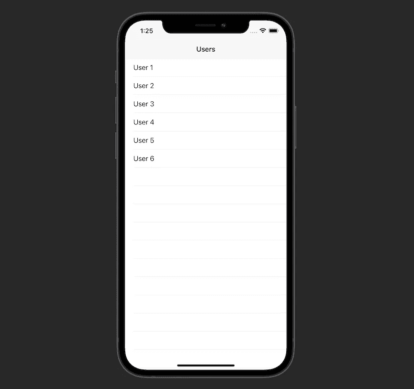

# 如何使用 SwiftUI 快速预览您的 UIViewControllers

> 原文：<https://betterprogramming.pub/how-to-quickly-preview-your-uiviewcontrollers-using-swiftui-670aa9c0264e>

## 最小化应用重建

照片由[贡纳尔·西古尔在](https://unsplash.com/@sigurdarson?utm_source=medium&utm_medium=referral) [Unsplash](https://unsplash.com?utm_source=medium&utm_medium=referral) 纵火拍摄。

在本教程中，我们将学习如何轻松调试我们的`UIViewControllers`而无需多次运行我们的应用程序。我们将利用 SwiftUI 预览来实现这一点。我们还将创建一个方便的扩展，您可以复制并粘贴到您的应用程序中，以允许任何视图控制器的即时 SwiftUI 预览支持。

即使你的项目的最低 iOS 版本低于 13.0，你仍然可以使用这个技巧，它会节省你很多时间。

示例项目的源代码可以在本文的底部找到。

# 我们开始吧

我们从在`UIViewController`上定义这个扩展开始:

1.  我们向 iOS 13 及以上版本的消费者提供该扩展。
2.  私有的`Preview`结构符合`UIViewControllerRepresentable`协议。我们将使用它为我们的视图控制器创建一个预览。
3.  该结构依赖于一个`UIViewController`。例如，如果我们想要一个`SettingsViewController`的预览，我们将把它提供给`Preview`结构。
4.  `makeUIViewController(context:)`和`updateUIViewController(_ uiviewController:context:)`方法是`UIViewControllerRepresentable`协议所要求的。在`makeUIViewController`方法中，我们返回想要获得预览的视图控制器。后一种方法保持为空。
5.  我们创建一个方便的`preview`属性，为视图控制器返回一个`Preview`。

这就是我们在应用程序中添加任何`UIViewController`预览支持所需的全部内容。让我们测试一下我们创造了什么。

# 用法示例

我们有一个简单的屏幕来获取用户并在一个`UITableView`中显示他们:

我们的`User`模型非常简单，我们有`mockUsers`属性来获取一组样本用户:

视图控制器的代码也非常简单:

正如我们所看到的，在`viewDidLoad()`中，我们模拟了一个网络请求，该请求返回一组用户并重新加载表视图:

为了创建`UsersViewController`的预览，我们需要做的就是定义一个符合`PreviewProvider`协议的结构，并返回我们在本教程开始时创建的`Preview`:

最后，我们能够在 Xcode 中看到视图控制器的实时预览:

我们已经成功地添加了对`UIViewController`预览的支持，并在一个简单的例子中测试了它们。

# 资源

示例项目的源代码可以在 [GitHub](https://github.com/zafarivaev/viewcontroller-swiftui-previews) 上找到。

# 包扎

要了解更多关于 SwiftUI 预览的信息，请查看这篇由 Manuel Schulze 撰写的[文章](/a-deep-dive-into-swiftui-previews-66d53469ee43)。

我希望这篇教程对你有用。感谢阅读！