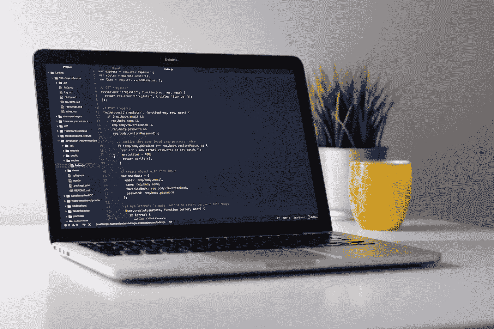
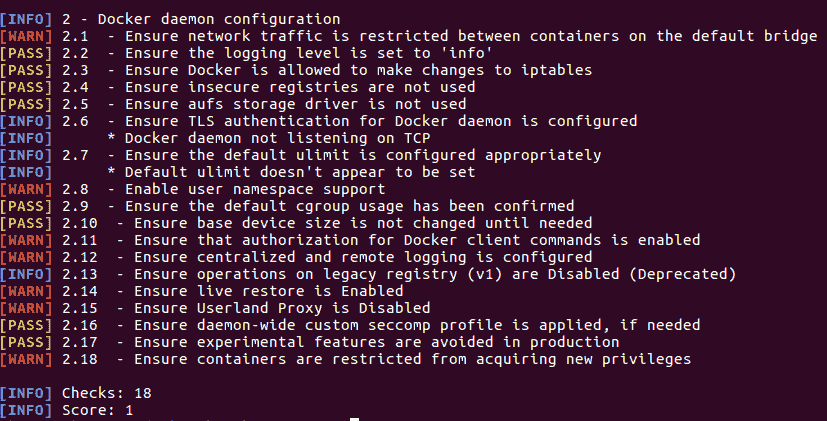
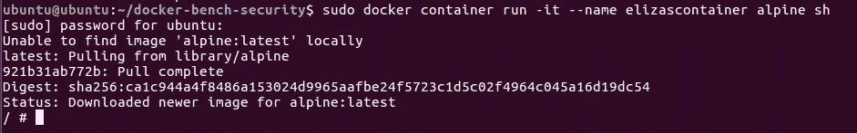
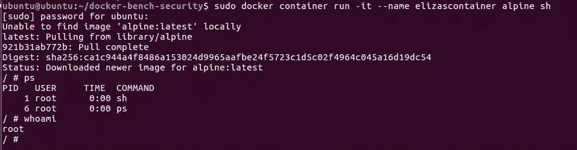
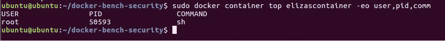
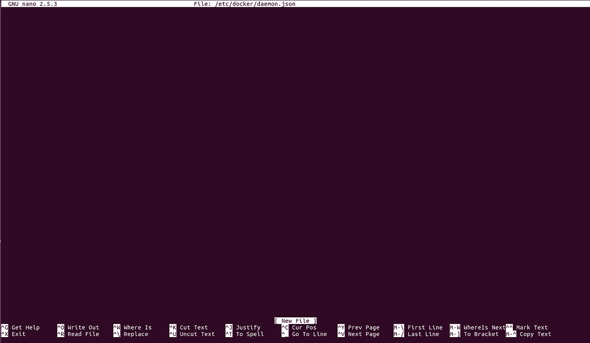
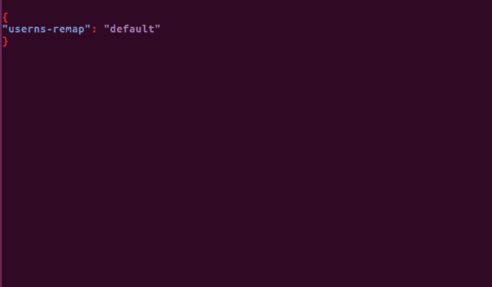
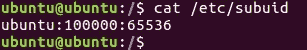
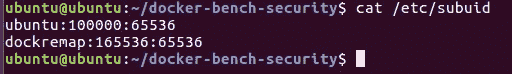
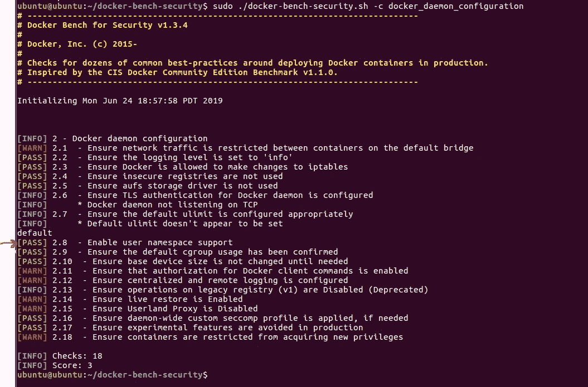

# 如何针对 Docker 快速运行基本安全审计并保护 Docker 守护进程…

> 原文：<https://betterprogramming.pub/how-to-quickly-run-a-basic-security-audit-against-docker-secure-the-docker-daemon-cdf1d8e4cd>

## 来自一个非码头专家只是充分利用失眠



照片由 [Unsplash](https://unsplash.com/search/photos/programming?utm_source=unsplash&utm_medium=referral&utm_content=creditCopyText) 上的 [Clément H](https://unsplash.com/@clemhlrdt?utm_source=unsplash&utm_medium=referral&utm_content=creditCopyText) 拍摄

示例运行在 Ubuntu 16.04.6 上，并使用 [Docker](https://www.docker.com/) 版本 18.09.5

# 基本安装

```
sudo apt install docker.io
sudo systemctl start docker
sudo systemctl enable dockersudo apt install git -y
```

安装基准安全性:

```
git clone [https://github.com/docker/docker-bench-security.git](https://github.com/docker/docker-bench-security.git)
```

从基准目录中，针对您的 Docker 版本运行基准

```
cd docker-bench-security/
sudo ./docker-bench-security.sh
```

输出应该如下所示:


请注意，`WARN` 应被视为类似于任何其他漏洞评估工具中的关键漏洞。同样，根据您的环境，`INFO` 语句也可能适用，所以不要忽略它们。

# 保护 Docker 守护程序

```
sudo ./docker-bench-security.sh -c docker_daemon_configuration
```



让我们看一个简单的例子，`WARN 2.8 Enable user namespace support`。

那么什么是名称空间呢？名称空间是 Linux 内核中的一项功能，它允许分离不同的资源。名称空间这个词可以用最简单的术语来理解，它是或者可以是隐式隔离的。在这个例子中，我将详细说明如何实现用户名称空间。

默认情况下，Docker 中没有设置名称空间。这意味着在容器爆发时，在用户名称空间中作为特权用户运行的恶意用户也可以作为特权用户运行。

下面的例子将展示在爆发事件中，启用用户名称空间如何使任何邪恶的攻击者没有比普通用户更多的权限。这增加了一层防御，尽管示例很简单，但不要就此打住。确保缓解安全审计输出中的所有问题。

Docker 以 [Alpine](https://alpinelinux.org/about/) 为例做他们最基础的[教程](https://training.play-with-docker.com/alacart/)。因为我还在学习码头工人的诀窍，所以我也打算这样做。

让我们从运行一个 alpine 容器开始:

```
sudo docker container run -it --name elizascontainer alpine sh
```



`**#**` 提示告诉我们，我们现在在阿尔卑斯集装箱内。在容器内部，我们可以运行像`whoami` 或`ps` 这样的命令来证明我们的特权状态是 root。

容器内的进程 ID 是`1`，但这是因为容器内的进程不知道任何外部进程。该容器之外的进程 ID 是`50593`，但这是同一个进程。一个是从容器内部的角度，另一个是从容器外部的角度。

现在，因为整个进程由根用户拥有，所以在发生突破时，攻击者将拥有对主机的完全根访问权限。为了实现缓解控制，让我们充分利用用户名称空间。



```
sudo docker container top elizascontainer -eo user,pid,comm
```



我们需要从主机系统的`/`根目录完成这项工作

```
cd ../../../sudo nano /etc/docker/daemon.json
```

如果这个文件以前没有编辑过，您将看到一个类似这样的空白文件:



添加以下设置:

```
{
"userns-remap": "default"
}
```

应该是这样的:



当`userns-remap`设置为`default`时，Docker [自动创建](https://docs.oracle.com/cd/E52668_01/E87205/html/ol-docker-userns-remap.html)一个名为`dockremap`的用户和组。



```
sudo service docker restart
```



现在，让我们重新运行初始审计检查，看看我们是否成功通过了用户名称空间检查:

```
sudo ./docker-bench-security.sh -c docker_daemon_configuration
```



Docker 拥有关于如何解决未决问题的优秀文档。

# Docker 安全的免费资源

[码头工人安全文件](https://docs.docker.com/engine/security/security/)。

[基准文档](https://github.com/docker/docker-bench-security)。

[玩 Docker 教程](https://training.play-with-docker.com/alacart/)。

不能在你的主机上玩 Docker？[在浏览器中玩 Docker](https://labs.play-with-docker.com/)。