# 如何针对 Docker 快速运行基本安全审计并保护主机…

> 原文：<https://betterprogramming.pub/how-to-quickly-run-a-basic-security-audit-against-docker-secure-the-host-5e8bd907c12f>

## 示例运行在 Ubuntu 16.04.6 上，并使用 Docker 版本 18.09.5

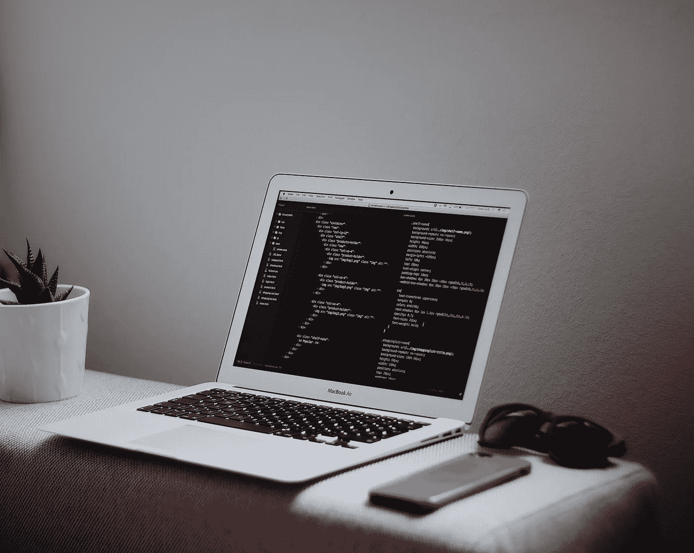

[Goran Ivos](https://unsplash.com/@goran_ivos?utm_source=unsplash&utm_medium=referral&utm_content=creditCopyText) 在 [Unsplash](https://unsplash.com/search/photos/programming-secruity?utm_source=unsplash&utm_medium=referral&utm_content=creditCopyText) 上拍摄的照片

# 基本安装

```
sudo apt install docker.io
sudo systemctl start docker
sudo systemctl enable dockersudo apt install git -y
```

安装基准安全性:

```
git clone [https://github.com/docker/docker-bench-security.git](https://github.com/docker/docker-bench-security.git)
```

从基准目录中，针对您的 Docker 版本运行基准。

```
cd docker-bench-security/
sudo ./docker-bench-security.sh
```

输出应该如下所示:

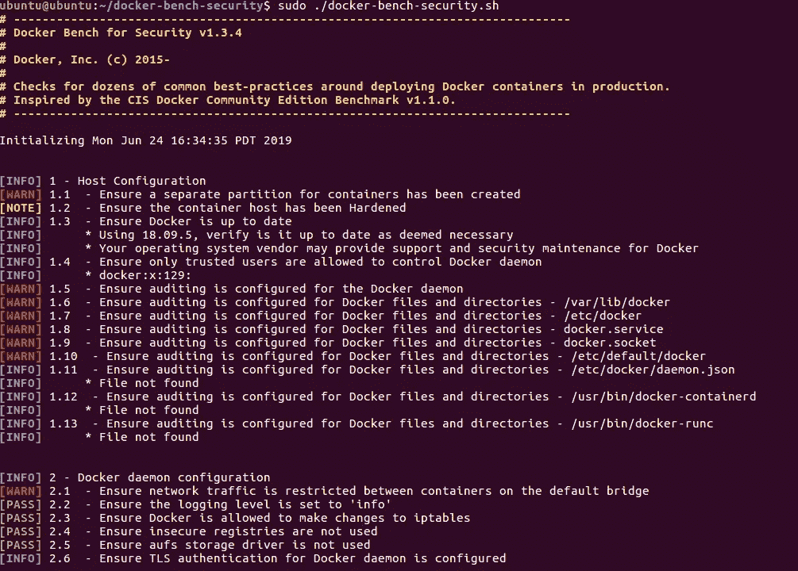

请注意，`WARN`应被视为类似于任何其他漏洞评估工具中的关键漏洞。同样，根据您的环境，`INFO`语句也可能适用，所以不要忽略它们。

# 主机配置

保护运行 Docker 的主机尤其重要。要减少大量的输出，只需将标题添加到您刚刚运行的命令中，以获得更多深入的漏洞信息。

```
sudo ./docker-bench-security.sh -c host_configuration
```

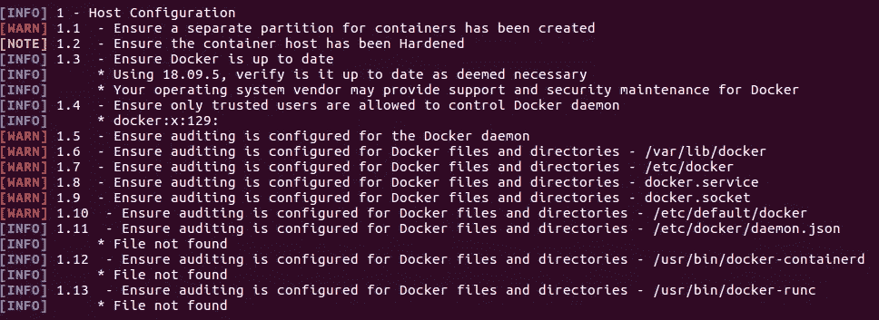

```
sudo apt install auditd -y
```

要检查您已经在系统上设置了哪些规则，请运行以下命令:

```
sudo auditctl -l
sudo aureport -l
```

因为我们还没有设置任何规则，所以我们没有事件。因此输出应该是这样的:

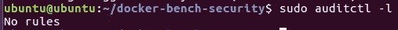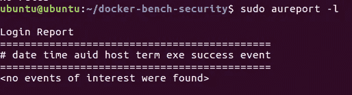

我们来定一个快速规则，打破规则，见证事件报告:

```
sudo auditctl -w /usr/bin/dockerd -k docker
```

这个命令是一个通用规则。它基本上说手表(`-w`)这个路径和文件(`/usr/bin/dockerd`)。如果违反此规则，生成一个唯一的事件 ID ( `-k`)。下面，我们可以重新运行`auditctl` 实用程序，这显示了我们的规则。

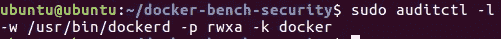

在运行几个随机命令来测试规则之后，我可以用下面的命令检查输出:

```
sudo aureport -k
```

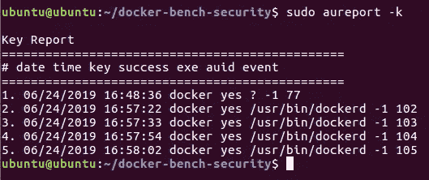

您在每个事件末尾看到的数字是其事件 ID。

要查看单个事件的信息，请运行以下命令:

```
sudo ausearch --event 102 | sudo aureport -f -i
```

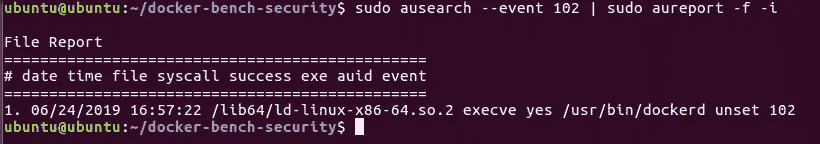

通过复制并粘贴到`/etc/audit/audit.rules`，对以下所有文件进行同样的操作:

`/etc/docker`|`/etc/default/docker`|`/etc/docker`/`daemon.json`|`/var/lib/docker`|`docker.service`|`docker.socket`|/`usr/bin/dockerd`|`/usr/bin/docker-runc`|`/usr/bin/docker-containerd`

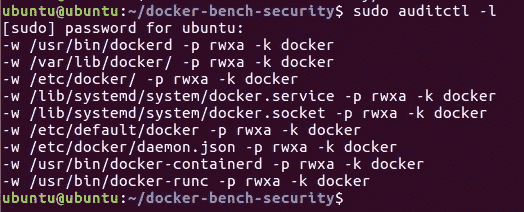

这些规则，尽管应用在正确的位置和工作顺序，但不是一成不变的。它们将在审计守护程序本身重新启动时被删除。让规则静态化。

```
sudo sh -c "auditctl -l >> /etc/audit/audit.rules"
```

check 1.5 有一个奇怪的问题。我不知道为什么，但是简单地在 bench-security 的配置文件中添加一个字母`d`就可以解决这个问题。见下文:

```
nano tests/1_host_configuration.sh
```

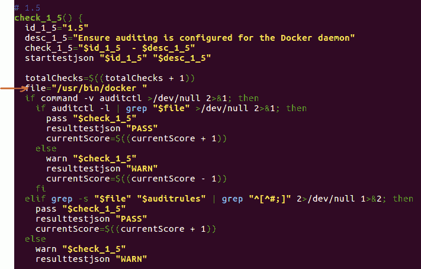

重新运行主机配置审核检查，并查看与原始审核的差异。

```
sudo ./docker-bench-security.sh -c host_configuration
```

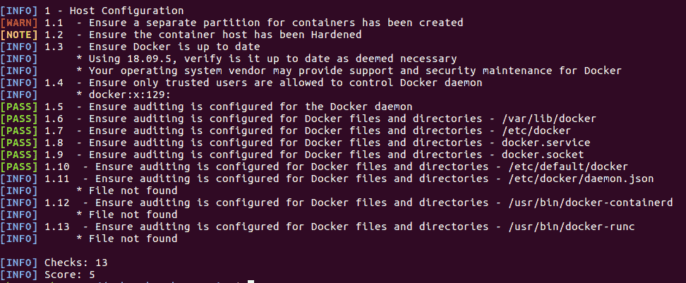

# Docker 安全的免费资源

1.  码头工人[安全](https://docs.docker.com/engine/security/security/)文档。
2.  基准[文档](https://github.com/docker/docker-bench-security)。
3.  玩 Docker [教程](https://training.play-with-docker.com/alacart/)。
4.  不能在你的主机上玩 Docker？在[浏览器](https://labs.play-with-docker.com/)中玩 Docker。