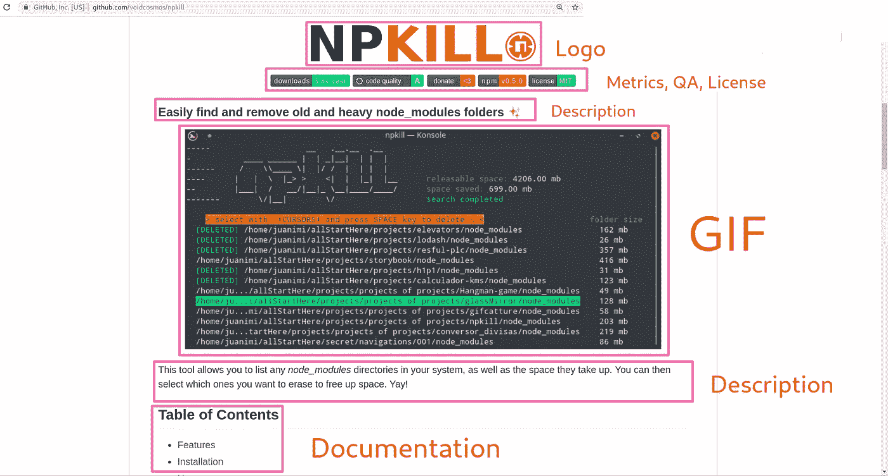
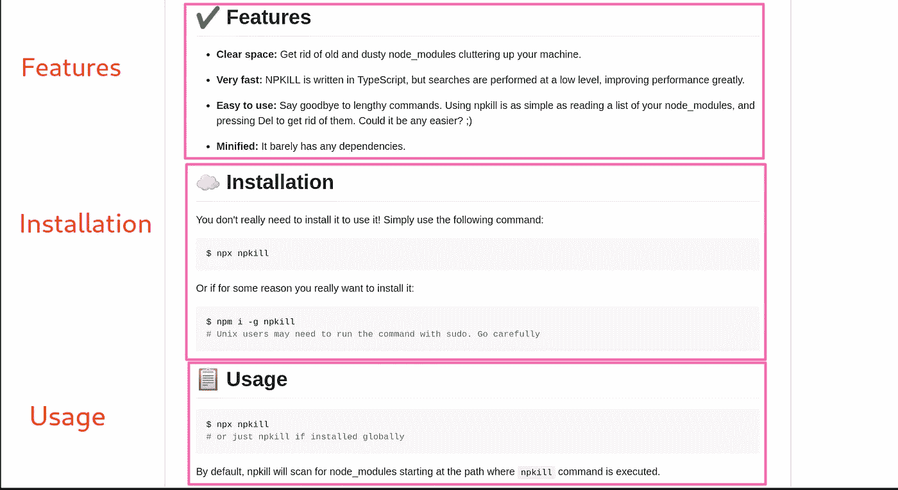
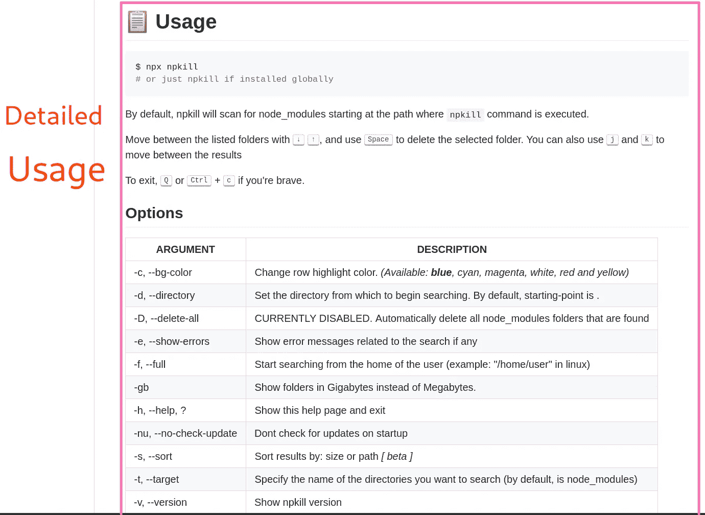
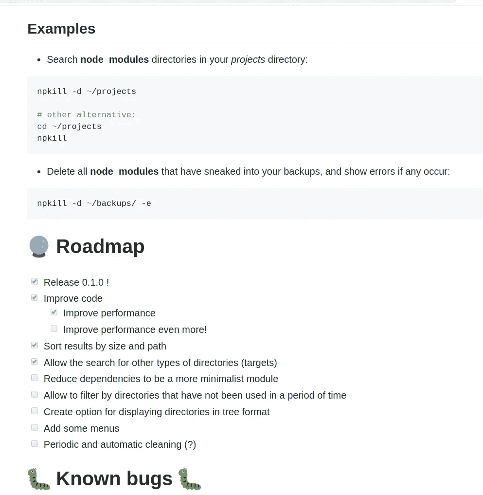

# 如何在你的第一个开源软件中达到 1000 个 GitHub 之星

> 原文：<https://betterprogramming.pub/how-to-reach-1000-github-stars-in-your-first-open-source-software-679aaad500c>

## 年轻开发者的成功故事

照片由[多兰·埃里克森](https://unsplash.com/@doran_?utm_source=unsplash&utm_medium=referral&utm_content=creditCopyText)在 [Unsplash](https://unsplash.com/search/photos/success?utm_source=unsplash&utm_medium=referral&utm_content=creditCopyText) 拍摄

今天，我要写一个软件开发的成功故事。我不会写优步、Instagram、Airbnb 或微软。我打算写一个小的 Node.js 包管理工具。

但是……成功的故事在哪里？

这个工具由两个年轻的程序员打造，新手，没有经验，没有启动软件的先验知识，上线不到一个月，在 GitHub 上就达到了 1000 星！

几周前，[我写过这个工具](https://medium.com/better-programming/npkill-the-easy-solution-to-deleting-node-modules-with-style-1c591126f7a5)。此外，我试图让我所有的社交网络都知道它，因为我认为这是对这两位新程序员的恒心的最好奖励，因为他们正在尽最大努力学习:实践！

[npkill](https://github.com/voidcosmos/npkill) —该工具允许您列出系统中的任何`node_modules`目录，以及它们占用的空间。然后，您可以选择要抹掉的内容以释放空间。耶！

在这篇文章中，我将总结如何达到你的目标的步骤和这个小项目成功的关键。

# 如何达到你的目标

GitHub 上流行的存储库有一些共同的特性:

*   一个自述文件，带有产品的图片/gif 和一个漂亮的标志。
*   文档。
*   代码 QA(静态代码分析)。
*   投稿说明。
*   定义明确的设置部分。
*   支持(回应问题/公关)
*   用一切可能的方式发布软件新闻。

# 自述文件

自述文件是访问者在查看存储库时看到的第一样东西。因此，您应该确保您的自述文件包含有关您的项目的基本信息。

我发现了一些非常有趣的项目，但是我没有安装，因为自述文件是空的或者是自动生成的。

自述文件中真正重要的是什么？当有人在看你的项目时，他们想知道:

*   这是什么？
*   代码有多好？
*   有多少支持？
*   包括什么？
*   它看起来像什么？
*   如何设置？

让我们逐一回答这些问题。

# 这是什么？

这是最基本的，我浏览了 GitHub 上的许多仓库，在阅读了自述文件后，我仍然不知道它们是做什么的。

我可以通过项目的名字算出来。在我的例子中，我喜欢阅读源代码，有时，我浏览源代码并试图推断出项目是做什么的，但这是一个错误。

在推文中描述你的项目(大约 140 个字符)。这些特性应该在一个专门的部分描述，在那里你可以详细解释每一个特性。所以，只考虑你的项目做了什么。

同样重要的是，一个标志，一个形象。这将把你的项目与一个形象联系起来，这将为你的项目打上烙印。你的项目有一个标志是非常重要的，因为你可以创建多媒体内容发布在社交网络上。

npkill 的描述非常容易理解:

> *“轻松找到并删除旧的和沉重的 node_modules 文件夹”*

# 代码有多好？

代码质量从科学一开始就是软件工程的一个话题，所以在本帖中我们就不讨论什么被认为是软件质量了。

但是，我们可以考虑一些表明代码已被处理的变量:

*   这是久经考验的。
*   它通过了风格检查( [ESLint](https://eslint.org/) 等)。).
*   GIT 使用 linter 提交。
*   问题和 PR 模板。
*   提供创建 PR 的说明和指南。
*   它可以在当前状态下编译(相对来说没有问题)。
*   它通过了某种形式的静态分析。

# 有多少支持？

如果我使用这个开源项目，我有一个问题，谁能帮助我？

这是所有开源项目中价值百万美元的问题，也是一个开源项目是否被大公司使用的区别所在(除了许可问题)。

重要的是看到有人为可能出现的问题提供支持。

在这件事上，我给了 npkill 程序员一条建议，因为当第一个问题出现时，他们把自己锁起来，找出发生了什么，并试图通过让发现错误的人完全放弃来解决它。

我告诉他们，你犯了一个错误，你要做的第一件事就是支持这个人，告诉他们你在那里，你会找到解决这个问题的办法。

这样，有问题的人和项目的创建者之间就建立了联系，因为开发人员会在那里帮助你。此外，如果您需要任何进一步的信息来搜索 bug，连接会更紧密。

所以回复用户是必不可少的(诚然，我们都有个人生活，没必要在不到一个小时的时间内匆忙回复)。

另一个基本的支持是必须在每个社交网络中提供的，在那里项目的外观被交流，因为我们从那些网络中找到用户，他们可能不是程序员，但实际上正在使用软件。

# 包括什么？

这包括一个项目特性列表，项目做什么。指出处于开发阶段或未来将要开发的路线图中的特性是一个好主意，清楚地表明它们还没有被开发。

这一事实将避免发现缺少该功能的用户的评论或价值主张。

在这里，您可以创建一个不需要创建详细描述的功能列表。该功能的解释可以委托给*如何使用？*一节。

# 它看起来像什么？

您不必安装或配置任何东西就可以显示结果，这一点很重要。创建一个视频，一个 GIF，或者创建一个服务器来演示应用程序的运行。

这将显示你的项目带来的价值。你可以在社交网络上使用这些内容，相信我，如果自述文件是必不可少的，那么拥有你的项目的视觉演示将会充分利用它，许多同事将会感谢你的努力。

我自己已经标记了有趣的存储库，这些存储库并不完全是我正在寻找的，但我可以直观地看到它们是什么——它们已经转到我的书签中，以备将来需要。

展示你的项目成果！

# 我如何设置它？

想象一下，你的项目已经吸引了一些想尝试它的用户，但是你没有提供如何启动它的说明…这是一场灾难！

你应该详细描述如何在不同的平台(你估计的平台)上配置你的软件，但是你应该尽可能的简单。

您可以创建一个快速或基本配置版本，其中的步骤更容易执行，还可以创建一个具有更多配置的高级版本。

但是，您不能忘记配置项目的说明，因为如果决定使用它的用户没有找到一种简单的方法，他们可能会寻找另一个做类似事情但易于安装的项目。

# 项目在哪里发布？

这一阶段对你的项目发展至关重要，重要的是你要记住，你不是在发垃圾邮件，而是在让人们知道有一个项目可以为专业人士解决问题。

这些文章的目的不是在没有更多价值的情况下把一个链接放到你的存储库中，所以你必须更详细地解释你的项目。如果你准备了一份好的自述文件，它将被作为写文章的基础文件。

在这个项目中，我是负责让它更广泛传播的人，因为我已经在不同的社区写了几个月了，这个场合被用来增加所有读者的价值。

当然，创作者一直在技术上支持解决任何疑问。

## 博客

我写关于 [npkill 的第一个地方是在我的个人博客](https://www.carloscaballero.io/npkill/)，在那里我每天大约有 100 次访问。

## 开发到

在 [Dev.to](https://dev.to/carlillo/npkill-the-solution-to-deleting-nodemodules-easily-with-style-1o70) 中，npkill 真的攀升了，很快就达到了 500 星。

除了社区开始知道 npkill 之外，它已经有了 200 个反应和超过 3500 次的访问。

## 中等

在[媒体](https://medium.com/better-programming/npkill-the-easy-solution-to-deleting-node-modules-with-style-1c591126f7a5)上，我交叉发布了这篇文章，这篇文章的访问量达到了 1000 次。

## 哈克农

该项目还发表在 Hackernoon 上，这篇文章的访问量刚刚超过 100 次。

## 推特

这是更多社区产生的地方，因为社区产生了运动，一些人高兴地释放空间，另一些人不断评论说他们可以用 Linux 的 find 命令做同样的任务。

(我们已经知道可以用 shell 脚本甚至汇编程序来做什么，但是您没有意识到这是另一个开源项目，它是为开源世界的洗礼而开发的吗？).

非常感谢所有做出贡献的人。

## 开源代码库

该项目已经成为 TypeScript 编程语言中的一个热门话题，使它为更多的开发人员所知。

我知道在 reddit.com[的几个帖子里也讨论了 npkill 主要在 JavaScript 和 Node.js 中。](http://www.reddit.com)

# 结论

我向你们展示了一个由两个年轻程序员开发的项目，他们不断告诉我他们认为没有人会下载他们的软件。

然而，凭借热情、毅力，尤其是对工作的热情，他们已经在 GitHub 上获得了数千次下载、数千次转发和 1000 多颗星。

每个人都可以让他们的项目被社区使用，但是永远不应该失去的是对正在做的事情的热情。请记住，您必须创建具有以下特征的软件:

*   文档。
*   易于安装和使用。
*   支持(GitHub 和社交网络上的回答)。
*   做广告让全世界都知道，你不是在卖任何东西，而是想让全世界知道你已经为他们的问题创造了一个解决方案。

# 资源

*   [npkill GitHub](https://github.com/voidcosmos/npkill)
*   [npkill web](https://zaldih.tk/npkill/)