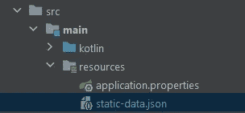

# 如何在 Spring Boot API 中读取 JSON 文件并返回其内容

> 原文：<https://betterprogramming.pub/how-to-read-a-json-file-and-return-its-content-in-a-spring-boot-api-1f69e552f7af>

## 用 Java 和 Kotlin 中的静态 JSON 文件模仿 API


照片由[道格拉斯·洛佩斯](https://unsplash.com/@douglasamarelo?utm_source=medium&utm_medium=referral)在 [Unsplash](https://unsplash.com?utm_source=medium&utm_medium=referral) 拍摄

我最近不得不开发一个 API，它应该返回非常复杂和嵌套的数据。构建这个 API 需要数百个查询，我的团队非常着急。这就是为什么我们决定用一个包含预期数据的 JSON 文件来模拟这个 API，这个文件是由数据科学家手工编写的。

我可以直接从 API 返回 JSON 文件，但这不是我们的想法。相反，API 应该从项目的文件夹中读取 JSON 文件，将它转换成 Java 对象，并将其序列化为 JSON，就像任何 Spring Boot API 通常会做的那样。所有这些都以最快的方式和最简单的逻辑实现。

现在让我们学习如何在 Spring Boot 中构建一个 API，它读取一个静态 JSON 文件并通过 Jackson 返回它在 JSON 中的内容。

# 为什么 API 可能需要返回 JSON 文件的内容

读取静态 JSON 文件的内容并通过 API 返回它是有用的，至少有两个原因。让我们深入研究一下。

1.  您的 API 响应永远不会改变:在这种情况下，响应可以只产生一次，并且可以缓存在一个静态 JSON 文件中。这在 API 响应复杂或涉及嵌套结构时尤其有用。
2.  模拟 API 响应:使用一个静态 JSON 文件作为 API 响应的数据源是模拟 API 的一种好的快速方法。

# 从 JSON 文件到 Spring Boot 的 API 响应

现在让我们看看如何用 Java 和 Kotlin 构建一个 API 来读取 JSON 文件并返回其 Spring Boot 内容。

## **先决条件**

首先，您必须将`[commons-io.ommons-io](https://mvnrepository.com/artifact/commons-io/commons-io)`和`[org.json](https://mvnrepository.com/artifact/org.json/json/20220320)`添加到项目的依赖项中。

如果您是 Maven 用户，请将以下依赖项添加到项目的 POM 文件中:

```
<dependency>
    <groupId>commons-io</groupId>
    <artifactId>commons-io</artifactId>
    <version>2.11.0</version>
</dependency><dependency>
    <groupId>org.json</groupId>
    <artifactId>json</artifactId>
    <version>20220320</version>
</dependency>
```

否则，如果您是 Gradle 用户，请将此依赖项添加到项目的构建文件中:

```
implementation group: 'commons-io', name: 'commons-io', version: '2.11.0'implementation group: 'org.json', name: 'json', version: '20220320'
```

现在，您已经具备了实现教程目标所需的一切。

## 构建读取静态 JSON 文件的 API

首先，让我们看一下静态 JSON 文件:

注意，这只是一个简单的例子。您的静态 JSON 文件可能要复杂得多。

然后，将`static-data.json`文件放在 Spring Boot 的`resources`文件夹中，如下图所示:



注意“resources”文件夹中的“static-data.json”文件

现在，您已经准备好读取 JSON 文件并返回其内容。让我们看看如何在 Java 和 Kotlin 中实现这一点。

## **Java**

## **科特林**

如你所见，`[ClassPathResource](https://docs.spring.io/spring-framework/docs/current/javadoc-api/org/springframework/core/io/ClassPathResource.html)`用于将`static-data.json`加载到`staticDataResource`变量中。如果你不熟悉`ClassPathResource`，这是一个 Spring Boot 类，用于加载放置在`resouces`文件夹中的资源。

然后，`staticDataResource`的`[InputStream](https://docs.oracle.com/javase/8/docs/api/java/io/InputStream.html)`表示被传递给`IOUtils.toString()`函数。这个`commons-io`实用函数将把它转换成一个`String`变量。

最后，`staticDataString`变量用于初始化一个`[JSONObject](https://stleary.github.io/JSON-java/org/json/JSONObject.html)`实例，用`[toMap()](https://stleary.github.io/JSON-java/org/json/JSONObject.html#toMap--)`方法获得的`Map<String, Objcet>`表示作为 API 响应返回。

带有`.toMap()`的`Map<String, Objcet>`对象将被 Jackson 转换成如下 200 HTTP `content-type: application/json`响应:

```
{
  "name": "Maria",
  "surname": "Williams",
  "age": 35
}
```

这与`static-data.json`文件的内容完全匹配。

瞧啊！您刚刚实现了一个 API，它读取一个静态 JSON 文件并在 Spring Boot 中返回其内容。

# 结论

在本文中，您了解了如何在 Spring Boot Java 或 Kotlin 应用程序中使用静态 JSON 文件。具体来说，您看到了如何实现 API 来读取静态 JSON 文件并以`content-type: application/json`格式返回其内容。这对于用几行代码模仿 API 或者实现响应从不改变的 API 特别有用。

感谢阅读！我希望这篇文章对你有所帮助。请随意留下任何问题、评论或建议。