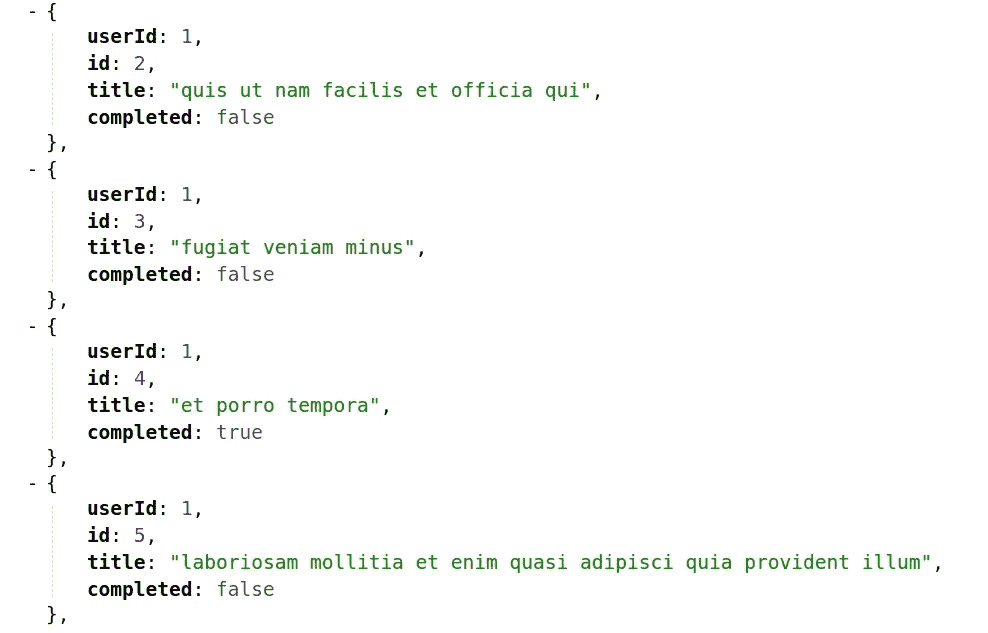
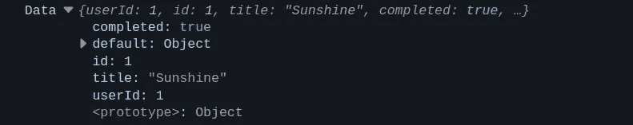
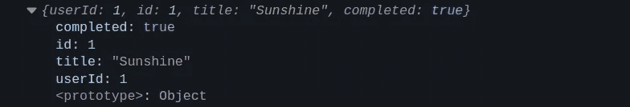
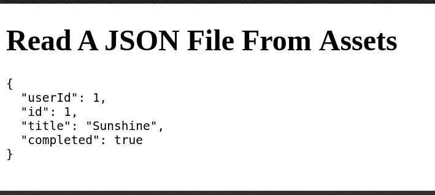

# 如何从 Angular 中的资产读取 JSON 文件

> 原文：<https://betterprogramming.pub/how-to-read-a-json-file-from-assets-in-angular-7c8313cd4fb1>

## [有角度的](https://medium.com/@lorenzozar/list/angular-5496c492a185)

## 从 Angular 的 assets 文件夹中读取 JSON 文件的 3 种方法



可在[https://jsonplaceholder.typicode.com/](https://jsonplaceholder.typicode.com/todos/)找到示例。您可以使用 https://jsoneditoronline.org/的[来试验 JSON 数据。](https://jsoneditoronline.org/)

在从事一个兼职项目时，我想从我的 assets 文件夹中的一个本地 JSON 文件中读取数据。

事实证明至少有几种方法可以做到这一点。我将提到最常见的几种，但您可以在下面找到更多:

1.  使用`import`语句
2.  使用角度 HttpClient

# 从 Angular 中的资产读取 JSON 文件

## 1.使用 import 语句

在 Angular 中从 assets 文件夹中读取 JSON 文件的一种方法是在组件中使用`import`语句。

如果你正在学习 Angular，还没有遇到 HttpClient，这是最简单的方法。或者至少是没有引入新概念的那种。

因为我想从我的`app.component.ts`文件的 assets 文件夹中读取一个 JSON 文件，所以我使用了如下的`import`:

```
import * as jsonData from '../assets/data.json';
```

这就差不多够了。您需要在您的`tsconfig.json`文件的`compilerOptions`中添加`"resolveJsonModule": true`，它是您的 Angular 应用程序的根。

下面是一个`tsconfig.json`的简化例子:

```
// tsconfig.json{
  "compileOnSave": false,
  "compilerOptions": {
    ...
    "resolveJsonModule": true,
    ...
 },
  "angularCompilerOptions": {
  ...
 }
}
```

在某些情况下，这还不够，您可能还需要将`esModuleInterop`设置为 true。在我的情况下，这是没有必要的。

最终，`AppComponent`会变成这样:

这是我的控制台截图:



Console.log of data.json

这假设您在项目的`src/assets`文件夹中有一个`data.json`文件。

## 2.使用角度 HttpClient

从 Angular 的 assets 文件夹中读取 JSON 文件的另一种方法是使用 HttpClient 模块。

首先，我们需要导入`app.module.ts`中的`HttpClientModule`。

其次，我们需要在`app.component.ts`中导入`HttpClient`，并将其注入构造函数中，以在组件中公开使用。

最后，我们可以使用 get 方法从文件中获取数据。

```
this.httpClient.get(this.URL).subscribe(console.log);
```

在这种情况下，我们只需订阅 Angular HttpClient 生成的`Observable`,并将数据记录在控制台中。

对于初学者来说，这种工作方式可能不太直观，因为它引入了两个新概念:

*   [HttpClient](https://angular.io/guide/http)
*   [RxJS 和可观察/订阅模式](https://www.vitainbeta.org/rxjs-primer/)

然而，应用程序通常通过 HTTP 协议连接到服务器。因此，迟早你会了解那些概念。

请注意，将异步效果与组件隔离开来是一个很好的实践。换句话说，您不希望在组件中包含 HTTP 请求。

例如，你应该在一个[服务](https://www.vitainbeta.org/angular-services/)中拥有它。为简单起见，此处省略。

最后，这里是`AppComponent`的样子:

不用说，日志和上一个非常相似。它看起来是这样的:



Console.log of data.json

如果您觉得这有点让人不知所措，请阅读使用 Fetch API 一节。

通过使用本机 Fetch API 可以读取 JSON 文件。这将消除一些与 RxJS 和 HttpClient 模块相关的复杂性。

## 3.从 Angular 中的资产读取 JSON 文件的其他方法

在 Angular 中，还有一些其他方法可以从 assets 文件夹中读取 JSON 文件。

我就不赘述了，因为它们不太可能被使用，但是，值得一提。

## 3.1 添加一个类型文件—JSON-typing ings . d . ts

当`tsconfig.json`中的`resolveJsonModule`和`esModuleInterop`都被设置为`true`时，如果出现错误，这似乎是可行的。

如果是这种情况，您必须在 app 文件夹中名为`json-typings.d.ts`的文件中声明 JSON 模块。

```
//  json-typings.d.tsdeclare module "*.json" {
    const value: any;
    export default value;
}
```

## 3.2 使用获取 API

我们还可以使用本机 Fetch API 读取 JSON 文件，这在所有浏览器中都可用。

在这种情况下，您的代码将如下所示:

```
// app.component.tsngOnInit(): void {
    fetch('./assets/data.json').then(res => res.json())
    .then(console.log); // do something with data
}
```

## 3.3 使用带角度的 JsonPipe

知道这一点很好，即使这不是从 JSON 文件中读取数据的方法。

JsonPipe 直接来自 [Angular](https://angular.io/api/common/JsonPipe) ，它将一个值转换成 JSON 格式的表示。该值必须在属性中，而不是在 assets 中的 JSON 文件中。

因此，您应该首先使用上述任何一种方法将 JSON 文件中的对象分配给一个属性。

完成后，就可以如下使用 JsonPipe 了:

```
<p>{{ data | json}}</p>
```

我建议使用`<pre>`标签让结果更漂亮。

```
<pre>{{ data | json}}</pre>
```



```
{{ data | json}}
```

如文档中所述，这主要用于调试目的。

如果您正在学习 Angular，您可能会对这个简单的教程感兴趣:

[](https://www.vitainbeta.org/angular-tutorial/) [## 角度教程- 2022 - vitainbeta

### 这想成为一个非常好的角度教程。正是我希望我有一个当我开始学习角在我的…

www.vitainbeta.org](https://www.vitainbeta.org/angular-tutorial/)