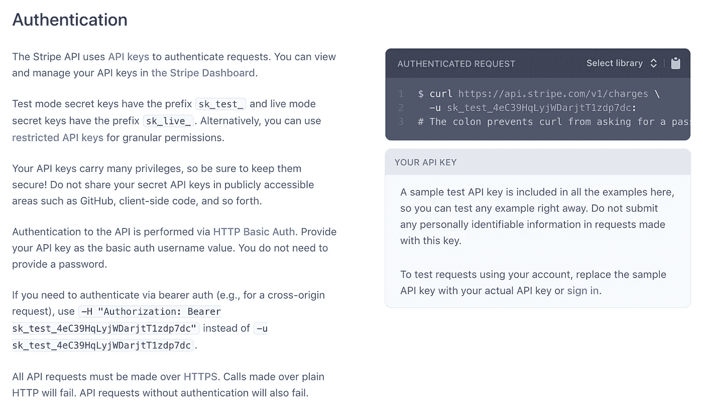
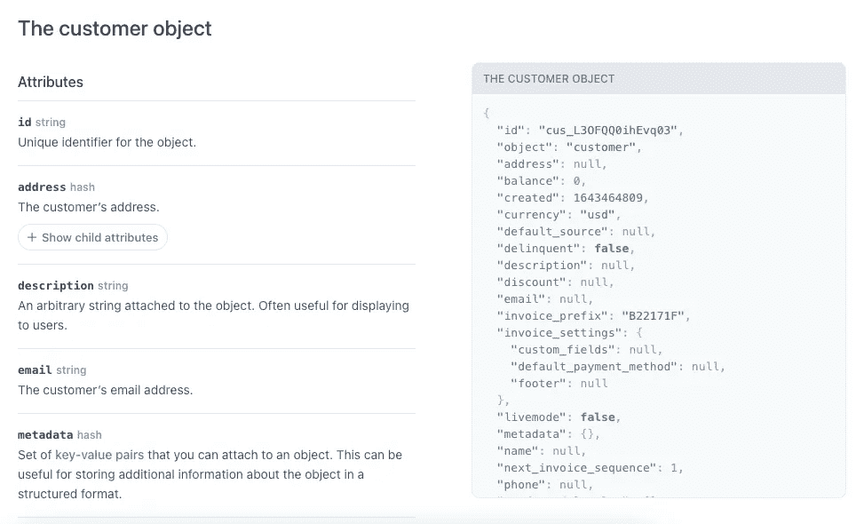
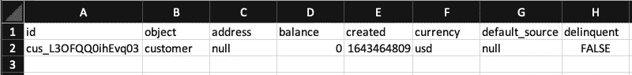
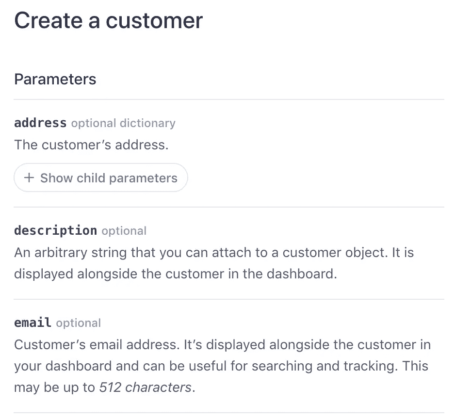
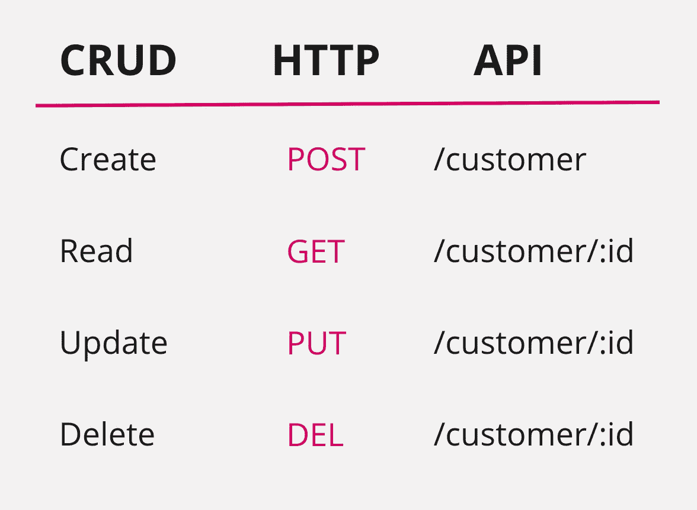
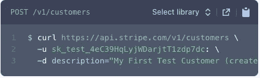
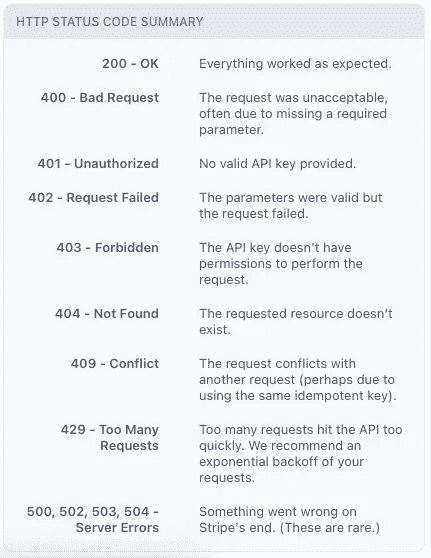
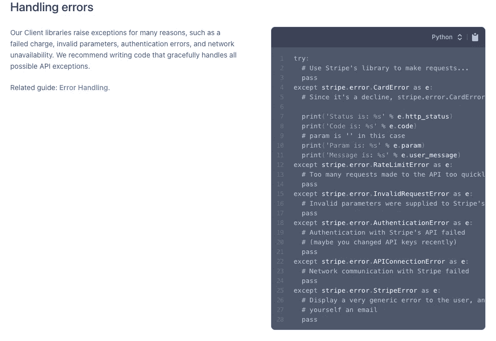

# 如何阅读和理解 API 文档

> 原文：<https://betterprogramming.pub/how-to-read-and-understand-api-documentations-2f894b51d0b7>

## 用 Stripe API 示例解释


如果有人告诉你“检查 API 文档”,你照做了，但是不确定你在看什么，这是给你的。

API 无处不在。它们将不同的应用程序连接在一起，是大多数集成的主干。换句话说，API 是一种通用语言，用于不同系统之间的通信。

> [API]文档越好，采用率就越高，对技术支持的问题就越少。

不用担心，不需要有技术背景也能继续。主要思想是有一个请求和响应的交换。但是我们怎么可能知道该问什么和期待什么结果呢？答案在于理解 API 文档。

# 并非所有的 API 文档都是平等的

并非所有的 API 文档都是一样的。有些很优秀，有些则不怎么样(他们存在吗？).那么是什么让 API 文档比写得差的好呢？

*可读性。*

最佳 API 文档是一个自助参考，它简明地解释了什么是可能的，什么是不可能的，以及如何开始。它也是一个让用户带着语法或功能问题返回的地方。那么，为什么这很重要呢？文档越好，采用率越高，对技术支持的问题就越少。

虽然 API 文档可能因站点而异，但它们都遵循相同的结构，包括:

*   证明
*   目标
*   请求
*   反应

在接下来的部分中，我们将检查每个要点，并以 Stripe API doc 为例进行总结。

# 种类

对于那些可能不熟悉 Stripe 的人来说，他们是互联网企业最大的在线支付处理软件之一，他们拥有最好的 API 文档之一。

这是他们 API 文档的链接【https://stripe.com/docs/api 

*免责声明——我与 Stripe 没有任何关系。我选择 Stripe API 文档的原因是它的可读性是一流的。它采用了时尚的双面板设计，左边是用简单英语写的解释，右边是代码片段。还有一个方便的侧边栏，可以让你快速浏览可用的资源。正如您所料，它包含了您需要的所有必要信息，可以让您立即开始工作。*

# 证明



[https://stripe.com/docs/api/authentication](https://stripe.com/docs/api/authentication)

当您想到 API 认证时，您应该想到安全性🔒。

Stripe 需要知道是谁发出的请求，以及他们是否被授权这样做。为此，对于我们发出的每个请求，我们需要发送一个带有 **API 密钥**、或密码的请求，通常使用特定于帐户的信息(如用户名和密码)来生成。

如果请求包含有效的 API 密钥，Stripe 将继续处理该请求。否则，Stripe 将自动返回一个错误响应`401 — Unauthorized`，让请求者知道他们的凭证无效。如果你不知道 401 是什么意思，没关系，我们会在错误部分讨论这个问题。

就像密码一样，我们永远不应该公开分享这些信息。

# 目标

对象代表信息。从技术上讲，您可以将对象想象成数据库表中的记录。例如，假设我们有姓名和手机号码等客户数据。这可能会存储在 customer 表内的数据库中，我们可以通过支持 customer 对象的 API 与该表进行交互，比如创建新客户或检索现有客户。

客户名称和移动电话是描述客户对象的数据属性。每个数据属性都有一个**类型** —无论是*字符串*、*整数*、*日期*等等。这加强了值必须遵守的规则。例如，姓名可能是字符串类型，而生日可能是日期类型。如果您试图创建一个生日为“abcdef”的新客户，那么这可能会返回一个错误，说明您只能在生日字段中保存一个日期值。

让我们来看一个真实的客户对象。

## 条带化客户对象



[https://stripe.com/docs/api/customers/object](https://stripe.com/docs/api/customers/object)

Stripe 在使客户对象易于阅读方面做得很好。右侧表示 JSON 格式的示例客户对象，而左侧定义数据属性。

如果这种格式看起来“太专业”，不要惊慌。我将用简单的英语解释如何阅读，从右边开始。

```
{
  "id": "cus_L3OFQQ0ihEvq03",
  "object": "customer",
  "address": null,
  "balance": 0,
  "created": 1643464809,
  "currency": "usd",
  "default_source": null,
  "delinquent": false,
  "description": null,
  "discount": null,
  "email": null,
  "invoice_prefix": "B22171F",
  "invoice_settings": {
    "custom_fields": null,
    "default_payment_method": null,
    "footer": null
  },
  "livemode": false,
  "metadata": {},
  "name": null,
  "next_invoice_sequence": 1,
  "phone": null,
  "preferred_locales": [],
  "shipping": null,
  "tax_exempt": "none"
}
```

上面的数据对象代表一个客户。

从顶部`"id": "cus_L3OFQQ0ihEvq03"`开始，意味着这个客户的`id`是`cus_L3OFQQ0ihEvq03`。就这样？是的——真的就这么简单。

数据属性*总是*遵循`key:value`模式。

如果您使用电子表格，您可以将键想象为列标题，将值想象为单元格行值。事实上，它们是可以互换的*，这意味着你可以很容易地在表格格式和 JSON 格式之间转换。这是人类(和机器)阅读、理解和使用数据对象的另一种方式。*

**

*电子表格中的客户对象*

## *条带客户属性*

*数据属性很重要。它们帮助开发人员理解哪些字段可以用于数据对象。*

**

*[https://stripe.com/docs/api/customers/create](https://stripe.com/docs/api/customers/create)*

*在 API 文档中引用数据对象时，您应该注意以下几点:*

*   *属性*
*   *类型*
*   *必需/可选*
*   *描述*

*请注意 Stripe 如何具备上述所有特性。我们可以以电子邮件为例。Stripe 客户对象中的 email 属性是一个可选字段，类型为 string。*

*这意味着 Stripe 不要求您在创建客户对象时拥有电子邮件值。但是，有些 API 可以，所以一定要仔细检查你正在使用的 API 文档。*

*描述也很重要，可以提供我们可能忽略的关键信息。在这种情况下，我们知道电子邮件有 512 个字符的限制。*

# *请求*

**

*提出请求*

*当《雾都孤儿》要求更多时，他是在提出请求。API 请求的行为方式类似，只是结构更标准(用 HTTP 方法、头和有效负载代替碗和勺子)。*

## *方法*

*在数据对象的上下文中，您可以使用 API 来执行四个基本的 **CRUD** 功能:*

*   *创造*
*   *阅读*
*   *更新*
*   *删除*

*例如，您可以创建客户、读取或检索客户、更新客户信息以及删除客户。*

*这些 CRUD 函数可以转换成四种 HTTP 方法:*

*   *邮政*
*   *得到*
*   *放*
*   *倒三角形*

**

*CRUD HTTP API 示例*

*上表是客户 API 及其与 CRUD 和 HTTP 方法关系的一个例子。`:id`是一个参数，您可以更改它来指定您正在请求的对象。例如，当你访问 LinkedIn 这样的网页时，你有没有注意到这个网址？*

**

*[https://www.linkedin.com/in/songthamtung/](https://www.linkedin.com/in/songthamtung/)*

*这类似于`GET /customer/:id`请求。这里的`:id`是*松坦通*。*

*值得注意的是，这种结构不是绝对的，而是一个可以遵循的一般准则。举例来说，Stripe 并没有完全遵循这一点——如果读者理解如何使用 API，那也没关系。*

**

*Stripe 的客户 API*

*Stripe 的客户 API 实际上甚至不包含 PUT 请求。相反，为了更新客户，他们使用 POST 方法并传入一个`:id`。您可能会注意到有一个额外的功能“列出所有客户”，这是一个 GET 请求，不接受任何`:id`。*

*有多种方法可以调用 API 端点。将此与请求有效负载结合起来，您将有更多的可能性。*

## *请求有效负载*

*请求负载或主体是与 API 请求一起发送的数据。您可以在这里指定要传递给正在调用的系统的信息。*

**

*使用 cURL 创建具有请求有效负载的客户*

*例如，当您想要创建一个客户时，您必须传递特定的细节，比如姓名和电子邮件。该数据包含在请求有效负载中。*

```
*curl https://api.stripe.com/v1/customers \   
-u sk_test_4eC39HqLyjWDarjtT1zdp7dc: \   
-d description="My First Test Customer (created for API docs)"*
```

*这是一个 cURL 请求，允许您从命令行或 shell 脚本进行 API 调用。类似于我们分解客户对象的方式，我们可以对此进行剖析，以了解发生了什么。*

1.  *第一行是我们向`curl [https://api.stripe.com/v1/customer](https://api.stripe.com/v1/customer)s`发出请求的 API URL。*
2.  *第二行用于认证`-u sk_test_4eC39HqLyjWDarjtT1zdp7dc`。*
3.  *最后一行是我们发送的有效负载，以及我们创建一个带有描述`-d description=”My First Test Customer (created for API docs)”`的客户的请求。*

*使用下面的语法，我们可以很容易地向请求有效负载添加一个名称和一个电子邮件。*

```
*curl https://api.stripe.com/v1/customers \   
-u sk_test_4eC39HqLyjWDarjtT1zdp7dc: \   
-d description="My First Test Customer (created for API docs)" \
-d name="Songtham Tung" \
-d email="songthamtung@gmail.com"*
```

*有关我们可以使用的可能属性的完整列表，请参考数据对象定义一节。我还想提一下，根据 API 的不同，请求负载可能不是必需的。*

*在你提出请求后，你总是可以期待得到回应。*

# *反应*

*牛顿没有说过，对于每个 API 请求，都有一个相等且相反的 API 响应。然而，在第三运动定律中发现的相同原理也可以应用在这里。*

*无论是成功还是失败，您都会收到包含以下内容的回复*

*   *状态代码*
*   *有效载荷*

## *状态代码*

**

*[https://stripe.com/docs/api/errors](https://stripe.com/docs/api/errors)*

*Stripe 在上表中很好地封装了 HTTP 状态代码。左侧包含 3 位数字状态代码，右侧包含其含义的简要描述。*

*一条经验法则是*

*   *2XX —成功*
*   *4XX —客户端错误*
*   *5XX —服务器错误*

*换句话说，如果您使用 Stripe API 成功创建了一个客户，那么返回的状态代码将是 200。否则，如果你犯了一个错误(无论是未经授权，错误的属性等)，那么你会收到 4XX。最后，如果一切正常，但收到的是 5XX，那么条带就有问题。*

*所以下次当你听到开发者说“是的，我得到了 200 分！”或者“不，我得了 500 分！”，你就会知道他们在谈论什么。*

## *响应有效负载*

*除了状态代码，API 响应还包括一个有效负载。与请求有效负载类似，响应有效负载只是返回的数据。返回的数据包含重要的信息，开发人员可以使用这些信息优雅地处理成功和失败的响应。*

*这是一个典型的流程图*

*   *如果响应成功，使用响应有效负载并执行以下操作*
*   *否则，如果由于客户端错误而失败，请使用响应有效负载并这样做*
*   *否则返回服务器错误*

*如果我们以客户 API `GET /customer/:id`为例*

*   *如果响应成功`200`，让客户返回应用程序*
*   *否则，如果由于`404 — Not Found`失败，将未找到的客户返回给应用程序*
*   *否则返回服务器错误*

*处理错误(和成功)是如此重要，以至于 Stripe 甚至有一个专门的部分，包含来自支持库的示例代码。*

**

*[https://stripe.com/docs/api/errors/handling?lang=python](https://stripe.com/docs/api/errors/handling?lang=python)*

*由于我不期望你知道如何阅读和理解一门编程语言，所以我们不会在这里详细讨论。然而，我想向您展示在真实场景中处理 API 响应的样子。*

*简而言之，代码告诉系统如何处理返回的 API 响应。*

*如果这个，那么那个。否则做点别的。*

# *结论*

*恭喜你能走到这一步！这并不容易。乍一看，阅读 API 文档可能很困难，但是有一种潜在的模式或语言本身使它成为一种无处不在的交流形式。*

*并非所有的 API 文档都是同等创建的，但是大多数 API 都倾向于像客户一样被分组到资源中。从这里，您可以看到示例请求和响应，以及有效负载中各自的属性和示例数据对象。*

*你该怎么做…嗯，完全取决于你和你的团队。要获得关于 API 实现的更高级的教程，可以考虑看看另一篇文章，在这篇文章中我们探讨了如何使用序列图来可视化 API 编排[这里](/designing-sequence-diagrams-for-api-orchestration-113ac45e16df)。*

*快乐阅读！*