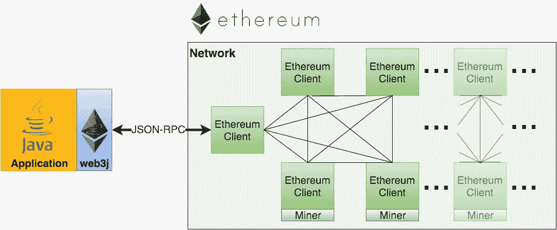

# 如何使用 Web3j 从 Android 读取已部署的智能合同

> 原文：<https://betterprogramming.pub/how-to-read-deployed-smart-contract-from-android-using-web3j-d56b23d616a3>

## 从已部署的合同中读取 ERC-20 令牌数量


由 [Tezos](https://unsplash.com/@tezos?utm_source=unsplash&utm_medium=referral&utm_content=creditCopyText) 在 [Unsplash](https://unsplash.com/s/photos/crypto-wallet?utm_source=unsplash&utm_medium=referral&utm_content=creditCopyText) 上拍摄的照片

区块链技术发展如此之快，以至于即使那些没有听说过加密货币或对其工作一无所知的人也在试图投资和研究该领域。随着加密货币热潮继续在全球蔓延，越来越多的初创公司每天都在开发利用区块链技术的新方法，难怪越来越多的人对投资该领域感兴趣。

在这篇短文中，我们将学习如何使用 [Web3j](https://docs.web3j.io/4.8.7/) 从 Android 应用程序中读取已部署的智能合同。我们不需要智能合同的 ABI 代码。对于 read，我们将使用我们[之前](https://yoorbit.medium.com/create-your-own-erc-20-token-using-solidity-and-hardhat-on-avalanche-test-network-d5239fa7611c)创建的 ERC-20 令牌契约。

## 目录

*   什么是 ERC-20 代币？
*   Web3j 是什么？
*   读取帐户余额

## 什么是 ERC-20 代币？

ERC-20 引入了可替换令牌的标准，换句话说，它们具有一种属性，使得每个令牌与另一个令牌完全相同(在类型和值上)。例如，ERC-20 令牌的行为就像 ETH 一样，这意味着 1 令牌等于并将永远等于所有其他令牌。

ERC-20 令牌必须能够:

*   将代币从一个帐户转移到另一个帐户
*   退还账户余额
*   返回令牌中可用的令牌总数
*   将代币转移到帐户

ERC-20 是用于以太坊智能合约的令牌标准。它规定了以太坊令牌契约必须实现的 6 个公共方法和 3 个公共事件

ERC20 标准令牌的简单实现:


*   `name`返回令牌的名称(例如，Avalanche)
*   `symbol`返回令牌的符号(如 AVAX)
*   `decimals`返回令牌使用的小数位数
*   `totalSupply`返回最初提供给令牌的总数
*   `balanceOf`返回账户余额
*   `transfer`将一定数量的代币转移到某个地址
*   `transferFrom`将一定数量的代币从收款人地址转移到收款人地址
*   从所有者的地址中提取一定数量的代币
*   `allowance`返回可从所有者账户中提取的代币数量
*   `Transfer`，令牌转移时必须触发
*   `Approval`，账户被批准领取一定数量代币时必须触发

## Web3j 是什么？

Web3j 是一个轻量级、高度模块化、反应式、类型安全的 Java 和 Android 库，用于处理智能合约并与以太坊网络上的客户端(节点)集成:



这允许你使用[以太坊](https://www.ethereum.org/)区块链，而不需要为平台编写你自己的集成代码。

[Java 和区块链](https://www.youtube.com/watch?v=ea3miXs_P6Y)演讲概述了区块链、以太坊和 Web3j。

## 阅读合同

由于我们的合同类型为 ERC-20，我们将读取余额的具体地址。当我们使用 OpenZeppelin 预定义的 ERC-20 时，ERC-20 合同所需的所有功能都将存在，我们将使用`balanceOf()`功能。

**1-创建新项目**

使用 Android Studio 的创建窗口创建一个新项目。

当项目编译结束时，将下面的实现添加到`build.gradle (Mocule)`文件并点击`Sync now`按钮。

```
// Web3j
implementation ('org.web3j:core:4.8.7-android')
```

当你读到这篇文章时，版本可能已经改变了。你可以查看 [Web3j GitHub 库](https://github.com/web3j/web3j)获取最新版本。

开始之前，不要忘记添加互联网权限。打开`AndroidManifest.xml`文件，将下面一行添加到`<application`标签上面。

```
<uses-permission android:name="android.permission.INTERNET" />
```

**2-设置扩展和常量**

由于我们阅读合同和具体地址的平衡，我们需要`CONTRACT_ADDRESS`和`WALLET_ADDRESS`。为了连接到链条，我们需要链条的`SOCKET_URL`。我们将使用雪崩富士的套接字 Url，因为我们的 ERC-20 令牌被部署到富士测试网络。您可以使用`Infura`在其他链中创建套接字 URL。

创建`Constants.kt`并复制粘贴下面的代码。不要忘记改变你的变量。

下面的扩展函数接受返回的参数，在我们的情况下，它将是`balance`，转换为 Ether 并返回它。

创建`Extensions.kt`并复制粘贴下面的代码。

**3-设置视图模型**

创建名为`ContractViewModel`的视图模型。在这个视图模型类中，我们需要两个函数。

第一个函数创建一个套接字服务，连接该套接字，创建 Web3j 对象，并返回它。复制下面的代码并粘贴到你的视图模型中。

第二个功能基本上是阅读合同。

在这个函数中，我们将获取 Web3j 对象，创建`Function`对象并发送`EthCall`。

函数对象有 3 个参数。第一个参数是函数名。第二个是`inputParameters`,我们的实度函数的参数列表。第三个是`outputParameters`，我们的实度函数的返回值如下。

我们需要在发送之前对函数进行编码。之后，我们可以使用这些参数创建事务。

复制下面的代码，粘贴到`createWeb3j`函数下面。

如果一切正常，您应该可以在`logcat`中看到`log`。就是这样！阅读一份如此简单的合同。

## 结论

在本文中，我们研究了如何从 Android 应用程序获取帐户余额。为此，我们使用了 Web3j 以太坊 Android 客户端。更多信息参见[正式文件](https://docs.web3j.io/4.8.7/)和[样本代码](https://github.com/Enes-Kayiklik/AndroidWeb3jSample)。

## 有用的链接

*   [什么是加密钱包](https://medium.com/stably-blog/what-is-a-crypto-wallet-7363d3118ce5)
*   [什么是 ERC-20](https://ethereum.org/en/developers/docs/standards/tokens/erc-20/)
*   [Web3j 官方文档](https://docs.web3j.io/4.8.7/)
*   [Web3j GitHub](https://github.com/web3j/web3j)