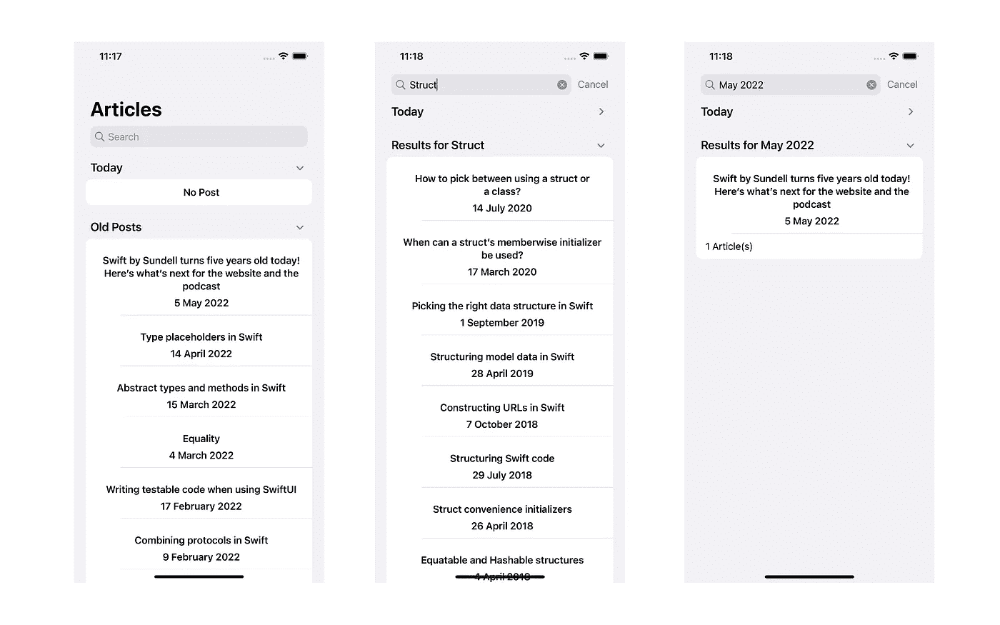

# 如何在 SwiftUI 中阅读网站 iOS 中的数据抓取

> 原文：<https://betterprogramming.pub/how-to-read-website-in-swiftui-c1bb17a06bf8>

## SwiftUI 中的网页抓取变得简单


我们生活在一个普遍使用 API 的世纪。作为移动开发者，我们习惯于对 JSON 数据进行编码和解码，以便通过服务器运行我们的应用程序。可悲的是，并不是所有的网站/服务都提供 API。有时候，你需要阅读网站来得到你想要的。我们称之为数据搜集。它包括在过滤 CSS 选择器的帮助下获取页面上的数据。我们如何在 SwiftUI 应用程序中获取数据？

# 图书馆

为此，我们需要一个能够正确解析和读取 HTML 主体的工具。我选择了 [SwiftSoup](https://github.com/scinfu/SwiftSoup) ，一个 100% Swift 的库，来做这个。您可以将它添加为 CocoaPods pod 或 Swift 包，因为这是我的优先选择。

# 项目

至于今天的例子，我想创建一个简单的博客阅读器应用程序来解析 [swiftbysundell.com 的](https://www.swiftbysundell.com)文章。让我们通过右键单击并查看其代码来研究它的 HTML 方案。

我们关心的是，所有的文章都是在`<ul class=”item-list>`里面总结的，它们都有`<article>`的主体。在一篇文章中，我们有一个`<H1>`作为标题，一个`<span class=”date”>`中的日期和一个带有`<a href=””>`的文章的 URL。我们需要丢弃这些数据来创建我们的文章模型。

# 构建应用程序

首先，我创建了一个简单的结构来保存我们的数据。我将使它可识别和可散列，以正确地与 SwiftUI 的 List & ForEach 视图一起工作。

# 创建视图

接下来，我将创建视图。为此，我将创建一个可搜索列表，当我点按单元格时，它会在 Safari 中导航到文章页面。

首先，我创建一个结果数组，根据搜索条件保存我们的文章。搜索不仅会查找文章的标题，还会查找它的日期。

之后，我将创建一个显示页眉和页脚的节结构。今天的帖子和以前的帖子将有两种结构。

接下来，我将创建一个简单的获取函数，从我们的`dataModel`中获取数据。

`ArticleCell`是一个简单的子视图，我将在其中显示数据。

我还写了一些日期扩展，帮助我从旧帖子中过滤今天的帖子，并按照我想要的方式格式化日期。

# 编写数据服务

现在我们需要实现我们的数据服务。我将创建一个带有名为`articleList`的`Published`变量的`ObservableObject`和一个我将使用的`baseURL`。

我将编写一个`fetchArticles`函数

*   擦除数组。它被填满了，
*   以字符串形式获取整个网站，
*   并在 Swiftsoup 的帮助下将字符串解析为 HTML。

我们将使用 do catch 块执行第二步和第三步，因为这些操作可能会引发错误。

```
let articles = try document.getElementsByClass(“item-list”).select(“article”)
```

这将引导我们进入网站的文章阵列。注意会有一个数组用`document.getElementsByClass` 调用，所以我们会做一个 for 循环来分别对待每一个数据。

```
let title = try article.select(“a”).first()?.text(trimAndNormaliseWhitespace: true) ?? “”
```

这将选择标签并获取其中没有任何空格的文本(如果有的话)。

```
**let** url = **try** baseURL.appendingPathComponent(article.select(“a”).attr(“href”))
```

这将得到我们需要的 URL。

```
**let** dateString = **try** article.select(“div”).select(“span”).text().replacingOccurrences(of: “Published on “, with: “”).replacingOccurrences(of: “Remastered on “, with: “”).replacingOccurrences(of: “Answered on “, with: “”).trimmingCharacters(in: .whitespacesAndNewlines)
```

这个长代码将获取字符串形式的数据。因为它可能包含一些文本，我们需要将它们去掉，并清除任何不可见的空白。

我也将这个字符串转换成日期，因此我应用了`DateFormatter`。

```
**let** formatter = DateFormatter(dateFormat: “dd MMM yyyy”)**let** date = Calendar.current.startOfDay(for: formatter.date(from: dateString) ?? Date.now)
```

最后，我将创建我的数据并将其添加到模型中。

```
**let** post = Article(title: title, url: url, publishDate: date)**self**.articleList.append(post)
```

服务类将如下所示。

就是这样。我们的应用程序运行良好。可以查看整个项目的[回购](https://github.com/egrimo/WebDataScraper)。



结果呢

今天，您将学习如何废弃数据来创建数据源。您可以使用这种技术从网站获取数据或创建您的博客应用程序。有什么问题吗？欢迎在下面的评论区提问。祝你有愉快的一天。