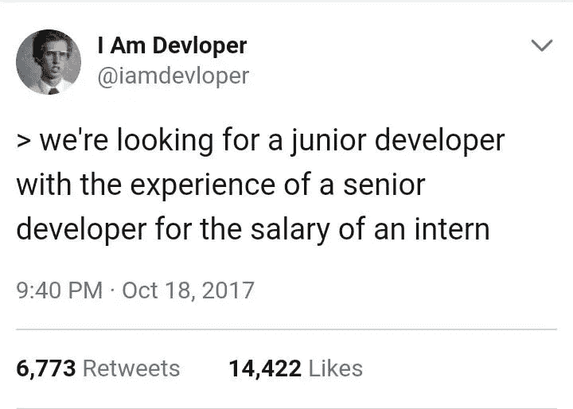

# 如何识别垃圾编程招聘启事

> 原文：<https://betterprogramming.pub/how-to-recognize-a-garbage-programming-job-posting-d362287aec0a>

## 永远不要接受“我们会根据经验付给你钱”

注意:这篇文章的重点并不是对任何人都不敏感，而是让人们意识到落入下面这些求职陷阱是多么容易。

欢迎来到 2020 程序员求职。通过[准备](https://medium.com/javascript-in-plain-english/the-best-2020-resources-for-your-coding-interview-preparation-eb7513dcf974)、[拒绝](https://medium.com/better-programming/how-to-get-over-your-fear-of-rejection-and-apply-for-the-damn-job-already-ea93037e94ca)、[重影人力资源](https://www.hrmonline.com.au/section/featured/ghosting-hr-problem/)，这将是一个漫长的旅程。此外，你必须首先找到公平的工作岗位，以添加到你的甲板上。就这一点而言，对你可能遇到的情况和如何避开可能的垃圾工作有一个大致的了解是特别好的。

让我们从我们的列表开始。

# 初级/实习生角色的丰富经验👨‍🦳

你有“丰富的 JavaScript 和框架经验”和四年多的专业编码经验吗？很好，很多公司都准备雇佣符合这些要求的“初级”开发人员。本质上，你将不得不作为一名经验丰富的开发人员工作，有时甚至是一名实习生的工资，因为“这是你职业生涯中的一条全新的道路。”

在我听来，这一切就像那种“找工作获得经验，但有经验才能找到工作”的老一套模式。

# 成为所有现存工艺的大师

对你来说，找到一份需要 10 项或更多复杂技能的工作并不罕见，这让你成为一个你能想到的所有可能手艺的大师。大致是这样的:

*   JavaScript +框架(Angular，React，Vue)
*   SQL、MySQL 和 GraphQL
*   HTML 和 CSS
*   引导框架
*   移动开发框架
*   SCSS。
*   质量保证测试
*   Jquery
*   WordPress 管理
*   基本客户服务
*   Adobe Photoshop
*   Adobe Indesign
*   Adobe Illustrator
*   用户界面和 UX 体验
*   DevOps skills (Docker，Jenkins)

# 极低的薪水或太宽的范围

不需要解释。我想总会有公司准备少付员工工资。他们认为，由于市场已经饱和，他们可以很容易地降低工资范围。你甚至会发现其中的一些范围相当宽，比如:“需要初级全栈开发人员——4.5 万到 9.5 万美元。”

说真的，是 45K 还是 95K？中间的东西？为什么收入会有如此大的差异？

# 一种让你困惑的通用语言

这就是我最讨厌这种垃圾招聘信息的地方:令人困惑、毫无意义、华而不实的语言。

*“我们是一家以客户为中心的公司，遵循与系统一致的程序来开发面向客户的解决方案。你准备好加入我们这个大家庭，成为一名增值的、基于结果的开发者了吗？”*

甚至在福利部分，你有时也会发现这样的散文:

*   *打赏的好东西*(是什么？)
*   *一个动态的环境*(什么让它动态？)
*   *一个可以让你成长的地方*(具体怎么说？)
*   *每天要学的新东西*

# 结论

你曾经有过关于招聘信息或人力资源的糟糕经历吗？欢迎在评论中分享。同时，感谢你的阅读，不要忘记总是[关注你自己和你的职业](https://hackernoon.com/why-i-hate-code-challenges-90221c9ab747)，避免上述陷阱。

# 资源

*   [2020 编码面试备考指南](https://medium.com/javascript-in-plain-english/the-best-2020-resources-for-your-coding-interview-preparation-eb7513dcf974)。
*   [是的，HR 可能会给你做鬼](https://www.hrmonline.com.au/section/featured/ghosting-hr-problem/)。
*   [编码面试吸](https://hackernoon.com/why-i-hate-code-challenges-90221c9ab747)。
*   [为什么最好的开发者经常说不](https://hackernoon.com/why-i-hate-code-challenges-90221c9ab747)。