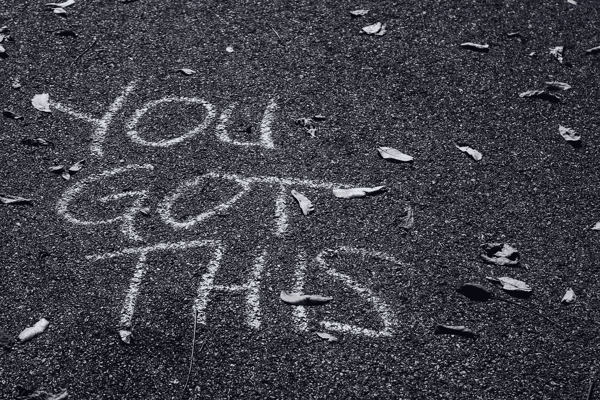
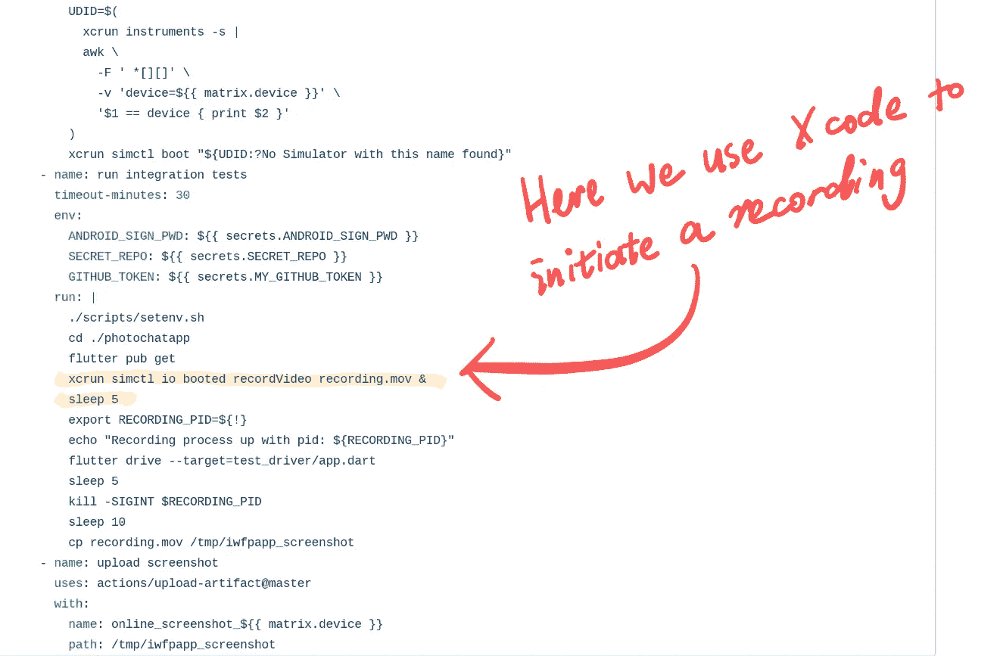
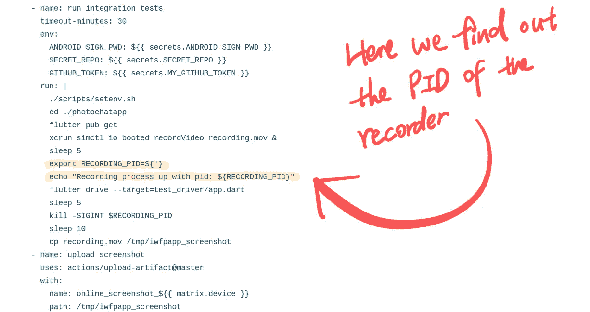
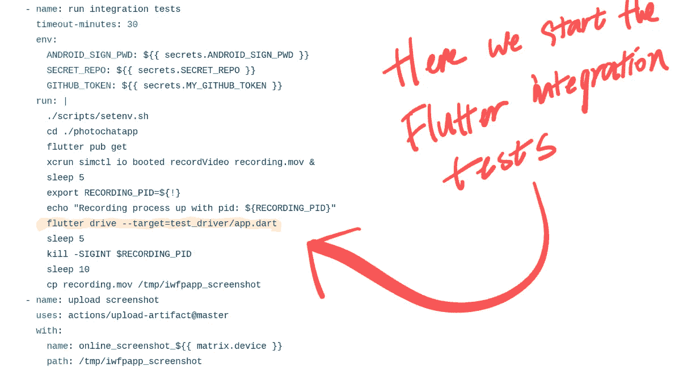
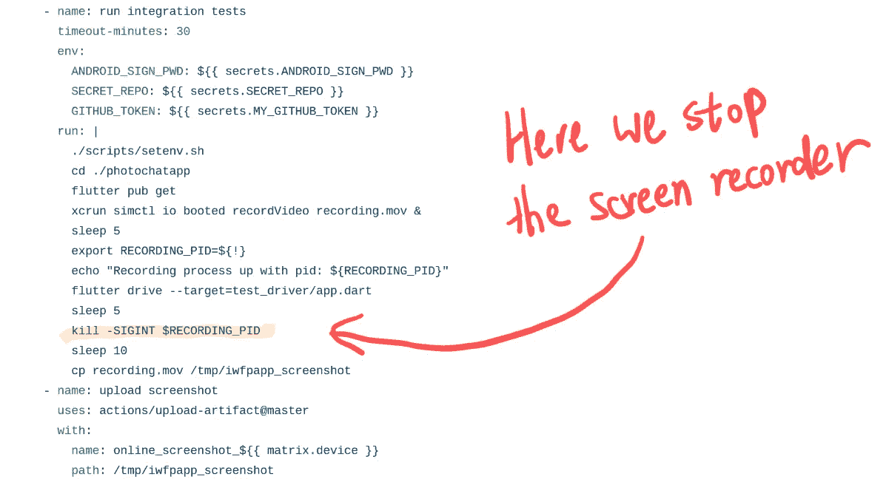
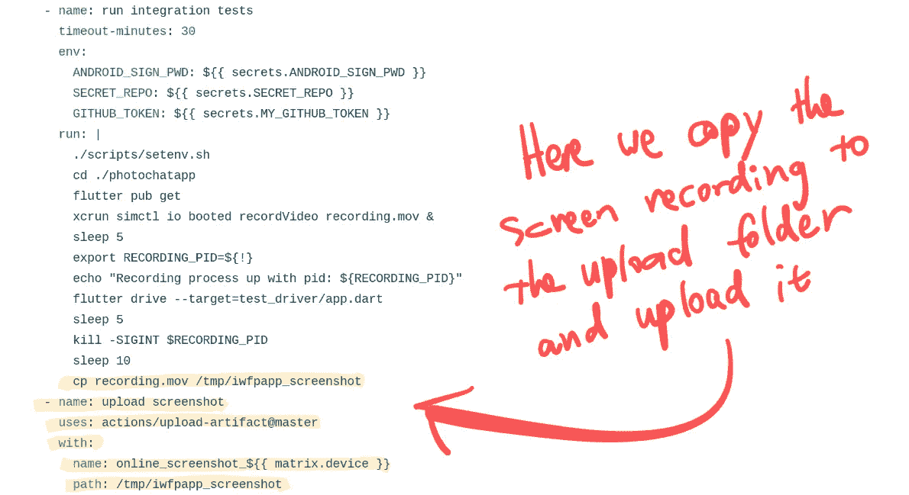
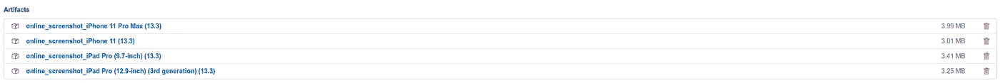
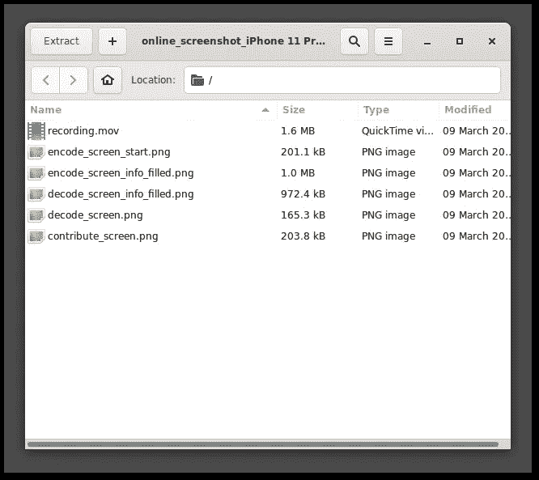

# 如何用 GitHub 动作记录颤振集成测试

> 原文：<https://betterprogramming.pub/how-to-record-flutter-integration-tests-with-github-actions-1ca670eff94a>

## 满怀信心地合并每个拉取请求

由[悉尼·瑞伊](https://unsplash.com/@srz?utm_source=unsplash&utm_medium=referral&utm_content=creditCopyText)在 [Unsplash](https://unsplash.com/s/photos/confident?utm_source=unsplash&utm_medium=referral&utm_content=creditCopyText) 拍摄的照片。

# 当截图不够时，我们需要屏幕录像

如何有效保持 UI 的一致性一直是移动开发中的热门话题。

在我之前的一篇文章中，我讨论了如何用 GitHub 操作运行集成测试和上传截图:

 [## 使用 GitHub 操作端到端监控您的 Flutter 应用程序的健康状况

### 详细的指南

medium.com](https://medium.com/better-programming/monitor-your-flutter-apps-health-end-to-end-with-github-actions-8a9fb1889c6a) 

然而，随着应用程序越来越复杂，截图无法捕捉所有的回归。相反，屏幕录制更可取。

让我们在我之前的文章(Flutter integrations test+screens)的基础上，将屏幕录像添加到我们的军火库中。下面先睹为快(对于每个拉取请求，您将获得这样的屏幕记录):

如果你想直接跳到一个真实的 Flutter 项目中的完整实现，请查看 [Mini Donkey](https://medium.com/minidonkey101) 的知识库(本文中的所有代码都来自这里):

 [## 天昊 95/照片

### 迷你驴携带加密(AES)和隐写术(的技术)安全和秘密的私人信息

github.com](https://github.com/tianhaoz95/photochat) 

# 步骤 1:启动屏幕记录器

要启动屏幕记录器，我们可以从 Xcode 使用 CLI:

图片来源:[工作流程配置](https://github.com/tianhaoz95/photochat/blob/master/.github/workflows/thor.yml#L86-L104)来自[迷你驴](https://medium.com/minidonkey101)。

由于 Xcode 中的一个“bug ”,在记录器之后立即开始测试会导致一个空的记录。我们需要添加一个`sleep`来确保这种情况不会发生。

# 步骤 2:检索屏幕记录器的 PID

屏幕记录器启动并运行后，我们想要检索它的进程 ID，以便我们可以在最后终止它。否则，我们的操作将永远运行，GitHub 将在六个小时后终止它。

图片来源:[工作流程配置](https://github.com/tianhaoz95/photochat/blob/master/.github/workflows/thor.yml#L86-L104)来自[迷你驴](https://medium.com/minidonkey101)。

# 步骤 3:运行颤振综合测试

在屏幕记录器完全准备好之后，我们可以开始颤振综合试验:

图片来源:[工作流程配置](https://github.com/tianhaoz95/photochat/blob/master/.github/workflows/thor.yml#L86-L104)来自[迷你驴](https://medium.com/minidonkey101)。

# 步骤 4:终止屏幕记录器并收集记录

颤振综合试验完成后，我们需要终止屏幕记录器，它在终止时自动保存屏幕记录:

图片来源:[工作流程配置](https://github.com/tianhaoz95/photochat/blob/master/.github/workflows/thor.yml#L86-L104)来自[迷你驴](https://medium.com/minidonkey101)。

为了确保在容器销毁之前保存屏幕记录，我在`kill`命令下添加了一个`sleep`。

# 步骤 5:将记录作为工件上传

生成屏幕记录后，我们现在可以将其作为构建工件上传，供其他开发人员查看:

图片来源:[工作流程配置](https://github.com/tianhaoz95/photochat/blob/master/.github/workflows/thor.yml#L86-L104)来自[迷你驴](https://medium.com/minidonkey101)。

一旦 GitHub Actions 工作流配置签入，您将获得每个 pull 请求的一组工件:

屏幕录制位于每个设备的`build artifact`包装内:

`recording.mov`是你在这篇文章开头看到的屏幕记录。

每一次 UI 更改(即使是最细微的更改)都只需点击一下鼠标就能完成，因此我们现在可以真正放心地合并拉请求了。