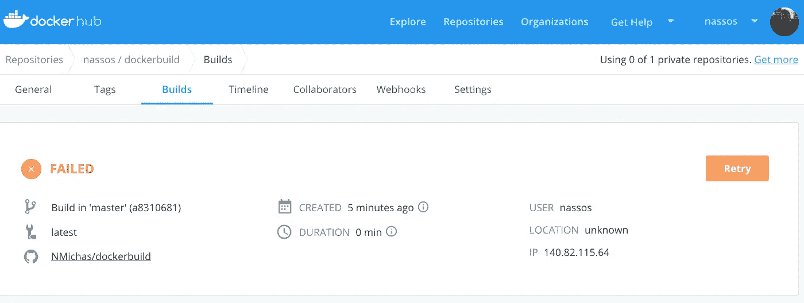
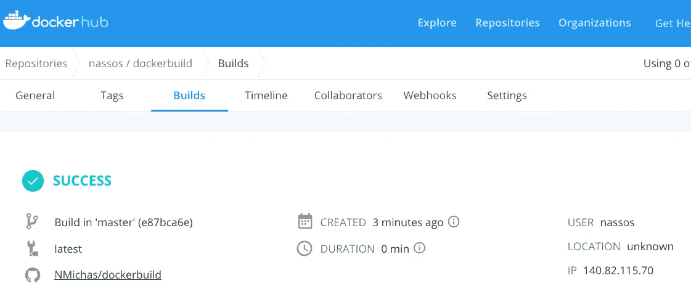
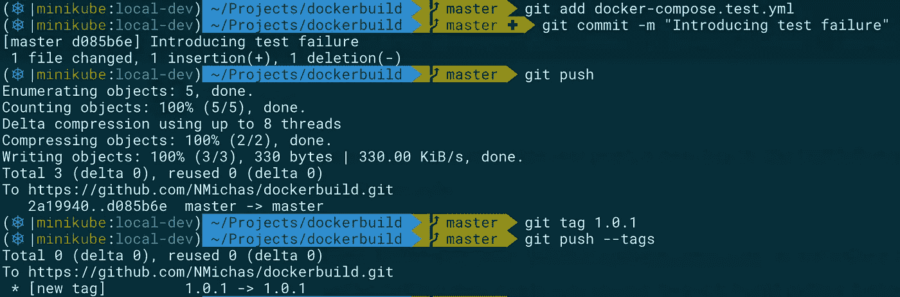
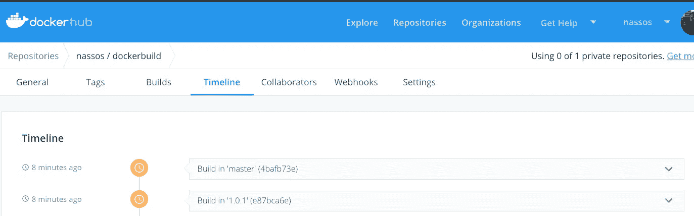
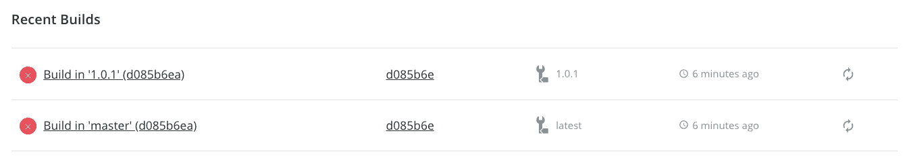
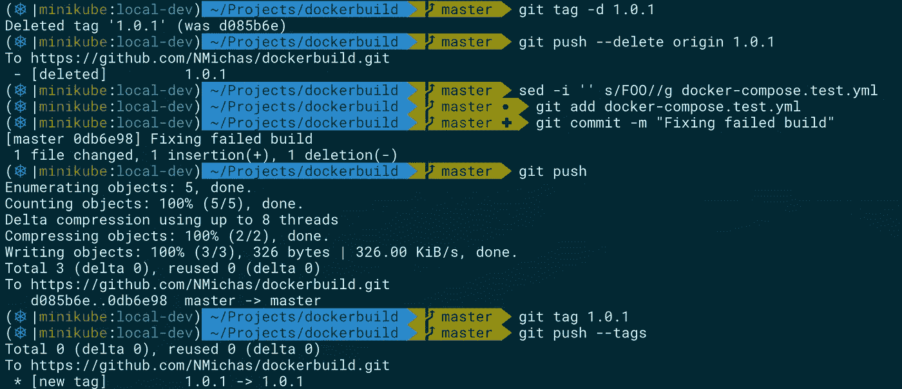
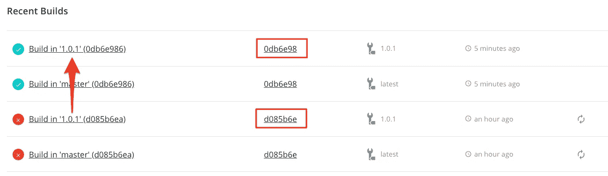
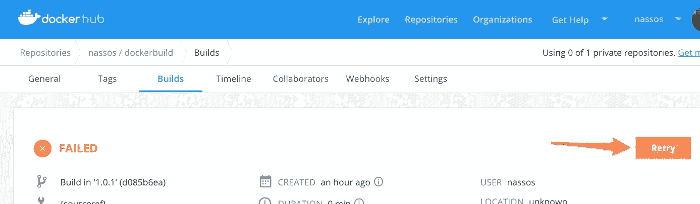
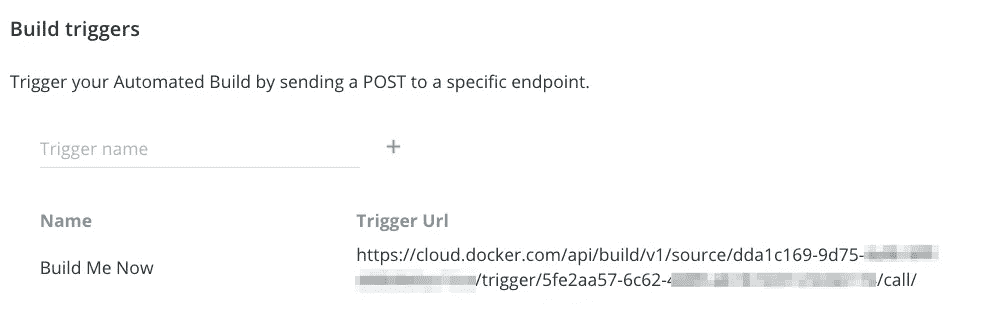
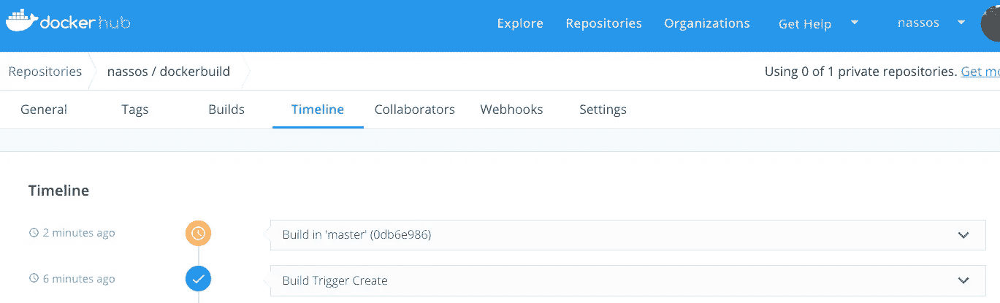

# 如何从失败的自动化 Docker Hub 构建中恢复

> 原文：<https://betterprogramming.pub/how-to-recover-from-a-failed-automated-docker-hub-build-8b6c1cc3d7d4>

## 自动化构建三部分系列的最后一部分


照片由[雅各布·欧文斯](https://unsplash.com/@jakobowens1?utm_source=medium&utm_medium=referral)在 [Unsplash](https://unsplash.com?utm_source=medium&utm_medium=referral) 上拍摄

在本系列的前两篇文章中，我们看到了如何在 GitHub 上自动构建 Docker 映像，以及如何在 Docker Hub 上测试自动构建。在这最后一篇文章中，我们将看到如何从测试失败的自动化构建中恢复。

# 使主分支上的构建失败

继续我们在“[如何在 Docker Hub](https://medium.com/@NMichas/how-to-test-your-automated-builds-on-docker-hub-e40879f35d1e) *上测试您的自动化构建”中停止的地方，“*让我们使用我们的`docker-compose.test.yml`文件并让它失败。我们可以通过简单地搞乱测试命令来引入失败条件，将它改为调用一个不存在的脚本(即`helloFOO`):

```
sut:
  build: .
  command: /helloFOO
```

继续添加并推送该文件。请记住，我们正在推进主分支，因此我们希望 Docker Hub 中的一个构建会自动触发主标签。事实上，几分钟后我们可以看到这个构建失败了:



由于自动化测试失败，构建失败

由于我们直接在主分支上工作，要修复这个错误，我们只需在`docker-compose.test.yml`上纠正上述修改，然后重新推送。几分钟后…



更正以前失败的版本

# 使用标签时从故障中恢复

还记得在“[如何在 Docker Hub](https://medium.com/@NMichas/how-to-test-your-automated-builds-on-docker-hub-e40879f35d1e) 上测试您的自动化构建”中，我们创建了两个不同的构建规则吗？一个是针对主分支的，另一个是针对每次我们在 GitHub repo 中推送新标签的。让我们探索后一个规则。

首先，重新修改您的`docker-compose.test.yml`来引入错误的脚本调用，这使得我们之前的主分支构建失败。然后，引入并推送新标签 1.0.1:



标记图像



Docker Hub 构建您的主分支机构以及您的 1.0.1 标签

正如所料，上面的两个构建都失败了:



失败的构建

纠正错误的修改并推入母版将修复母版图像，但是您的标记图像呢？嗯，事情可能会变得棘手。您看，版本控制系统的要点——特别是像 Git 这样的分布式系统——是您可以在本地存储库中自由地(几乎)做任何您想做的事情。它只是您自己的本地副本，即使您完全搞砸了，您也可以恢复到以前的提交，重新应用隐藏的代码，或者精挑细选您认为最新的代码视图。

也就是说，直到你推。然后，您自己的代码视图就变成了同一个存储库的所有其他用户的公共财产，Git 现在包含了您在存储库历史上的精彩贡献。那么，如何着手修复这个失败的构建呢？有两种方法。

## 制作新版本(好方法)

像每一个优秀的 Git 公民一样，您甚至不会考虑修改 Git 存储库的历史。您按照“Git 中的东西，留在 Git 中”的格言生活和呼吸，因此您唯一的选择是发布一个新的版本。在这种情况下，事情对您来说非常简单:纠正错误并创建一个新的 1.0.2 标签。如上所述，一旦推送，Docker Hub 将触发一个构建，几分钟后您就可以使用您的 1.0.2 映像了。

## 移除和重新引入标签(丑陋的方式)

你花了世界上所有的时间向你的客户解释我们需要推 1.0.2，但是客户坚持说:“我们的 FOO 政策不允许我们有版本差距。下一个版本**必须是 1.0.1。好吧，至少你尽力了。**

Git 允许您从本地存储库和远程存储库中删除标签。因为这是一个紧急情况，我们会这样做。但是，请记住，由于您已经推送了您的原始标记，存储库的其他用户可能已经使用或看到了它，并且他们现在可能会对标记的底层提交 ID 发生变化感到困惑(或恼怒)。在这种情况下，在移动标签之前，最好先与团队的其他成员交流您的意图。

所以，让我们删除标签，修复错误，重新添加标签，然后按:



重新引入标签

几分钟后…



您新推出的 1.0.1 映像

您的新 1.0.1 版本已经准备就绪，构建成功。注意到同一个版本/标签是如何引用不同的提交 ID 的吗？如果可能的话，尽量避免。

# 那个重试按钮

在上面的一些截图中，您可能已经注意到，当 Docker Hub 构建失败时，会提供一个重试按钮:



重试以前失败的构建

重试按钮可以让你重新触发 Docker Hub 构建。但是，这里应该注意的是，重试将针对失败作业的原始提交 ID 进行。如果失败的原因是代码中的逻辑错误，构建将不可避免地再次失败，因此重试这些失败的构建没有任何意义。另一方面，如果您 100%确定失败不是由于您自己的代码，但是可能 Docker Hub 上发生了一些奇怪的事情，一些依赖项暂时不可用，等等。，您可以通过重试来快速恢复失败的生成。

# 基于 HTTPS 的触发器

最后一件事，不一定与恢复有关，但通常与触发构建有关:Docker Hub 允许您创建 HTTPS 链接，当被调用时，会触发构建。您可以在 Docker Hub 存储库中的 Builds > Configure Automated Builds > Build triggers 下定义构建触发器:



通过 HTTPS 触发构建

您可以通过执行以下命令来触发上面的构建:

```
curl -v -X POST [https://cloud.docker.com/api/build/v1/source/dda1c169-9d75-xxxx-xxxx-xxxxxxxxxxxx/trigger/5fe2aa57-6c62-xxxx-xxxx-xxxxxxxxxxxx/call](https://cloud.docker.com/api/build/v1/source/dda1c169-9d75-4af8-9fff-e88b8eba15ce/trigger/5fe2aa57-6c62-4489-a618-920123cb6174/call/)
```



通过 HTTPS 触发构建

# 本系列的其他文章

本文是 Docker Hub 和自动化构建系列的一部分。该系列的其他文章有[当你推 GitHub](https://medium.com/better-programming/build-your-docker-images-automatically-when-you-push-on-github-18e80ece76af) 时自动构建你的 Docker 映像和[如何在 Docker Hub 上测试你的自动化构建](https://medium.com/better-programming/how-to-test-your-automated-builds-on-docker-hub-e40879f35d1e)。