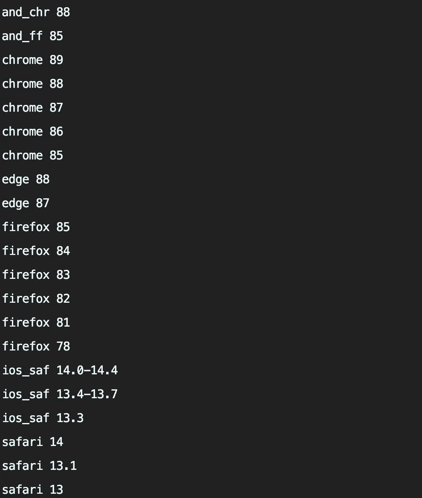
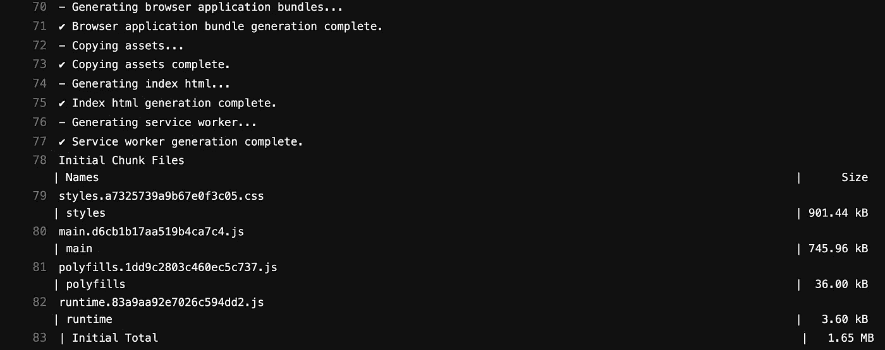

# 如何通过禁用差动加载来减少角度展开时间

> 原文：<https://betterprogramming.pub/how-to-reduce-angular-deployment-times-by-disabling-differential-loading-9215e2702bfb>

## 部署 Angular 应用程序时避免不必要的工作


由[泰勒维克](https://unsplash.com/@tvick?utm_source=medium&utm_medium=referral)在 [Unsplash](https://unsplash.com?utm_source=medium&utm_medium=referral) 上拍摄的照片。

如今，软件的运输比过去更频繁了。无论是大公司还是小公司都已经意识到持续部署会带来很多好处，比如更快的反馈循环。多亏了像 Netlify 这样的平台，web 应用可以通过一个全球 CDN 来运输和服务，而不需要太多的配置。

妨碍持续部署的一个因素是长时间的部署。部署需要很长时间的原因有很多:

*   如果部署过程中涉及大量手动步骤，部署可能会很麻烦。
*   部署管道中的不稳定性(例如不稳定的端到端测试)会导致部署失败或严重延迟。
*   部署通常涉及需要预先完成的多个步骤(例如，生产就绪构建、运行所有测试、部署到生产前，以及最终到生产)。

让我们把重点放在后一点上。由于有了 Angular CLI，Angular 应用程序很容易部署。一个简单的命令(`[ng build --prod](https://angular.io/cli/build)`)运行我们的 Angular 应用程序的完整构建。我们可以将生成的文件上传到托管平台/CDN，或者使用`[ng deploy](https://angular.io/cli/deploy)`通过一个命令来部署我们的文件。

对于现有的 Angular 应用程序，我们决定完全忽略对 IE11 等传统浏览器的支持。想法很简单:构建的代码越少，构建 Angular 应用程序所需的时间就越少。默认情况下，Angular 使用一种叫做[差分加载](https://angular.io/guide/deployment#differential-loading)的策略。通过差异加载，我们可以实现高度的浏览器兼容性。

不过，这种方法也有缺点。因为我们基本上构建每个包两次(一次用于现代浏览器，一次用于遗留浏览器)，这对应用程序的构建时间有明显的影响。此外，我们在 CI 平台(GitLab CI 或 GitHub Actions)上浪费了宝贵的管道时间。

您可能只需要支持相当现代的浏览器(如果您需要支持 IE11 这样的浏览器，请查看我的文章[关于在 Angular 应用程序中修复常见的 IE11 问题](/how-to-fix-your-angular-app-when-its-not-working-in-ie11-eb24cb6d9920))。在这种情况下，我们可以通过加快构建过程从而减少部署时间来节省宝贵的时间。

在本文中，我将向您展示如何在 Angular 项目中禁用差异加载，以加快构建和部署。

# 如何在角度应用中禁用差分加载

*   调整`browserslist`以仅考虑我们实际想要支持的 web 浏览器。
*   确保我们已经在`tsconfig.json`中将`"target": "es2015"`指定为目标。

如您所见，禁用差异加载只涉及几个步骤。让我们看一下代码。首先，我们调整`browserslist`文件，如果您使用 Angular CLI 创建项目，您应该已经有了这个文件:

运行`npx browserslist`将创建以下输出:



没有 IE11，没有 Opera Mini，没有传统的微软 Edge。看起来我们只是针对现代浏览器，正如我们所希望的那样。您可以随意改变这些值，并根据自己的需要进行调整。

接下来，我们将`tsconfig.json`调整为只针对现代浏览器:

# 禁用差异加载会有什么不同？

我们来看看上面的改动效果。首先，我们来看看现状。完整的 AOT 构建在 GitLab CI 中花费了大约 5.8 分钟，在 Netlify 中花费了大约 4.4 分钟。您可以在构建日志中看到生成了 ES2015 和 ES5 捆绑包:


接下来，我们将看看我们的更改如何影响构建和部署时间。完整的 AOT 构建现在在 GitLab CI 中只需要大约 3.5 分钟，在 Netlify 中只需要大约 2.5 分钟。您可以在构建日志中看到，没有生成 ES5 包:



您可以进一步验证[您的代码是否针对支持 ES2015](/check-your-javascript-bundles-for-browser-support-d769c1fca4c) 的浏览器。我们可以利用 es-check 这样的库来检查生成的 JavaScript 包:

```
# should succeed
npx es-check es2015 ./your-dist-folder/*.js --verbose
# should fail
npx es-check es5 ./your-dist-folder/*.js --verbose
```

# 结论

感谢您阅读这篇关于通过禁用差异加载来加速角度部署的短文。在我的例子中，我的 Angular 应用程序的部署时间有了显著的改进。只要不需要支持遗留浏览器，这就是加速 Angular 应用程序构建和部署的一种方式。

你还知道其他加快 Angular 应用程序部署的技巧吗？请在评论中告诉我。