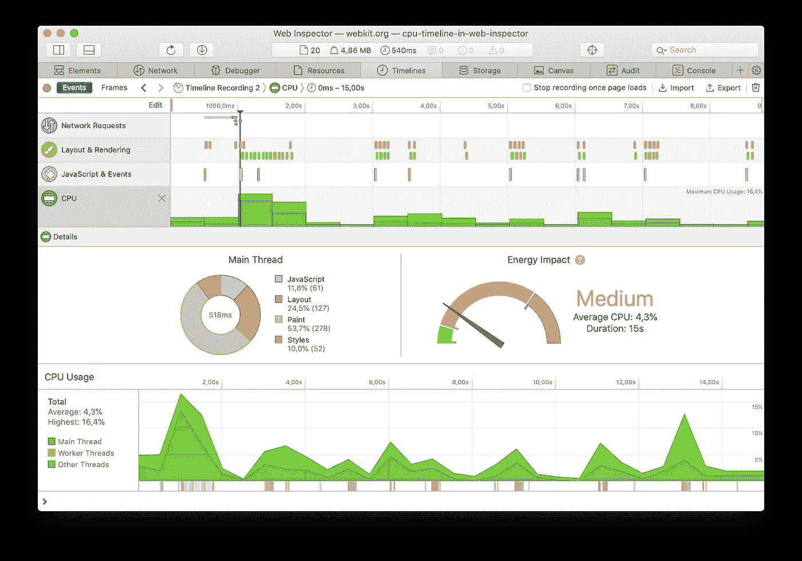
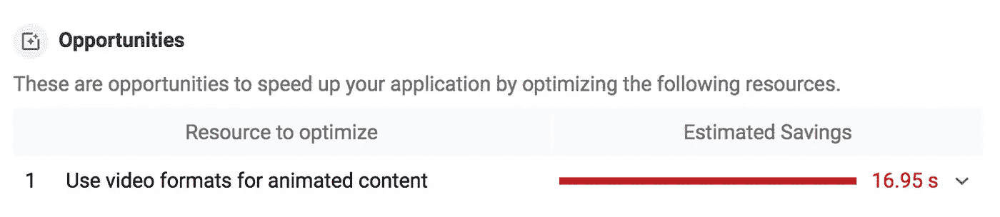

# 作为全栈开发人员，减少碳足迹的 12 种方法

> 原文：<https://betterprogramming.pub/how-to-reduce-co2-emission-as-a-full-stack-developer-bc50b6a1cd00>

## 最大限度减少二氧化碳排放

诺亚·布舍尔在 [Unsplash](https://unsplash.com?utm_source=medium&utm_medium=referral) 上的照片

最近，我们在[迪纳摩](https://dyna.mo/?utm_source=blog_ricardo_dantas&utm_campaign=sustainability&utm_medium=social&utm_term=sustainability&utm_content=sustainability)做了一个关于数字可持续性的有趣演示，这让我思考作为一名全栈开发人员，我可以做些什么来减少我的日常工作中的生态足迹。这启发了我写这篇文章。

> 定义生态足迹最简单的方法是称之为人类活动的影响，用生产消费产品和吸收产生的废物所需的生物生产用地和水的面积来衡量。更简单地说，它是生产支持特定生活方式所需的商品和服务所需的环境量。
> 
> — [世界自然基金会](https://wwf.panda.org/discover/knowledge_hub/teacher_resources/webfieldtrips/ecological_balance/eco_footprint/)

你知道 IT 行业的温室气体排放量预计到 2040 年将达到全球排放量的 14%吗？如果互联网是一个国家，[它将是第七大污染国](https://www.sustainablewebmanifesto.com/#citation)？令人印象深刻，不是吗？

回想我在职业生涯中优化 web 应用程序、电子商务和门户项目的所有方法，我得出的结论是，应用程序对用户的加载越轻越快，应用程序的能耗就越低。所以这里有一些你可以在下一个项目中使用的技巧。

# 措施

你可以使用像 WebsiteCarbon.com 这样的工具来衡量你的网站的环保程度。另外，你可以使用 DevTools 上的 [Safari 的 light house](https://webkit.org/blog/8970/how-web-content-can-affect-power-usage/)来测量它的能量影响。然后，使用以下提示制定一个攻击计划来解决可能出现的问题。

# 选择可再生能源主机提供商

主机提供商和数据中心可能看起来不像是用了很多电力，但他们有数千台计算机来处理数据，房间变得非常温暖。他们需要保持空气凉爽，所以空调系统是这个行业的必需品，这些系统消耗大量的能源。

绿色网络基金会(Green Web Foundation)正在做一项了不起的工作，它(T2)提供了一份世界上最环保的主机提供商名单(T3)。考虑为你的下一个项目挑选一个。

# 当您不使用守护程序和服务器时，请停止它们

当开发人员编写应用程序时，他们通常需要在本地机器上运行几个进程，以便测试和避免应用程序的实时版本崩溃。然而，最终他们会切换项目，忘记停止一些后台进程。因此，它们会一直运行下去，或者直到有人注意到内存或处理的高消耗。

通过停止未使用的服务器和后台进程，您可以大幅(取决于进程的类型)减少内存、处理和功耗。

# 使用黑暗模式

如果你使用的是支持深色模式的操作系统，或者你的应用程序允许你切换主题以使用深色，请考虑使用它。深色对眼睛[更好](https://www.wired.com/story/give-yourself-to-dark-mode-side/)，可以节省智能手机和笔记本电脑的电池和能源。

# 关掉你的相机

在这些困难时期，每个人都在使用 Google Meets、MS Teams 和 Zoom 等工具进行在线会议。这种行为已经成为我们日常生活的一部分。

研究显示，一小时的视频通话或网飞流媒体会排放 150 到 1000 克的二氧化碳。通过在视频通话中关闭摄像头，你可以减少 96%的碳足迹。

# 优化字体

通过优化您的字体文件，您可以减少高达 97%的文件大小。

*   使用现代网络字体格式，如 WOFF 和 WOFF2。与 TTF、OFT 和 SVG 文件格式相比，这些格式使用更高的压缩方法。
*   通过预加载所需的字体，让浏览器有最好的机会获得正确的字体。
*   将字体分成子集，只包含需要的字符。

# 使用离用户近的 CDN 和服务器

使用离用户更近的 cdn 和服务器将减少电信网络的流量，这将大大降低基础设施的能耗。

# 使用 AMP(加速移动页面)

AMP 通过删除不必要的代码和文件重量，使内容在移动设备上加载更快，呈现原始网页的极简版本。

# 使用静态网页

使用像 WordPress 这样的服务器端渲染解决方案，每当有人试图加载一个页面时，就会处理信息并发送给用户。这会导致服务器消耗更多的能量。您可以使用[静态生成器工具](https://jamstack.org/generators/)来帮助您分发不需要在每次浏览量中从数据库获取的内容。您还可以通过在客户端使用缓存来做得更好。

# 不要使用 gif

GIF 动画很有趣，但是它们会创建非常大的文件，消耗大量的流量和能量。好消息是，您可以用`<video>`元素替换它们。

*注意:* `*<source>*` *标签的顺序很重要！首先指定 WebM* `*<source>*` *否则浏览器会跳过它而播放 mp4 版本。*

使用 DevTools 中的 Lighthouse 选项卡来检查您的网站上是否有可以转换为视频的 gif。如果您有任何可以转换的 gif，您应该会在报告中看到“为动画内容使用视频格式”的建议。

# 优化图像

图片是页面权重的最大贡献者。您使用的图像文件越大，需要传输的数据就越多，消耗的能量也就越多。你可以用一些技巧和工具来解决这个问题。

## 使用 WebP 格式

WebP 图像比 JPEG 和 PNG 小，通常文件大小减少 25-35%。这减小了页面大小并提高了性能。使用下面的方法，即使浏览器不支持 WebP，也能确保它能呈现正确的图像。

## 延迟加载图像

你可以自然地做到！最流行的 Chromium 浏览器(Chrome、Edge、Opera)和 Firefox 支持 image 元素上的`loading`属性。Safari [的实现正在进行](https://bugs.webkit.org/show_bug.cgi?id=200764)。您也可以在[caniuse.com](https://caniuse.com/#feat=loading-lazy-attr)上查看该功能的可用性。不支持`loading`属性的浏览器可以简单地忽略它而不会产生副作用。

在 [MDN 文档](https://developer.mozilla.org/en-US/docs/Web/Performance/Lazy_loading)中查看更多关于延迟加载属性的详细信息。

## 图像优化工具

可以使用 [TinyPNG](https://tinypng.com/) 、 [TinyJPG](https://tinyjpg.com/) 、 [SvgHero](https://svghero.app/?utm_source=blog_ricardo_dantas&utm_campaign=sustainability&utm_medium=social&utm_term=sustainability&utm_content=sustainability) 、 [ShortPixel](https://shortpixel.com/) 等工具。你也可以使用像 [image-webpack-loader](https://github.com/tcoopman/image-webpack-loader) 、 [gulp-imagemin](https://github.com/sindresorhus/gulp-imagemin) 或者 [grunt-contrib-imagemin](https://github.com/gruntjs/grunt-contrib-imagemin) 这样的包。

# 停止使用谷歌搜索

艺术家 [**乔安娜·莫尔**创造了一个项目](http://www.janavirgin.com/CO2/)，在这个项目中，用户可以通过谷歌搜索知道自从你访问网站以来，排放了多少公斤的二氧化碳。

谷歌有一个不错的替代品: [Ecosia](https://www.ecosia.org/) 搜索引擎！Ecosia 不仅是一个生态友好的搜索引擎，也是一个隐私友好的搜索引擎。

# 结论

减少技术的足迹不仅仅是减少能源消耗，这是一个双赢的游戏！

*   公司可以优化他们的资源消耗和成本
*   用户对更快更轻的应用有更好的体验
*   环境污染将会大大减少。

你知道更多让它更加环保的小技巧吗？欢迎在评论区分享！

# 订婚

 [## 家庭——气候行动。技术

### 在 ClimateAction.tech，我们一起开会、讨论、学习和采取气候行动。我们希望您能加入我们的……

climateaction.tech](https://climateaction.tech)  [## 可持续网络宣言

### 我们都分享和使用网络，就像我们都分享和生活在这个星球上一样。这个宣言是一个公开的宣言…

www.sustainablewebmanifesto.com](https://www.sustainablewebmanifesto.com) 

# 资源

 [## 开放式可持续技术

### 维持稳定气候、能源供应和重要自然资源的开放技术项目

opensustain.tech](https://opensustain.tech/)  [## 网络内容如何影响用电量

### 用户在线时间的很大一部分花在移动设备上，剩下的很大一部分是用户…

webkit.org](https://webkit.org/blog/8970/how-web-content-can-affect-power-usage/)  [## 让你的网站更加节能的 17 种方法

### 在过去的几年里，我们谈论了很多关于网站碳足迹的话题。网络的碳影响…

www.wholegraindigital.com](https://www.wholegraindigital.com/blog/website-energy-efficiency/)  [## 盖茨比指数

### 🚀肩负着减少互联网碳足迹的使命！🌎我们对世界上的盖茨比网站进行了排名，顺序是…

ecoping.earth](https://ecoping.earth/indexes/world/gatsby/)  [## 生态分级机

### 你的网站有多环保？生态评分器是一个免费的工具，可以根据可持续设计、绿色托管和…

ecograder.com](https://ecograder.com)  [## 网络开发

### 利用 web.dev 提供的有用指导和分析，在您自己的网站和应用程序上获得 web 的现代功能。随着 web…

网络开发](https://web.dev/)