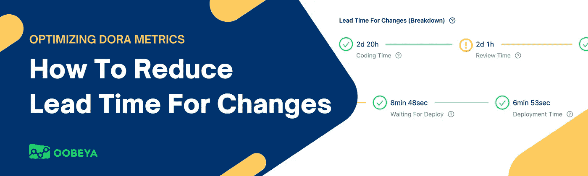
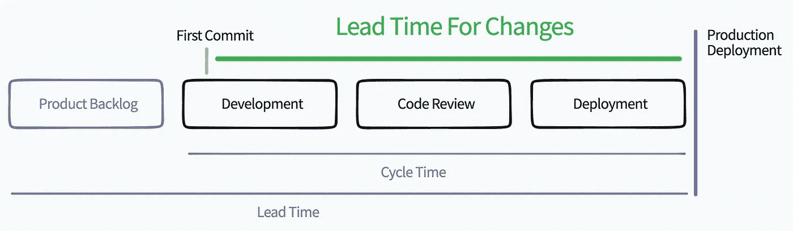
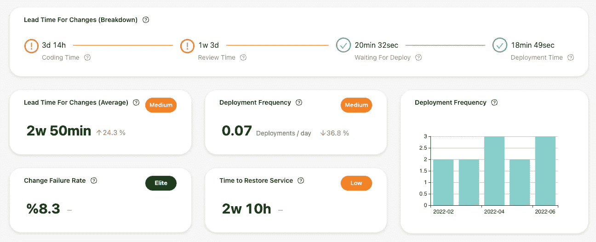
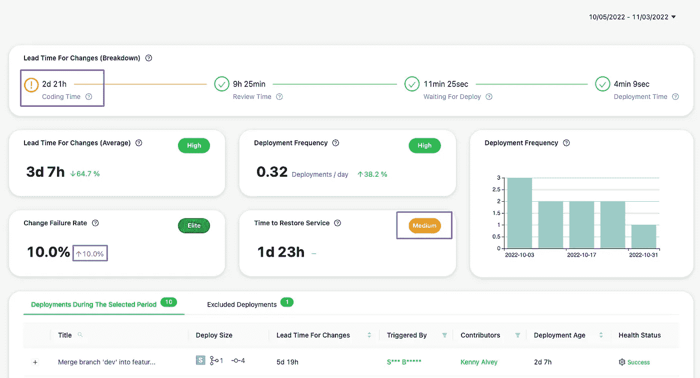

# 如何缩短变革的准备时间(优化 DORA 指标)

> 原文：<https://betterprogramming.pub/how-to-reduce-lead-time-for-changes-optimizing-dora-metrics-e97d47e11701>

## 帮助团队更快做出改变的指南



优化软件工程流程|作者图片

本文将密切关注 [DORA 度量](https://oobeya.io/dora-metrics-four-key/?utm_source=medium&utm_content=lead-time)之一，变更的交付周期(变更交付周期)，以及如何减少它以优化软件开发和交付过程。

度量是衡量事物的一种方式。它们用于了解当前形势、确定趋势、预测未来结果和做出更好的决策。

DORA 度量是测量和改进软件交付过程健康状况的最好方法。

# 什么是 DORA 指标？

[DORA metrics](https://oobeya.io/dora-metrics-four-key/?utm_source=medium&utm_content=lead-time) 已被世界各地的组织广泛采用。它们现在是衡量软件价值交付的标准。

如果你想测量软件交付的整体性能，DORA metrics 是一个不错的选择。但是它们是什么呢？

阅读我的文章“如何准确衡量 DORA 指标”[点击这里](https://oobeya.io/blog/how-to-measure-dora-metrics-accurately/):

[](https://oobeya.io/blog/how-to-measure-dora-metrics-accurately/) [## 如何准确测量 DORA 指标？Oobeya 软件工程智能

### DORA metrics 在业界相当流行。然而，与他们一起工作是极其困难的。让我们来看看…

oobeya.io](https://oobeya.io/blog/how-to-measure-dora-metrics-accurately/) 

## DORA 指标(又名加速指标和四个关键指标)

1.  变更的交付周期:投入生产所需的时间。
2.  部署频率:组织成功发布到产品的频率。高性能的软件团队经常小批量发布。
3.  变更失败率:导致生产失败的部署的百分比。
4.  恢复服务的时间:组织从生产故障中恢复需要多长时间。

从谷歌云的朵拉研究页面了解更多:[https://www.devops-research.com/research.html](https://www.devops-research.com/research.html)

组织应该一起衡量和跟踪所有这四个关键指标，以做出更好的决策，并加快其价值交付绩效。

如果您只关注这些指标中的一两个，您可能会做出糟糕的决策。假设您专注于增加部署频率，并决定减少测试工作，以便在更短的时间内进行更多的生产部署。由于您的决策，您的组织/产品可能会失去稳定性和可靠性。

关注四个 DORA 指标是创建高绩效组织的最好也是唯一的方法。

但是现在我们将讨论如何减少变更的交付时间(同时也要考虑所有的 DORA 指标)。

# 变革的准备时间有多长？

代码变更和发布给最终用户之间的时间间隔被认为是变更的前置时间。

```
Lead Time For Changes = [Production Deployment Time] - [First Commit Time of all changes]
```

## 提前期剖析

下图展示了交付周期指标的剖析。



提前期分解

让我们深入分析这一细分，以了解我们如何缩短变革的准备时间。

# 变革准备时间的各个阶段

变更的交付时间主要衡量编码、代码评审和 CI/CD 过程中的摩擦。

1.  编码时间:第一次提交和 PR 打开之间经过的时间。
2.  代码审查时间:从 PR 打开到 PR 合并所经过的时间。
3.  等待部署:从 PR 合并到部署管道启动之间的时间。
4.  部署时间:从部署开始到部署成功完成所经过的时间。



[https://oobeya.io](https://Oobeya.io) — DORA 指标跟踪工具

# 如何缩短变革的准备时间

减少变更交付时间的最好方法是识别软件开发的浪费和瓶颈。

识别浪费并致力于减少浪费将会自动减少交付时间并[提高开发团队的生产力](https://oobeya.io/optimize-software-engineering/?utm_source=medium&utm_content=lead-time)！

让我们看看如何优化变革的交付周期阶段:

## 优化编码时间

*   减少编码周期中的返工(但是首先测量返工)
*   小批量工作
*   避免不必要的复杂解决方案(需要技术和领域知识)
*   避免多任务和上下文切换
*   写清楚要求
*   加快反馈周期(总是最关键的一个)

## 优化代码审查时间

*   保持小规模。如果审查者决定与你的改变作战，它将花费太多的时间来审查公关。
*   编码更快。将大的特性分成小的部分，并保持每个拉取请求的编码时间较短。早点看到问题。
*   复习更快。不要让您的代码变更过时，以防止潜在的合并冲突。
*   创建代码审查清单
*   自动化代码评审过程中可以自动化的东西。自动化是代码审查的第一道关卡。
*   准备好接受审查。提交前请自我审查。给它一个清晰的描述性标题，并写出最好的描述。

查看我关于代码评审的文章[这里](https://oobeya.io/blog/why-code-reviews-should-be-your-favorite-activity/):

[](https://oobeya.io/blog/why-code-reviews-should-be-your-favorite-activity/) [## 为什么代码评审应该是你最喜欢的活动

### 成为更好的代码审查者，创建更好的拉请求，以及加速拉请求分析的技巧…

oobeya.io](https://oobeya.io/blog/why-code-reviews-should-be-your-favorite-activity/) 

## 优化部署时间的等待

*   自动化您的 CI/CD 流程。
*   增加您的测试自动化覆盖率。
*   创建一组强大的冒烟测试、回归测试等。
*   消除手动批准流程。
*   减少管道排队时间。提高 CI/CD 工具的性能和能力。

## 优化部署时间

*   识别 CI/CD 流程中的摩擦。
*   缩短 CI/CD 管道持续时间。
*   缓存构建依赖项。
*   优化容器图像大小。
*   检查网络延迟。
*   优化资源。
*   审查管道架构。

# “是的，我知道我需要改进的地方！”

这些神奇的词语为有效和可持续的改进打开了大门。

如果您想提高团队的健康和绩效，您应该首先从度量开始。然后，您将获得对您的开发和交付周期中正在发生的事情的洞察力(通过利用趋势、基准、模式、反模式、摩擦、风险、症状等等)。

一旦你开始说，“是的，我知道我需要改进的地方”，你就拥有了优化系统性能、团队健康、开发人员快乐、生产力和组织成功的钥匙



是的，我知道我需要改进的地方！— [https://oobeya.io](https://oobeya.io)

# 资源

*   请看原文：<https://oobeya.io/blog/how-to-reduce-lead-time-for-changes-dora-metrics/>
*   点击这里查看多拉研究。
*   如何准确衡量 DORA metrics:[https://OOB eya . io/blog/how-to-measure-DORA-metrics-accurately/](https://oobeya.io/blog/how-to-measure-dora-metrics-accurately/)