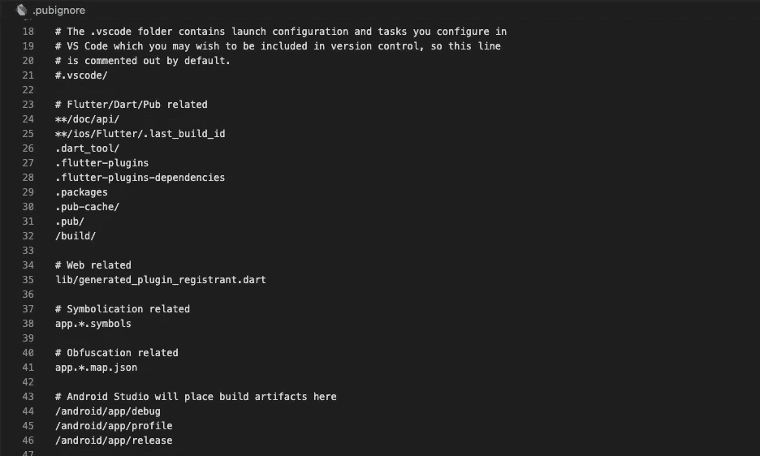
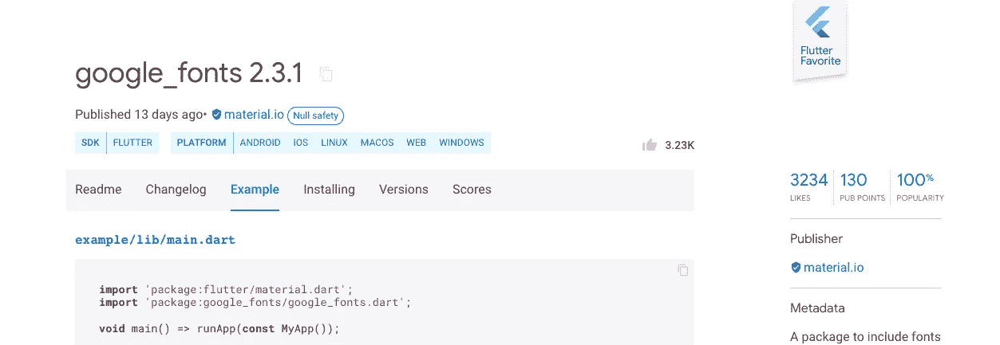

# 如何减小你的颤振包的尺寸

> 原文：<https://betterprogramming.pub/how-to-reduce-the-size-of-your-flutter-package-c99b2827ee90>

## 简单的文件大小挤压


Brian Kostiuk 在 [Unsplash](https://unsplash.com/s/photos/microchip?utm_source=unsplash&utm_medium=referral&utm_content=creditCopyText) 上拍摄的照片

如果你曾经试图发布一个 Flutter 包，你可能会意识到你的包的大小。例如，pub.dev 不允许 Flutter 包大于 100 MB。这是一个有用的规则，可以确保包(以及随后使用这些包的项目)不会变得过于庞大。

因此，如果您发现自己在尝试发布后看到这个不祥的 pub.dev 错误消息，不要惊慌。

有很多原因可能会弹出这个问题，这些原因与您的包实际上太大无关。我的意思是，你的包的核心(开发者需要使用的)可能不会大到禁止进入 pub.dev。

更有可能的是，您需要运行一些快速命令来帮助减少和重新确定项目的文件和数据分配。有很多[好方法](https://itnext.io/reducing-flutter-app-size-570db9810ebb)可以缩小你的 Flutter 应用或包的大小。从减少资产规模，分割一个肥胖的 APK，到使用程序优化你的应用，有很多选择可以探索。

在这篇博文中，我想在发布之前整合并涵盖我发现的最快捷、最简单的削减软件包的方法。让我们直接开始吧。

## `pubignore`

首先要做的是更新您的`.pubignore`文件。把你不想或不需要`pub.dev`知道的东西放在这里。通过将这些文件放在这里，它们将不会在包发布过程中被考虑。



的例子。pubignore 文件。

## 扑干净

这个！这对我非常有帮助。命令`flutter clean`的工作原理是删除你的 Flutter 应用程序中不需要发布的各种目录。根据 Flutter Agency 上的帖子“在执行 flutter clean 命令后，我们会看到它将删除我们应用程序中的 dart-tools 文件夹、android 文件夹和 iOS 文件夹以及调试文件。”

## 例子

如果你要发布一个包到 pub.dev，在你的项目根目录下有一个`example`目录是很重要的。这样，它将显示在 pub.dev 的 example 选项卡下。



google_fonts flutter 包的示例标签示例。

虽然您可能需要不止一个示例 dart 文件来本地运行您的包(比如说如果您 cd 到 example 来运行您的应用程序)，但是为了发布它，您只需要您的`lib/main.dart`文件，甚至只需要 example 目录根目录中的`example.dart`文件。

因为在这个目录中发布到 pub.dev 不需要那么多，所以可以在示例目录中运行`flutter clean`。在命令行中，在你的包的根目录中，简单地执行`cd example/`，然后执行`flutter clean`。您还可以在您的`.pubignore`中包含您的`example`目录的各个部分。

## 饭桶

您还可以通过从 git 历史中删除不需要的缓存信息来减少项目规模。为此，您只需在命令行中键入以下内容。

```
git rm -r--cached
```

这对于存放要在回购中删除的文件更有用，但它可以帮助清理您的遥控器并减少您的回购大小。也可以试试`git filter-repo`和`git filter-branch`(虽然首选`filter-repo`)。你可以在这里阅读更多关于这些命令[的信息。](https://repository.prace-ri.eu/git/help/user/project/repository/reducing_the_repo_size_using_git.md#:~:text=Deleting%20files%20in%20a%20commit,Instead%2C%20you%20must%20rewrite%20history.)

[***升级您的免费媒体会员资格***](https://matt-croak.medium.com/membership) *并接收各种出版物上数千名作家的无限量、无广告的故事。这是一个附属链接，你的会员资格的一部分帮助我为我创造的内容获得奖励。*

你还可以通过电子邮件 *订阅* [***，每当我发布新内容时，你都会收到通知！***](https://matt-croak.medium.com/subscribe)

*谢谢！*

# 参考

[](https://itnext.io/reducing-flutter-app-size-570db9810ebb) [## 减少抖动应用程序的大小

### 作为开发者，我们希望让应用程序变小，这样我们的应用程序就能获得尽可能多的分发。

itnext.io](https://itnext.io/reducing-flutter-app-size-570db9810ebb) [](https://flutteragency.com/clear-flutters-build-cache/) [## 如何清除 Flutter 的构建缓存？-颤振机构

### 缓存是什么系统生成的临时文件在 dart-tools 文件夹，android 文件夹，一个 iOS 文件夹。清除…

flutteragency.com](https://flutteragency.com/clear-flutters-build-cache/) [](https://repository.prace-ri.eu/git/help/user/project/repository/reducing_the_repo_size_using_git.md#:~:text=Deleting%20files%20in%20a%20commit,Instead%2C%20you%20must%20rewrite%20history.) [## 使用 git 存储库项目用户帮助减小存储库大小

### 随着时间的推移，Git 存储库变得越来越大。当大文件被添加到 Git 存储库时:获取存储库…

repository.prace-ri.eu](https://repository.prace-ri.eu/git/help/user/project/repository/reducing_the_repo_size_using_git.md#:~:text=Deleting%20files%20in%20a%20commit,Instead%2C%20you%20must%20rewrite%20history.)