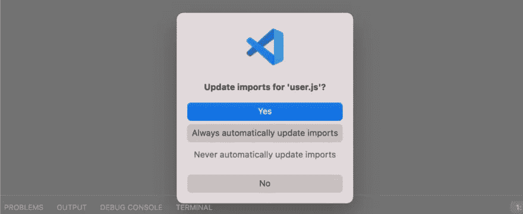
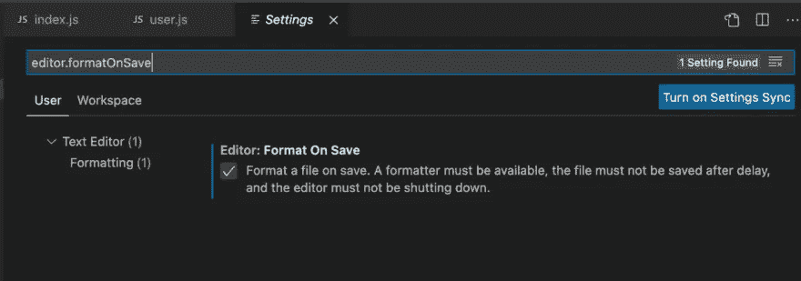
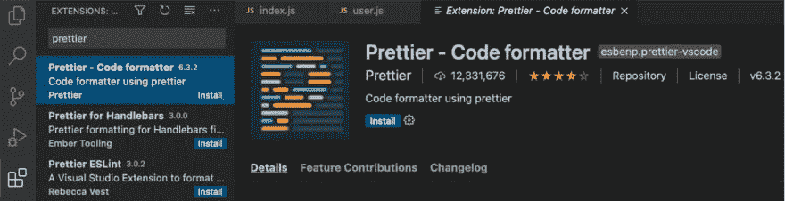
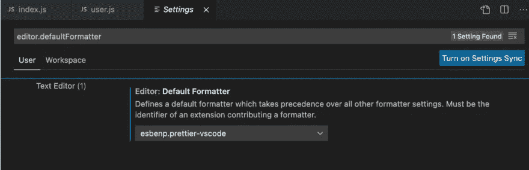

# 如何在 Visual Studio 代码中重构代码

> 原文：<https://betterprogramming.pub/how-to-refactor-code-in-visual-studio-code-884dc85a066a>

## 让重构变得容易的强大插件


作者照片。

[重构](https://www.stepsize.com/blog/the-ultimate-engineers-guide-to-refactoring?utm_source=medium&utm_medium=referral&utm_campaign=1)根据最佳实践或规则改进代码的内部结构，而不改变当前行为。您经常会看到开发团队在开始新的开发周期之前，计划一周的重构时间来评估代码的架构和内部结构。对于工程团队来说，持续解决技术问题并定期讨论维护和代码质量非常重要。

代码重构是提高代码质量和可维护性的重要活动。在干净的代码上构建新的特性要容易得多，但是在编写测试时也会让你受益。

本文着眼于如何使用 Visual Studio 代码(VS 代码)和 VS 代码插件来重构代码。

# 1.使用 Visual Studio 代码快捷方式进行重构

首先，我们利用 Visual Studio 代码的原生快捷方式来做一些基本的代码重构。我们使用 JavaScript 创建了一个小代码示例来帮助您使用这些功能。

有一个包含业务逻辑的`index.js`文件。我们导入一个`userModule`，检索一个新的用户对象，并将用户名转换成大写:

```
const userModule = require('./modules/users/retrieve')const myUser = userModule.getUser("Ben", 17)
console.log(myUser.name)const name = userModule.toUpperCaseUser(myUser.name)
console.log(name)
```

此外，这里是包含我们在`index.js`文件中使用的几个导出函数的`userModule`的实现。该文件嵌套在两个文件夹中。由此产生的路径是`/modules/users/retrieve.js`:

现在，让我们右击`index.js`文件中的`getUser`函数。您将看到不同的选项可以帮助我们重构代码。这里有一个简短的列表:

*   转到定义:打开一个窗格，显示函数的定义位置。
*   转到实现:带您到`modules/users/retrieve.js`文件中的函数定义。
*   查找所有引用:显示一个函数在一个文件中被使用的所有位置和每个函数的用法。

上面的命令对于在 VS 代码中快速导航和查找函数定义非常有用。例如，您想弄清楚在哪些文件中使用了特定的函数。您可以使用这些命令快速解决此类任务。

# 2.自动修复导入和文件名

当重构代码时，开发人员经常忍不住批评选择不当的文件名。最重要的是，重构代码意味着你在不同的文件之间转移代码，改变某些模块的用途。因此，当代码重构完成时，不完整的导入太常见了。

VS 代码可以让你免去手动扫描所有文件来查找不完整导入的麻烦。当你第一次在 VS 代码中改变一个文件名时，它会要求你自动更新导入。在这里，选择“总是自动更新导入”选项。您可以通过重命名前面示例中的`retrieve.js`文件来尝试一下。



现在，创建一个新文件夹并将`retrieve.js`文件移动到这个文件夹中。这样做时，VS 代码会向您显示另一个弹出消息，询问您是否希望在移动文件时自动更新导入。再次选择“总是自动更新导入”选项。就是这样！

# 3.Visual Studio 代码的内置代码格式

从 [VS 代码文档](https://code.visualstudio.com/docs/editor/codebasics#_formatting)中，我们可以了解内置格式化选项是如何工作的:

> “VS 代码有 JavaScript、TypeScript、JSON 和 HTML 的默认格式化程序。每种语言都有特定的格式选项(例如，`html.format.indentInnerHtml`)，您可以在用户或工作区设置中根据自己的喜好进行调整。”

要触发格式化选项，您可以打开命令面板(shift + CMD + P)并查找选项“格式化文档”选择此选项来格式化您的文档。最有可能的是，除了修复一些缩进问题，这不会改变你的代码太多。

如果您希望 Visual Studio 代码在您对文件进行更改时自动触发“格式化文档”选项，您可以通过[用户设置](https://code.visualstudio.com/docs/getstarted/settings)进行配置。我们更喜欢在点击保存按钮(CMD + S)时格式化文档。为此，打开您的用户设置并查找规则`editor.formatOnSave`。单击规则旁边的复选框以启用它。



或者，您可以选择`editor.formatOnType`，它在输入后格式化一行，或者选择`editor.formatOnPaste`，它在您将内容粘贴到编辑器中时格式化内容。

选择格式规则时，您无需执行任何其他操作即可启用该规则。

# 4.通过更漂亮的 Visual Studio 代码扩展自定义代码格式

我们不需要使用 VS Code 提供的内置代码格式化工具。我们可以禁用默认的语言格式化程序，用一个自定义的语言格式化程序或者一个像 Prettier 这样的扩展提供的语言格式化程序来代替它。

> "如果您安装了另一个为同一种语言提供格式化的扩展，您也可以禁用默认的语言格式化程序。"— [*VS 代码文档*](https://code.visualstudio.com/docs/editor/codebasics#_formatting)

首先，我们需要在扩展窗格中找到更漂亮的扩展。确保选择支持多种语言的官方 beauty 扩展。你可以点击“安装”按钮来安装扩展。



您也可以选择一个特定的[更漂亮的 ESLint 扩展](https://marketplace.visualstudio.com/items?itemName=rvest.vs-code-prettier-eslint)。然而，使用官方插件更容易，因为你可以为不同的文件类型配置它。例如，您可能在一个项目中有 CSS、JSON 和 JavaScript 文件。

要启用漂亮的格式化程序作为所有语言的默认格式化程序，我们必须再次打开用户设置。寻找`editor.DefaultFormatter`规则，选择更漂亮的格式化程序`esbenp.prettier-vscode`。



我们需要添加更漂亮的配置规则来告诉 VS 代码现在如何格式化我们的文档。最简单的方法是在项目的根目录下创建一个`.prettierrc` [配置文件](https://prettier.io/docs/en/configuration.html)。这个文件将包含一个保存所有活动规则的 JSON 对象。这种方法的优点是，您可以将配置文件提交到您的存储库中，以便在您的团队中实施相同的编码标准。这种标准化将减少未来的重构工作。

以下是一些流行的规则，可以帮助你快速重构代码:

*   `tabWidth`:指定每个缩进层次的空格数。
*   `semi`:在语句末尾打印分号。
*   `singleQuote`:用单引号代替双引号。
*   `arrowParens`:在一个单独的 arrow 函数参数周围加上括号，这是我们在这个例子中想要避免的。

您可以通过更改一个文件并保存它来尝试这些设置。或者，您可以再次打开命令调板，然后选择命令“格式化文档”

如果你想看看所有可能的规则，你可以在[更漂亮的文档](https://prettier.io/docs/en/options.html)中找到所有选项。

# 重构好玩吗？

是的，重构应该很有趣！首先，它让开发人员有机会评估他们的代码，改进代码，并从错误中学习。最重要的是，开发人员喜欢从干净的代码基础开始，而不是在混乱的代码基础上开发新功能。

说到重构工具和插件，你有很多选择。例如，我们没有涵盖 VS 代码市场中的 [JS 重构扩展](https://marketplace.visualstudio.com/items?itemName=cmstead.jsrefactor)，因为它只提供基本的重构选项。

如果你想快速获得显著的收益，我们建议使用更漂亮的。这是一个强大的重构工具，它也有助于使用更漂亮的配置文件在您的团队中实施编码风格标准——更不用说 VS Code 提供了一些有用的重构功能，如查找函数的所有引用或自动修复导入。

如果你正在和一个工程师团队一起工作，并且想要正确地安排重构工作的优先次序，请查看[步长](http://www.stepsize.com?utm_source=medium&utm_medium=referral&utm_campaign=1)。

*本文原载于* [*管理技术债务博客*](https://www.stepsize.com/blog/how-to-refactor-code-in-visual-studio-code) *。*