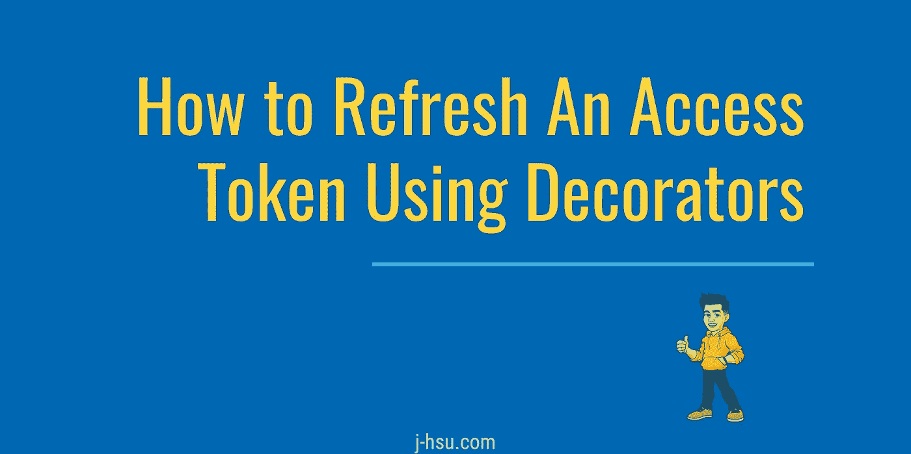

# 如何使用装饰器刷新访问令牌

> 原文：<https://betterprogramming.pub/how-to-refresh-an-access-token-using-decorators-981b1b12fcb9>

## 教您如何使用 Python decorators 建立一个请求新访问令牌的框架

当我为使用 [JWT](https://jwt.io/) 进行认证的 [iFormBuilder API](https://github.com/jhsu98/ifb-wrapper) 创建一个包装器时，我开始遇到更长脚本的挑战，这些脚本的长度超过了单个 JWT 的有效期。

为了优雅地解决这个问题，我使用 decorators 来检查令牌的到期时间，并在必要时请求一个新令牌。本文介绍了我建立的框架，以便您可以在自己的脚本中应用类似的机制。

# 设置场景

首先，我概述了设置令牌刷新框架所需的所有部分。

我们的班级将通过要求必需的字段来请求 JWT。没有访问权，我们班就什么也做不了。

# 编写访问令牌函数

充实`getAccessToken()`将依赖于你试图与之交互的任何 API。因此，我不会包含任何构造和执行 JWT 请求的代码。

我强烈推荐使用`try/except/else`和`raise_for_status()`来请求访问令牌。当我们使用 API 时，请求可能会失败，并且不会返回访问令牌，但是在 Python 看来，它可能是成功的。

# 编写初始化函数

每当我们创建一个`myAPI`类的新实例时，就会执行`__init__()`函数。我们想在这个函数中做的是请求一个访问令牌，如果成功，设置到期时间。

我们假设访问令牌应该被返回并存储在`self.access_token`中，因此，如果请求后的值是`None`，我们将引发一个异常。

否则，我们设置访问令牌的到期时间。我喜欢给这个类一个小的缓冲，所以如果我的令牌在一个小时(3600 秒)后过期，我将把过期时间设置为 3500 秒。

# 编写装饰类和函数

装饰器是将一个函数包装到另一个函数中的简单方法。

如果你不熟悉 decorators，我推荐你去看看关于真正的 Python 的初级读本。对于我们的 API 类，我们希望用访问令牌检查和刷新来包装所有的 API 函数。

# 把它们放在一起，用装饰器

现在我们都设置好了，是时候创建一个使用装饰器的新函数了。你所需要做的就是把`@Decorators.refreshToken`放在任何会发出 API 请求的函数上面。

我已经把代码和一个空的示例函数放在了一起。

我希望你喜欢这个教程，它很好地为你服务。这种智能刷新机制远远优于任意请求新的 JWTs 中间脚本。