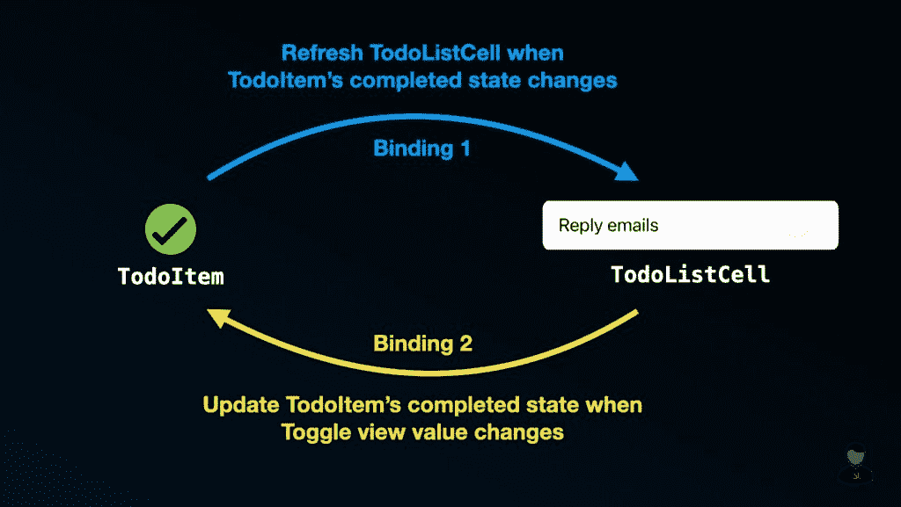

# 使用 UIHostingConfiguration 时如何刷新单元格的内容

> 原文：<https://betterprogramming.pub/how-to-refresh-cells-content-when-using-uihostingconfiguration-9a34c00e6479>

## 告别手动刷新单元格


作者图片

使用表视图或集合视图时，确保数据模型始终与屏幕上显示的内容保持同步是非常重要的。当使用表格视图或集合视图构建 UI 时，总是需要手动确保一切同步。

随着 iOS 16 中`UIHostingConfiguration`的引入，我们终于可以利用只存在于 SwiftUI 中的双向绑定的力量了。通过双向绑定，iOS 将为我们处理同步数据模型和视图内容的繁重工作。这意味着我们不再需要调用`reloadItems(at:)`来刷新单元格，或者调用`reconfigureItems(at:)`来更新数据源快照。

这些是 UIKit 上一些非常令人兴奋的改进，你一定不想错过，所以让我们开始吧！

# 示例应用程序

为了展示双向绑定的伟大之处，让我们创建一个简单的待办事项列表应用程序，如下所示:


在进入主题之前，让我们定义一个模型对象，我们可以用它来表示一个待办事项列表条目。

除此之外，我已经整理了一个使用`UIHostingConfiguration`的简单列表，您可以将它作为本文的开始项目。

如果您在理解上面的代码时有困难，我强烈建议您首先阅读我之前的文章[“如何使用 SwiftUI](https://swiftsenpai.com/development/swiftui-custom-cell/) 创建自定义 UICollectionViewListCell”

# 双向绑定

双向绑定是 SwiftUI 中一个相当常见但极其有用的特性。在 SwiftUI 中，通常在模型对象和视图之间建立双向绑定。术语“双向”表示模型对象的任何变化都会自动触发视图的更新。对视图的任何更改都将触发对模型对象的更新。

因为我们的待办事项应用程序使用的是`UIhostingConfiguration`，我们可以忘记重新加载单元格的传统方式，利用这个令人敬畏的 SwiftUI 功能来更新我们单元格的内容。

它是这样工作的:



双向装订

# 使用双向绑定刷新单元格

如上图所示，我们想要在`TodoItem`和`TodoListCell`之间建立一个双向绑定。让我们首先关注将`TodoItem`绑定到`TodoListCell`上。

## 绑定 1:要查看的模型对象

我们需要做的第一件事是使`TodoItem`符合`ObservableObject`。之后，将`@Published`属性包装器添加到`completed`属性中。当`completed`发生变化时，这个属性包装器触发 SwiftUI 更新我们的单元格。

之后，转到`TodoListCell`，将`item`属性标记为`@ObservedObject`。现在，让我们根据`item`的`completed`状态，给`Text`视图添加一些样式。

至此，我们已经成功地将`TodoItem`绑定到了`TodoListCell`。要查看实际的绑定，让我们通过将所有`TodoItem`的`completed`状态更改为`true`来实现“完成全部”功能。

现在，如果您运行示例代码并点击“全部完成”按钮，所有单元格的标题都会变成灰色，并带有删除线。

请注意，我们不需要手动逐个刷新每个单元格。每次`item`(观察对象)发生变化时，SwiftUI 会自动刷新相应的单元格。这就是捆绑的力量！

## 绑定 2:视图到模型对象

难题的另一部分是创建从`TodoListCell`的 UI 元素到`TodoItem`的绑定。为了实现这一点，我们可以使用 SwiftUI 中的`Toggle`视图，它具有内置的绑定功能，我们需要做的就是使用`$`前缀来建立绑定。

作为顶上的樱桃，我还添加了`animation()`到绑定中，这样每当`completed`状态改变时，我们可以得到一个平滑的删除线和变色动画。

有了所有这些，我们成功地在`TodoListCell`和`TodoItem`之间创建了一个双向绑定。因此，每当我们点击`Toggle`视图时，就会更新`TodoItem`的`completed`状态，从而触发相应`TodoListCell`的刷新。

想试试示例代码吗？请在这里随意获取[。](https://github.com/LeeKahSeng/SwiftSenpai-UICollectionView-SwiftUI)

# 好的和坏的

既然您已经看到了双向绑定的运行，您应该会注意到一切都是自动发生的。只要我们正确地设置了绑定，我们的模型对象和单元内容将总是同步的。

最重要的是，多亏了`UIHostingConfiguration`，我们现在可以轻松地利用 SwiftUI 的能力，并在 UIKit 环境中使用它。正如你之前看到的，在 UIKit 中实现起来有些麻烦的动画和效果(比如删除线)已经变得极其容易实现了。

话虽如此，但有一点需要注意。在这种情况下，模型对象必须是引用类型，否则它将无法符合`ObservableObject`协议。这在大多数情况下应该没什么大不了的，但我相信还是值得一提的。

你喜欢读这篇文章吗？如果你这样做了，我相信你也会喜欢我以前的文章，“在 iOS 16 中使用 UIHostingConfiguration 时，[处理单元交互”](https://swiftsenpai.com/development/uihostingconfiguration-cell-interactions/)

感谢阅读。👨🏻‍💻

```
**Want to Connect?**Feel free to follow me on [Twitter](https://twitter.com/Lee_Kah_Seng) so you won’t miss out on any of my upcoming iOS development-related articles.
```