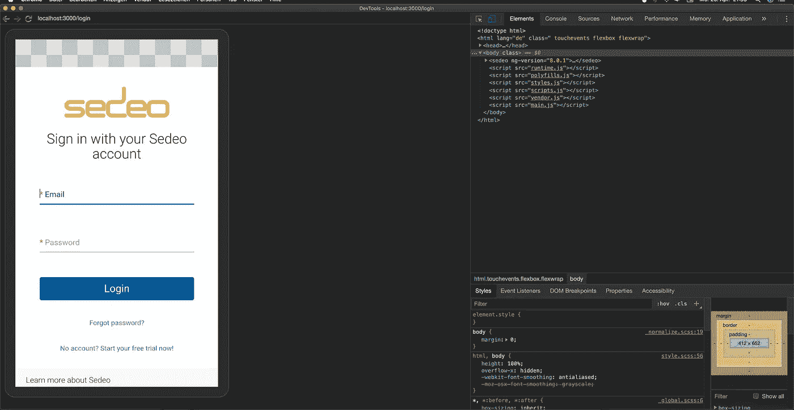
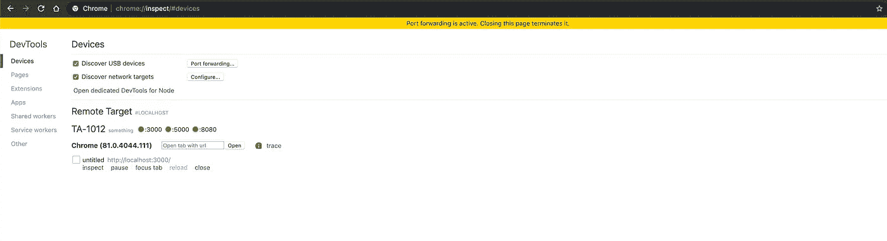

# 如何用 Chrome DevTools 远程调试 Android 上的网站

> 原文：<https://betterprogramming.pub/how-to-remote-debug-websites-on-android-devices-with-chrome-e0afc661a8e8>

## 在真实的 Android 设备上测试，以发布更好的网站

安娜·奥萨在 [Unsplash](https://unsplash.com?utm_source=medium&utm_medium=referral) 拍摄的照片。

随着 Android 被安装在超过 25 亿台设备上，web 开发人员不能忽视为 Android 优化网页。Android 用户选择的网络浏览器最有可能是谷歌 Chrome，因为它通常是预装的，许多用户已经因为在电脑上使用 Chrome 而熟悉它。随着[渐进式网络应用(PWAs)](https://itnext.io/progressive-web-apps-do-we-still-need-native-apps-at-all-bb7a00ae4fa7) 的兴起，用户期望高质量的应用不仅作为本地应用，而且在他们的浏览器中也是如此。

虽然您可以调整浏览器的大小并使用浏览器开发工具，但您无法以这种方式完全模拟移动体验。例如，我遇到了一个问题，无法在手机上点击某个元素，但在桌面上却可以。桌面和移动设备上的相同浏览器可能会有差异，因为一些功能取决于它们运行的平台。

我已经写了一篇关于如何在 Xcode 的 iOS 模拟器中测试你的网站的文章。

在本文中，我想向您展示如何使用 Chrome 远程调试在 Android 设备上测试网站。

# 如何使用 Chrome DevTools 在 Android 设备上远程调试网站

1.  在 Android 设备的开发者选项中启用 USB 调试。
2.  使用 USB 连接线将手机连接到电脑。您的 Android 设备可能会要求您确认是否信任这台电脑。
3.  在电脑上打开`chrome://inspect/#devices`。
4.  确定“发现 USB 设备”复选框已启用。
5.  如果您的应用程序在本地运行，那么您需要添加端口转发。否则，您的 Android 设备将无法访问您的应用程序！在本例中，我为本地前端的端口 3000 和本地后端的端口 5000 添加了转发。
6.  通过在输入栏中设定 URL 来打开您的网站。
7.  请确保在菜单中切换 Screencast，以在您的计算机上查看您的 Android 设备如何呈现给定的网站。你现在可以用 Chrome 开发者工具检查和调试网站了。

运行和调试在本地主机上运行的 web 应用程序。

在上面的屏幕中，您可以看到一个运行在 localhost:3000 上的 web 应用程序。和其他网站一样，我可以检查 DOM、修改样式、调试 JavaScript 代码、模拟慢速网络等等。

使用 Chrome 开发工具检查在本地主机上运行的网站。

# Chrome 远程调试的优势

*   您可以在电脑和 Android 设备上与网站互动。
*   Chrome 开发工具有助于正确检查和调试你的网站。
*   对于普通网站和 web 应用程序来说，性能很好。大多数网页甚至单页应用程序都应该能够完美地工作。
*   代码中的更改会自动反映出来(要么重新加载网页，要么使用实时重新加载/热模块重新加载解决方案)。
*   在实际设备上测试比在 Chrome 中切换移动视图更有效。

# Chrome 远程调试的缺点

*   由于流式传输，性能可能不如以前好。
*   由于这是谷歌 Chrome 的一项功能，你不能将这种方法用于 Mozilla Firefox 等其他浏览器。

# 结论

感谢您阅读这篇关于 Android 上 Chrome 远程调试的简短介绍。正如你所看到的，我们可以使用 Chrome 远程调试在 Android 设备上轻松测试网站和 web 应用程序。这使我们能够在将网站发送给最终用户之前，在移动设备上测试网站。

你是如何在 Android 设备上测试网站的？请在评论中告诉我。