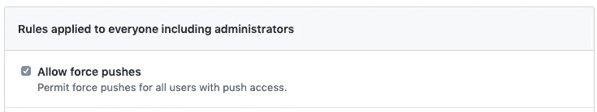

# 如何从 GitHub 中删除敏感数据和明文秘密

> 原文：<https://betterprogramming.pub/how-to-remove-sensitive-data-and-plaintext-secrets-from-github-ca8ca0b7675a>

## 保持你的存储库干净，以避免被黑客攻击


照片由[静止不动](https://unsplash.com/@stillnes_in_motion?utm_source=medium&utm_medium=referral)在[不飞溅](https://unsplash.com?utm_source=medium&utm_medium=referral)上拍摄

有些开发人员爱快速编码，爱偷工减料，我也为之心虚！这意味着敏感数据(例如，明文秘密、应用程序编程接口[API]密钥、密码等。)可能会意外地提交到您的 git 存储库中。如果您在本地开发，这可能没问题，但是当使用 GitHub 这样的托管服务时，这可能是个问题。

阅读 [Secjuice Squeeze Volume 7](https://www.secjuice.com/secjuice-squeeze-vol-7-infosec-news/) ，其中包含一个关于在 GitHub 上发现星巴克 API 密钥的故事。

# 背景

我在几个 git 存储库上工作，其中大部分都提交了敏感数据。他们有 API 密匙，AWS 密匙，密码，你能想到的！作为一名安全工程师，我想补救这一点。看起来工作量很大。有多个存储库，但他们有这些“肮脏”的提交可以追溯到几年前。我将分享我是如何通过移除秘密来清理脏提交的。

# 来自 GitHub 帮助的指导

我使用了 GitHub 的官方文档来开始。我通读了一遍，似乎很简单。我只需要使用 [BFG 回购清理器](https://rtyley.github.io/bfg-repo-cleaner/)，并要求开发人员删除存储库并再次克隆它。小菜一碟！至少我是这么认为的。

[https://help . github . com/en/articles/remove-sensitive-data-from-a-repository](https://help.github.com/en/articles/removing-sensitive-data-from-a-repository)

# 使用 BFG 回购清洁剂

BFG Repo-Cleaner 是一个 Java 程序，它利用 git 过滤器分支来修改现有的提交并替换内容。Git 过滤器分支是一个相当繁琐的过程(参见上面的 GitHub 帮助文档)，所以我很高兴 BFG 简化了它。

下面是我用来清理提交的过程。

1)我将 Java 应用程序下载到我的`~/Downloads`文件夹中。

2)我创建了一个`~/Documents/bfg-secrets-all.txt`文件。我确保将它放在我的 git 存储库之外，以避免不小心犯下它，从而违背这个练习的目的！

我为每个我想清除的秘密添加了一行。每行必须以`regex:`或`glob:`开头，为了简单和熟悉，我决定使用正则表达式。

```
regex:8cea3229-09cd-4b89-9dce-f0f9b0697406
regex:815e9bc4-d795-4961-ab8b-50ddf8a391fe
```

我搜索了特定的秘密，但是我可以使用实际的正则表达式。

```
regex:\w{8}-\w{4}-\w{4}-\w{4}-\w{12}
```

3)我煞费苦心地从每个存储库中删除了所有的秘密。我利用[环境变量](https://medium.com/the-node-js-collection/making-your-node-js-work-everywhere-with-environment-variables-2da8cdf6e786)、 [AWS 密钥管理服务](https://aws.amazon.com/kms/)和[点文件](https://linux-audit.com/linux-history-how-dot-files-became-hidden-files/)将敏感数据移出提交的文件。

4)我转到 GitHub 存储库设置中的分支保护规则，并启用强制推送。



5)我运行了以下命令来检查脏提交。

```
java -jar ~/Downloads/bfg-1.13.0.jar --replace-text ~/Documents/bfg-secrets-all.txt
```

它要么说没有脏提交，要么打印出一个脏提交列表。请参见清理后的示例输出。

```
Commit Tree-Dirt History
------------------------ Earliest                                              Latest
    |                                                          |
    ..DDDDDDDDDDDDDDDDDDDDDDDDDDDDmmDmmDDDDmDDDDDDmmmmmmmmmmmmDD D = dirty commits (file tree fixed)
    m = modified commits (commit message or parents changed)
    . = clean commits (no changes to file tree) Before     After   
    -------------------------------------------
    First modified commit | 06f9e3e4 | cc990b18
    Last dirty commit     | e587f82e | f7ded7dc
```

6)然后我把所有的改动都推上去了。

```
git reflog expire --expire=now --all && git gc --prune=now --aggressive
git push origin --force --all
git push origin --force --tags
```

7)要求开发人员删除存储库并再次克隆它。

8)我访问了 GitHub 上的存储库，确保提交看起来像这样:

```
- apiKey = 'placeholder';
+ apiKey = '8cea3229-09cd-4b89-9dce-f0f9b0697406';
```

现在它看起来像这样:

```
- apiKey = 'placeholder';
+ apikey = '***REMOVED***';
```

9)我庆祝是因为我以为我完成了。

# 从所有分支中删除敏感数据

过了一会儿，我转到了一个不同的、过时的分支。我碰巧在提交历史中看到了一个明文形式的 API 密钥。BFG 回购清洁工说，它清除了提交历史！

我意识到 BFG Repo-Cleaner 只清理签出的 git 分支。有道理。这与整个 git 工作流是一致的。

我不得不为每个分支重复 BFG 过程，并要求开发人员删除他们的存储库并再次克隆它们。

至少现在所有的树枝都被清理干净了。我的担心现在已经过去了。

# 从 GitHub Pull 请求中删除敏感数据

我访问了一个旧的 pull 请求(PR ),在提交历史中看到了一个明文形式的 API 键。又来了！我用 BFG 回购清洁剂清洁了每一根树枝。这是怎么回事？！忽悠我一次；你真可耻。忽悠我两次；我感到羞耻。

原来 GitHub PRs 是独立于 git 库的。这似乎是显而易见的，因为 PR 是一个外部文档，允许评审者批准一个分支是否应该合并到另一个分支。当 PR 被批准和合并时，GitHub 执行 git 合并功能。

BFG Repo-Cleaner 是为 git 库而不是 GitHub pull 请求设计的。因此，我需要手动删除所有这些 PRs 及其提交。

在第二次 PR 和 40 次提交之后，我意识到手动检查数百个 PR 和数千个提交的秘密是困难的，并且容易出现人为错误。

我决定我需要一个自动的方法来找到所有的 PRs 和有脏提交的提交。我决定使用 [GitHub API](https://developer.github.com/v3/) 。

由于版权原因，我不能分享我写的剧本。我正在描述我用来构建脚本的思维过程。

1)我创建了一个[个人访问令牌](https://github.com/settings/tokens)。

2)我创建了一个 Node.js 脚本来测试 token。

```
mkdir myscript
npm init -y
npm install github-api
touch index.js/* index.js */
'use strict'
const GitHub = require('github-api');
const gh = new GitHub({ token });
```

3)我用 GitHub 组织所有的库。我更新了脚本以获取所有的存储库。该脚本列出了所有的存储库。

```
gh.getOrganization(orgName);
const repos = org.getRepos();
console.log(repos);
```

4)我选择了一个存储库。

```
const repo = gh.getRepo(repos[0].owner.login, repos[0].name);
```

5)我获得了它所有的 pr。

```
const prs = repo.listPullRequests(options);
```

6)我选了一个 PR。

```
const pr = prs[0];
```

7)我获得了在 PR 中创建、修改和删除的所有文件。

```
const files = repo.listPullRequestFiles(repo, pr.number);
```

8)我看了前面用的`bfg-secrets-all.txt`文件。

9)我使用之前使用的`bfg-secrets-all.txt`文件搜索了每个文件中的差异，并创建了一个 CSV 输出。

10)我将更新代码以遍历每个存储库、PRs 和文件。

11)我联系了 [GitHub 支持](https://support.github.com/)删除整个 PR 或跟踪引用，您也可以使用 GitHub API 获取该信息(参见下面的示例脚本)。

# 再次检查仓库

在清理完存储库后，我等了几个星期，再次在存储库上运行了 BFG 回购清除器。我发现一些存储库又有敏感数据了。我了解到一个开发人员忘记删除存储库，并使用未清理的存储库进行提交。

在一段时间后检查存储库以确保它们是干净的是一个好主意。

# 阻止开发人员提交

这似乎是一场永无止境的战斗:我清理，一个开发人员不小心犯了一个秘密，我偶然发现它，我再次清理，循环重复。我首先想要一个过程来帮助防止这种情况。

我决定在提交之前使用 git 钩子来检查提交。我决定检查预提交 git 挂钩。

1)我创建了一个可执行的预提交脚本。

```
touch .git/hooks/pre-commit
chmod +x .git/hoooks/pre-commit# pre-commit
#!/bin/shif $(grep -rqE "\w{8}-\w{4}-\w{4}-\w{4}-\w{12}"  *) ; then
  echo 'Found a matching secret'
  exit 1
fi
```

2)我用一个秘密创建了一个文件来测试它。

```
echo 8cea3229-09cd-4b89-9dce-f0f9b0697406 > secres.txt
git commit -a -m 'Testing'
```

我得到了下面的输出，文件没有被提交。

```
Found a matching secret
```

3)我需要一种方法来创建存储库的这一部分。目前，它只能在我的机器上运行。我利用了每个存储库用于一个 Node.js 项目。我添加了一个安装后脚本，以确保 git hook 脚本可以在每个开发人员的机器上工作。

我更新了`package.json`文件。

```
{
  "scripts": {
    "postinstall": "git config core.hooksPath .githooks"
  }
}
```

4)我把 git hook 脚本复制到一个可提交的目录，并提交它；您不能提交`.git`目录中的文件。

```
mkdir .githooks
mv .git/hooks/pre-commit .githooks
git add .githooks/pre-commit
git commit -m "Added pre-commit hook script."
```

5)所有的开发人员都需要下载最新的代码，并在他们的机器上运行`npm install`命令。

6)另一种方法是允许`npm install`将钩子复制到`.git/hooks`目录。

```
{
  "scripts": {
    "postinstall": "cp .githooks/* .git/hooks"
  }
}
```

# 结论

将敏感数据和明文秘密提交给 GitHub 存储库可能会削弱您的安全姿态，并且需要在事后努力清理它。

你可以使用 [BFG 回购清理器](https://rtyley.github.io/bfg-repo-cleaner/)来清理你提交历史中的秘密。确保清理每个分支，强制推行更改，并在一段时间后再次运行 BFG，以确保不会再次引入敏感数据。

使用 BFG 后，您可能会在 GitHull pull 请求中发现敏感数据。您可以使用 [GitHub API](https://developer.github.com/v3/) 来查找包含敏感数据的拉请求。将这些发现发送给 [GitHub 支持](https://support.github.com/)，并要求他们删除拉取请求或其跟踪参考。

您可以使用 git 预提交挂钩来帮助防止提交敏感数据。