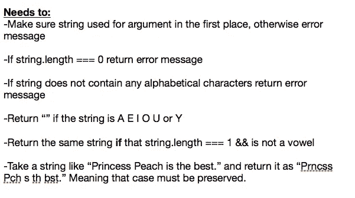
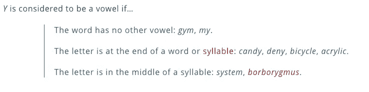

# 如何在 JavaScript 中删除字符串中的元音

> 原文：<https://betterprogramming.pub/how-to-remove-vowels-from-a-string-in-javascript-fbed6e3a438e>

## 算法面试准备


由 [Moritz Schmidt](https://unsplash.com/@moroo?utm_source=medium&utm_medium=referral) 在 [Unsplash](https://unsplash.com?utm_source=medium&utm_medium=referral) 拍摄的照片

最近，我在做笔记，试图想出一个函数的例子，这个函数将用在专门处理字符串的库中。

我给自己写了几个例子，当时一个想法突然出现在我的脑海里:“尝试创建一个函数，它接受一个字符串，然后不带元音地返回它，这难道不是一个很好的实践吗？”

我就是这样开始编写这个算法的，我决定把它叫做`vowelCut`。

我刚从假期回来，所以像这样的小问题是让我回到编码算法的最佳状态的好方法。给自己这样的小挑战会让你进入一种特定的思维模式，如果你愿意的话，这是一个我肯定有一段时间没有涉足的思维模式。

我也有一段时间没有用普通 JS 或正则表达式做一些事情了，这两者在字符串操作时都特别有用。

你可以通过我创建的 GitHub repo 跟踪本文中的所有内容: [vowelCut](https://github.com/TimeSmash/vowelcut-algorithm) 。

本文的前两个文件介绍了这种算法的创建，有带注释的版本和普通版本，所以请使用最适合您的版本。我将发布普通版本的代码，因为评论很大程度上反映了我在本文中所写的内容。

(注意:本文的主要部分在所有情况下都将 Y 视为元音。repo 中还有另一个可选文件，它涉及到在给定特定标准的情况下，将 Y 视为元音。这个可选文件增加了算法的复杂性。它与本文的可选部分相对应。)

有了所有的方式，让我们开始检查建设过程！

# 考虑特定的终点



在编写算法之前写出端点有助于确定您希望它做什么。

以上是我想用这个函数完成的一个简短的公告。

通过写下端点，我们给了自己一些具体的东西，在制定算法时可以参考。这也有助于我们记住我们可能遇到的约束或可能出现的潜在困难。

## **接受有效字符串**

前三个端点处理对给定论点的分析。一个字符串应该有一定的质量，如果没有，应该向用户返回一个错误消息，告诉用户问题是什么以及解决的方法。

首先，由于这个算法的整个目标是字符串操作，我们最好首先确保我们实际处理的是一个字符串！这很容易用`typeof`操作符解决(稍后讨论),但是不考虑不需要的字符串。

我真的想对这种算法将要处理的字符串类型严格要求——毕竟，如果其中没有字母，为什么首先要费心去寻找元音呢？这就是为什么需要识别缺少字母字符的字符串。

最后，如果一个空字符串以某种方式通过，我需要一个特定的消息。

虽然我们的第二个端点已经说明了缺少字母的原因，但是没有任何内容的字符串就明显不同了。因此，我们也应该有一个反映这种情况的消息。

## **避免不必要的无元音字符串处理**

我们希望确保返回一个去掉元音的字符串——对于只有一个元音的单字符字符串，这意味着我们应该只返回一个空字符串。

如果我们有一个不是元音的单字符字符串，我们应该返回这个字符。

## **提供算法功能的清晰示例**

最后，我们应该有一个例句，以及去掉元音后的结果是什么。

我是桃公主的粉丝(超级粉碎兄弟近战，有人吗？)，我想要一个相当长的句子，这样对我来说很好。通过了解我们将要提供和接受的东西，我们可以在以后再次使用这句话，并进行比较。

请注意，所有这些都是非常简单的端点。如果你不习惯单元测试，像这样的练习是一个很好的开始。

这种算法及其助手函数的简单性使得调试变得容易，因此您可以专注于您的单元测试组合，而不必对相关代码着迷。

我不会在本文中讨论单元测试，但是也许我会在将来写一篇关于单元测试的文章，可能会以此为例。

# 算法组成

随着所有端点的建立，我们可以开始编写实际的代码了！

请记住，算法往往有很多事情要做，而不是把所有代码放在一个空间，最好是把它分成不同的帮助函数，我们可以根据需要调用它们。

由于这个例子的复杂性较低，所以我只使用了两个助手，但是在任何情况下使用它们都更有组织性和可读性。

## **无效字符串的核算**

前三个端点都处理了如何将我们收到的字符串作为参数(如果它们是字符串的话)。

这是我们希望我们的算法看到的第一件事——如果我们有一个不可行的论点，我们甚至不应该开始处理它。相反，我们应该尽早终止函数。在我们的例子中，这意味着抛出一个值为错误消息的返回值。

首先，我们将错误消息保存为变量。

```
const notAStringMessage = "Not a string. Please provide an argument that is a string."const noLetterString = "Please write a string that has letters in it."const zeroLengthStringMessage = "Please write a string 1 or more characters long."
```

然后我们构建我们的第一个助手方法，`isAValidString(string)`。它将首先评估参数是否是通过`typeof`操作符接收的。

请记住，这个操作符将评估紧随其后的某个东西的数据类型，这个评估的返回值是一个小写字符串(即如果数据类型是一个数字，它将返回“数字”，一个字符串将返回“字符串”)。

如果参数不是字符串，我们将返回反映这一点的错误消息。

```
if(typeof string!== "string"){return notAStringMessage}
```

如果参数是一个字符串，我们现在可以确定这些字符串的质量。

首先，我们将通过评估字符串的长度来检查它是否被填充。空字符串的长度为零，如果这是真的，我们应该返回适当的错误消息。

```
if (string.length === 0){return zeroLengthStringMessage}
```

如果字符串不为空，我们可以继续进行最后的评估，使用简单的正则表达式检查字符串中是否有字母元素。

使用的正则表达式是`/[a-zA-Z]/`，这是一个字符类，可以用来检查字母表中所有字母的字符串，不管它们的大小写。

(或者，我们也可以像这样使用不区分大小写的标志:`/[a-z]/i`。这是一件小事，但提供了一种不同的可读性方法。这纯粹是你和其他阅读你的代码的人的偏好。)

如果字符串不包含字母，显然没有必要检查它的元音，我们应该向用户返回一个错误消息来反映这一点。

```
if(/[a-zA-Z]/.test(string) === false){return noLetterString}
```

如果上述所有条件都返回 false，这意味着我们有一个有效的字符串！我们可以返回`true`作为这个函数代码的最后一行，然后关闭它。

## **检查元音字符串**

既然我们已经确定输入是一个有效的字符串，我们可以看看它是否有元音。这需要我们的第二个助手函数，恰当地命名为`hasVowels`。

我们要做的第一件事是把所有的字母都变成小写。这样我就可以比较正则表达式，看这个单词是否有元音。

(附注:我刚刚意识到，在审查这段代码时，我可以再次使用 trusty `i`标志来使我的正则表达式不区分大小写，从而消除所有内容都小写的需要。唉，这种方式的代码也工作得很好！)

`.test`方法将一个字符串与一个正则表达式进行比较，如果该字符串包含正则表达式，则返回一个布尔值。我使用的字符类在它比较的字符串中寻找任何元音，并基于此返回`true`或`false`。

这在`vowelCut`中用来节省处理时间——根据前面函数中建立的规则，像`MDM`这样的字符串是有效的，但是如果首先没有要删除的元音，就没有必要进行元音删除过程！

因此，当这个函数在字符串上被调用时，`vowelCut`收到一个参数并返回 false，我们只是返回原始字符串。只有当它为真时，我们才真正开始字符串操作。

## **切割元音**

在这一点上，我们已经确定参数`vowelCut`已经接收了一个有效的字符串，并且是一个有元音的字符串。我们终于可以开始元音切割过程了！

```
let characterArray = string.split("")
       return characterArray.map(character => {
           if(/[aeiouyAEIOUY]/.test(character)){
              character = ""
           } else {return character}
       }).join("")
```

我发现最简单的方法是通过`split`方法将字符串分割成单独的字符，用一个空字符串作为分隔符。这意味着字符串中的每个字符都被转换成新数组中自己的元素。比如:“嗯嗨！”变成["W "，" e "，" l "，" l "，" h "，" I "，"啊！"] .

因为我们有一个数组，所以我们现在可以遍历它。我选择使用的迭代函数是`map`，因为它创建了一个新的数组。我们一会儿会把这个新数组转换回字符串。

我给出的回调函数`map`检查这个字符是否是一个元音，如果是，用一个空字符串替换这个元音。如果字符不是元音字母，我们就原样返回字符。

当映射完成后，我们得到一个不应该包含任何元音的新数组。从那里，我们可以用`join`将它转换成一个字符串，用一个空格作为分隔符来分隔新转换的单词。

# 完整算法忽略

在我们结束之前，让我们快速看一下这个算法的最终组成。

通过参考上面的代码，我们可以简单回顾一下这个算法是如何处理数据的，以及这个过程的顺序。

1.  检查字符串是否有效，通过返回适当的错误消息提前结束函数。
2.  检查元音的有效字符串。如果不存在元音，则通过返回提供的相同字符串来提前结束函数。
3.  如果字符串有元音，如果字符串是单个字符，则返回空字符串。对于任何其他长度的字符串，系统地删除元音。返回更改后的字符串。

就这样吧！我们已经创建了一个函数，从任何我们认为有效的字符串中删除元音。

如果你想就此打住，那太好了。如果你想看看如何修改这个算法，使它更复杂一点，请继续阅读下面！

# 可选:将 Y 视为元音

注意:如果您正在使用 GitHub repo 跟进，请参考`vowel-algorithm-Y-consideration.js`文件。显然有新的函数被组合，但是也要注意对已建立的函数的改变。

让这个算法稍微复杂一点的方法是考虑 Y 的矛盾性质。在英语中，Y 有时需要同时充当元音和辅音。

## **围绕约束识别和构建功能**

初看起来，Y 是否是元音的规则似乎很容易理解:



从韦氏词典的例子中，我们可以看到 Y 作为元音的标准取决于单词中其他元音的数量，以及 Y 在单词中的位置。

从编程的角度来看，这些规则的问题在于音节不是一个容易定义的东西。你不能把一个单词分成三四分之一，然后期望每次都能得到真正的音节。

有可能利用 API 进行音节识别，但这超出了我们在这里尝试做的事情的范围。

即使我们有，我们也必须考虑到这个算法目前接受的字符串可能包含也可能不包含真正的单词。为了解释*和*，我们可能需要使用某种字典 API。你明白我的意思了吗？

所以，当 Y 是元音时，让我们试着忽略音节标准。我们剩下的逻辑基本上是这样的:“Y 是一个元音，当它是一个单词中唯一的元音，或者在一个单词的末尾。”

让我们也把 Y 算作元音，当它是字符串中唯一能让我们的生活变得简单的东西。

现在工作起来容易多了！让我们创建一个新函数，`YIsAVowel`遵循这个逻辑。

## **创建将 Y 识别为元音的函数**

我们要做的第一件事是将字符串小写，以便于检查。然后，我们将检查字符串的最后一个索引是否以 Y 结尾。如果是，Y 是一个元音，所以我们将返回`true`。在这里使用`charAt`方法检查字符串也说明了字符串仅仅是 y。

如果字符串没有以 Y 结尾，如果 Y 是字符串中唯一的元音，它仍有可能是一个元音。我们可以像以前一样使用一个字符类来解释所有的元音，但是这一次，我们将使用它来排除元音。

有不同的方法可以做到这一点，但是我将坚持使用测试方法，因为它已经在前面讨论过了。我们将使用一个 bang `!`,这样每当我们*没有遇到元音时，我们就会返回`true`。*

这个条件句的第二部分很明显。如果我们已经确认没有其他元音，Y 必须出现在单词中才能算作一个元音。我们可以使用 *includes* 方法来判断它是否存在。

## **记账终止特殊字符**

既然我们已经将 Y 作为一个元音，你可能会认为我们可以继续前进，改变我们的其他函数来加入这个新功能。没错，这是我最初做的。

然而，当我摆弄这个算法时，我意识到了一些事情。`YIsAVowel`专门查找字符串末尾的字符，作为其逻辑的一部分。

这并不一定意味着最后一个字符是字母。比如在“开心！”感叹号是该字符串的最后一个字符。

按照`YIsAVowel`目前的运行方式，它不会从末尾有任何标点符号、特殊字符或数字的字符串中删除终端 Y。

进入功能`cutEndPunc`。这与它在 tin 上所说的完全一样，它将接受一个字符串的参数，并在没有任何结束标点的情况下返回它。

在这个函数中，您将看到看起来像复杂的正则表达式。当你认识到这是一个像其他职业一样的角色职业时，它真的没有那么糟糕。

正则表达式有一些特殊字符，当被认为是实际字符时需要转义符，因此有大量的反斜杠。

为了提高可读性，这个正则表达式将来可能会被修改(研究字符类和特殊字符，特别是`$`)，但是您真正需要做的是，它将删除字符串末尾除了字母之外的几乎所有内容。

我们将使用这个正则表达式将其与字符串的最后一个字符进行比较`cutEndPunc`将把它作为一个参数。

每当它遇到正则表达式中的一个字符时，我们将使用子串操作和变量重新声明将字符串的长度缩短 1。

我们将在这里利用递归的优势，以便重复这个活动，直到字符串末尾不再有不需要的字符。

## **修改已建立的助手功能**

现在，我们可以回过头来将这个功能合并到`YIsAVowel`中。

这里所不同的是，我们从字符串中去掉了所有的非字母字符。有了这些，剩下的就是修改我们已经建立的代码了。

## **改变 has 元音以解释 Y**

检查一个字符串是否有元音的函数需要一些小的调整，因为 Y 不允许作为元音全权委托。

首先，我们从 regex 字符类中删除 Y。这对我们还是很有用的，因为我们在考虑 y 之前，已经考虑了所有其他的元音。

然而，在某些时候，没有其他元音，Y 是唯一的竞争者。这里我们添加了一个额外的`else if`条件，它检查字符串中是否有 Y，以及 Y 是否是该字符串中的一个元音。

如果这是假的，我们可以肯定字符串中没有任何元音。然后，我们可以像以前一样使用`hasVowels`。

## **更改 vowelCut**

我们需要做的最后一件事是改变`vowelCut`来解释我们引入的新功能。这段代码的第一部分(识别有效字符串)是完全相同的，所以让我们开始新的内容。

## **去掉元音 Y**

这一次，我们不是将字符串拆分成单个字符，而是拆分成单词。

这是因为 Y 不再容易被识别为元音。以前，每当我们看到它，我们就把它剪下来。现在，我们有了逻辑，Y 在它所在单词的上下文中可能是也可能不是元音。

现在，我们通过正则表达式检查每个单词中是否有 Y。如果没有，我们不会以任何方式修改这个词。如果是，那么我们检查 Y 是否是这个单词中的一个元音。如果是，我们使用替换函数。

这个函数检查一个特定的正则表达式(第一个参数)并用一个字符串(第二个)替换它。在我们的例子中，这意味着我们寻找 Y 并用一个空字符串替换它。完成后，我们把绳子接回去。

## **去除所有其他元音**

我们现在有了一个去掉了所有元音-Y 的字符串。因此，字符串中的任何其他 Y 都不能是元音。

现在，我们可以像以前一样:将字符串分割成单独的字符，并删除任何元音字符。

## **改进功能完成**

如果你已经到了这一步，你已经看到了修改算法的过程。

我们仍然考虑每个新功能的端点，虽然制作全新的方法仍然有些困难，但是将它们合并到已经建立的代码中并没有那么糟糕。

这篇文章非常全面，通过 GitHub repo，你应该可以看到所有的东西是如何设置的。

你可以随心所欲地使用它——当然，总有可以改进的地方来优化它的效率、可读性和功能性。

这样做无疑是锻炼您的分析思维和 JavaScript 能力的好方法。

一如既往，享受乐趣，快乐编码！