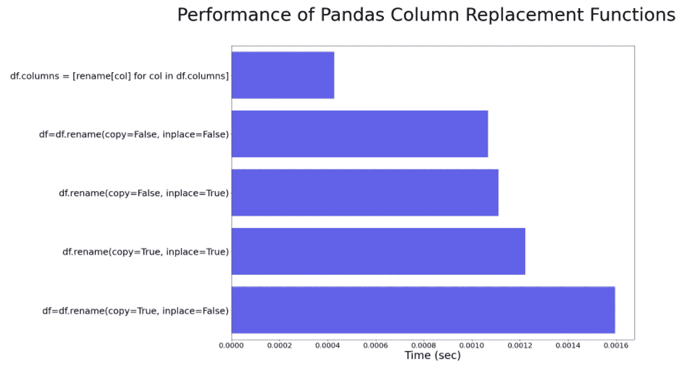

# 如何重命名 Pandas 中的列—速度高达 4 倍

> 原文：<https://betterprogramming.pub/how-to-rename-columns-in-pandas-with-speed-b29f298f1ab7>

## 或者为什么隐藏的熊猫复制会减慢你的速度


熊猫的表现因引擎盖下的模仿而变慢。查看重命名列，让我们看看隐藏的复制机制是如何导致与性能最好的方法相比，性能降低了将近 4 倍。

# 背景

我们将完成两件事:

*   展示在 pandas 中重命名列的两种方法
*   展示性能最好的方法和一个重要的性能瓶颈

## 重命名 Pandas 中的列

在本例中，我们创建了一个包含 1，000 列和 10，000 行的示例数据框:

创建测试数据集

重命名`dataframes`有两种方法:

## **方法 1: __rename__ 方法**

这是最常见的方式，典型的调用是:

```
df = df.rename(columns=rename_cols)
```

## **方法二:替换列属性**

另一种方法是直接简单地设置 dataframe `columns`属性:

```
df.columns = [rename_cols[col] for col in df.columns]
```

# 提高性能

方法 2 已经过优化，但是在`rename`方法中有两个关键参数——我们直接从文档中引用它们的描述:

*   `copy`:也复制底层数据
*   `inplace`:是否退新的`DataFrame`。如果`True`则复制的值被忽略。

我们将展示方法 2 打开和关闭这些参数的性能，并将其与方法 1 进行比较。

结果可以在下图中看到。



很明显，在方法 2 中直接改变属性是最快的，而使用非就地复制的`rename`方法是最慢的。

# 为什么性能很慢？

很明显，复制数据帧会降低性能，所以为什么`copy=True`很慢是有道理的，但是为什么关闭复制仍然很慢，例如，当我们使用重命名方法设置`copy=False`时？

我们稍微钻研一下重命名方法的[源代码](https://github.com/pandas-dev/pandas/blob/4bfe3d07b4858144c219b9346329027024102ab6/pandas/core/generic.py#L985)来假设一下。虽然有很多控制流逻辑(if/else 语句)，但也有一些隐藏的复制在进行。具体来说，重命名方法中有这条[线](https://github.com/pandas-dev/pandas/blob/4bfe3d07b4858144c219b9346329027024102ab6/pandas/core/generic.py#L1156):

```
result._set_axis_nocheck(new_index, axis=axis_no, inplace=True)
```

我需要把这个电话稍微分解一下。

在`rename`中，`result`被设置为 self。这意味着变量结果只是数据帧的副本。

参数`new_index`大致是新列名的值。从技术上讲，它是一个`Axis`对象，以列名作为属性，但这比我们需要的要复杂得多。关键的性能瓶颈是什么？它在数据帧的副本上进行原位替换。

事实上，`_set_axis_nocheck`有一个[评论](https://github.com/pandas-dev/pandas/blob/4bfe3d07b4858144c219b9346329027024102ab6/pandas/core/generic.py#L758)是这样解释的:

# 结论

虽然我不想说就地复制和属性设置是唯一的瓶颈，但它给我们上了关于熊猫和性能的重要一课。当心秘密复制！