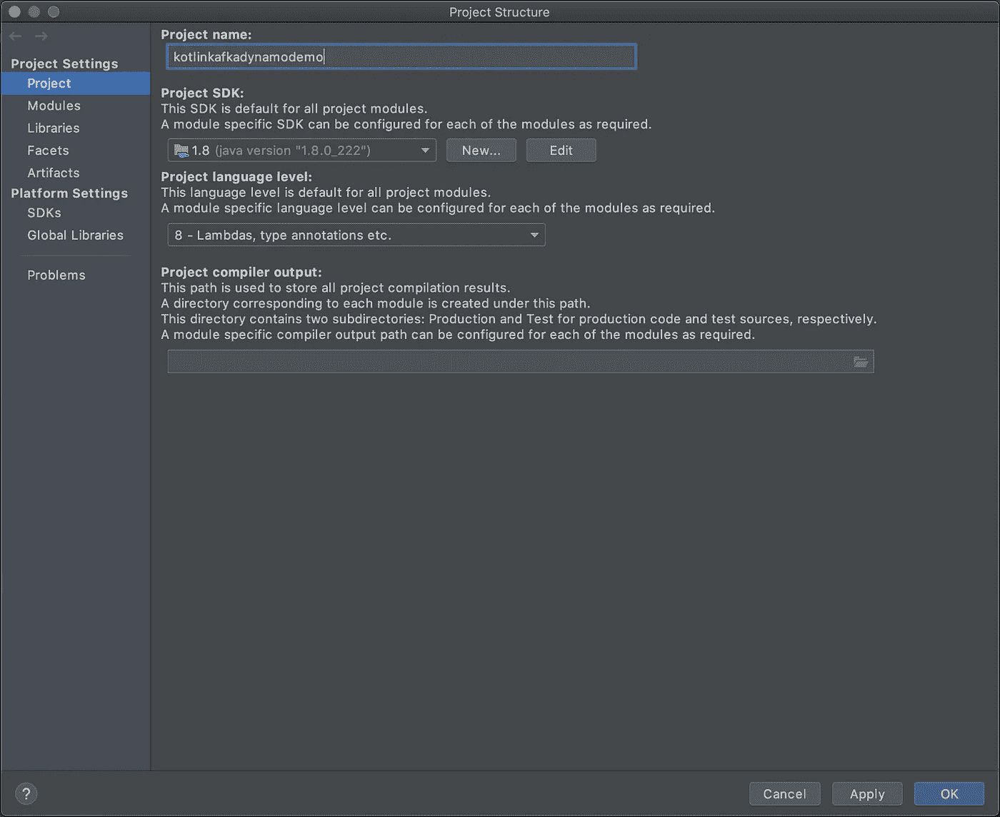
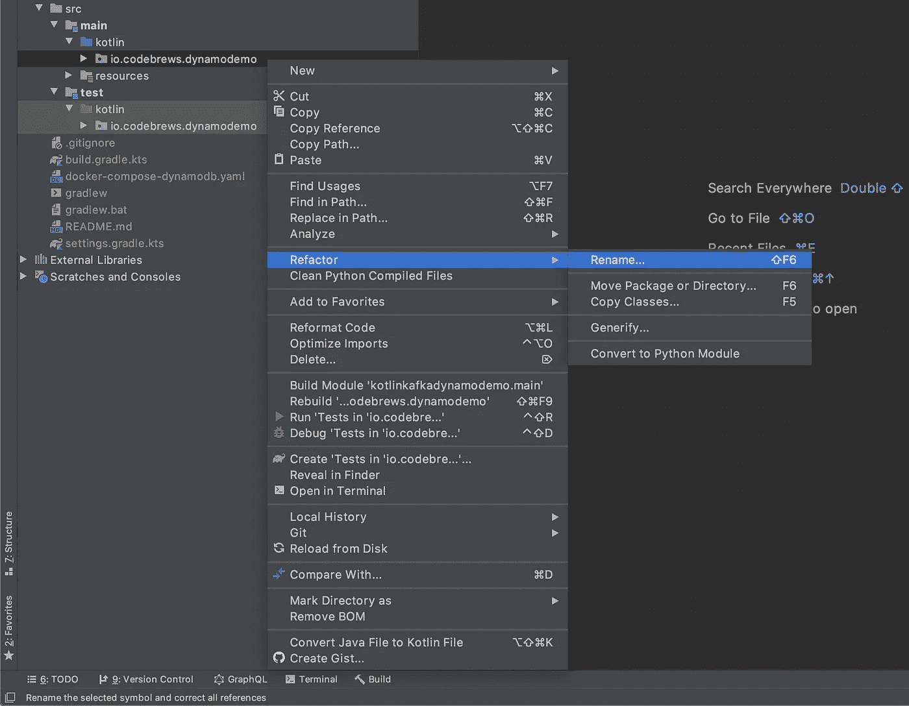
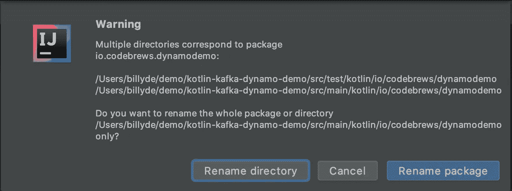
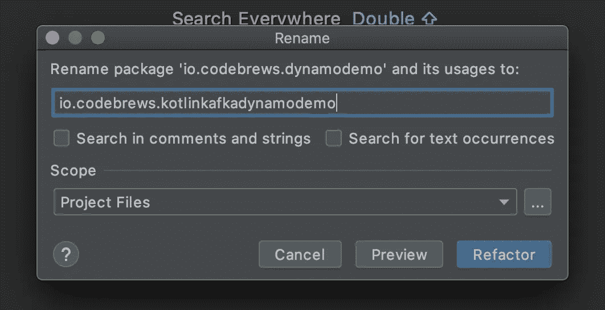
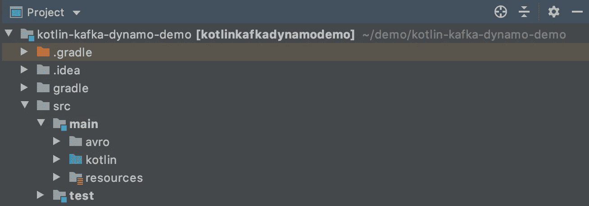

# 如何在 IntelliJ 中重命名项目模块

> 原文：<https://betterprogramming.pub/how-to-rename-project-module-in-intellij-d78d950314b5>

## 在 IntelliJ 中重命名项目模块，并在克隆现有 Git 存储库后重新初始化 Git 存储库


乔恩·泰森在 [Unsplash](https://unsplash.com?utm_source=medium&utm_medium=referral) 上的照片

# 介绍

我们经常通过浏览 GitHub 上的项目资源库来寻找灵感。当我们发现一些有趣的东西并想在它的基础上发展时，我们会做`git clone`这样我们就可以玩它了。

如果我们的目标是构建我们自己的应用程序，我们显然不想使用现有的项目名称，因为它很可能不能直观地描述我们的应用程序。

因为这是一个 Git 项目，所以重命名并不简单。本指南将向您展示如何根据您的喜好重命名现有的 Git 项目并重新初始化一个新的 Git 存储库。

# 开始

对于本教程，我们将克隆这个 GitHub [repo](https://github.com/billydh/dynamodemo) 。

假设我们想要构建一个包含 [DynamoDB Kafka](https://www.confluent.io/hub/confluentinc/kafka-connect-aws-dynamodb) 的应用程序。目前，我们刚刚克隆的项目只有 [DynamoDB](https://www.google.com/aclk?sa=L&ai=DChcSEwity8W1uuvnAhVFHSsKHWU1AEwYABAAGgJzZg&sig=AOD64_0cNENDHJEZtDtzMla-ZXw6nPJ2fQ&q=&ved=2ahUKEwixtr-1uuvnAhV5zDgGHTNLDqwQ0Qx6BAgQEAE&adurl=) ，它被命名为`dynamodemo`。重命名它是有意义的，以表明它也有卡夫卡。

# 重命名根项目文件夹

将存储库克隆到本地机器后，将根项目文件夹重命名为`kotlin-kafka-dynamo-demo`，通过删除`.git`文件并运行命令`git init`来重新初始化一个新的 GitHub repo。

```
~/demo ❯ git clone [git@github.com](mailto:git@github.com):billydh/dynamodemo.git kotlin-kafka-dynamo-demoCloning into 'kotlin-kafka-dynamo-demo'...
remote: Enumerating objects: 50, done.
remote: Counting objects: 100% (50/50), done.
remote: Compressing objects: 100% (32/32), done.
remote: Total 50 (delta 8), reused 43 (delta 5), pack-reused 0
Receiving objects: 100% (50/50), 59.89 KiB | 293.00 KiB/s, done.
Resolving deltas: 100% (8/8), done.~/demo ❯ cd kotlin-kafka-dynamo-demo~/demo/kotlin-kafka-dynamo-demo on   master ❯ ls -ltra
total 64
drwxr-xr-x  12 billyde  staff   384B 17 Feb 20:51 .
drwxr-xr-x   9 billyde  staff   288B 17 Feb 20:51 ..
drwxr-xr-x  12 billyde  staff   384B 17 Feb 20:51 .git
-rw-r--r--   1 billyde  staff   341B 17 Feb 20:51 .gitignore
-rw-r--r--   1 billyde  staff   476B 17 Feb 20:51 README.md
-rw-r--r--   1 billyde  staff   1.3K 17 Feb 20:51 build.gradle.kts
-rw-r--r--   1 billyde  staff   284B 17 Feb 20:51 docker-compose-dynamodb.yaml
drwxr-xr-x   3 billyde  staff    96B 17 Feb 20:51 gradle
-rwxr-xr-x   1 billyde  staff   5.2K 17 Feb 20:51 gradlew
-rw-r--r--   1 billyde  staff   2.2K 17 Feb 20:51 gradlew.bat
-rw-r--r--   1 billyde  staff    32B 17 Feb 20:51 settings.gradle.kts
drwxr-xr-x   4 billyde  staff   128B 17 Feb 20:51 src~/demo/kotlin-kafka-dynamo-demo on   master ❯ rm -rf .git~/demo/kotlin-kafka-dynamo-demo ❯ git init
```

# 更新 IntelliJ 中的模块名称

现在，让我们在 [IntelliJ](https://www.jetbrains.com/idea/) 中打开项目文件夹。

然后，打开`settings.gradle.kts`文件，将`rootProject.name`重命名为`kotlinkafkadynamodemo`。

这才是你的`settings.gradle.kts`应该有的样子。

```
*rootProject*.*name* = "kotlinkafkadynamodemo"
```

接下来，转到`File > Project Structure`或点击`cmd + ;`(如果你在 Mac 上的话)。将`Project name`从`dynamodemo`重命名为`kotlinkafkadynamodemo`，然后点击`Apply`。



项目名

# 重命名包

接下来，转到左侧的项目浏览器，然后右键单击`src/main/kotlin/io.codebrews.dynamodemo`并选择`Refactor > Rename…`，或者您可以在用鼠标单击突出显示`src/main/kotlin/io.codebrews.dynamodemo`后简单地从键盘上按下`shift + fn + F6`。



重构

将弹出一个警告提示，询问您是否要重命名目录或包。继续选择`Rename package`。



重命名包

最后，让我们将包重命名为`kotlinkafkadynamodemo`并点击`Refactor`。



重命名并重构

完成后，从根项目文件夹中删除`.idea`文件夹，然后重启 IntelliJ。

就是这样。现在您将拥有一个模块名为`kotlinkafkadynamodemo`的项目。

