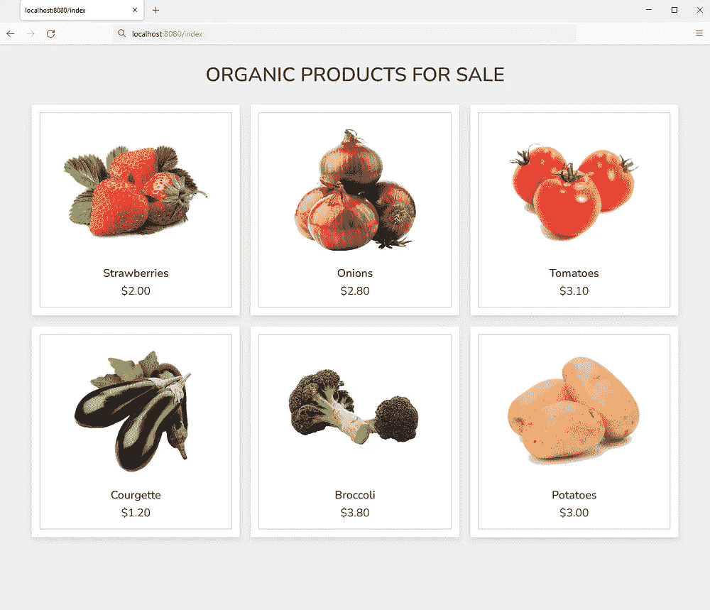
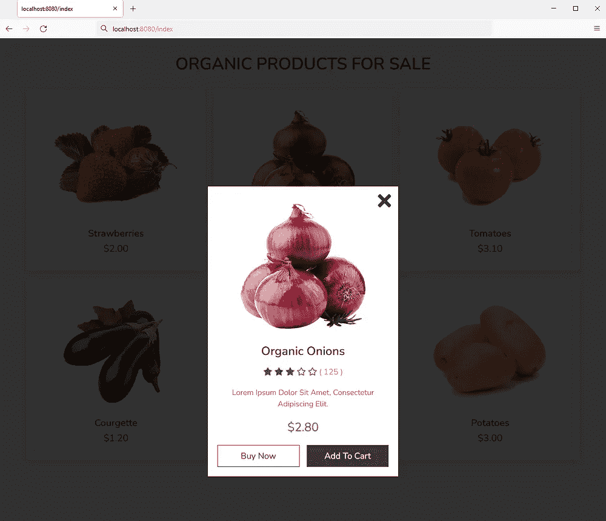

# 如何用 C++渲染和提供 HTML 模板页面

> 原文：<https://betterprogramming.pub/how-to-render-and-serve-html-template-pages-with-c-af45dd39ec3e>

## 在本文中，我将向您展示如何使用 C++和 Cinatra 和 Ginger 库，通过一个简单的 HTTP 服务器来呈现 HTML 模板并提供服务。


凯特·汤森在 [Unsplash](https://unsplash.com?utm_source=medium&utm_medium=referral) 上的照片

不久前，我写了两篇关于如何用 Golang 从模板中呈现 HTML 的文章。如果你有兴趣，你可以在这里找到他们和。尝试过之后，我决定看看我是否能在没有太大困难的情况下用 C++做类似的事情。这篇文章就是这个实验的结果。

我设法找到了用于创建简单的 HTTP 服务器和呈现模板的仅头文件库。我选择 Cinatra 作为 HTTP 框架，选择 Ginger 作为 HTML 模板。

我从 Github 下载了这两个库。在 Cinatra 页面上，提到需要安装 Boost，所以我也安装了。我在下面讨论如何做到这一点。

作为一个例子，我将创建一个简短的程序，它将服务于一个列出六种产品的产品页面。实际的 CSS 和 JavaScript 来自于[web designer 先生的伟大教程](https://www.youtube.com/watch?v=OAPRagDr4pU)。本教程中的 HTML 已经过修改，可以作为 Ginger 库的模板使用。你可以在视频下面找到这个项目需要的 CSS、JavaScript 和图片文件。

# 我的设置

C++最大的困难之一是正确设置所有的库和路径。通过一些修补，我想出了下面的解决方案，似乎在我的系统上工作。即使它可能不会马上为你工作，我相信它至少会给你一些启发，告诉你如何让它在你的系统上工作。

## MSYS2 和 GCC

我运行的是 Windows 11。为了安装 C++编译器，我决定使用 MSYS2，它捆绑了 GCC。一旦安装了 MSYS2，我就创建了一个指向 GCC 二进制文件所在目录的路径。我将这个路径添加到了 Windows 的环境变量中。为了测试这是否有效，我打开了一个 Windows 命令提示符(不是 MSYS 提示符——我不会用它),然后输入`gcc --version`。如果安装正确，并且在 windows 环境变量中输入了正确的路径，应该会返回安装的 GCC 版本。

## 促进

Boost 是一个非常有用的免费 C++库集合。如果你想使用 Cinatra 库，这也是必要的。

我下载了最新的 Windows zip 文件，并将其解压缩到一个有足够空间的驱动器上。我系统上库的路径是`D:\boost_1_79_\boost_1_79_0`。对于您的系统，这可能有所不同。

我不完全确定当只为 Cinatra 使用 Boost 时，是否有必要使用`bootstrap.bat`批处理文件安装 Boost，但我还是做了。起初，我总是在试图运行`bootstrap.bat`时出错。我发现在我的例子中，因为我使用 MSYS2 的 GCC，我需要编辑批处理文件。所以在`bootstrap.bat`里我找了`call .\build.bat`，改成了`call .\build.bat gcc`。现在，批处理文件运行无误，并且安装了 Boost。

## 目录结构

对于这个项目，我创建了以下目录结构。我把 Cinatra 和 Ginger 的头文件库放在一个名为`/include`的子目录中。

此外，我创建了一个`/static`子目录，在其中添加了必要的图像、CSS 和 JavaScript 文件。最后，我创建了一个名为`/templates`的子目录来保存 HTML 模板。

`/www`子目录由 Cinatra Toolkit 自动创建。对于这个项目，这里没有文件。

```
D:.
│   c.exe
│   cinatra.cpp
│
├───include
│   │   cinatra.hpp
│   │   ginger.h
│   │
│   └───cinatra
│           client_factory.hpp
│           connection.hpp
│           cookie.hpp
│           define.h
│           dh1024.pem
│           function_traits.hpp
│           gzip.hpp
│           http_cache.hpp
│           http_client.hpp
│           http_parser.hpp
│           http_router.hpp
│           http_server.hpp
│           io_service_pool.hpp
│           itoa.hpp
│           itoa_jeaiii.hpp
│           mime_types.hpp
│           modern_callback.h
│           multipart_parser.hpp
│           multipart_reader.hpp
│           picohttpparser.h
│           render.h
│           request.hpp
│           response.hpp
│           response_cv.hpp
│           response_parser.hpp
│           router.hpp
│           server.crt
│           server.key
│           session.hpp
│           session_manager.hpp
│           sha1.hpp
│           smtp_client.hpp
│           upload_file.hpp
│           uri.hpp
│           url_encode_decode.hpp
│           use_asio.hpp
│           utils.hpp
│           websocket.hpp
│           ws_define.h
│
├───static
│   ├───css
│   │       style.css
│   │
│   ├───images
│   │       1.png
│   │       2.png
│   │       3.png
│   │       4.png
│   │       5.png
│   │       6.png
│   │
│   └───js
│           script.js
│
├───templates
│       product.html
│
└───www
```

# 程序代码

下面，我将检查代码。如果你以前学过一点 C++的话，这其实很容易理解。

在第 14 行，我们创建了一个 HTTP 服务器。

在第 17–71 行，我们为六种产品创建了一些虚拟数据。我们将这些数据放入名为`xs`的地图矢量中。

在第 73 行，我们告诉服务器在`0.0.0.0:8080`监听，这实际上对应于`localhost:8080`。

在第 74–92 行，使用`set_http_handler()`为`/index`路径创建了一个接受 GET 和 POST 方法的 HTTP 路由处理程序。这个函数的第二个参数是 lambda 函数。注意，如果我们想在 lambda 函数中使用向量`xs`,我们需要将它作为参数发送给该函数。

在第 76–78 行，我们创建了一个映射`t`，它将包含模板中使用的变量。

在第 80–82 行，模板被打开并添加到一个名为`ss`的`stringstream`中。

在第 84 行，我们为 Ginger 模板渲染引擎的输出创建了一个名为`output`的`stringstream`。

在第 85–89 行，我们尝试使用映射`t`中的变量将流`ss`中的模板呈现到输出流`output`中。如果这样做不成功并返回一个错误，那么我们捕获这个错误并将其输出到标准的 C 错误输出流。

在第 91 行，创建了一个响应，其中包括在`output`中最终呈现的 HTML 模板。

在第 95 行，我们注册了保存静态资产的目录。这是保存 CSS、图像和 JavaScript 文件(在它们各自的子目录中)所需要的。

在第 97 行，我们运行服务器。

# 模板

这里我将解释模板的一些特性。我不会谈论实际使用的 HTML 网上有很多地方可以找到更多关于它的信息。

与 Go 语言中的[标准模板引擎](/how-to-use-templates-in-golang-46194c677c7d)相比，Ginger 模板可用的操作有些有限。例如，在使用`$if`语句或添加自定义函数映射时，不可能放置等式运算符。然而，对于许多目的来说，这并不重要，因为可能不需要这些操作。

Ginger 的语法规范可以在这里找到[。](https://github.com/melpon/ginger#template-syntax-specification)

在第 13 行，我们使用`${title}`变量在这里打印标题。

在第 15–21 行，for 循环用于打印出现在`xs`向量中的每个产品。在这个循环中，我们使用`x`变量来表示每个产品。为了获得产品`x`中的字段，我们可以编写`${x.<field>}`，其中`<field>`可以是`num`、`img`、`name`、`price`等等。

在第 25–45 行，类似的事情发生了。这是弹出窗口。在这里，在第 31–35 行，我们还包含了一些`$if`语句，这样我们就可以显示每个产品的星号。我们在这里只能使用布尔值，所以我们需要在将乘积向量传递给模板之前，为乘积向量中的每个星设置布尔值。

# 编译和运行代码

为了编译上面的源代码，我打开 Windows 命令提示符并编写以下代码:

```
gcc cinatra.cpp -lstdc++ -lwsock32 -lws2_32 -I D:/boost_1_79_0/boost_1_79_0 -L D:/boost_1_79_0/boost_1_79_0/libs -o c.exe
```

我花了一段时间才找到要添加哪些标志以及如何包含目录。注意，我已经包含了用于我的 Boost 安装的“通用包含”目录`-I`和“库”`-L`。

要运行可执行文件，只需编写:`c.exe`

现在我们可以去`localhost:8080/index`看看结果。



在左侧，您可以看到产品概述，在右侧可以看到特定产品的弹出窗口

# 参考

[“具有快速查看产品预览弹出效果的响应式产品卡”，网页设计师先生](https://www.youtube.com/watch?v=OAPRagDr4pU)