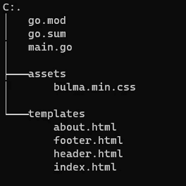

# 如何用 Gin 为 Golang 渲染 HTML 页面

> 原文：<https://betterprogramming.pub/how-to-render-html-pages-with-gin-for-golang-9cb9c8d7e7b6>

## 这个简单的例子展示了如何使用流行的 web 框架 Gin for the Go Language (Golang)来呈现 HTML 模板页面


Bjarne Vijfvinkel 在 [Unsplash](https://unsplash.com?utm_source=medium&utm_medium=referral) 上拍摄的照片

Gin 是 Golang 最流行的 web 框架之一。我以前写过关于如何使用基本的 Golang 模板包渲染 HTML 页面的文章。用 Gin 呈现 HTML 模板甚至更容易。

为了使工作流程更加顺畅，尝试新的想法并进行调试，我还决定使用 Codegangsta 开发的名为 Gin 的自动重载工具。

# 安装轧棉机

安装 [Gin HTTP web 框架](https://github.com/gin-gonic/gin)很简单，就像大多数(如果不是全部)Golang 包一样:

```
go get -u github.com/gin-gonic/gin
```

# 杜松子酒代码

## 进口货

在第 4–7 行，我们导入了一些包:

*   Gin HTTP web 框架的包。
*   用于导入`FuncMap()`函数的 Golang `html/template`基础包。在模板中使用函数时，这是必需的。
*   与杜松子酒一起使用的 Golang `net/http`底座包装。
*   `FuncMap`中`upper`功能的`strings`基础包。

## main()函数

在第 11 行，我们创建了一个名为`router`的默认 Gin 路由器。除了基本功能之外，默认的 Gin 路由器还使用日志和恢复中间件。

在第 12–14 行，`SetFuncMap()`用于创建模板中使用的函数映射。这里我们只是添加了一个简单的模板函数`upper`，它使用`strings.ToUpper()`函数将字符串中的所有字符设置为大写。

在第 15 行，我们让 Gin 路由器知道我们已经在`./assets`目录中保存了一些静态资产。Gin 可以以这种方式访问任何静态资产。

对于这个例子，我在那个目录中放了一个布尔玛 CSS 库的最小化版本。通过使用`Static()`函数，HTML 模板现在可以访问这个库了。

你可以在这里阅读布尔玛 CSS 库的文档。

在第 16 行，所有满足模式`template/*.html`的模板都由`LoadHTMLGlob()`函数加载。这种模式意味着模板文件应该有`.html`扩展名，并位于`/template`目录中。

在第 18–22 行，我们告诉 Gin 路由器在 URL 路径`/`接受一个 HTTP `GET`方法请求。当收到一个请求时，Gin 发送一个 HTTP `OK`状态消息，并使用在`gin.H{}`括号中提供的数据呈现`index.html`模板。在这种情况下，数据只包含一个键/值对，这个键叫做`content`。

在第 24–28 行，与上面类似，我们告诉 Gin 路由器在`/about`路径接受 HTTP `GET`方法请求。这次呈现的是`about.html`模板。

在第 29 行，我们告诉 Gin 在`localhost`端口`8080`运行 web 服务器。

# 模板和目录结构

下面您可以找到本例中使用的四个模板。这些都需要放在各自的文件中。文件名出现在每段代码之前。

模板的语法与`html/template`基础包相同。你可以在这里阅读更多关于模板[的语法。](/how-to-use-templates-in-golang-46194c677c7d)

您还可以在下面找到该项目的目录结构:



# 自动重装轧花机

如前所述，我在开发时使用了 [codegangsta/gin](https://github.com/codegangsta/gin) 工具来自动重新加载 gin。这使得在浏览器中检查代码的结果更加容易。我们可以做到这一点，而不必在更改代码时停止当前的可执行文件并重新构建和运行它。

这是 Github 页面上对该实用程序的描述:

> `gin`是一个简单的命令行工具，用于实时重载 Go web 应用程序。只需在您的应用程序目录中运行`gin`，您的 web 应用程序将由`gin`作为代理。`gin`当检测到变化时，会自动重新编译你的代码。下次收到 HTTP 请求时，您的应用将会重新启动。

## 安装 codegangsta/gin

```
go get github.com/codegangsta/gin
```

## 运行 codegangsta/gin

```
gin -i --appPort 8080 --port 3000 run main.go
```

上面的代码将在命令行中运行。它假设您正在`localhost`端口`8080`上运行您的 Go web 应用程序，并且您将使用端口`3000`作为 Gin 自动重新加载代理。

## 关于运行代码的说明

在从命令行运行代码之前，您可能需要运行以下内容:

```
go mod init
go mod tidy
```

# 在网络浏览器中检查结果

在浏览器的 URL 字段中键入以下内容，以检查代码的结果:

```
localhost:3000/
```

…对于索引页和…

```
localhost:3000/about
```

用于“关于”页面。

# 参考

[“Golang 教程:介绍 Gin HTML 模板以及如何与 Bootstrap 集成”，作者 Adam Ou-Yang](https://hoohoo.top/blog/20210530112304-golang-tutorial-introduction-gin-html-template-and-how-integration-with-bootstrap/)

[Gin-Gonic 的 Gin Web 框架](https://github.com/gin-gonic/gin)

[codegangsta/gin:Go web 服务器的实时重载实用程序](https://github.com/codegangsta/gin)

[](/how-to-generate-html-with-golang-templates-5fad0d91252) [## 如何用 Golang 模板生成 HTML

### 如何使用 Go 模板生成 HTML 页面的示例

better 编程. pub](/how-to-generate-html-with-golang-templates-5fad0d91252)